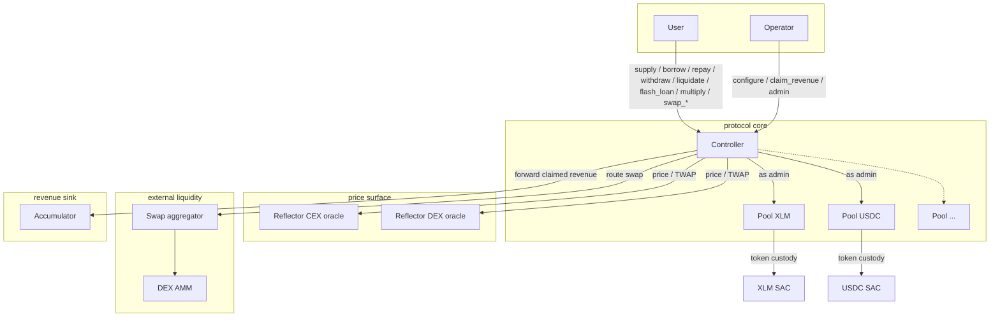
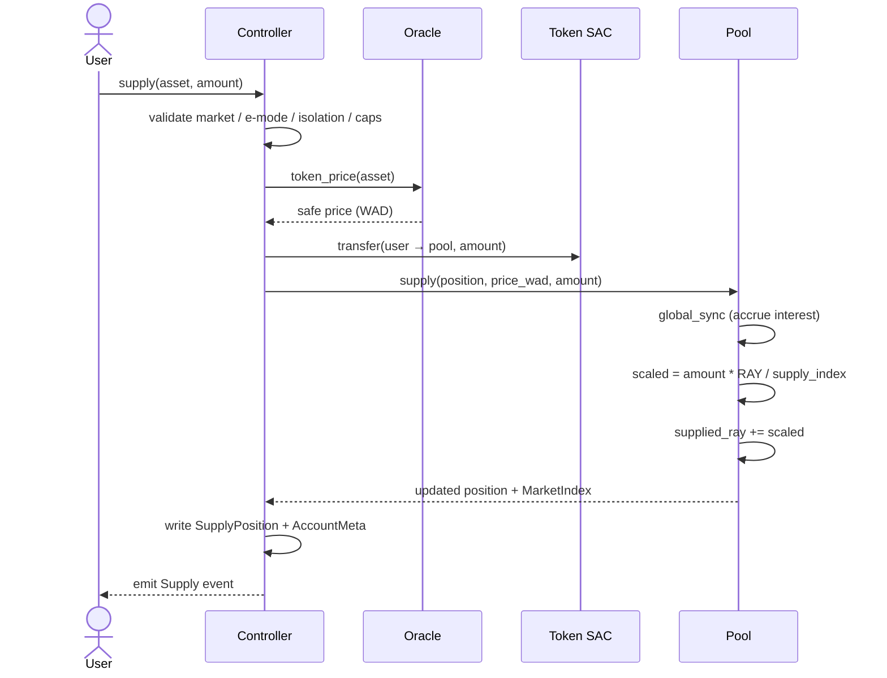
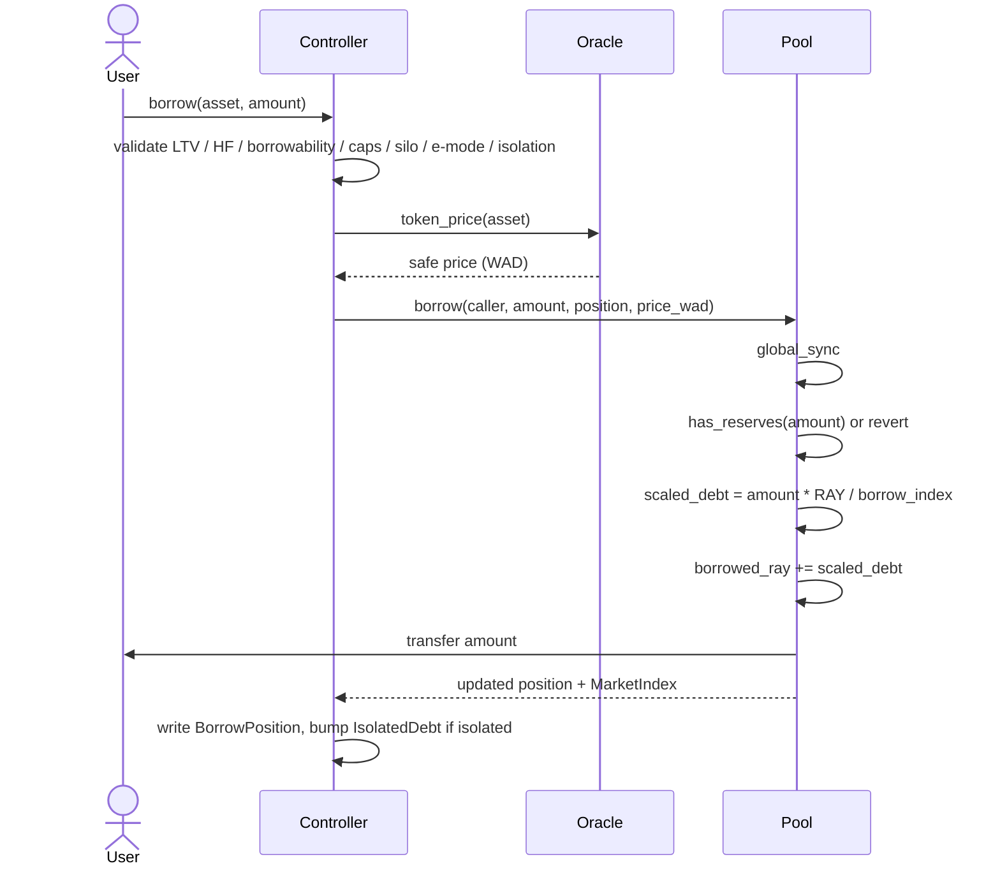
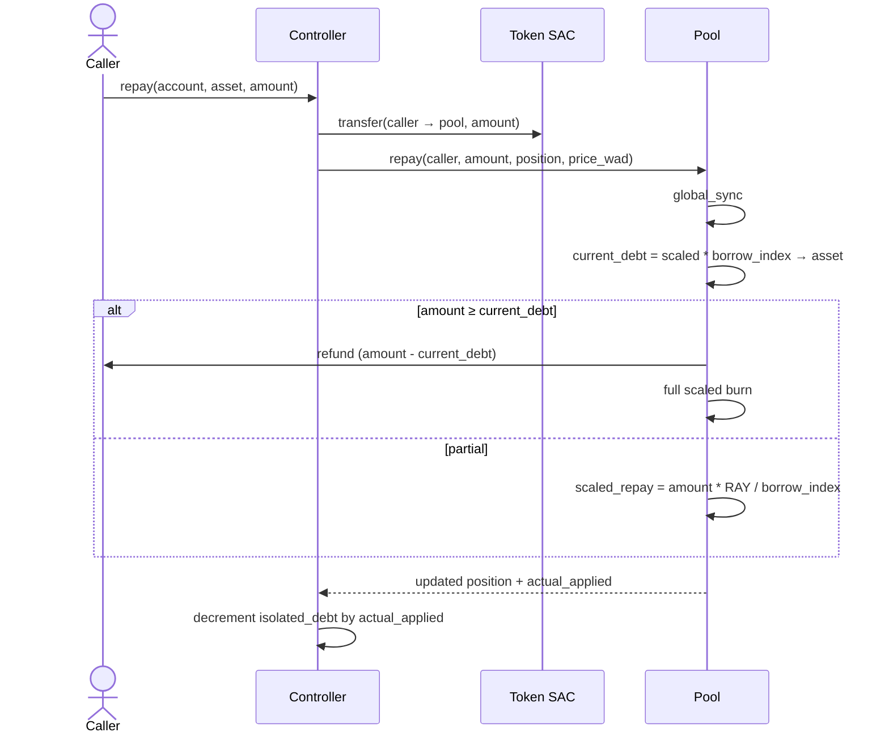
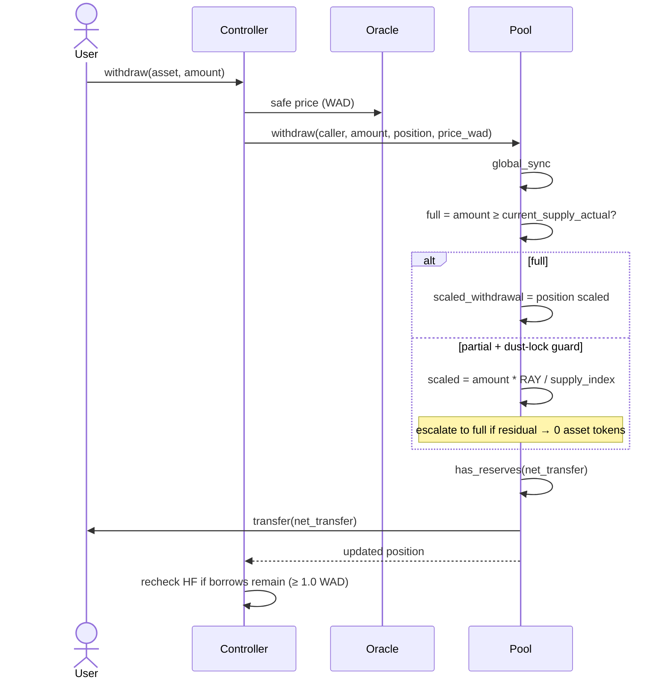
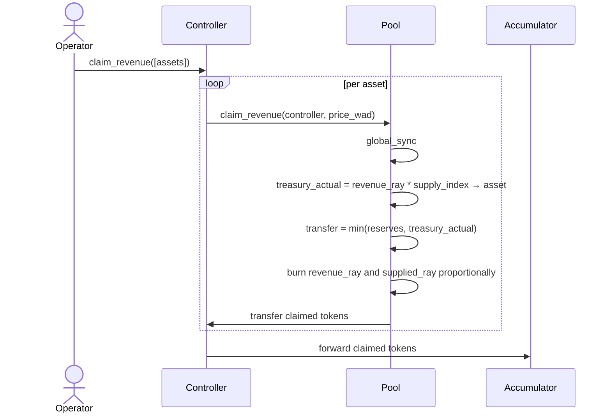
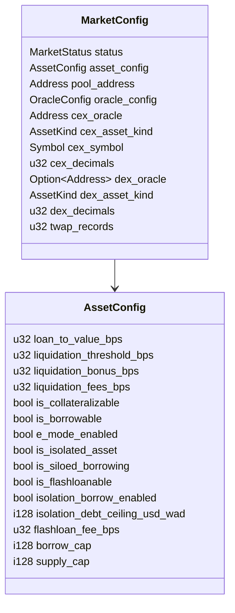
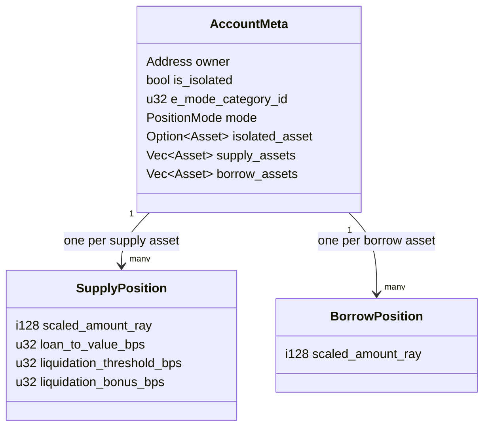
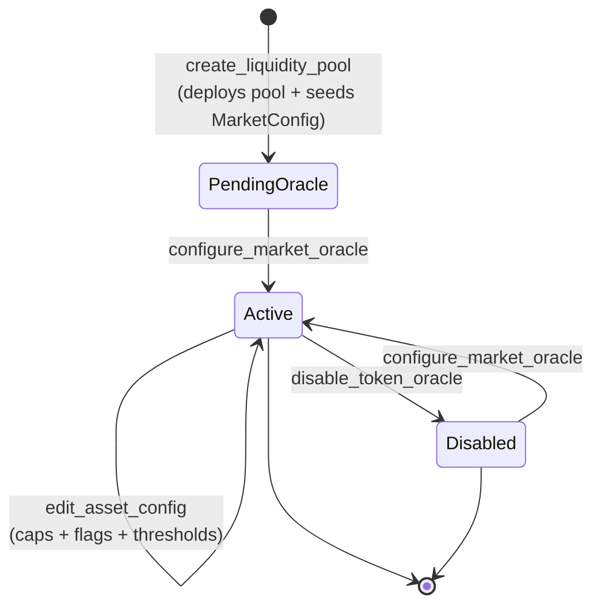

# Architecture

## Overview

The protocol is a two-tier Soroban system:

1. `controller` — the single protocol entrypoint. Users and operators
   interact with it for every lending flow.
2. `pool` — one child contract per listed asset. Pools own actual
   liquidity, interest accrual, reserves, and revenue accounting.

The controller deploys pools from a stored WASM template and owns them
through standard owner/admin control.

### System topology

Trust boundaries:

- Controller trusts pools only for asset-local accounting.
- Pools trust the controller as admin for every mutation.
- Controller validates every oracle response before using it.
- Aggregator calls execute inside the controller; the controller verifies
  input/output balances around the call (`strategy.rs::swap_tokens`).

## Component Boundaries

### Controller

The controller owns:

- user-facing endpoints
- protocol risk checks
- account lifecycle and storage
- market registry
- oracle and price safety logic
- e-mode and isolation mode
- liquidation orchestration
- strategy orchestration
- flash-loan orchestration
- pool deployment and upgrades
- routing claimed revenue to the accumulator

It stores protocol-wide shared state such as:

- `MarketConfig`
- `EModeCategory`
- `EModeAsset`
- `IsolatedDebt`
- `PoolsList`
- `PositionLimits`

It also stores per-account state as split storage:

- `AccountMeta(account_id)`
- `SupplyPosition(account_id, asset)`
- `BorrowPosition(account_id, asset)`

### Pool

Each pool is asset-local and owns:

- token custody
- aggregate scaled supply and debt
- supply and borrow indexes
- interest-rate model execution
- protocol revenue accrual
- reserve availability checks
- socialization of bad debt into the supply index

Pools make no protocol-level solvency decisions. They execute accounting
the controller requests.

### Pool interface

The controller depends on `pool-interface`, not on the `pool` crate
itself. This is intentional:

- it keeps the full pool contract out of controller runtime WASM
- it keeps controller exports and spec smaller
- it makes the controller/pool trust boundary explicit

The interface covers mutating calls such as:

- `supply`, `borrow`, `withdraw`, `repay`
- `update_indexes`, `add_rewards`
- `create_strategy`, `seize_position`, `claim_revenue`
- `update_params`, `upgrade`
- `flash_loan_begin`, `flash_loan_end`

and read-side calls such as:

- `capital_utilisation`, `reserves`
- `deposit_rate`, `borrow_rate`
- `protocol_revenue`, `supplied_amount`, `borrowed_amount`
- `delta_time`, `get_sync_data`

## Controller-to-Pool Communication

The controller deploys each pool as its owner/admin. Every pool
mutation is therefore gated by `verify_admin`.

### Supply flow

### Borrow flow

### Repay flow

### Withdraw flow

Note: "withdraw all" composes two sentinels. The controller maps
`amount == 0` to `i128::MAX` (`controller/src/positions/withdraw.rs:84`,
comment `// 0 = withdraw all`). The pool then takes the full-withdraw
branch via `amount ≥ current_supply_actual`
(`pool/src/lib.rs:181-183`). Either passing `0` from the caller or
passing any value ≥ the position's current actual supply triggers a
full close.

### Revenue flow

## Storage Model

### Market storage

One canonical per-market record:

- `ControllerKey::Market(asset) -> MarketConfig`

No separate reflector storage key exists. Oracle wiring is flat on
`MarketConfig`.

### Account storage

Account storage is intentionally split into three key families so the hot
paths touch only what they need.

Benefits:

- avoids rewriting large nested account maps on every change
- lets views touch only relevant positions
- supports targeted TTL bumps per account and per position

## Oracle Architecture

Oracle state lives inside `MarketConfig`.

The operator endpoint is:

- `configure_market_oracle(caller, asset, cfg)`

Key design points:

- operators pass neither token decimals nor oracle-feed decimals
- controller reads:
  - token decimals from the asset contract
  - CEX oracle decimals from the CEX oracle
  - DEX oracle decimals from the DEX oracle when configured
- unreadable required decimals revert the transaction

This closes a whole class of operator misconfiguration risk.

Detailed price-resolution logic, including the first/last tolerance tiers
and the `allow_unsafe_price` rule, is documented in
[INVARIANTS.md §14](./INVARIANTS.md#14-market-oracle-invariants).

## Market Lifecycle

User operations become available only after both
`configure_market_oracle` and the final `edit_asset_config` land. The
deployment runbook calls these in sequence — see
[DEPLOYMENT.md](./DEPLOYMENT.md).

## Deployment Relationship

Deployment is template-driven:

- pool WASM uploads once per deployment round
- controller stores the pool template hash
- future `create_liquidity_pool` calls deploy child pools from that
  template

The deployment Make targets automatically update `configs/networks.json`
with:

- controller contract id
- pool wasm hash

## Live Deployment Path

The live path covers:

- controller
- pool
- pool-interface
- common
- `Makefile` + `configs/script.sh`

## Read This Next

- [README.md](./README.md)
- [DEPLOYMENT.md](./DEPLOYMENT.md)
- [INVARIANTS.md](./INVARIANTS.md)
- [MATH_REVIEW.md](./MATH_REVIEW.md) — rule-coverage audit of the math
  flows above.
