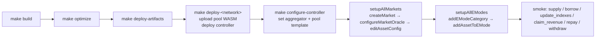

# Deployment

## Purpose

The supported build and deployment process for the Stellar contracts in this repository.

The operator interface is the Makefile plus `configs/script.sh`. One reproducible path covers:
- build
- deploy
- controller setup
- market creation
- oracle configuration
- asset-risk activation
- e-mode configuration
- smoke testing

### Pipeline overview



`make setup-<network>` wraps `deploy → configure-controller →
_setup-markets` so the full chain runs end-to-end.

## Source Of Truth

Configuration files:

- `configs/networks.json`
  Per-network RPC metadata plus the latest deployed controller id and uploaded pool wasm hash.
- `configs/testnet_markets.json`
  Testnet market definitions.
- `configs/mainnet_markets.json`
  Mainnet market definitions.
- `configs/emodes.json`
  E-mode categories and memberships.
- `configs/script.sh`
  Config-driven setup actions.
- `Makefile`
  Supported build, deploy, setup, and invoke commands.

## Prerequisites

Required locally:
- `stellar` CLI
- `jq`
- Rust toolchain compatible with the repo

Recommended operator setup:
- a funded identity such as `deployer`
- or `SIGNER=ledger` for ledger-backed signing

## Build Artifacts

Primary build commands:

```bash
make build
make optimize
make deploy-artifacts
```

Artifact directories:
- `target/wasm32v1-none/release/`
  Raw build outputs
- `target/optimized/`
  Optimized WASM for local tooling and inspection
- `target/deploy/`
  Deploy artifacts used by Makefile deployment targets

## Supported Deployment Commands

### Deploy Only

```bash
make deploy-testnet
make deploy-mainnet
```

This flow:
1. builds contracts
2. optimizes them
3. prepares deploy artifacts
4. uploads pool WASM
5. deploys controller
6. updates `configs/networks.json` with:
   - `controller`
   - `pool_wasm_hash`

### Configure Controller After Deploy

```bash
make configure-controller NETWORK=testnet
```

This flow:
1. sets the aggregator if configured in `configs/networks.json`
2. sets the pool template hash on the controller

If `aggregator` is blank in `configs/networks.json`, setup logs a warning and continues.

### Full Setup

```bash
make setup-testnet
make setup-mainnet
```

The supported end-to-end operator path. It runs:

1. `deploy-<network>`
2. `configure-controller`
3. `_setup-markets`

`_setup-markets` delegates to:

```bash
NETWORK=<network> SIGNER=<signer> ./configs/script.sh setupAll
```

which runs:
1. `setupAllMarkets`
2. `setupAllEModes`

## Market Setup Flow

For each market in `configs/<network>_markets.json`, `setupAllMarkets` does:

1. `createMarket`
2. `configureMarketOracle`
3. `editAssetConfig`

### 1. `createMarket`

This action:
- reads `asset_address` from config
- reads asset decimals on-chain from the asset contract
- assembles `MarketParams`
- deploys the pool through `create_liquidity_pool`
- seeds the controller market in `PendingOracle`

The Make/script path reads decimals on-chain when building `MarketParams`; the config file is not
trusted for live asset decimals.

### 2. `configureMarketOracle`

This action calls `configure_market_oracle` with a flat operator config object containing:
- exchange source
- stale threshold
- tolerance bands
- CEX oracle address
- CEX asset kind
- CEX symbol
- optional DEX oracle address
- DEX asset kind
- TWAP record count

The controller then discovers:
- token decimals from the asset contract
- CEX oracle decimals from the CEX oracle
- DEX oracle decimals from the DEX oracle when configured

A failed required read reverts the setup transaction.

### 3. `editAssetConfig`

This action enables the final market risk flags and caps:
- borrowability
- collateralizability
- flashloanability
- e-mode flag
- liquidation parameters
- caps

The market becomes operational only after both oracle config and final asset config land.

## E-Mode Setup Flow

`setupAllEModes` reads `configs/emodes.json`.

For each category:
1. `addEModeCategory`
2. `addAssetToEMode` for each configured asset

## Direct Invocation Commands

The Makefile exposes generic helpers for controller and pool calls.

Controller invoke:

```bash
make invoke NETWORK=testnet FN=supply ARGS="..."
make view NETWORK=testnet FN=get_market_config ARGS="..."
```

Explicit contract id invoke:

```bash
make invoke-id NETWORK=testnet CONTRACT_ID=<id> FN=claim_revenue ARGS="..."
make view-id NETWORK=testnet CONTRACT_ID=<id> FN=protocol_revenue
```

Use these helpers for smoke tests and one-off operations.

## Smoke-Test Runbook

Validate these categories after deployment:

### Required

1. market config reads
2. detailed market views
3. supply
4. borrow
5. update indexes
6. claim revenue
7. repay
8. withdraw

### Recommended

1. duplicate same-token entries in a batch supply
2. post-update index reads
3. pool-side `protocol_revenue`
4. pool-side `reserves`

## Recently Verified Testnet Flow

The current live testnet deployment was validated through:
- `make setup-testnet`
- `make invoke`
- `make view`
- `make invoke-id`
- `make view-id`

Observed successes:
- duplicate XLM entries in one `supply` batch were accepted and aggregated correctly
- borrow, repay, and withdraw flows succeeded
- `update_indexes([XLM, USDC])` succeeded
- `claim_revenue([XLM, USDC])` succeeded twice
- `get_market_config` returned the flattened oracle fields with discovered oracle decimals

`configs/networks.json` persists the resulting:
- controller id
- pool wasm hash

## Operational Notes

### Aggregator

`aggregator` is optional in `configs/networks.json`.

If blank:
- deployment still succeeds
- `configure-controller` logs a warning and continues

### Active Deployment Scope

The deployment and operator flow depends only on:
- controller
- pool
- pool-interface
- common
- config files
- Makefile

### Decimals

Two distinct decimal domains exist:

- token decimals
  - sourced from the asset contract
- oracle-feed decimals
  - sourced from the oracle contracts

Operators supply neither during oracle setup.

### Token allowlist policy (audit-prep)

`approve_token_wasm` admits a token contract. The protocol's accounting
math assumes 1:1 transfer semantics and a fixed per-address balance.
Operators MUST NOT allowlist:

- **Fee-on-transfer tokens.** Borrow / withdraw / liquidation seizure /
  add_rewards do not balance-delta on the egress side. A FoT token causes
  borrowers to under-receive while debt is booked at the requested
  amount; liquidators get less bonus than the math books; bad debt
  cascades. Findings H-06.
- **Rebasing tokens (positive or negative).** Pool reserves are read live
  via `tok.balance(pool)`; rebases drift reserves from scaled supply.
  Positive rebases let `claim_revenue` extract the rebase delta;
  negative rebases stall withdrawals while debt accounting is unchanged.
  Finding H-07.

Approved tokens MUST be standard SAC or audited SEP-41 with strict 1:1
transfer semantics. The on-chain validation cannot enforce this
property.

### SAC issuer upgrade

A Stellar issuer can upgrade their issued-asset SAC. If the upgrade
changes `decimals()` or transfer semantics, `MarketParams.asset_decimals`
and `MarketConfig.cex_decimals`/`dex_decimals` go stale. The protocol
has no on-chain endpoint to refresh these values. Operator runbook:

1. Monitor issuers for upgrade events.
2. On any change, `pause()` and review.
3. If the change is benign, document and unpause.
4. If the change breaks accounting, migrate users to a new market backed
   by a different token contract.

Finding H-08.

### M-09 migration: `dex_symbol` field

The audit-prep upgrade adds a required `dex_symbol: Symbol` field to
`MarketConfig`. This is a breaking storage layout change. After
deploying the upgrade:

1. For every existing market with `dex_oracle.is_some()`, call
   `configure_market_oracle` with the same parameters plus the new
   `dex_symbol` (use the same value as `cex_symbol` to preserve current
   behavior).
2. Run `make view NETWORK=<network> FN=get_market_config ARGS="..."`
   to verify each market deserializes and reports the new field.
3. Until step 1 completes per market, oracle reads from that market
   panic on the new mandatory probe.

## Suggested Operator Sequence

Fresh environment:

```bash
make build
make setup-testnet
```

Post-deploy checks:

```bash
make view NETWORK=testnet FN=get_all_markets_detailed ARGS="--assets-file-path /tmp/assets.json"
make view NETWORK=testnet FN=get_all_market_indexes_detailed ARGS="--assets-file-path /tmp/assets.json"
```

Lifecycle smoke:

```bash
make invoke NETWORK=testnet FN=supply ARGS="..."
make invoke NETWORK=testnet FN=borrow ARGS="..."
make invoke NETWORK=testnet FN=update_indexes ARGS="..."
make invoke NETWORK=testnet FN=claim_revenue ARGS="..."
make invoke NETWORK=testnet FN=repay ARGS="..."
make invoke NETWORK=testnet FN=withdraw ARGS="..."
```

## Failure Modes To Investigate Immediately

- `configure_market_oracle` cannot read token decimals
- `configure_market_oracle` cannot read CEX or DEX oracle decimals
- `configure_market_oracle` cannot validate ticker availability
- market stays `PendingOracle` after setup
- `configs/networks.json` did not update with controller or pool wasm hash
- `protocol_revenue` increases but `claim_revenue` returns zero unexpectedly

## Related Documents

- [README.md](./README.md)
- [ARCHITECTURE.md](./ARCHITECTURE.md)
- [INVARIANTS.md](./INVARIANTS.md)
- [MATH_REVIEW.md](./MATH_REVIEW.md)
