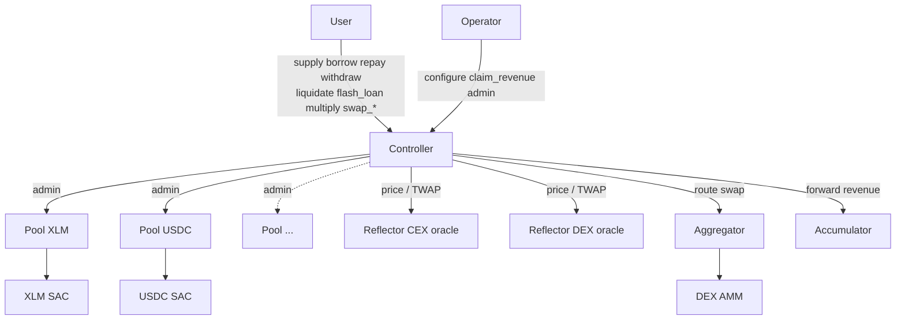

# Stellar Lending Protocol

Production-oriented multi-asset lending protocol for Soroban.

A single `controller` contract owns risk, oracle, account, and
orchestration logic. One `pool` contract per listed asset owns liquidity,
interest accrual, reserves, and protocol revenue accounting.

## System At A Glance



- Users call the controller; the controller talks to pools through
  `pool-interface` and to Reflector for prices.
- Strategies (`multiply`, `swap_debt`, `swap_collateral`,
  `repay_debt_with_collateral`) route through the configured aggregator.
- Protocol revenue accrues inside each pool and is forwarded to the
  accumulator on `claim_revenue`.

## Why This Design

The architecture is intentionally opinionated:

- One controller is the canonical protocol entrypoint.
- Pools are minimal per-asset accounting engines.
- Controller-to-pool calls go through `pool-interface`, not the `pool`
  crate itself.
- Market oracle state lives inside `MarketConfig`; no separate reflector
  storage key exists.
- `configure_market_oracle` sets up oracles atomically; operators never
  pass token or oracle decimals manually.
- Account storage splits into `AccountMeta`, `SupplyPosition`, and
  `BorrowPosition` keys to keep hot reads and writes tight.

These choices shrink deploy size, simplify operator flows, and make the
storage model easier to reason about formally.

## Documentation Map

- [ARCHITECTURE.md](./ARCHITECTURE.md)
  Contract boundaries, storage model, controller-to-pool sequence
  diagrams, market lifecycle.
- [INVARIANTS.md](./INVARIANTS.md)
  Protocol algebra, fixed-point conventions, solvency math, interest
  invariants, liquidation cascade, oracle tolerance tiers, worked
  examples.
- [DEPLOYMENT.md](./DEPLOYMENT.md)
  Build, deploy, configure, and smoke-test flow driven by the Makefile
  and config files.
- [MATH_REVIEW.md](./MATH_REVIEW.md)
  Rule-coverage audit of the Certora spec tree and drift between docs
  and code. Remediation plan.

## Repository Layout

- `common/`
  Shared math, events, constants, storage keys, public ABI types, and
  errors.
- `controller/`
  Protocol entrypoint. Handles supply, borrow, repay, withdraw,
  liquidation, flash-loans, strategies, market listing, oracle config,
  e-mode, and revenue routing. Includes `controller/certora/` for formal
  verification rules.
- `pool/`
  Asset-specific liquidity engine. Handles balances, indexes, reserves,
  revenue accounting, and rate-model updates.
- `pool-interface/`
  Client-only ABI the controller uses to call pools.
- `test-harness/`
  Integration tests, scenario builders, mock reflector/oracle plumbing,
  and coverage entrypoints.
- `configs/`
  Network config, market templates, e-mode templates, deployment script,
  and coverage helper.

## Contract Responsibilities

### Controller

Owns:

- account creation and lifecycle
- supply and borrow permissioning
- health-factor and collateral checks
- e-mode and isolation mode
- market registry
- flattened market oracle configuration
- pool deployment and upgrades
- protocol revenue routing to the accumulator
- strategy orchestration and flash-loan entrypoint

Public write surface:

- `supply`, `borrow`, `repay`, `withdraw`
- `liquidate`, `flash_loan`
- `multiply`, `swap_debt`, `swap_collateral`, `repay_debt_with_collateral`
- `update_indexes`, `claim_revenue`, `add_rewards`
- market / admin / oracle / e-mode configuration endpoints

Public read surface:

- `health_factor`, `total_collateral_in_usd`, `total_borrow_in_usd`
- `get_account_positions`, `get_account_attributes`
- `get_market_config`, `get_all_markets_detailed`,
  `get_all_market_indexes_detailed`
- `liquidation_collateral_available`, `liquidation_estimations_detailed`

### Pool

Owns:

- actual token custody
- scaled aggregate supply and debt
- borrow and supply indexes
- reserve availability
- protocol revenue balance
- interest-rate model parameters

The pool makes no protocol-level risk decisions. It trusts the controller
as owner/admin and executes asset-local accounting.

## Fixed-Point Domains

| Domain | Base | Used for |
|---|---|---|
| asset-native | token decimals (e.g. 7 for XLM) | balances, transfers |
| `BPS` | `10^4` | percentages, caps, LTV, LT, fees |
| `WAD` | `10^18` | USD values, health factor |
| `RAY` | `10^27` | indexes, rates, scaled balances |

All cross-domain operations use half-up rounding via
`common::fp_core::mul_div_half_up`. See
[INVARIANTS.md §1-2](./INVARIANTS.md#1-fixed-point-domains).

## Build And Test

Core commands:

```bash
make build
make optimize
make deploy-artifacts
make test
make coverage
cargo fmt --all
cargo clippy --workspace -- -D warnings
```

Coverage commands:

```bash
make coverage-controller
make coverage-pool
make coverage-merged
```

Merged coverage reports land in `target/coverage/`.

## Deployment Summary

The supported operator path is Makefile-first:

```bash
make setup-testnet
```

That flow:

1. builds and optimizes controller and pool WASM
2. uploads the pool WASM template
3. deploys the controller
4. persists the controller id and pool wasm hash into
   `configs/networks.json`
5. sets the pool template on controller
6. creates markets from `configs/testnet_markets.json`
7. configures each market oracle with `configure_market_oracle`
8. enables final risk params with `edit_asset_config`
9. creates e-mode categories from `configs/emodes.json`

For the full operator runbook, see [DEPLOYMENT.md](./DEPLOYMENT.md).

## Operational Notes

- `configs/networks.json` is the source of truth for the latest deployed
  controller id and pool wasm hash per network.
- `configs/<network>_markets.json` carries an informational `decimals`
  field, but the live market-creation flow reads token decimals on-chain
  when building `MarketParams`.
- `configure_market_oracle` reads token and oracle-feed decimals on-chain
  and rejects inconsistent or unreadable oracle setup.

## Testing Philosophy

Three layers:

- unit tests inside `common`, `controller`, and `pool`
- integration tests in `test-harness`
- formal rules in `controller/certora/spec/` — see
  [MATH_REVIEW.md](./MATH_REVIEW.md) for current coverage
- live operator verification through Makefile-driven testnet smoke flows

## License

Proprietary. All rights reserved.
