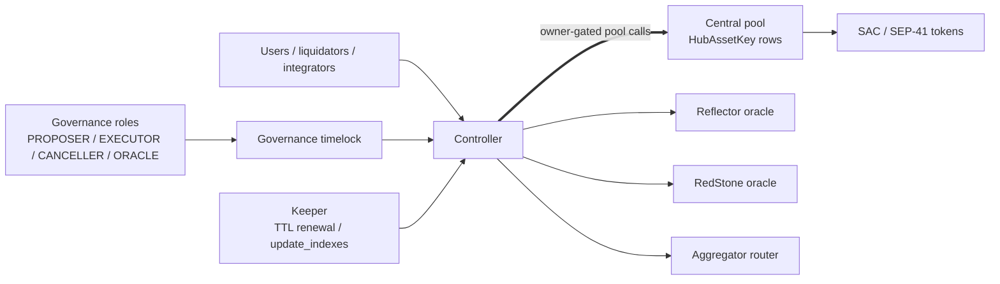

# XOXNO Lending

[](https://github.com/XOXNO/rs-lending-xlm/actions/workflows/tests.yml)   

XOXNO Lending is a multi-asset lending protocol for Stellar Soroban. The current
design has three core contracts:

- `governance`: owns the controller and timelocks protocol-admin changes.
- `controller`: owns accounts, spoke configuration, oracle validation, risk
  checks, liquidations, flash loans, and strategy entrypoints.
- `pool`: one central controller-owned pool that holds liquidity and stores
  accounting rows keyed by `HubAssetKey { hub_id, asset }`.

> [!IMPORTANT]
> The protocol is pre-audit. Mainnet launch is gated by
> [ADR 0009](./architecture/decisions/0009-mainnet-launch-hardening-and-operational-control.md)
> and the acceptance matrix in
> [SCF_BUILD_ARCHITECTURE.md](./SCF_BUILD_ARCHITECTURE.md).

## Quick Links

- [Architecture reference](./SCF_BUILD_ARCHITECTURE.md): topology, storage,
  contract boundaries, launch gates, and verification criteria.
- [Protocol invariants](./architecture/INVARIANTS.md): fixed-point domains,
  solvency rules, oracle constraints, and accounting invariants.
- [Architecture decisions](./architecture/decisions/README.md): ADR index for
  protocol design choices.
- [Certora verification](./certora/README.md): proof domains, profiles, and local
  prover commands.
- [Security policy](./SECURITY.md): private vulnerability reporting and safe
  harbor scope.
- [Contributing guide](./CONTRIBUTING.md): local checks and pull request
  expectations.

## Architecture At Glance



- **Controller** is the user-facing protocol contract. It coordinates account
  lifecycle, `HubAssetKey` market operations, spoke risk configuration, oracle
  checks, liquidation, flash loans, and strategies.
- **Governance** validates admin inputs, schedules controller changes through a
  ledger-based timelock, and keeps pause/unpause immediate. Governance roles are
  `PROPOSER`, `EXECUTOR`, `CANCELLER`, and `ORACLE`.
- **Pool** is a single central liquidity contract. It stores `Params` and `State`
  rows by `HubAssetKey`, tracks `cash`, indexes, reserves, revenue, and flash-loan
  settlement.
- **Keeper** is off-chain. It renews TTLs and can call `update_indexes`; it does
  not rely on controller `KEEPER`, `REVENUE`, or `ORACLE` roles.

## Design Model

- **Hub assets**: a market is addressed by `HubAssetKey { hub_id, asset }`.
  The same token on different hubs is independent and does not net positions,
  indexes, revenue, or bad debt.
- **Spokes**: accounts bind to a real spoke id `>= 1`. Spoke asset rows
  (`SpokeAsset(spoke_id, HubAssetKey)`) hold collateral flags, borrow flags,
  caps, liquidation parameters, and optional oracle overrides.
- **Oracle activation**: token-rooted `AssetOracle(asset)` entries activate price
  resolution. Removing the entry disables price use for that asset.
- **Scaled balances**: supply and debt positions are stored as RAY-scaled shares
  against per-market indexes.
- **Numeric domains**: token amounts stay token-native at token boundaries; USD
  risk math uses WAD; rates and indexes use RAY.
- **Flash loans**: the pool snapshots token balance, calls the receiver, pulls
  repayment, then verifies balance increased by the fee.
- **Bad debt**: unrecoverable residual debt is socialized through the pool supply
  index, with a configured floor.

## Repository Map

```text
rs-lending-xlm/
├── common/                  # Shared math, types, events, constants, errors
├── contracts/
│   ├── controller/          # Accounts, risk, oracle, liquidation, strategies
│   ├── governance/          # Timelocked protocol administration
│   ├── pool/                # Central pool accounting and flash loans
│   ├── defindex-strategy/   # Reference DeFindex vault strategy
│   └── flash-loan-receiver/ # Reference flash-loan receiver
├── interfaces/              # External ABI traits and generated clients
├── services/keeper/         # Off-chain keeper service, separate workspace
├── certora/                 # Certora specs and harnesses
├── tests/                   # Integration harnesses and fuzz targets
├── architecture/            # Invariants, ADRs, and architecture material
├── configs/                 # Market, spoke, network, deployment inputs
└── vendor/                  # Minimal cvlr-log patch (no_std fix pending upstream)
```

## Requirements

Required:

- Rust from [rust-toolchain.toml](./rust-toolchain.toml).
- Stellar CLI with Soroban contract support.
- `wasm32v1-none`, installed through the configured Rust toolchain.

Optional:

- `cargo-llvm-cov` for coverage reports.
- `cargo-fuzz` and nightly Rust for fuzz targets.
- Certora Soroban tooling for formal verification profiles.

## Quickstart

```bash
git clone https://github.com/XOXNO/rs-lending-xlm.git
cd rs-lending-xlm
cargo test --workspace
make build
```

Use `make help` for the full command surface.

## Common Commands

| Command | Purpose |
| --- | --- |
| `make build` | Build controller and pool WASM artifacts. |
| `make optimize` | Build optimized deployment WASM binaries. |
| `cargo test --workspace` | Run the root Rust workspace test suite. |
| `make test` | Run serialized Soroban integration tests. |
| `make test-pool` | Run pool unit tests. |
| `make fmt` | Format the root workspace. |
| `make clippy` | Run clippy with warnings denied. |
| `make coverage-merged` | Generate merged controller, pool, and harness coverage. |

`services/keeper` is a separate workspace:

```bash
cargo test --manifest-path services/keeper/Cargo.toml
```

## Verification

Verification layers include:

- Rust unit tests in production crates.
- Soroban integration tests in `tests/test-harness`.
- Fuzz targets in `tests/fuzz`.
- Certora profiles for math, pool accounting, controller risk logic, oracle
  rules, flash loans, liquidation, strategies, and controller-pool consistency.

Baseline local checks:

```bash
cargo test --workspace
make test
make test-pool
cargo check -p common --features certora
cargo check -p pool --features certora --no-default-features
cargo check -p controller --features certora --no-default-features
```

Mainnet launch uses the stronger acceptance matrix in
[SCF_BUILD_ARCHITECTURE.md](./SCF_BUILD_ARCHITECTURE.md#14-verification-surface).

### Static Analysis

[Scout](https://github.com/mihaieremia/scout-audit) runs on every PR, gates on
critical findings, and publishes the report in the job summary. Run the same
analysis locally:

```bash
scripts/scout-local.sh
scripts/scout-local.sh contracts/controller
```

For inline results in VS Code, install the SARIF Viewer extension
(`ms-sarifvscode.sarif-viewer`) and open `target/scout-audit/scout.sarif`.

## Deployment Operations

Deployment is Makefile-driven and requires Stellar CLI, configured network
settings, and a funded signer:

```bash
make testnet deploy
make testnet setup
make testnet info
```

Operational commands follow `make <network> <action>`:

```bash
make testnet pause
make testnet updateIndexes USDC XLM
make testnet getHealth 1 SIGNER=ledger
```

Mainnet authority, cap staging, and sustained-operation gates are defined in
[ADR 0009](./architecture/decisions/0009-mainnet-launch-hardening-and-operational-control.md).

## Security

Do not open public issues or pull requests for vulnerabilities. Report security
issues to `security@xoxno.com`; safe-harbor terms are in
[SECURITY.md](./SECURITY.md).

## License

This repository is licensed under the
[PolyForm Noncommercial 1.0.0](./LICENSE). Commercial use requires a written
agreement with XOXNO.

## Contributing

Protocol changes must preserve the accounting, authorization, oracle, and
solvency invariants in [INVARIANTS.md](./architecture/INVARIANTS.md), and must
include relevant verification output and launch-risk notes. Read
[CONTRIBUTING.md](./CONTRIBUTING.md) before opening an issue or pull request.
