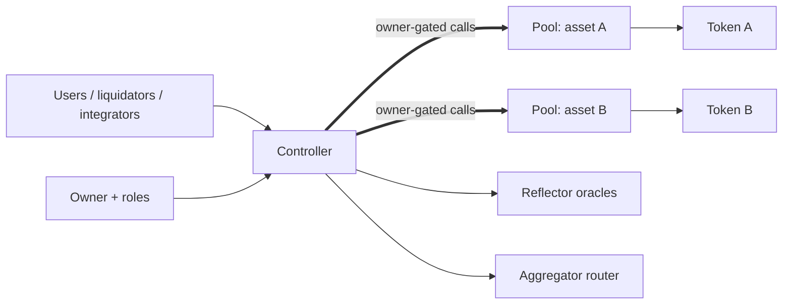

# XOXNO Lending

[](https://github.com/XOXNO/rs-lending-xlm/actions/workflows/ci.yml)   

XOXNO Lending is a multi-asset lending protocol for Stellar Soroban. It uses a
controller-and-pool architecture: the controller owns account state, oracle
validation, risk checks, liquidations, flash loans, and strategy entrypoints;
each pool owns custody and accounting for exactly one listed asset.

This repository contains the Soroban contracts, deployment tooling,
architecture records, and verification assets for the protocol.

> [!IMPORTANT]
> The protocol is pre-audit. Mainnet launch is gated by the hardening policy in
> [ADR 0009](./architecture/decisions/0009-mainnet-launch-hardening-and-operational-control.md)
> and the acceptance matrix in
> [SCF_BUILD_ARCHITECTURE.md](./SCF_BUILD_ARCHITECTURE.md).

## Quick Links

- [Architecture reference](./SCF_BUILD_ARCHITECTURE.md) - system topology,
  contract boundaries, launch gates, and verification acceptance criteria.
- [Protocol invariants](./architecture/INVARIANTS.md) - fixed-point domains,
  solvency rules, oracle constraints, and accounting invariants.
- [Architecture decisions](./architecture/decisions/README.md) - ADRs for the
  load-bearing design choices.
- [Certora verification](./verification/certora/README.md) - proof domains,
  profiles, and local prover commands.
- [Security policy](./SECURITY.md) - private vulnerability reporting and safe
  harbor.

## Architecture At A Glance



- **Controller**: user-facing coordinator for accounts, market setup, risk,
  liquidation, flash loans, and strategies.
- **Pool**: one contract per listed asset; custody, indexes, reserves,
  protocol revenue, rate updates, and flash-loan settlement.
- **Common**: fixed-point math, constants, events, errors, and shared ABI
  types.
- **Pool interface**: typed Soroban trait used for controller-to-pool calls.
- **Verification harnesses**: integration tests, property tests, fuzz targets,
  and Certora specs.

## Design Model

- **Scaled balances**: supply and borrow positions are stored in RAY precision
  against pool indexes; interest accrues by index movement, not account sweeps.
- **Explicit numeric domains**: token-native amounts stay at the token
  boundary; USD values and health factor use WAD; rates and indexes use RAY.
- **Oracle policy**: risk-increasing flows use strict price validation;
  selected risk-decreasing paths can use permissive cache modes.
- **Risk modes**: normal, isolation mode, e-mode, and siloed borrowing are
  enforced by the controller.
- **Flash loans**: pools settle by balance snapshot and post-repayment balance
  check, matching Soroban's invocation-scoped authorization model.
- **Bad debt**: unrecoverable residual debt is socialized through the affected
  pool's supply index with a numerical floor.

## Repository Map

```text
rs-lending-xlm/
├── common/             # Shared math, types, events, constants, and errors
├── controller/         # Accounts, risk, oracle, liquidation, strategy logic
├── pool/               # Asset pool accounting, indexes, revenue, flash loans
├── pool-interface/     # Cross-contract ABI used by the controller
├── verification/       # Certora specs, test harness, fuzzing, corpora
├── architecture/       # Invariants, ADRs, and architecture reference material
├── configs/            # Market, network, and deployment configuration inputs
└── vendor/             # Pinned local dependencies used during audit work
```

## Requirements

Install the toolchain and contract tooling before building:

- Rust from [rust-toolchain.toml](./rust-toolchain.toml).
- Stellar CLI with Soroban contract support.
- `wasm32v1-none`, installed through the configured Rust toolchain.

Optional tools:

- `cargo-llvm-cov` for coverage reports.
- `cargo-fuzz` and nightly Rust for fuzz targets.
- Certora Soroban tooling for formal-verification profiles.

## Quickstart

```bash
git clone https://github.com/XOXNO/rs-lending-xlm.git
cd rs-lending-xlm

cargo test --workspace
make build
```

Use `make help` to see the full command surface.

## Common Commands

| Command | Purpose |
| --- | --- |
| `make build` | Build controller and pool WASM artifacts. |
| `make optimize` | Build and optimize deployment WASM binaries. |
| `cargo test --workspace` | Run the full Rust workspace test suite. |
| `make test` | Run the Soroban integration harness serially. |
| `make test-pool` | Run pool unit tests. |
| `make fmt` | Format the workspace. |
| `make clippy` | Run clippy with warnings denied. |
| `make coverage-merged` | Generate merged controller, pool, and harness coverage. |

## Verification And Audit

The repository contains layered verification:

- Rust unit tests in production crates.
- Soroban integration tests in `verification/test-harness`.
- Property tests and fuzz targets in `verification/fuzz`.
- Certora profiles for common math, pool accounting, controller risk logic,
  oracle rules, flash loans, liquidation, isolation, strategies, and
  controller-pool consistency.

Baseline local checks:

```bash
cargo test --workspace
make test
make test-pool
./verification/certora/compile_all.sh
```

Mainnet launch uses the stronger acceptance matrix in
[SCF_BUILD_ARCHITECTURE.md](./SCF_BUILD_ARCHITECTURE.md#16-verification-surface).

## Deployment And Operations

Deployment is Makefile-driven and requires the Stellar CLI, configured network
settings, and a funded signer:

```bash
make testnet deploy
make testnet setup
make testnet info
```

Operational commands follow the `make <network> <action>` pattern. Examples:

```bash
make testnet pause
make testnet updateIndexes USDC XLM
make testnet getHealth 1
SIGNER=ledger make mainnet setupAll
```

Mainnet authority, cap staging, and sustained-operation gates are defined in
[ADR 0009](./architecture/decisions/0009-mainnet-launch-hardening-and-operational-control.md)
and summarized in the architecture reference.

## Security

Do not open public issues or pull requests for vulnerabilities. Report security
issues privately to `security@xoxno.com`; scope and safe-harbor terms are in
[SECURITY.md](./SECURITY.md).

## License

This repository is licensed under the
[PolyForm Noncommercial 1.0.0](./LICENSE). Commercial use requires a written
agreement with XOXNO.

## Contributing

Protocol changes preserve the accounting, authorization, oracle, and solvency
invariants documented in [architecture/INVARIANTS.md](./architecture/INVARIANTS.md)
and include relevant verification output and launch-risk notes.
