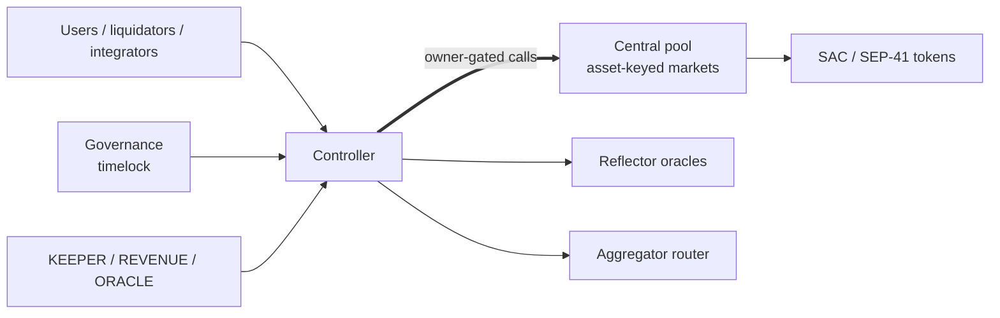

# XOXNO Lending

[](https://github.com/XOXNO/rs-lending-xlm/actions/workflows/ci.yml)   

XOXNO Lending is a multi-asset lending protocol for Stellar Soroban. It uses a
governance, controller, and central-pool architecture: governance owns the
controller and timelocks protocol-admin changes; the controller owns account
state, oracle validation, risk checks, liquidations, flash loans, and strategy
entrypoints; one central pool contract holds liquidity and asset-scoped
accounting for each listed market.

This repository holds the contracts, deployment tooling, architecture records,
and verification assets.

> [!IMPORTANT]
> The protocol is pre-audit. Mainnet launch is gated by the hardening policy in
> [ADR 0009](./architecture/decisions/0009-mainnet-launch-hardening-and-operational-control.md)
> and the acceptance matrix in
> [SCF_BUILD_ARCHITECTURE.md](./SCF_BUILD_ARCHITECTURE.md).

## Quick Links

- [Architecture reference](./SCF_BUILD_ARCHITECTURE.md): system topology,
  contract boundaries, launch gates, and verification acceptance criteria.
- [Protocol invariants](./architecture/INVARIANTS.md): fixed-point domains,
  solvency rules, oracle constraints, and accounting invariants.
- [Architecture decisions](./architecture/decisions/README.md): ADRs for the
  load-bearing design choices.
- [Certora verification](./certora/README.md): proof domains,
  profiles, and local prover commands.
- [Security policy](./SECURITY.md): private vulnerability reporting and safe
  harbor.
- [Contributing guide](./CONTRIBUTING.md): local checks, change expectations,
  and pull request requirements.
- [Code of conduct](./CODE_OF_CONDUCT.md): expected conduct and reporting.

## Architecture at a Glance



- **Controller**: the single user-facing contract; coordinates accounts, market
  setup, risk, liquidation, flash loans, and strategies.
- **Governance**: owns the controller, validates admin inputs, schedules
  changes through a ledger-based timelock, and keeps emergency pause immediate.
- **Pool**: one central controller-owned contract; asset-keyed custody, indexes,
  reserves, protocol revenue, rate updates, and flash-loan settlement.
- **Common**: fixed-point math, constants, events, errors, and shared ABI types.
- **Pool interface**: typed Soroban trait for controller-to-pool calls.
- **Verification harnesses**: integration tests, property tests, fuzz targets,
  and Certora specs.

## Design Model

- **Scaled balances**: positions are stored in RAY against per-market indexes;
  interest accrues by moving one shared index, not by sweeping accounts.
- **Numeric domains**: token-native at the token boundary, WAD for USD values
  and health factor, RAY for rates and indexes.
- **Oracle policy**: risk-increasing actions require strict, validated
  prices; risk-reducing actions may accept looser prices.
- **Risk modes**: the controller enforces normal and e-mode borrowing.
- **Flash loans**: pools settle by balance snapshot and post-repayment check,
  matching Soroban's invocation-scoped authorization.
- **Bad debt**: unrecoverable residual debt is socialized through the pool's
  supply index, floored to a minimum.

## Repository Map

```text
rs-lending-xlm/
├── common/             # Shared math, types, events, constants, and errors
├── contracts/
│   ├── controller/     # Accounts, risk, oracle, liquidation, strategy logic
│   ├── governance/     # Timelocked protocol administration
│   ├── pool/           # Central pool accounting, indexes, revenue, flash loans
│   ├── defindex-strategy/    # Reference DeFindex vault strategy (integration example)
│   └── flash-loan-receiver/  # Reference flash-loan receiver (tests/examples)
├── interfaces/
│   ├── controller/     # Controller external ABI trait and client
│   ├── governance/     # Governance external ABI trait and client
│   └── pool/           # Cross-contract pool ABI used by the controller
├── services/           # Off-chain keeper service (separate workspace)
├── certora/            # Certora formal verification specs and harness
├── tests/
│   ├── test-harness/   # Integration and property tests
│   └── fuzz/           # cargo-fuzz targets and corpora
├── architecture/       # Invariants, ADRs, and architecture reference material
├── configs/            # Market, network, and deployment configuration inputs
└── vendor/             # Pinned local dependencies used during audit work
```

## Requirements

Required:

- Rust from [rust-toolchain.toml](./rust-toolchain.toml).
- Stellar CLI with Soroban contract support.
- `wasm32v1-none`, installed through the configured Rust toolchain.

Optional:

- `cargo-llvm-cov` for coverage reports.
- `cargo-fuzz` and nightly Rust for fuzz targets.
- Certora Soroban tooling for formal-verification profiles.

## Quickstart

```bash
git clone https://github.com/XOXNO/rs-lending-xlm.git
cd rs-lending-xlm

cargo test --workspace
make build
```

Use `make help` to see the full command surface.

## Common Commands

| Command | Purpose |
| --- | --- |
| `make build` | Build controller and pool WASM artifacts. |
| `make optimize` | Build and optimize deployment WASM binaries. |
| `cargo test --workspace` | Run the full Rust workspace test suite. |
| `make test` | Run the Soroban integration harness with serialized tests. |
| `make test-pool` | Run pool unit tests. |
| `make fmt` | Format the workspace. |
| `make clippy` | Run clippy with warnings denied. |
| `make coverage-merged` | Generate merged controller, pool, and harness coverage. |

## Verification and Audit

Verification layers:

- Rust unit tests in production crates.
- Soroban integration tests in `tests/test-harness`.
- Property tests and fuzz targets in `tests/fuzz`.
- Certora profiles for common math, pool accounting, controller risk logic,
  oracle rules, flash loans, liquidation, strategies, and controller-pool
  consistency.

Baseline local checks:

```bash
cargo test --workspace
make test
make test-pool
cargo check -p common --features certora
cargo check -p pool --features certora --no-default-features
cargo check -p controller --features certora --no-default-features
```

Mainnet launch uses the stronger acceptance matrix in
[SCF_BUILD_ARCHITECTURE.md](./SCF_BUILD_ARCHITECTURE.md#16-verification-surface).

## Deployment and Operations

Deployment is Makefile-driven and requires the Stellar CLI, configured network
settings, and a funded signer:

```bash
make testnet deploy
make testnet setup
make testnet info
```

Operational commands follow the `make <network> <action>` pattern. Examples:

```bash
make testnet pause
make testnet updateIndexes USDC XLM
make testnet getHealth 1
SIGNER=ledger make mainnet setupAll
```

Mainnet authority, cap staging, and sustained-operation gates are defined in
[ADR 0009](./architecture/decisions/0009-mainnet-launch-hardening-and-operational-control.md)
and summarized in the architecture reference.

## Security

Do not open public issues or pull requests for vulnerabilities. Report security
issues to `security@xoxno.com`; scope and safe-harbor terms are in
[SECURITY.md](./SECURITY.md).

## License

This repository is licensed under the
[PolyForm Noncommercial 1.0.0](./LICENSE). Commercial use requires a written
agreement with XOXNO.

## Contributing

Protocol changes must preserve the accounting, authorization, oracle, and
solvency invariants in [INVARIANTS.md](./architecture/INVARIANTS.md), and include
the relevant verification output and launch-risk notes. Read
[CONTRIBUTING.md](./CONTRIBUTING.md) before opening an issue or pull request.
