# XOXNO Lending — Technical Architecture

*Stellar Soroban lending and borrowing protocol with capital-strategy primitives.*

---

## Contents

1. [Overview](#1-overview)
2. [Design Thesis](#2-design-thesis)
3. [System Topology](#3-system-topology)
4. [Component Responsibilities](#4-component-responsibilities)
5. [Account and Position Model](#5-account-and-position-model)
6. [Market Configuration](#6-market-configuration)
7. [Market Lifecycle](#7-market-lifecycle)
8. [Core User Flows](#8-core-user-flows) — supply, borrow, repay, withdraw, liquidation
9. [Capital Strategy Flows](#9-capital-strategy-flows) — multiply, swap_collateral, swap_debt, repay_debt_with_collateral, flash_loan
10. [Risk Frameworks](#10-risk-frameworks) — e-mode, isolation, threshold snapshots
11. [Oracle and Price Safety](#11-oracle-and-price-safety)
12. [Fixed-Point Math and Invariants](#12-fixed-point-math-and-invariants)
13. [Soroban Storage and TTL Model](#13-soroban-storage-and-ttl-model)
14. [Access Control and Trust Boundaries](#14-access-control-and-trust-boundaries)
15. [Deployment Model](#15-deployment-model)
16. [Differentiation](#16-differentiation)
17. [Stellar / Soroban Specifics](#17-stellar--soroban-specifics)
18. [Risks and Mitigations](#18-risks-and-mitigations)
19. [Verification](#19-verification)

[Appendix — Diagram Index](#appendix--diagram-index) · [References](#references)

---

## 1. Overview

XOXNO Lending is a Stellar-native lending protocol written in Rust on Soroban. Capital-strategy primitives — leverage, deleverage, debt swaps, collateral swaps, flash loans — are first-class controller endpoints, not modules layered on a passive core. Every flow honors the same solvency invariants, oracle gates, and isolation rules.

A two-tier Soroban deployment: a single **controller** owns user-facing endpoints, account lifecycle, risk validation, and orchestration; per-asset **pool** child contracts own token custody, interest accrual, and bad-debt socialization. A thin `pool-interface` crate separates them, so the controller depends on the ABI, not the implementation.

The controller validates Reflector, Soroswap, and SAC / SEP-41 surfaces before state mutation.

**Repository.** `https://github.com/XOXNO/rs-lending-xlm`. Source-of-truth docs live under `architecture/` (ARCHITECTURE, INVARIANTS, MATH_REVIEW, ORACLE, DATAFLOW, STORAGE, STELLAR_NOTES, ACTORS, CONFIG_INVARIANTS, ENTRYPOINT_AUTH_MATRIX, INCIDENT_RESPONSE, DEPLOYMENT, GLOSSARY). §References annotates each.

---

## 2. Design Thesis

Stellar lending today stops at supply, borrow, repay, withdraw. Users wanting leveraged exposure, pair rotation, or atomic deleveraging must orchestrate flash loans, swaps, and rebalances across multiple contracts and signatures — fragile against MEV, slippage, and partial failure, and hostile to non-expert users.

XOXNO Lending fills the gap. Strategy primitives live inside the protocol, so the same isolation guarantees, oracle gates, and liquidation logic apply uniformly across simple deposits and complex multi-leg flows. The protocol is built to be **consumed by other Stellar applications** — wallets, vault aggregators, structured products, RWA frontends — not to be a destination dApp.

The core architectural choice: **separate protocol-wide risk and account orchestration from per-asset liquidity accounting**. The controller coordinates account-level risk and multi-asset actions; each pool stays narrow and asset-local. Pools execute accounting; the controller decides whether to allow it.

---

## 3. System Topology

The protocol has one controller, per-asset pools, two oracle feeds, one DEX router, the SAC / SEP-41 token contracts backing each market, and a revenue accumulator. The controller validates every external surface before any state mutation. Pools never reach beyond their custodied token: they receive admin-gated calls from the controller and respond, never calling oracles, the router, or other pools.

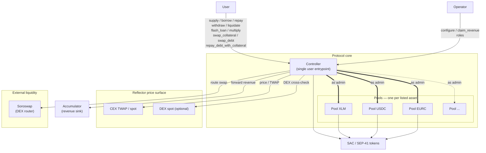

**Trust boundaries.**

- The controller is the only contract users call. Every pool mutation is owner-gated via `verify_admin`, and the controller owns each pool — only the controller can mutate pool state.
- The controller validates every oracle response before use.
- Soroswap calls run inside the controller, which verifies input and output balances around each call and enforces caller-supplied `min_amount_out`.
- The controller depends on `pool-interface`, not the pool runtime crate. This pins the cross-contract surface, shrinks controller WASM, and makes the trust boundary explicit.

---

## 4. Component Responsibilities

### 4.1 Controller

The controller owns protocol logic and is the only user-facing entrypoint. Responsibilities span five domains:

- **Account lifecycle.** Creation, ownership checks, multi-position bookkeeping, position-limit enforcement.
- **User flows.** Supply, borrow, repay, withdraw, liquidation — all with risk validation for LTV, health factor (HF), liquidation threshold and bonus, isolation debt ceilings. Supply, borrow, repay, withdraw accept bulk multi-asset payloads atomically; liquidation is intrinsically multi-asset (one call may repay several debts and seize several collaterals).
- **Strategy orchestration.** `multiply`, `swap_collateral`, `swap_debt`, `repay_debt_with_collateral`, and flash-loan flow with reentrancy guard.
- **Market and oracle config.** Asset registry, e-mode categories, isolation rules, oracle wiring, price-safety tier resolution.
- **Operational housekeeping.** Pool deployment from the stored WASM template, pool upgrades, revenue claiming and forwarding to the accumulator, TTL keepalives.

### 4.2 Pool

One pool per listed asset. Each owns asset-local state only:

- **Custody.** Token balance for its single asset.
- **Aggregate accounting.** Scaled supply, scaled borrow debt, supply and borrow indexes, accrued protocol revenue.
- **Interest model.** Per-block accrual, reserve-availability checks, bad-debt socialization into the supply index.
- **Flash-loan accounting.** `flash_loan_begin` snapshots the pre-loan balance; `flash_loan_end` verifies repayment via balance-delta.

Pools make no protocol-level solvency decisions. They execute accounting the controller requests.

### 4.3 Pool Interface

`pool-interface` exposes pools as a typed client. **Mutating calls**: `supply`, `borrow`, `withdraw`, `repay`, `update_indexes`, `add_rewards`, `flash_loan_begin`, `flash_loan_end`, `create_strategy`, `seize_position`, `claim_revenue`, `update_params`, `upgrade`, `keepalive`. **Read calls**: `capital_utilisation`, `reserves`, `deposit_rate`, `borrow_rate`, `protocol_revenue`, `supplied_amount`, `borrowed_amount`, `delta_time`, `get_sync_data`.

### 4.4 External Services

**Reflector oracle.** Read via a minimal `ReflectorClient`. The ORACLE role sets per-market wiring via `configure_market_oracle`, adjusts it through `edit_oracle_tolerance`, and triggers a kill switch via `disable_token_oracle`. Token decimals come from the token contract; CEX and DEX oracle decimals from the oracle contracts during `configure_market_oracle`. Operators supply no decimals. Reflector methods: `lastprice(asset)` for spot, `prices(asset, records)` for TWAP windows, `decimals()` and `resolution()` for feed metadata.

**Soroswap.** DEX router for the four account-bound strategies (`multiply`, `swap_collateral`, `swap_debt`, `repay_debt_with_collateral`). Set at deployment; the Owner updates it via `set_aggregator`. The controller passes user-supplied `min_amount_out` and verifies received amount via balance-delta before settling. The user bounds slippage; the controller never trusts the router unconditionally.

**Accumulator.** Protocol revenue sink, set at deployment; the Owner updates it via `set_accumulator`. Revenue accrues as scaled supply tokens (appreciating with the supply index) and forwards on `claim_revenue`. Revenue earns yield until claimed. Trust model: address-only — tokens forward without per-call validation, since the accumulator is a passive governance-configured collector.

---

## 5. Account and Position Model

One account holds many positions — standard, isolated, e-mode, strategy-driven, plus future permissioned or RWA-compatible markets — all under one owner address with split per-asset storage.

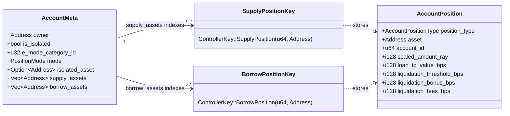

The same `AccountPosition` type backs supply and borrow entries. Two storage key families (`SupplyPosition(account_id, asset)` and `BorrowPosition(account_id, asset)`) keep read paths separated; the `position_type` field distinguishes them at the value layer for generic code (liquidation seizure, bad-debt cleanup).

**Why split storage.** Withdraw never reads borrow positions; repay never reads supply positions; viewing one position never deserializes the whole account. Storage I/O is linear in the *touched* set, not the total; TTL bumps target each account and position instead of rewriting nested maps.

**Authorization.** Each account carries an `owner: Address`. Risk-increasing mutations (borrow, withdraw, account-bound strategies) require `caller.require_auth()` plus `account.owner == caller`. Risk-decreasing mutations (supply, repay) and liquidation are permissionless — supply and repay only improve account health; liquidation requires `liquidator.require_auth()` for the token spend, but no relationship to the victim, since the protocol incentivizes third parties to clean up unhealthy positions. This preserves liveness during oracle outages and lets keepers, integrators, and liquidators interact without privileged keys.

**Position limits.** Up to 10 supply and 10 borrow positions per account. The cap bounds liquidation gas, since liquidation iterates every position on the account.

**Scaled-amount accounting.** Positions store `scaled = actual × RAY / index`. Reconstruction is `scaled × index / RAY`. Interest auto-compounds in O(1) per market: the index moves, every position's actual balance moves with it.

---

## 6. Market Configuration

Each market has one canonical `MarketConfig` record keyed by asset, carrying status, pool address, risk parameters, and full oracle wiring as a single flat structure. The flat layout reads and audits more easily than a split scheme.

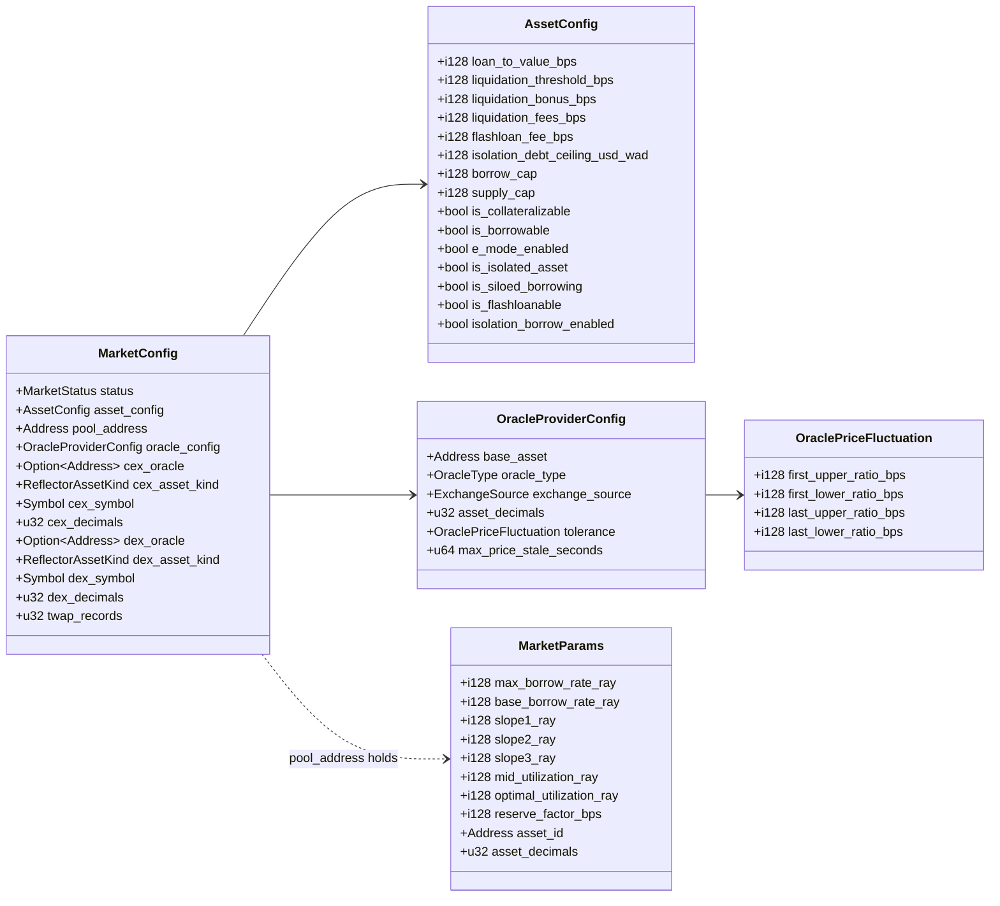

`MarketConfig`, `AssetConfig`, `OracleProviderConfig`, and `OraclePriceFluctuation` live in controller storage; edits go through `edit_asset_config` and `configure_market_oracle`. `MarketParams` (rate-model parameters and reserve factor) lives on the pool side; edits go through the controller's `upgrade_pool_params`.

**Tolerance bands.** Each tier stores four ratio bounds; operators configure only two BPS values per market (`first_tolerance`, `last_tolerance`). The contract derives the four ratios via `upper = BPS + tolerance` and `lower = BPS² / upper` — a multiplicative band: at 2% tolerance, the upper ratio is 1.02× and the lower 1/1.02× ≈ 0.98×.

**Inter-parameter invariants.** Edit endpoints validate the following at write time:

- `liquidation_threshold > LTV` — fresh borrows cannot land in liquidatable territory.
- `liquidation_bonus ≤ MAX_LIQUIDATION_BONUS = 15%` — caps liquidator premium.
- `flashloan_fee_bps ∈ [0, MAX_FLASHLOAN_FEE_BPS = 5%]` — bounds protocol take; negative values rejected so the pool never pays the receiver.
- `reserve_factor_bps < 100%` (on `MarketParams`) — the protocol cannot consume all interest accrual.
- `liquidation_fees_bps ≤ 100%` — fee on bonus cannot exceed the bonus.
- `borrow_cap`, `supply_cap`, `isolation_debt_ceiling_usd_wad` all `≥ 0`; `0` denotes unlimited.
- Rate-curve monotonicity (on `MarketParams`): `0 ≤ base_borrow_rate ≤ slope1 ≤ slope2 ≤ slope3 ≤ max_borrow_rate ≤ MAX_BORROW_RATE_RAY (= 2 × RAY)` — keeps the curve non-decreasing and the Taylor input inside its convergence envelope.
- Utilization breakpoints (on `MarketParams`): `0 < mid_utilization < optimal_utilization < RAY` — guarantees the three-region curve is well-defined.
- Tolerance-band ordering: `MIN_FIRST_TOLERANCE ≤ first_tolerance ≤ MAX_FIRST_TOLERANCE`, `MIN_LAST_TOLERANCE ≤ last_tolerance ≤ MAX_LAST_TOLERANCE`, plus `first_tolerance < last_tolerance`, enforced in `validate_oracle_bounds`.

Per-position threshold snapshots protect existing accounts from sudden config tightening.

---

## 7. Market Lifecycle

Markets activate in stages. A market accepts user operations only after pool, oracle, and risk configuration land.

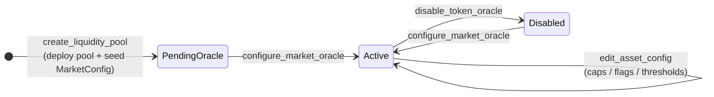

Staging prevents partial configuration from going live: a pool must exist before oracle configuration, and the final asset config lands last. `Disabled` is a soft kill switch — `disable_token_oracle` blocks new oracle-dependent operations while keeping pool reserves and positions intact, so existing positions can still repay or withdraw using cached state. A single `configure_market_oracle` call re-arms the market.

---

## 8. Core User Flows

Each flow enters the controller, which validates risk and dispatches per-asset accounting to the pool. The five flows share a shape: validate inputs and account state, fetch oracle prices under the appropriate posture, transfer tokens at the boundary, ask the pool to update scaled accounting, then re-check post-state invariants where applicable.

Each flow's risk direction sets its oracle posture: supply and repay tolerate stale prices and tier-3 deviation (risk-decreasing); borrow, withdraw-with-debt, liquidation enforce strict prices (risk-increasing).

### 8.1 Supply

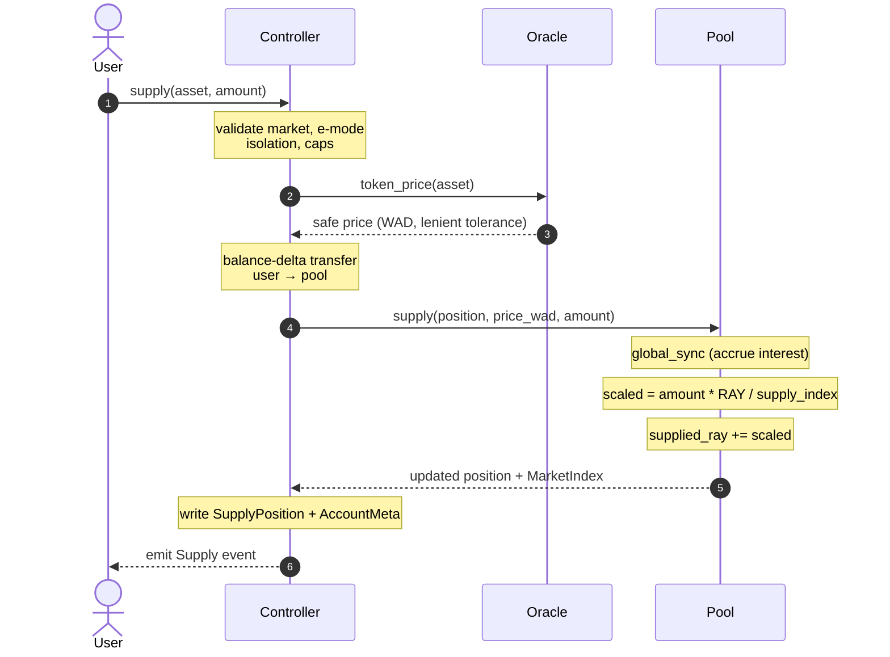

Supply is risk-decreasing and permissionless — any caller can deposit into any existing account, raising its HF. Calling with `account_id == 0` mints a new account owned by the caller. The cache uses `allow_unsafe_price = true`: tier-3 deviation falls back to the safe price rather than panicking, so legitimate deposits keep flowing during oracle stress. The raw-asset supply cap checks the **synced** total, not stale state, preventing same-tx multi-payment cap leaks. Balance-delta accounting (`balance_before` / `balance_after`) defends fee-on-transfer and rebasing tokens.

### 8.2 Borrow

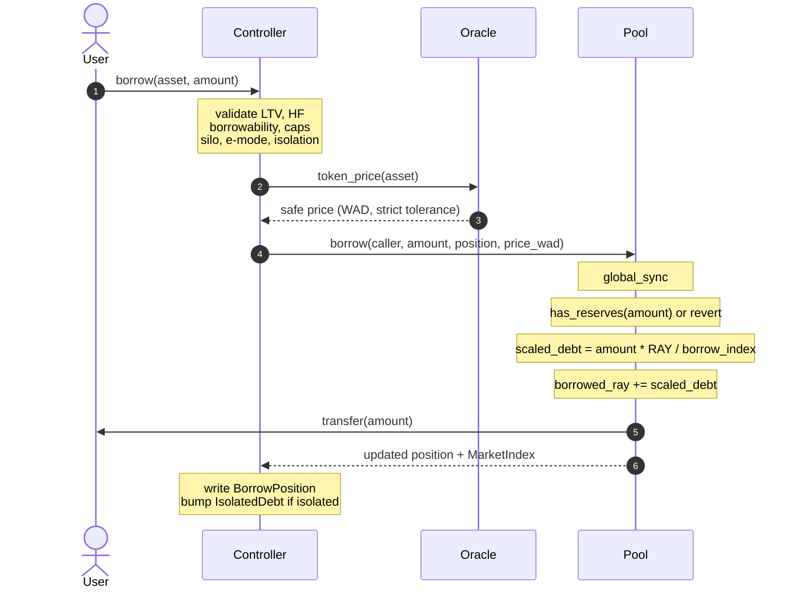

Borrow is risk-increasing, owner-gated; the controller verifies `account.owner == caller` after `caller.require_auth()`. The cache enforces strict pricing (`allow_unsafe_price = false`). LTV admission (`borrow ≤ Σ(collateral × LTV)`) plus the config-time invariant `liquidation_threshold > LTV` imply post-borrow `HF ≥ 1.0`.

### 8.3 Repay

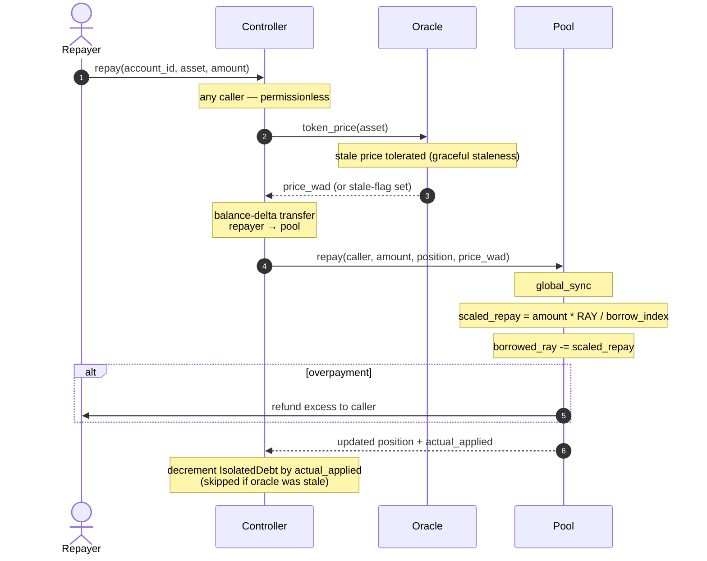

Repay is permissionless — anyone can repay anyone's debt. Index sync runs before scaled-amount reduction so partial repays burn the correct number of scaled tokens. The pool refunds overpayment via balance-delta.

The repay path uses **graceful staleness**: a stale oracle still permits repayment. The isolated-debt USD decrement skips on stale prices (under-decrementing is conservative — the next non-stale op reconciles), but position reduction is exact, operating on scaled amounts independent of price. Users can self-rescue during oracle outages.

### 8.4 Withdraw

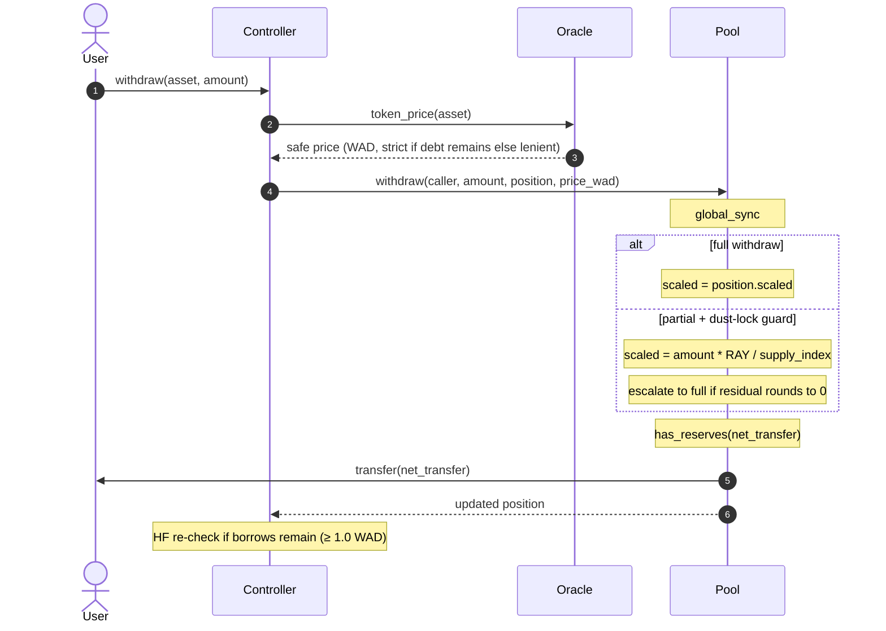

Withdraw is risk-increasing, owner-gated; the controller verifies `account.owner == caller` after `caller.require_auth()`. Oracle posture is conditional: with no borrows, `allow_unsafe_price = true` — no debt, no solvency risk. With borrows, strict pricing applies. The post-flow HF check uses fresh prices to defeat intra-tx price caching. The controller treats `amount == 0` as "withdraw all", mapping it to `i128::MAX` and clamping pool-side.

### 8.5 Liquidation

Liquidation is permissionless — any liquidator who can repay part of an unhealthy account's debt may invoke it. The endpoint requires `liquidator.require_auth()` (token spend) but no relationship to the liquidated account. It triggers when `HF < 1.0 WAD`; the liquidator repays part of the debt and seizes a matching portion of collateral plus a bonus. The cache enforces strict pricing (`allow_unsafe_price = false`) since collateral leaves at a price-derived ratio.

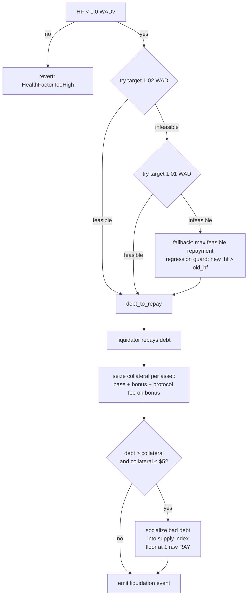

**Bonus formula.** `gap = (1.02 - HF) / 1.02; bonus = base + (max - base) × min(2 × gap, 1)`, capped at `MAX_LIQUIDATION_BONUS = 15%`. Multi-collateral seizure is proportional across assets, weighted by USD value. A protocol fee (`seizure × liquidation_fees_bps / BPS`) accrues to pool revenue.

**Bad-debt socialization.** When residual debt exceeds collateral and residual collateral falls below $5, the position fully seizes and the loss socializes via supply-index reduction. The index floors at 1 raw RAY atom; revenue-accrual paths carry an at-floor early-return guard so a wrecked pool cannot brick later ops. `PoolInsolventEvent` fires on >90% index drops so off-chain monitors can disable the asset.

---

## 9. Capital Strategy Flows

Strategy endpoints atomically compose two or more §8 core flows plus a Soroswap leg. Five sit on the controller — `multiply`, `swap_collateral`, `swap_debt`, `repay_debt_with_collateral`, `flash_loan`. Each respects the same e-mode, isolation, position-limit, and HF invariants as the core flows. The controller validates inputs, executes legs under a strategy guard, brackets the swap with balance-delta checks, and re-validates the post-state with fresh prices before persisting.

**Auth.** The four account-bound strategies (`multiply`, `swap_collateral`, `swap_debt`, `repay_debt_with_collateral`) gate to the account owner — they alter a specific account's risk surface. `flash_loan` is permissionless — any caller may originate one, since it must repay in the same tx or revert.

§9.5 captures the shared execution pattern; subsections describe each composition and where safety invariants attach.

### 9.1 Multiply (leverage long / short)

Opens a leveraged position in one tx. The controller flash-borrows the debt asset, swaps it into collateral via Soroswap, and supplies the result. The user pays `flashloan_fee_bps` (per-asset, governance-set, capped at 5%) plus slippage bounded by `min_amount_out`. The post-flow HF check uses fresh prices and enforces `HF ≥ 1.0`.

### 9.2 Swap collateral

Withdraws a collateral asset, swaps it via Soroswap, supplies the result as new collateral. Debt stays untouched. Useful for rebalancing or chasing better-yielding collateral without unwinding.

### 9.3 Swap debt

Flash-borrows a new debt asset via `pool.create_strategy`, swaps it via Soroswap, repays existing debt. The new asset's `flashloan_fee_bps` charges on the borrowed amount. Useful for interest-rate arbitrage or debt-asset rotation. The siloed-borrowing rule still applies: a swap into a siloed asset succeeds only when no other debt is open.

### 9.4 Repay debt with collateral

Withdraws collateral, swaps it via Soroswap, repays debt atomically. Lets users deleverage without external liquidity.

### 9.5 Strategy execution pattern

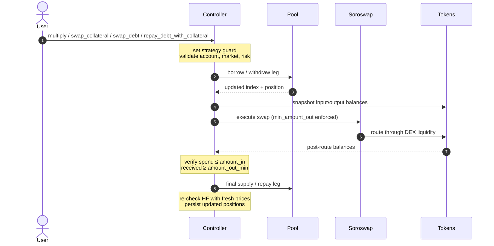

A strategy guard brackets Soroswap calls; pre- and post-call token balance snapshots validate them. The router's `min_amount_out` caps slippage at user-supplied tolerance.

### 9.6 Flash loan

```mermaid
sequenceDiagram
    autonumber
    actor U as Receiver contract
    participant C as Controller
    participant P as Pool
    participant T as Token

    U->>C: flash_loan(asset, amount, callback)
    Note over C: validate same-shard + endpoint not built-in
    C->>P: flash_loan_begin(asset, amount)
    Note over P: snapshot pool_balance_before<br/>set FlashLoanOngoing = true
    P->>T: transfer(pool → receiver, amount)
    C->>U: invoke callback (execute_flash_loan)
    Note over U: arbitrary logic; cannot re-enter<br/>controller via require_not_flash_loaning
    U->>T: transfer(receiver → pool, amount + fee)
    C->>P: flash_loan_end
    Note over P: pool_balance_after ≥<br/>pool_balance_before + fee or revert
    Note over P: clear FlashLoanOngoing
    P-->>C: ok
    C-->>U: ok
```

The `FlashLoanOngoing` instance flag is a single-flight guard. While set, every state-changing controller endpoint short-circuits on `require_not_flash_loaning`, eliminating reentrancy from the callback. Same-shard validation and a built-in-function denylist further constrain the callback surface. Balance-delta on the pool verifies repayment, not the receiver.

**Receiver-contract requirement.** Soroban's SAC `transfer(from, to, amount)` invokes `from.require_auth()` internally. For the receiver to repay the pool from its own balance, its `execute_flash_loan` callback must call `env.authorize_as_current_contract(...)` before the repayment transfer. Receivers that skip this revert with an auth error; the pool's balance-delta check fails the loan.

---

## 10. Risk Frameworks

E-mode and isolation are the two risk-segmentation modes. They optimize for opposite ends of the risk spectrum, are mutually exclusive, and are fixed at account creation — switching modes requires a new account.

| Property | E-Mode | Isolation Mode |
|----------|--------|----------------|
| Asset risk profile | Low (correlated, e.g. stablecoin pairs) | High (volatile, illiquid, RWA-compatible) |
| Per-account collateral | Multiple assets within the category | Exactly one (`isolated_asset`) |
| LTV / threshold / bonus | Enhanced (e.g. 97% / 98% / 2%) | Standard or stricter |
| Debt scope | Any borrowable asset | Only assets flagged `isolation_borrow_enabled` |
| Global cap | None — bounded by collateral value | `isolation_debt_ceiling_usd_wad` per asset |

### 10.1 E-Mode

Correlated assets receive enhanced parameters when grouped into a category. A stablecoin category may use `LTV = 97%`, `liquidation_threshold = 98%`, `liquidation_bonus = 2%` versus standard `75% / 80% / 5%`. E-mode locks at account creation. Categories are governance-managed; an admin can deprecate a category to block new positions while preserving existing ones until they wind down. The mutual-exclusivity guard with isolation fires at creation and on every deposit.

### 10.2 Isolation Mode

High-risk assets carry a global USD debt ceiling (`isolation_debt_ceiling_usd_wad`). An isolated account holds exactly one collateral type; every borrow consumes the global ceiling. The tracker is denominated in WAD; repay decrements it (sub-$1 dust erasure prevents ratchet bias) and borrow clamps at the ceiling. A representative configuration: `LTV = 30%`, `liquidation_threshold = 50%`, `liquidation_bonus = 10%`, `isolation_debt_ceiling = $10M USD` — conservative LTV, wide liquidation buffer, larger bonus to attract liquidators on thinner liquidity. Isolation lets higher-risk and future RWA-compatible markets coexist with conservative core markets without risking protocol solvency.

### 10.3 Per-position threshold snapshots

`liquidation_threshold_bps`, `liquidation_bonus_bps`, `liquidation_fees_bps`, and `loan_to_value_bps` snapshot at first deposit. Existing positions keep their snapshots when governance later changes the asset config — e.g., if `liquidation_threshold_bps` drops from 80% to 75%, existing positions retain 80% until refreshed. The KEEPER-gated `update_account_threshold` endpoint propagates new admin-set values to a chosen account (helper: `supply::update_position_threshold`). Updates require `HF ≥ 1.05` (5% buffer) so the keeper cannot push borderline accounts into liquidation; values stay bounded by the admin-only `asset_config` storage.

---

## 11. Oracle and Price Safety

The protocol prices assets via Reflector (SEP-40). The controller reads spot and TWAP feeds, normalizes 14-decimal USD to WAD at the edge, and settles all math in WAD. A two-tier deviation policy gates risk-increasing operations during stress. `architecture/ORACLE.md` carries integration details, provider-specific behaviors, and open questions.

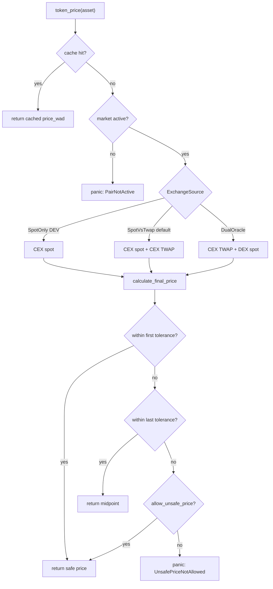

**Tolerance bands.** Operators set two BPS values per market at `configure_market_oracle` time — `first_tolerance ∈ [50, 5000]`, `last_tolerance ∈ [150, 5000]`, `first < last`. The contract stores the derived multiplicative ratios on `MarketConfig` (see §6) and classifies each reading into one of three tiers. Tier 1: safe price. Tier 2: midpoint of aggregator and safe. Tier 3: panic for risk-increasing ops, fallback to safe price for risk-decreasing ones.

**Reflector surface.** Four SEP-40 methods: `decimals()` for feed precision, `resolution()` for sample period, `lastprice(asset)` for spot, `prices(asset, records)` for TWAP windows. `ReflectorAsset::Stellar(Address)` names native assets; `ReflectorAsset::Other(Symbol)` names bridged tickers (`BTC`, `ETH`).

**Hardenings.**

| Property | Behavior |
|----------|----------|
| Decoupled staleness | Staleness and tolerance are independent: `allow_unsafe_price` bypasses tolerance but never staleness. `max_price_stale_seconds` clamped to `[60, 86_400]` at config time. |
| Future-dated rejection | A feed timestamp >60 seconds ahead of the ledger always reverts. |
| Soft DEX-staleness | In `DualOracle` mode, a stale DEX feed degrades to CEX TWAP as final price. CEX-side staleness still hard-fails risk-increasing ops. |
| Per-tx price cache | Within one tx, every price read for an asset returns the same value — eliminating intra-tx arbitrage. |
| On-chain decimal discovery | Token, CEX, and DEX oracle decimals all read from contracts at config time. Operators supply no decimals. |

---

## 12. Fixed-Point Math and Invariants

Four precision domains make cross-domain mistakes impossible at compile time. Rust newtypes (`Bps`, `Wad`, `Ray`) make accidental cross-precision arithmetic fail to compile; the asset-native domain is raw `i128`, converted explicitly at the token boundary.

| Domain | Base | Use | Rust type |
|--------|------|-----|-----------|
| Asset-native | per-token (read on-chain via `decimals()`) | Token amounts on the SAC / SEP-41 boundary | raw `i128` |
| BPS | 10⁴ | Percentages: LTV, liquidation threshold, reserve factor, fees, oracle tolerance | `common::fp::Bps` |
| WAD | 10¹⁸ | USD values, health factor, isolated-debt aggregate, prices after Reflector normalization | `common::fp::Wad` |
| RAY | 10²⁷ | Indexes, scaled balances, interest rates per millisecond | `common::fp::Ray` |

Cross-domain conversions use `common::fp_core::mul_div_half_up` with `I256` intermediates; 256-bit headroom prevents multiply-then-divide overflow even when both inputs sit near `i128::MAX`.

All arithmetic uses **half-up rounding**: `mul: (a × b + p/2) / p`; `div: (a × p + b/2) / b`. Half-up eliminates the floor-division bias that would compound into directional drift across millions of accruals.

**Compound interest.** 8-term Taylor expansion of `e^(rate × time)`, with `delta_ms` capped at one year per chunk so `x = rate × delta_ms / MS_PER_YEAR ≤ 2` bounds the truncated series. Annual borrow rate is capped at `MAX_BORROW_RATE_RAY = 2 × RAY` (200% APR), enforced at config time and re-clamped per chunk so the Taylor input stays in its safe envelope.

**Core invariants** (full set in `architecture/INVARIANTS.md`):

*Solvency and risk*

1. `HF = Σ(collateral × liquidation_threshold) / Σ(borrow)` in WAD; an account is liquidatable iff `HF < 1.0 WAD`.
2. Post-borrow debt ≤ Σ(collateral × LTV); LTV controls admission, liquidation threshold controls liquidation.
3. Reserve availability holds on every outgoing transfer: explicit `has_reserves` panic on borrow, withdraw, `flash_loan_begin`, `create_strategy`; implicit `min(reserves, requested)` clamp on `claim_revenue`.
4. Isolated debt ≤ configured ceiling, denominated in WAD, dust-clamped under $1.
5. Flash-loan repayment: `pool_balance_after ≥ pre_balance + fee` enforced in `flash_loan_end`, where `pre_balance` is the pool's token balance snapshotted at `flash_loan_begin` before disbursal. Equivalent to "the receiver's net repayment covers `amount + fee`."

*Accounting integrity*

6. Positions store scaled amounts; actuals reconstruct as `scaled × index / RAY`.
7. `0 ≤ revenue_ray ≤ supplied_ray` — protocol revenue is a supply claim that appreciates with the supply index.
8. Accrued interest splits exactly as `supplier_rewards + protocol_fee`.

*Math mechanics*

9. Borrow index is monotonic when elapsed time and utilization are non-negative.
10. Supply index is monotonic except for the sanctioned bad-debt socialization path; floored at 1 raw RAY atom.
11. Oracle and token decimals are discovered on-chain at config time; never operator-supplied.

---

## 13. Soroban Storage and TTL Model

The protocol uses Soroban storage tiers explicitly, not as a generic key-value map. `architecture/STORAGE.md` carries the key-by-key layout, TTL constants, and durability guarantees.

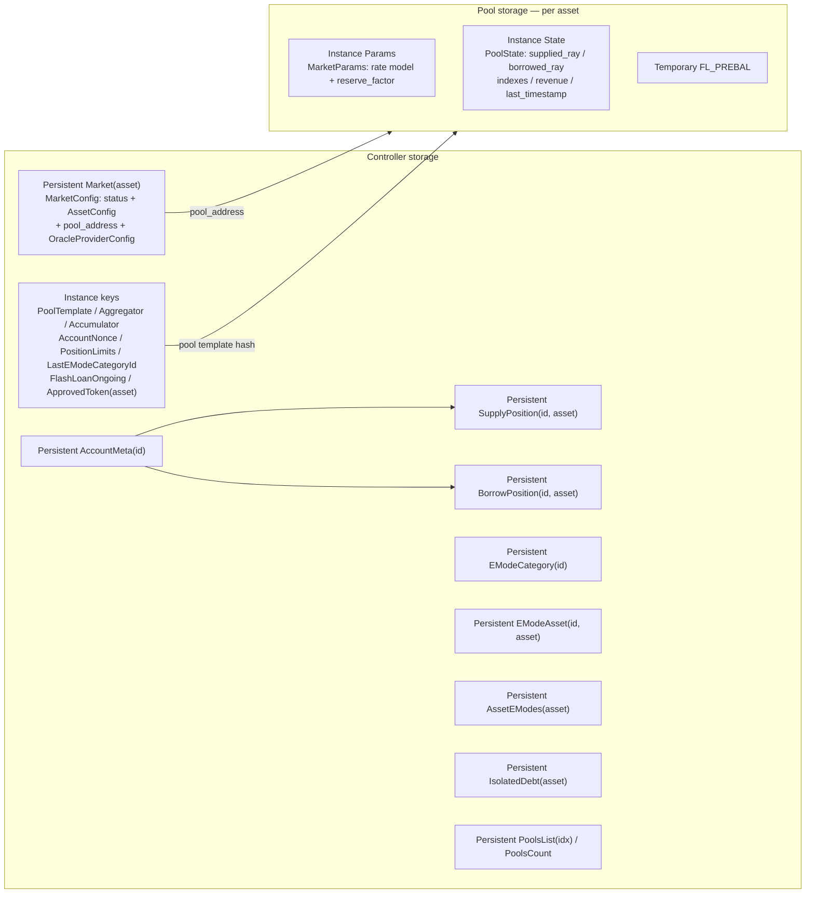

The Instance `Aggregator` key holds the swap router address — currently Soroswap. The key name reflects the abstract role, not the provider.

**Tiering rules.** Instance storage carries protocol-wide config (auto-bumped on every call, TTL ~180 days, the Soroban max). Persistent storage holds per-account positions and per-market config (explicit TTL bumps to ~120 days on writes and via keepalives). Temporary storage holds single-tx scratch state — flash-loan pre-balance is the canonical example.

**Active TTL management.** Soroban state expires; the protocol relies on explicit keepalives, not incidental writes. Three endpoints extend persistent TTLs without rewriting state:

- `keepalive_shared_state(assets)` — extends shared market, e-mode, and registry keys.
- `keepalive_accounts(ids)` — extends account metadata and per-position keys.
- `keepalive_pools(assets)` — delegates to each pool to extend instance state.

---

## 14. Access Control and Trust Boundaries

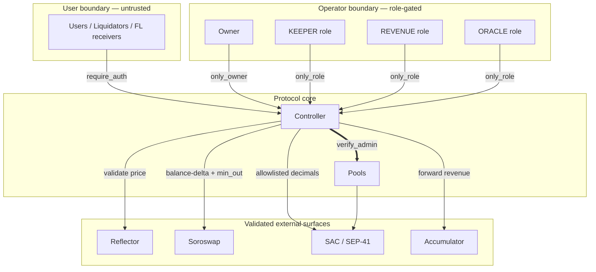

**Role separation.** The controller exposes four permission tiers, each scoped to a small surface:

| Role | Endpoints |
|------|-----------|
| **Owner** | `upgrade`, `pause`, `unpause`, `create_liquidity_pool`, `upgrade_pool`, `upgrade_pool_params`, `edit_asset_config`, `set_position_limits`, e-mode management, `set_aggregator`, `set_accumulator`, `set_liquidity_pool_template`, `approve_token_wasm` / `revoke_token_wasm`, `grant_role` / `revoke_role`. Ownership transfer is two-step: `transfer_ownership` (proposes) → `accept_ownership` (confirms). |
| **KEEPER** | `update_indexes`, `clean_bad_debt`, `update_account_threshold`, `keepalive_shared_state`, `keepalive_accounts`, `keepalive_pools`. Bounded operational hooks run on a schedule. |
| **REVENUE** | `claim_revenue`, `add_rewards`. Routes accrued revenue to the accumulator; accepts external reward injections. |
| **ORACLE** | `configure_market_oracle`, `edit_oracle_tolerance`, `disable_token_oracle`. Manages oracle wiring on existing markets without exposing risk-parameter mutation. |

`grant_role` grants roles; all are revocable. KEEPER is granted at construction; REVENUE and ORACLE require explicit post-deploy `grant_role` so a compromised owner key in the bootstrap window cannot immediately route revenue or reconfigure oracles. `architecture/ENTRYPOINT_AUTH_MATRIX.md` carries the full matrix — every public function with its auth gate, runtime checks, and downstream pool calls.

**External surfaces are validated, never trusted.** The controller checks oracle data for non-positive values, staleness, future timestamps, TWAP coverage, and deviation bands. Token balance deltas and minimum-output checks bracket Soroswap calls. Tokens are limited to approved SAC or audited SEP-41 contracts with 1:1 transfer.

---

## 15. Deployment Model

Template-driven. The pool WASM uploads once; the controller stores the pool-template hash; subsequent `create_liquidity_pool` calls deploy child pools from it.

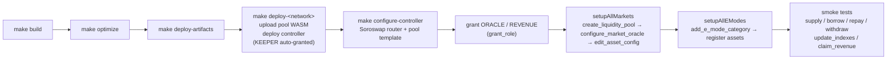

Setup order is load-bearing: pool first, oracle config second, `edit_asset_config` last — so user operations cannot fire against a partial market. Token, CEX, and DEX decimals all read from contracts during `configure_market_oracle` — never operator-supplied. A failed required decimal read reverts the tx.

`make setup-<network>` wraps deploy + configure + market setup end-to-end. The Soroswap-router config is optional during bootstrap (a blank value logs a warning and continues, deferring strategy operations). Role grants split across two phases: KEEPER at `__constructor`; REVENUE and ORACLE require explicit post-deploy `grant_role` calls. The split is deliberate — a compromised owner key in the bootstrap window cannot immediately route revenue or reconfigure oracles. The ORACLE grant must land between `configure-controller` and `setupAllMarkets`, since `setupAllMarkets` invokes the ORACLE-gated `configure_market_oracle`; `make setup-<network>` does not insert it, so the operator runs it separately.

Source-of-truth files: `configs/networks.json` (per-network metadata, controller ID, pool WASM hash), `configs/testnet_markets.json`, `configs/mainnet_markets.json`, `configs/emodes.json`, `configs/script.sh`, `Makefile`. `architecture/DEPLOYMENT.md` carries the full operator runbook.

---

## 16. Differentiation

XOXNO Lending sits at a different point in the design space from existing Stellar lenders:

- **Controller-led orchestration.** Account lifecycle and cross-asset risk live on a single controller, not on pools.
- **One pool per asset.** Each pool is asset-local; the controller coordinates multi-asset actions.
- **Multi-position accounts.** One account holds many positions, with split storage for `AccountMeta`, `SupplyPosition`, `BorrowPosition`.
- **Native isolation mode.** High-risk assets and future RWA-compatible markets ship under per-asset USD debt ceilings.
- **Native e-mode.** Correlated assets unlock enhanced LTV and liquidation parameters at account creation.
- **Native strategy primitives.** `multiply`, `swap_collateral`, `swap_debt`, `repay_debt_with_collateral`, `flash_loan` are first-class controller endpoints.
- **Bulk batches.** Supply, borrow, repay, withdraw accept multi-asset payloads atomically.
- **Per-position threshold snapshots.** Liquidation parameters snapshot at first deposit; refreshes go through the KEEPER-gated `update_account_threshold`, behind a 5% HF buffer.

These capabilities serve the §2 thesis: a foundational lending layer for other Stellar applications to build on, not a destination dApp.

---

## 17. Stellar / Soroban Specifics

| Concern | Implementation |
|---------|----------------|
| Authorization | `caller.require_auth()` on every entrypoint; cross-contract auth propagates through Soroban's auth tree; pool admin gate via `enforce_owner_auth`. |
| Storage tiers | Instance (180-day TTL, auto-bumped) for protocol globals — `FlashLoanOngoing` flag, swap-router address, pool template hash; persistent (120-day TTL) for accounts and markets, bumped via `bump_user` and `bump_shared`. |
| Token integration | SAC for XLM and issued assets; balance-delta accounting defends fee-on-transfer and rebasing tokens. |
| Reflector integration | Minimal `ReflectorClient`; on-chain decimal discovery; per-tx price cache. |
| Soroswap integration | DEX router for the four account-bound strategies (`multiply`, `swap_collateral`, `swap_debt`, `repay_debt_with_collateral`); on-chain `min_amount_out` plus controller-side balance-delta verification. |
| Cross-contract pattern | Typed `LiquidityPoolClient` from `pool-interface`; the controller never imports the pool runtime crate. |
| Upgrade path | Owner-only `upgrade(new_wasm_hash)` on controller and per-pool; pre-upgrade auto-pause prevents in-flight state corruption. |
| Pause | `pausable::when_not_paused` on every state-changing entrypoint; freezes the protocol within ~5 seconds. |

### Transaction limits

The worst-case transaction is a multi-asset liquidation at the position cap (10 supply + 10 borrow). Soroban network limits (April 2026):

| Limit | Value | Worst-case usage |
|-------|-------|------------------|
| `tx_max_instructions` | 400,000,000 | <30% on a 10×10 liquidation; envelope grows linearly with position count |
| `tx_max_disk_read_entries` | 200 | ≤~100 reads at 10×10 (20 positions + pool-state, market-config, cex/dex oracle entries, AccountMeta); ~50% margin |
| `tx_max_write_ledger_entries` | 200 | ~30–50 writes (touched positions + AccountMeta + IsolatedDebt + pool-state instance) |
| `tx_max_size_bytes` | 132,096 | 10-asset `Vec<(Address, i128)>` payload ~500 B; far below cap |
| `tx_memory_limit` | 41,943,040 (41 MB) | well below cap; `I256` math intermediates are largest allocations |
| `tx_max_contract_events_size_bytes` | 16,384 | one event per position mutation, ~200 B each → ~4 KB at max load |
| `tx_max_footprint_entries` | 400 | combined R/W footprint <100 entries |

Every flow fits inside Soroban's per-tx envelope with margin. `bench_liquidate_max_positions` (§19) regression-tests the worst-case envelope on each release.

---

## 18. Risks and Mitigations

| Risk | Mitigation |
|------|------------|
| Oracle manipulation | Multi-source resolution (CEX TWAP + DEX spot); tier-based tolerance gating; staleness decoupled from tolerance; future-date reject; per-tx price cache. `oracle_tolerance_tests` covers every tier transition. |
| Soroswap slippage / sandwich | `min_amount_out` enforced router-side; controller verifies received amount via balance-delta; user-supplied slippage tolerance bounds loss. `strategy_bad_router_tests` and `fuzz_strategy_flashloan` exercise adversarial router responses. |
| Reentrancy via flash loans | `FlashLoanOngoing` instance flag globally serializes every state-changing controller endpoint during the flash-loan window. Same-shard validation; built-in-function denylist. `flash_loan_tests` and `fuzz_strategy_flashloan` cover nested calls and callback panics. |
| Bad-debt cascade | Dutch-auction liquidation with dynamic bonus; bad-debt socialization with hard supply-index floor; at-floor early-return guards on revenue accrual; `PoolInsolventEvent` surfaces on >90% drops. `bad_debt_index_tests` and `fuzz_liquidation_differential` lock the math. |
| Tx-budget exhaustion at max liquidation | Position cap (10 supply + 10 borrow) sized so a worst-case liquidation fits inside `tx_max_instructions = 400 M` with margin. `bench_liquidate_max_positions` locks the envelope per release. |
| Storage TTL expiry | Persistent positions bumped on every write; instance state auto-bumped per call; three keeper endpoints extend TTLs explicitly. `fuzz_ttl_keepalive` covers every storage family. |
| Decimal mismatch / fee-on-transfer | On-chain decimal discovery via `try_decimals()`; balance-delta receipt accounting. `decimal_diversity_tests` exercises 6-, 7-, 12-, 18-decimal token mixes. |
| Governance config error | Edit endpoints enforce inter-parameter invariants at write time (see §6); per-position snapshots protect existing accounts. `admin_config_tests` covers the validation surface. |
| Owner-key compromise | Contract-level: `pause()` freezes within ~5 seconds; two-step ownership transfer (`transfer_ownership` → `accept_ownership`) prevents accidental handoff. Operator-level: multisig on the Owner key. |
| KEEPER / REVENUE / ORACLE role compromise | Roles are revocable. KEEPER cannot mutate config; REVENUE only routes revenue; ORACLE cannot change risk parameters. Privilege scopes bounded (see §14). `fuzz_auth_matrix` covers every endpoint × caller-role combination. |

`architecture/INCIDENT_RESPONSE.md` carries the full incident response runbook.

---

## 19. Verification

A four-layer verification stack.

**Formal verification (Certora).** Active office-hour reviews; full audit planned via the Stellar Audit Bank. Specs live under `controller/certora/spec/`, organized into 13 rule modules — one per architectural concern:

| Module | Coverage |
|---|---|
| `solvency_rules` | `revenue ≤ supplied`, reserve cap on borrow / withdraw / claim, LTV admission, supply-index floor, isolation debt non-negativity |
| `health_rules` | HF transitions across the 1.0 boundary, post-borrow `HF ≥ 1` |
| `liquidation_rules` | Dutch-auction targets, bonus cap, regression-guard fallback |
| `index_rules` | Borrow-index monotonicity, supply-index monotonicity (with sanctioned bad-debt exception) |
| `interest_rules` | Accrued interest = supplier rewards + protocol fee identity |
| `boundary_rules` | LTV / cap / fee / decimal-precision boundary cases |
| `position_rules` | Scaled-balance reconstruction, position-limit enforcement |
| `isolation_rules` | Isolation debt clamping, dust erasure, ceiling enforcement |
| `emode_rules` | E-mode XOR isolation, category-asset bidirectional consistency |
| `oracle_rules` | Tolerance-tier classification, staleness gates, decoupled `allow_unsafe_price` semantics |
| `flash_loan_rules` | Reentrancy guard set/clear lifecycle, repayment ≥ amount + fee |
| `strategy_rules` | Pre/post-swap balance checks, post-flow HF re-check |
| `math_rules` | `mul_div_half_up` rounding identities, `I256` no-overflow on rescale |

Source code lives one path away (e.g., `solvency_rules` ↔ `controller/src/positions/borrow.rs` admission and `pool/src/lib.rs` reserve checks).

**Coverage-guided fuzz (cargo-fuzz).** Six harnesses in `fuzz/fuzz_targets/` cover math, rates, and stateful execution; CI runs them on every PR.

| Target | What it locks down |
|---|---|
| `flow_e2e` | End-to-end op sequences across supply / borrow / withdraw / repay / liquidate / flash-loan plus keeper and revenue paths; HF floor, reserve availability, cache atomicity on `Err`. |
| `flow_strategy` | Strategy entrypoints (`multiply`, `swap_collateral`, `swap_debt`, `repay_debt_with_collateral`) under randomized router responses; flash-loan → swap → position-mutation chain. |
| `fp_math` | `mul_div_half_up`, `div_by_int_half_up`, `rescale_half_up` — half-up rounding identities, sign preservation, `I256` no-overflow bounds. |
| `fp_ops` | Ray ↔ Wad ↔ asset conversions, Wad arithmetic, Bps scaling, round-trip identities (`a + b − b ≡ a`) within documented ulp bounds. |
| `pool_native` | `pool::LiquidityPool` paths reachable without token transfers; registered as a native contract so coverage instrumentation sees pool code directly. |
| `rates_and_index` | Three-region piecewise rate curve, compound-interest Taylor series, the §5 interest-split identity `accrued = supplier_rewards + protocol_fee`. |

**In-harness fuzz suites.** Seven fuzz-style suites in `test-harness/tests/` exercise high-level invariants under randomized inputs:

| Suite | What it locks down |
|---|---|
| `fuzz_auth_matrix` | Every public endpoint × every caller-role combination |
| `fuzz_budget_metering` | Per-flow Soroban instruction-budget envelopes |
| `fuzz_conservation` | Token balance conservation across multi-step flows |
| `fuzz_liquidation_differential` | Liquidation math against a parallel reference implementation |
| `fuzz_multi_asset_solvency` | HF and reserve invariants under random multi-asset portfolios |
| `fuzz_strategy_flashloan` | Strategy + flash-loan composition under random slippage and reentrancy attempts |
| `fuzz_ttl_keepalive` | Persistent storage liveness across random keepalive schedules |

**Integration suites.** ~40 test files in `test-harness/tests/`, grouped by concern:

- **Core flows**: `supply_tests`, `borrow_tests`, `repay_tests`, `withdraw_tests`, `liquidation_tests`, `flash_loan_tests`.
- **Strategy variants**: `strategy_tests`, `strategy_happy_tests`, `strategy_edge_tests`, `strategy_coverage_tests`, `strategy_panic_coverage_tests`, `strategy_bad_router_tests`.
- **Risk and lifecycle**: `emode_tests`, `isolation_tests`, `bad_debt_index_tests`, `liquidation_coverage_tests`, `liquidation_math_tests`, `liquidation_mixed_decimal_tests`, `lifecycle_regression_tests`.
- **Math and invariants**: `interest_tests`, `interest_rigorous_tests`, `math_rates_tests`, `invariant_tests`.
- **Operational and chaos**: `keeper_tests`, `oracle_tolerance_tests`, `decimal_diversity_tests`, `chaos_simulation_tests`, `stress_simulation_tests`, `bench_liquidate_max_positions`, `footprint_test`.
- **Account and config**: `account_tests`, `admin_config_tests`, `events_tests`, `revenue_tests`, `rewards_rigorous_tests`, `views_tests`, `pool_coverage_tests`, `utils_tests`.

`bench_liquidate_max_positions` and `fuzz_budget_metering` together lock the worst-case Soroban tx envelope per release.

---

## Appendix — Diagram Index

All diagrams use Mermaid syntax inline.

1. System Topology (§3)
2. Account and Position Storage Model (§5)
3. Market Configuration Model (§6)
4. Market Lifecycle (§7)
5. Supply Flow (§8.1)
6. Borrow Flow (§8.2)
7. Repay Flow (§8.3)
8. Withdraw Flow (§8.4)
9. Liquidation Cascade (§8.5)
10. Strategy Execution Pattern (§9.5)
11. Flash-Loan Lifecycle (§9.6)
12. Oracle Price Resolution Pipeline (§11)
13. Soroban Storage Model (§13)
14. Trust Boundaries (§14)
15. Deployment Pipeline (§15)

---

## References

- Repository: `https://github.com/XOXNO/rs-lending-xlm`
- Architecture documents (full set): `architecture/`
  - `ARCHITECTURE.md` — system topology and component boundaries
  - `INVARIANTS.md` — algebraic invariants and verification map
  - `MATH_REVIEW.md` — fixed-point math audit
  - `ORACLE.md` — Reflector integration details
  - `DATAFLOW.md` — flow-by-flow data movement with trust-boundary annotations
  - `STORAGE.md` — storage tier and key family layout
  - `STELLAR_NOTES.md` — Soroban platform behaviors the protocol depends on
  - `ACTORS.md` — privilege model and key actors
  - `CONFIG_INVARIANTS.md` — config-time inter-parameter rules
  - `ENTRYPOINT_AUTH_MATRIX.md` — every public function with its auth gate, runtime checks, and downstream pool calls
  - `INCIDENT_RESPONSE.md` — operator runbook keyed to emitted events
  - `DEPLOYMENT.md` — end-to-end deployment runbook (build → deploy → role grants → market setup → smoke tests)
  - `GLOSSARY.md` — protocol-specific terms and abbreviations
