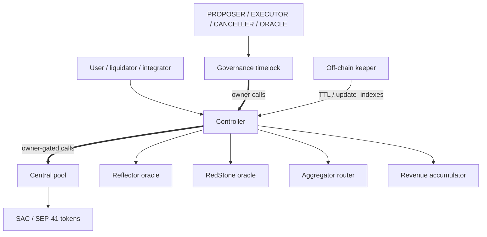

# XOXNO Lending Architecture Reference

This document describes the protocol implemented in this repository at the
current source shape. It is a build and audit reference, not a deployment
announcement.

## 1. Summary

XOXNO Lending is a Soroban lending protocol with three core contracts:

- `governance`: owns the controller and timelocks protocol-admin operations.
- `controller`: user-facing contract for accounts, spoke configuration, oracle
  policy, risk checks, liquidation, flash loans, and strategy flows.
- `pool`: one central controller-owned liquidity contract with accounting rows
  keyed by `HubAssetKey { hub_id, asset }`.

The protocol is pre-audit. Mainnet launch remains gated by ADR 0009 and the
verification evidence listed in this file.

## 2. Contract Topology



The current controller does not define `KEEPER`, `REVENUE`, or `ORACLE` roles.
Governance roles live on the governance contract. The keeper is off-chain and
uses caller authorization for submitted transactions.

## 3. Addressing Model

Markets are addressed by:

```rust
HubAssetKey {
    hub_id: u32,
    asset: Address,
}
```

The same token can exist on different hubs without sharing indexes, revenue,
cash, debt, or bad-debt socialization. Hub id `0` is not a production hub. Hubs
are created on demand and stored in controller instance storage.

Accounts bind to a spoke id `>= 1`. Spokes are not base overlays. Each spoke has
its own `SpokeAsset(spoke_id, HubAssetKey)` rows for risk and caps.

## 4. Storage Shape

Controller persistent and instance keys are defined by `ControllerKey` in
`common/src/types/controller.rs`.

Important instance keys:

- `Pool`
- `PoolTemplate`
- `Aggregator`
- `Accumulator`
- `AccountNonce`
- `PositionLimits`
- `AppVersion`
- `MinBorrowCollateralUsd`
- `LastSpokeId`
- `LastHubId`
- `Hub(u32)`
- `PositionManager(Address)`

Important persistent keys:

- `AssetOracle(Address)`
- `Spoke(u32)`
- `SpokeAsset(u32, HubAssetKey)`
- `SpokeUsage(u32, HubAssetKey)`
- `AccountMeta(u64)`
- `Delegates(u64)`
- `SupplyPositions(u64)`
- `BorrowPositions(u64)`

Pool persistent keys are:

- `Params(HubAssetKey)`
- `State(HubAssetKey)`

There is no separate market-status enum in the current controller model. An
asset is price-active when its token-rooted `AssetOracle(asset)` entry exists
and the configured source passes validation.

## 5. Governance

Governance owns the controller. It validates protocol-admin inputs, schedules
operations through a ledger-based timelock, and executes ready operations.

Governance roles:

- `PROPOSER`
- `EXECUTOR`
- `CANCELLER`
- `ORACLE`

Governance keeps emergency `pause` and `unpause` immediate. Governance-self
operations such as role changes, delay changes, ownership transfer initiation,
and upgrades are timelocked.

## 6. Controller Responsibilities

Controller entrypoints cover:

- Account creation, delegate management, and account renewal.
- Supply, borrow, repay, withdraw, liquidation, and bad-debt cleanup.
- Flash loans.
- Strategy flows: multiply, collateral swap, debt swap, repay debt with
  collateral, and Blend migration.
- Hub, spoke, spoke-asset, position-limit, pool, oracle, aggregator, and
  accumulator configuration.
- Pool deployment, pool parameter updates, pool caps, rewards, revenue claim,
  and pool WASM upgrade.

Risk-increasing and external-surface flows are paused with `#[when_not_paused]`.
Repay, withdraw, liquidation, bad-debt cleanup, and account renewal remain
available where the code keeps user de-risk paths open.

## 7. Pool Responsibilities

The pool is owned by the controller. It:

- Holds token custody for all listed hub assets.
- Stores market params and state by `HubAssetKey`.
- Tracks `cash` as borrowable reserves.
- Accrues interest through borrow and supply indexes.
- Stores protocol revenue as scaled supply shares.
- Verifies reserves before outgoing transfers.
- Settles flash loans with balance snapshots, callback invocation, repayment
  pull, and post-repayment verification.
- Socializes unrecoverable bad debt through the supply index floor.

Direct token donations do not increase borrowable liquidity because normal
liquidity checks use internal `cash`, not live token balance.

## 8. Spokes And Risk

Spokes define account-local risk policy. A spoke asset row contains:

- collateral and borrow flags;
- paused and frozen flags;
- LTV, liquidation threshold, liquidation bonus, and liquidation fee;
- supply and borrow caps;
- optional oracle override.

Borrow and indebted withdrawal paths load risk from the account's spoke. Assets
not listed on that spoke revert before risk math can use them.

## 9. Oracle Model

The controller resolves prices through a strict path:

1. Load token-rooted `AssetOracle(asset)`.
2. Apply optional spoke oracle override where relevant.
3. Read Reflector or RedStone source data.
4. Enforce staleness, future timestamp, decimals, sanity bounds, and tolerance.
5. Normalize to USD WAD.

Dual-source markets require the primary and anchor sources to stay inside the
configured tolerance band. Missing source data fails closed with source-specific
errors.

## 10. Account And Position Model

Accounts store owner, active spoke id, mode, supply positions, and borrow
positions. Supply and debt positions are keyed by `HubAssetKey`.

Pool balances are scaled shares:

- supply shares use the supply index;
- debt shares use the borrow index;
- indexes and rates use RAY;
- USD risk math uses WAD;
- token transfers use token-native units.

## 11. Flash Loans

Flash loans are controller-routed and pool-settled:

1. Controller validates the hub asset and caller flow.
2. Pool snapshots its token balance.
3. Pool transfers the loan amount.
4. Receiver callback runs.
5. Pool verifies the callback did not leave unexpected retained funds.
6. Pool pulls amount plus fee and verifies final balance.
7. Fee becomes protocol revenue.

The controller flash-loan guard blocks reentrant mutators during the flow.

## 12. Strategies

Strategy flows route through the controller and must end inside the same account
health and position-limit constraints as direct supply, borrow, repay, and
withdraw flows. Router output is treated as untrusted and validated by balance
delta. Slippage remains a route-payload responsibility unless a controller-side
minimum-output parameter is added.

The DeFindex adapter is configured for one `HubAssetKey` and `spoke_id`.
Each vault maps to one controller account id.

## 13. Keeper

`services/keeper` is a separate workspace. It renews and restores TTL for:

- controller and governance instances;
- configured `AssetOracle(asset)` rows;
- `Spoke(id)` rows;
- account persistent keys;
- access-control role-holder keys;
- pool `Params(HubAssetKey)` and `State(HubAssetKey)` rows;
- instances and WASM code entries.

Use `contracts.markets = [{ hub_id, asset }]` in keeper config. Legacy
`market_assets` is kept only as `hub_id = 1` shorthand.

## 14. Configuration Inputs

Market, spoke, and network configs live in `configs/`.

Current config files use `hub_id = 1` for listed testnet and mainnet market
rows. Mainnet launch still requires validation of network addresses, ownership,
governance, caps, oracle source contracts, and deployment artifacts before any
public claim that those values are live.

## 15. Launch Gates

Before mainnet launch:

- Governance owner and roles must be configured with separate operational
  controls.
- Controller and pool WASM hashes must be pinned to release artifacts.
- Production builds must exclude testing-only entrypoints and mock contracts.
- Market caps and oracle parameters must be reviewed per asset.
- Keeper config must enumerate every launched `HubAssetKey`.
- Verification evidence in section 16 must be collected and reviewed.
- External audit findings must be resolved or explicitly accepted.

## 16. Verification Surface

Baseline local evidence:

| Command | Scope |
| --- | --- |
| `cargo fmt --check` | Root workspace formatting. |
| `cargo test --workspace` | Root workspace unit tests. |
| `make test` | Soroban integration harness. |
| `make test-pool` | Pool unit tests. |
| `cargo check -p common --features certora` | Certora common harness build. |
| `cargo check -p pool --features certora --no-default-features` | Certora pool harness build. |
| `cargo check -p controller --features certora --no-default-features` | Certora controller harness build. |
| `cargo test --manifest-path services/keeper/Cargo.toml` | Keeper workspace tests. |
| `cargo check --manifest-path tests/fuzz/Cargo.toml --bin pool_native` | Fuzz harness build gate. |

Formal and fuzz evidence expected before launch:

- Certora profiles for fixed-point math, pool accounting, controller risk,
  oracle policy, liquidation, flash loans, and strategy/controller-pool
  consistency.
- Fuzz target builds and replay logs for `tests/fuzz`.
- Coverage reports for controller and pool critical paths.
- Static analysis reports, including Scout and any additional Soroban-specific
  checks used for release.

Do not describe a check as passed unless the command was run against the current
tree and its output was reviewed.

## 17. Security Review Focus

Reviewers should prioritize:

- `HubAssetKey` isolation across controller, pool, keeper, and docs.
- Oracle disable/reconfigure behavior through `AssetOracle(asset)`.
- Spoke asset listing and cap enforcement.
- Account authorization, delegates, and position managers.
- Flash-loan and strategy callback reentrancy.
- Internal `cash` accounting and bad-debt socialization.
- Governance timelock, role separation, and upgrade hash control.
- Keeper TTL coverage and configuration drift.
