# XOXNO Lending: Architecture Reference

This document describes the architecture implemented in this repository:
contract responsibilities, storage layout, risk checks, oracle validation,
strategy and flash-loan flows, verification requirements, and operational
boundaries. Module paths identify the implementation areas behind each
architecture claim.

## 1. Summary

Users call one **controller** contract. It tracks accounts, fetches and checks
prices, enforces risk limits, and runs liquidations. The controller owns one
**central pool** contract. The pool holds listed token balances and stores one
asset-keyed accounting row per market. Governance owns the controller, validates
admin inputs, and schedules protocol changes through a timelock.

The protocol is a multi-asset lending and borrowing system for Stellar
Soroban, implemented in Rust across the core `no_std` crates:

- `governance`: protocol-admin contract. Owns the controller, validates admin
  inputs, schedules controller and governance-self changes through a
  ledger-based timelock, and keeps emergency pause/unpause immediate.
- `controller`: single user-facing contract. Owns account state, market
  configuration, oracle resolution, access control, risk checks, liquidation,
  flash loans, and account-bound strategy flows.
- `pool`: one central liquidity-pool contract. Holds custody and asset-scoped
  accounting rows (supply, debt, indexes, reserves, protocol revenue,
  flash-loan settlement, rate-model updates) for each listed market.
- `pool-interface`: typed Soroban contract trait the controller uses to call
  the pool.
- `controller-interface`: typed Soroban ABI trait describing the controller's
  external entrypoints for clients and tests.
- `governance-interface`: typed Soroban ABI trait for timelock lifecycle,
  controller deployment, and typed admin proposers.
- `common`: shared fixed-point math (`math::fp`, `math::fp_core`), rate model
  (`rates`), constants, errors, events, and contract types.

The pool is owner-gated. Each mutating accounting, maintenance, and WASM
upgrade entrypoint is gated by the `#[only_owner]` macro; the owner is the
controller, set at construction via `ownable::set_owner`. The pool does not call
oracles, routers, or other pools.

## 2. Design Constraints

The implementation enforces these properties:

- Risk-increasing operations perform market, oracle, cap, e-mode, LTV,
  health-factor, and liquidity checks before final state persistence
  (`contracts/controller/src/positions/*.rs`, `contracts/controller/src/strategies/`,
  `contracts/controller/src/validation.rs`).
- Users interact with the controller. The controller calls the pool through
  `pool_interface::LiquidityPoolClient`.
- Pool mutating accounting, maintenance, and WASM-upgrade endpoints reject any
  caller other than the controller through the `#[only_owner]` macro
  (`contracts/pool/src/lib.rs`).
- An account can hold supply and borrow positions in multiple assets within
  per-account limits stored in `ControllerKey::PositionLimits`. E-mode accounts
  apply additional asset and category constraints.
- Strategy flows (`multiply`, `swap_collateral`, `swap_debt`,
  `repay_debt_with_collateral`) route through the same controller risk model
  as `supply`, `borrow`, `repay`, `withdraw`.
- Storage records are split per concern (account meta, per-side position
  maps, market config, e-mode category). Numeric
  domains are explicit per field (BPS, WAD, RAY, asset-native).

## 3. System Topology

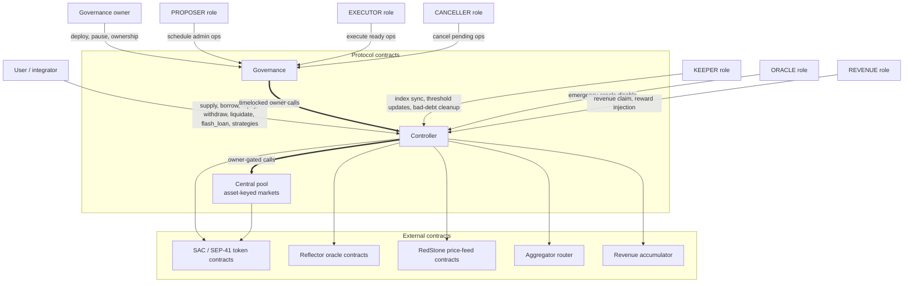

Boundaries enforced in code:

- The controller is the user-facing protocol contract.
- Governance deploys and owns the controller. Protocol-affecting admin changes
  are queued through typed `propose_*` entrypoints and executed after the
  timelock delay.
- The controller deploys one central pool and owns it. Mutating accounting,
  maintenance, and WASM-upgrade endpoints are owner-gated through `#[only_owner]`.
- Aggregator-router output is validated by balance-delta checks: the
  controller snapshots its token balances, authorizes a single pull of the
  committed input amount, and verifies on return that the output delta is
  positive (`contracts/controller/src/strategies/helpers.rs`).
- Oracle prices are validated before use: market status, oracle configuration
  presence, freshness, future-timestamp guard, source/strategy policy, sanity
  bounds, and deviation tolerance (`contracts/controller/src/oracle/price.rs`).
- Token contracts must be owner-approved before market listing (single-use
  allow-list at `ApprovedToken(asset)` in `contracts/controller/src/storage/instance.rs`),
  and the pool tracks available reserves through internal `cash` per market so
  direct token donations cannot inflate borrowable liquidity.

## 4. Contract Responsibilities

### 4.1 Controller

Implemented entrypoints (`contracts/controller/src/*`):

- Account creation, ownership matching, position lifecycle.
- `supply`, `borrow`, `repay`, `withdraw`, `liquidate`, `clean_bad_debt`.
- Strategies: `multiply`, `swap_collateral`, `swap_debt`,
  `repay_debt_with_collateral`.
- `flash_loan`.
- Market listing: `approve_token`, `revoke_token`,
  `set_liquidity_pool_template`, `create_liquidity_pool`,
  `set_market_oracle_config`, `set_oracle_tolerance`,
  `disable_token_oracle`.
- Asset, e-mode, caps, position-limit, aggregator, accumulator configuration.
- Central-pool deployment, pool parameter updates, and pool WASM upgrades
  (`deploy_pool`, `upgrade_liquidity_pool_params`, `upgrade_pool`).
- `claim_revenue`, `add_rewards`.
- TTL keepalive: per-account on-chain refresh via `renew_account`
  (caller-auth, account-owner gated), complemented by permissionless off-chain
  `ExtendFootprintTtl` operations issued by the keeper service
  (`services/keeper`). The off-chain path needs no on-chain role; any wallet
  with XLM for fees can keep the protocol's storage alive.
- `pause`, `unpause`, `transfer_ownership`, `accept_ownership`,
  `grant_role`, `revoke_role`, `upgrade`.
- View surface: health, collateral, debt, positions, account attributes,
  market and e-mode configs, batch market and index views, liquidation
  estimation.

Production admin callers normally reach these thin setters through governance
typed proposers. The controller keeps state-dependent checks, storage writes,
and events; governance performs proposal-time input validation and timelock
scheduling.

### 4.2 Governance

Implemented in `contracts/governance/src/*`. Governance:

- Deploys the controller once with governance as the controller constructor
  admin (`deploy_controller`).
- Stores the controller address in governance instance storage.
- Validates protocol-admin inputs before scheduling them.
- Schedules controller-targeted operations through typed `propose_*` functions
  and executes ready operations through the generic `execute`.
- Schedules governance-self operations through typed `propose_*` functions and
  executes them inline through `self_timelock.rs`, because Soroban rejects
  generic self-reentry.
- Lets a CANCELLER cancel pending operations.
- Keeps `pause` and `unpause` immediate owner-gated emergency brakes.

The minimum mainnet delay constant is `TIMELOCK_MIN_DELAY_LEDGERS = 34_560`.
Delay updates are monotonic in production: `validate_delay_update` rejects a
new delay below the current delay.

### 4.3 Pool

Implemented in `contracts/pool/src/lib.rs`, `contracts/pool/src/cache.rs`, `contracts/pool/src/interest.rs`,
`contracts/pool/src/views.rs`. The central pool manages listed assets and:

- Holds token balances for all listed assets.
- Stores one `PoolKey::Params(asset)` and one `PoolKey::State(asset)`
  persistent record per market.
- Tracks `supplied_ray`, `borrowed_ray`, `revenue_ray`, `supply_index_ray`,
  `borrow_index_ray`, `last_timestamp`, and `cash` per asset.
- Calls `interest::global_sync` before each mutation.
- Verifies reserve availability before outgoing transfers
  (`cache::has_reserves`).
- Uses internally tracked `cash` as available reserves. Live token balances are
  used for flash-loan settlement checks, not for normal borrowable-liquidity
  accounting.
- Records protocol revenue as a scaled supply claim and updates the supply
  index accordingly.
- Executes pool-owned `flash_loan`, takes a local balance snapshot, calls the
  receiver callback, pulls repayment, and verifies post-repay balance equals
  pre-balance + fee.
- Reduces the supply index on bad-debt socialization, floored at
  `SUPPLY_INDEX_FLOOR_RAW`.
- Updates rate-model parameters (`update_params`) after syncing accrued
  interest.
- Upgrades pool WASM through `upgrade` when called by its owner
  (`#[only_owner]`).

The pool stores no account ownership, oracle configuration, or e-mode state.

### 4.4 Pool Interface

`interfaces/pool/src/lib.rs` defines the controller-to-pool ABI as the
`LiquidityPoolInterface` trait. Mutating: `supply`, `borrow`, `withdraw`,
`repay`, `update_indexes`, `add_rewards`, `flash_loan`, `create_strategy`,
`seize_position`, `claim_revenue`,
`update_params`, `upgrade`. Read-only: `get_utilisation`,
`get_reserves`, `get_deposit_rate`, `get_borrow_rate`, `get_revenue`,
`get_supplied_amount`, `get_borrowed_amount`, `get_delta_time`, `get_sync_data`,
`get_bulk_indexes`.

## 5. Account and Storage Model

Each account uses three records: metadata (owner and risk mode), supply
positions, and borrow positions. Supply-only actions read and write the supply
map without loading borrow positions, which keeps storage work bounded.

Account state is split into metadata plus two position maps:

- `ControllerKey::AccountMeta(u64)` → `AccountMeta { owner,
  e_mode_category_id, mode }`.
- `ControllerKey::SupplyPositions(u64)` → `Map<Address, AccountPositionRaw>`.
- `ControllerKey::BorrowPositions(u64)` → `Map<Address, DebtPositionRaw>`.

Persistent position records store no asset, account id, or side: asset is the
enclosing map key, side is the enclosing storage key, and account id is the
discriminant inside that key. The collateral side (`AccountPositionRaw`) carries
`scaled_amount_ray`, `liquidation_threshold_bps`, `liquidation_bonus_bps`, and
`loan_to_value_bps`; the three risk-parameter fields are an open-time snapshot.
The debt side (`DebtPositionRaw`) carries only `scaled_amount_ray`; debt risk
parameters are sourced from the live market config, not snapshotted.
Liquidation-threshold updates are keeper-gated by `update_account_threshold` and
require a 5% health-factor buffer for risk-increasing changes.

Splitting positions per side allows:

- supply-only flows to read and write only the supply side
  (`process_supply` in `contracts/controller/src/positions/supply.rs`),
- repay-only flows to touch only the borrow side (`process_repay` in
  `contracts/controller/src/positions/repay.rs`),
- full health-factor checks to load both sides where required.

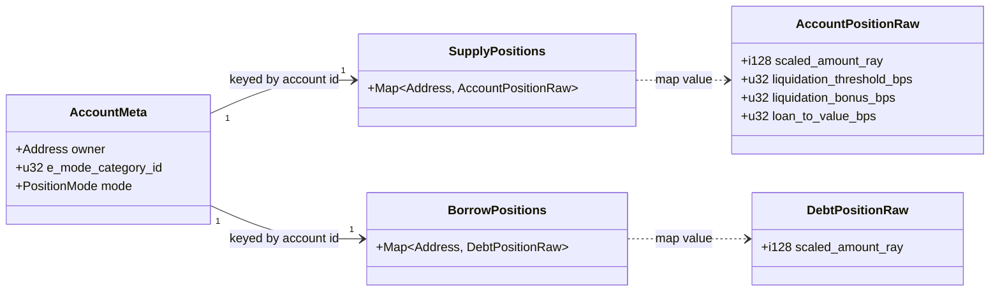

## 6. Market Lifecycle

Before users can supply or borrow an asset, governance must list it in the
controller and central pool, then wire up its price oracle. The central pool is
deployed once; each listed asset becomes a market row inside that pool. A market
then moves through three states: `PendingOracle` (the asset row exists but has
no active price feed), `Active` (usable), and `Disabled` (repay/read
paths only).

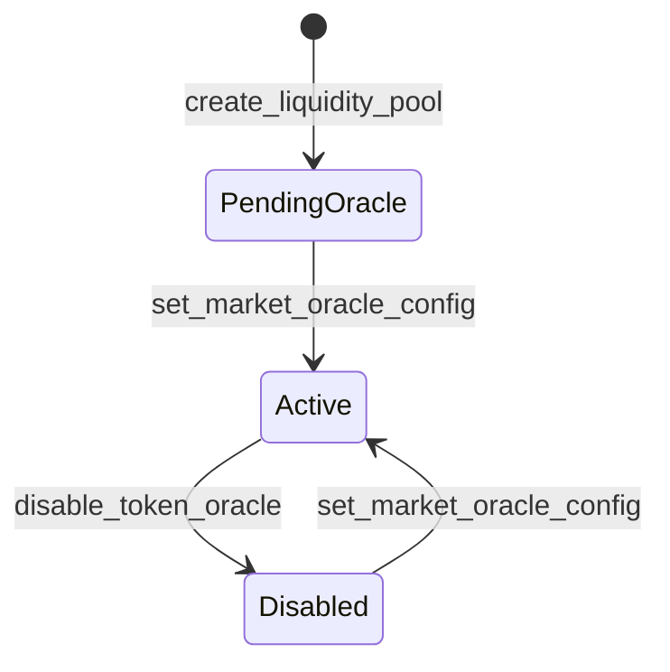

Deployment and listing path:

1. Governance deploys the controller once (`deploy_controller`).
2. Governance schedules `set_liquidity_pool_template` with the pool WASM hash.
3. Governance schedules `deploy_pool`; the controller deploys one deterministic
   central pool with salt `POOL_DEPLOY_SALT` and stores it in
   `ControllerKey::Pool`.
4. Governance schedules `approve_token(asset)`.
5. Governance schedules `create_liquidity_pool(asset, params, config)`. Despite
   the legacy name, this creates an asset market inside the central pool. It
   does not deploy another pool contract.
6. Proposal-time validation probes token `decimals` / `symbol`, rejects
   double-listing, checks `params.asset_id == asset`, verifies token decimals,
   validates asset config, and validates the rate model.
7. At execution, the controller requires the single-use `ApprovedToken(asset)`,
   calls `pool.create_market(params)`, stores `Market(asset)` as
   `PendingOracle`, and consumes the token approval.
8. Governance schedules `set_market_oracle_config` through
   `propose_configure_market_oracle`; execution activates the market after the
   controller re-checks quote-market invariants.

Constraints enforced at listing or oracle configuration:

- `MarketParamsRaw.asset_id` must equal the listed asset.
- In non-`testing` builds, `MarketParamsRaw.asset_decimals` must equal the
  token contract's reported decimals; it must also fall within
  `MIN_ASSET_DECIMALS..=MAX_ASSET_DECIMALS`.
- `e_mode_categories` is controller-managed; membership is changed only
  through `add_asset_to_e_mode_category` /
  `edit_asset_in_e_mode_category` / `remove_asset_from_e_mode`.
- A `Single` strategy paired with a naked spot source is rejected in
  non-`testing` builds during oracle proposal validation
  (`SpotOnlyNotProductionSafe`).
- Disabled markets reject normal risk operations. The `Repay` and `View`
  oracle policies keep the intended repay/read paths reachable.

## 7. Market Configuration and Risk Parameters

`ControllerKey::Market(asset)` stores `MarketConfig`:

- `status` (`MarketStatus`)
- `asset_config: AssetConfigRaw`
- `oracle_config: MarketOracleConfig`

All oracle wiring lives inside `oracle_config`: strategy, primary and anchor
sources, sanity bounds, and tolerance (see Section 9). Pool address is not per
market; the single address lives in `ControllerKey::Pool`. Rate-model
parameters live in the central pool's `PoolKey::Params(asset)`, not in
`MarketConfig`.

`AssetConfigRaw` fields: `loan_to_value_bps`, `liquidation_threshold_bps`,
`liquidation_bonus_bps`, `liquidation_fees_bps`, `is_collateralizable`,
`is_borrowable`, `is_flashloanable`,
`flashloan_fee_bps`, `borrow_cap`,
`supply_cap`, `e_mode_categories`.

`validate_asset_config` (`contracts/controller/src/validation.rs`) rejects:

- `liquidation_threshold ≤ LTV` or `liquidation_threshold > BPS`
  (via `validate_risk_bounds`).
- `threshold * (BPS + liquidation_bonus) > BPS * BPS`: the seizure ceiling
  `threshold * (1 + bonus)` must stay ≤ 100%, so a liquidation cannot seize more
  than the collateral backing a position. There is no flat bonus cap; the
  ceiling is derived per asset from the threshold.
- `liquidation_fees > BPS` (10000 bps).
- Negative `supply_cap` or `borrow_cap` (zero is treated as uncapped per the
  cap-sentinel comment).
- `flashloan_fee_bps > MAX_FLASHLOAN_FEE_BPS` (500 bps).
- The protocol-wide minimum LTV-weighted collateral while debt exists is stored
  separately as `ControllerKey::MinBorrowCollateralUsd`. It defaults to
  `DEFAULT_MIN_BORROW_COLLATERAL_USD_WAD = 5 * WAD` and is changed through
  `set_min_borrow_collateral_usd`.

`MarketParamsRaw::verify_rate_model` (delegating to `InterestRateModel::verify`)
rejects:

- `base_borrow_rate_ray < 0`,
- non-monotone slopes
  (`base ≤ slope1 ≤ slope2 ≤ slope3 ≤ max_borrow_rate`),
- `max_borrow_rate_ray ≤ base_borrow_rate_ray`,
- `max_borrow_rate_ray > MAX_BORROW_RATE_RAY` (`2 * RAY`),
- `mid_utilization_ray ≤ 0`,
- `optimal_utilization_ray ≤ mid_utilization_ray`,
- `optimal_utilization_ray ≥ RAY`,
- `max_utilization_ray < optimal_utilization_ray` or `max_utilization_ray > RAY`,
- `reserve_factor_bps ≥ BPS`.

```mermaid
classDiagram
    direction LR

    class MarketConfig {
        +MarketStatus status
        +AssetConfigRaw asset_config
        +MarketOracleConfig oracle_config
    }

    class AssetConfigRaw {
        +u32 loan_to_value_bps
        +u32 liquidation_threshold_bps
        +u32 liquidation_bonus_bps
        +u32 liquidation_fees_bps
        +bool is_collateralizable
        +bool is_borrowable
        +bool is_flashloanable
        +u32 flashloan_fee_bps
        +i128 borrow_cap
        +i128 supply_cap
        +Vec~u32~ e_mode_categories
    }

    class MarketOracleConfig {
        +u32 asset_decimals
        +u64 max_price_stale_seconds
        +OraclePriceFluctuation tolerance
        +OracleStrategy strategy
        +OracleSourceConfig primary
        +OracleSourceConfigOption anchor
        +i128 min_sanity_price_wad
        +i128 max_sanity_price_wad
    }

    class OracleSourceConfig {
        <<enumeration>>
        Reflector
        RedStone
    }

    class OraclePriceFluctuation {
        +u32 first_upper_ratio_bps
        +u32 first_lower_ratio_bps
        +u32 last_upper_ratio_bps
        +u32 last_lower_ratio_bps
    }

    class MarketParamsRaw {
        +i128 max_borrow_rate_ray
        +i128 base_borrow_rate_ray
        +i128 slope1_ray
        +i128 slope2_ray
        +i128 slope3_ray
        +i128 mid_utilization_ray
        +i128 optimal_utilization_ray
        +i128 max_utilization_ray
        +u32 reserve_factor_bps
        +Address asset_id
        +u32 asset_decimals
    }

    MarketConfig --> AssetConfigRaw
    MarketConfig --> MarketOracleConfig
    MarketOracleConfig --> OraclePriceFluctuation
    MarketOracleConfig --> OracleSourceConfig : primary + anchor
    MarketConfig ..> MarketParamsRaw : PoolKey::Params(asset)
```

## 8. Fixed-Point Domains

Soroban has no floating-point or decimal type, so the protocol stores each
fraction as a large integer scaled by a fixed factor. It uses three such scales,
each sized for the precision its job needs (`common/src/constants/`,
`common/src/math/fp.rs`):

- token-native units for token transfers,
- `BPS = 10_000` for percentages,
- `WAD = 10^18` for USD values and health factor,
- `RAY = 10^27` for indexes, rates, and scaled balances.

Positions store scaled balances. Actual amounts are reconstructed as:

- `supply_actual = scaled_supply * supply_index / RAY`
- `borrow_actual = scaled_debt * borrow_index / RAY`

Pool indexes are synced before each mutation, so accrual happens by updating
the indexes rather than rewriting positions.

Protocol revenue is held as a scaled supply claim in the pool: fees increase
`revenue_ray` and feed the supply index until `claim_revenue` burns the
realized scaled revenue and transfers tokens to the pool owner (the
controller), which forwards them to the configured accumulator.

## 9. Oracle Pricing

Price integrity controls borrow capacity, liquidation, and bad-debt risk. The
controller reads a **primary** price source and, in most markets, a second
**anchor** source, then checks the two against tolerance bands before acting.
Source configuration and final-price selection follow.

The controller resolves prices through `token_price`
(`contracts/controller/src/oracle/price.rs`), normalized to WAD. Each market's
`oracle_config: MarketOracleConfig` selects a strategy over a primary source and
an optional anchor source, then applies sanity and tolerance gates.

Sources and strategies:

- A source is `OracleSourceConfig::Reflector(ReflectorSourceConfig)` or
  `OracleSourceConfig::RedStone(RedStoneSourceConfig)`. A Reflector source has a
  `read_mode` of `Spot` or `Twap(records)`; RedStone reads spot.
- `OracleStrategy::Single` uses the primary source without an anchor.
- `OracleStrategy::PrimaryWithAnchor` reads the primary plus an anchor source
  and applies tolerance-band checks between them. If the anchor is absent,
  unreadable, or stale-and-unusable, the result falls back to the primary only
  where the active policy allows it.

`propose_configure_market_oracle` resolves and validates oracle config before
scheduling `set_market_oracle_config`. At execution the controller re-checks
the quote-market invariants before activating the market. Validation covers:

- strategy/anchor consistency (`PrimaryWithAnchor` ⇔ an anchor is configured)
  and `primary ≠ anchor`,
- in non-`testing` builds, rejects `Single` + Reflector `Spot`
  (`SpotOnlyNotProductionSafe`),
- `60 ≤ max_price_stale_seconds ≤ 86_400`,
- sanity bounds `0 < min_sanity_price_wad < max_sanity_price_wad ≤
  MAX_REASONABLE_PRICE_WAD`,
- per Reflector source: USD base (`base() == USD`), decimals in `[1, 18]`,
  resolution `≥ 60`, a live `lastprice`, and, for `Twap(records)`, `records`
  in `[1, 12]` with sufficient TWAP history,
- per RedStone source: staleness bound, a live feed read, and feed validation,
- first tolerance in `[MIN_FIRST_TOLERANCE, MAX_FIRST_TOLERANCE]`,
- last tolerance in `[MIN_LAST_TOLERANCE, MAX_LAST_TOLERANCE]`,
- `first_tolerance < last_tolerance`.

Oracle policies (`OraclePolicy`, `contracts/controller/src/oracle/policy.rs`)
gate five allowances: disabled-market pricing, stale source, unsafe deviation,
degraded dual-source resolution, and sanity-band violation:

- **RiskIncreasing**: all five denied. Used by `borrow`, risky strategy paths,
  and debt-backed `withdraw` / `swap_collateral` / `update_account_threshold`.
- **Liquidation**: all five denied (identical allowances to RiskIncreasing, kept
  as a distinct variant for intent and auditing). Used by `liquidate`.
- **RiskDecreasing**: allows stale source, unsafe deviation, and missing-TWAP
  fallback, and sanity-band violation; disabled markets stay blocked. Used by
  `supply`, `flash_loan`, `update_indexes`, `claim_revenue`, `add_rewards`,
  and debt-free `withdraw` / `swap_collateral`.
- **Repay**: all five allowed (permissive, and reachable for
  `MarketStatus::Disabled` markets). Used by `repay`.
- **View**: all five allowed; read-only entrypoints can also read disabled
  markets.

The future-timestamp guard (`check_not_future_at`, `MAX_FUTURE_SKEW_SECONDS`,
a one-sided 60 second future bound) is unconditional and applies in all modes.

`token_price` (`oracle/price.rs`) gates the resolved price: it rejects the
unconfigured `pending_for` sentinel, requires `price_wad > 0`, and enforces the
configured `[min_sanity_price_wad, max_sanity_price_wad]` bounds. Band selection
for `PrimaryWithAnchor` happens in `calculate_final_price`
(`oracle/tolerance.rs`), where `primary` is the safe price and `anchor` the
comparison price:

1. Both present and inside the first tolerance band → primary (safe) price.
2. Inside the last tolerance band → midpoint of primary and anchor.
3. Outside the last band → revert `UnsafePriceNotAllowed` unless the policy
   allows unsafe deviation, in which case return the primary price.

`Single` returns the primary price without band selection.

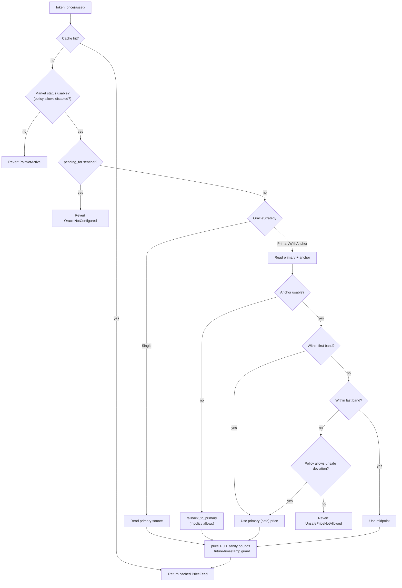

## 10. Common Controller Flow

User operations enter through the controller and follow the
same skeleton (`contracts/controller/src/positions/*.rs`,
`contracts/controller/src/strategies/`, `contracts/controller/src/strategies/flash_loan.rs`):

```mermaid
flowchart LR
    Entry["Controller entrypoint"] --> Auth["require_auth + pause check"]
    Auth --> Load["Load AccountMeta and required position maps"]
    Load --> Plan["Aggregate batch + market/risk validation"]
    Plan --> Price["Resolve prices via Cache"]
    Price --> TokenMove{"Token movement?"}
    TokenMove -->|inbound| DeltaIn["Transfer + balance-delta measurement"]
    TokenMove -->|outbound| PoolCall["Pool mutation"]
    DeltaIn --> PoolCall
    PoolCall --> PoolSync["Pool global_sync + scaled accounting"]
    PoolSync --> PostRisk{"Risk-increasing?"}
    PostRisk -->|yes| HF["require_healthy_account"]
    PostRisk -->|no| Persist["Persist touched account side"]
    HF --> Persist
    Persist --> Events["Emit events"]
```

The remaining subsections list the per-flow specifics that diverge
from this skeleton.

### 10.1 Supply

`supply(caller, account_id, e_mode_category, assets)`
(`contracts/controller/src/positions/supply.rs`):

- `account_id == 0` creates a new account owned by `caller`. Existing-account
  deposits from third parties are accepted because they only add collateral.
- Duplicate payments are aggregated before token movement.
- Cache uses `OraclePolicy::RiskDecreasing`.
- The controller transfers the requested SAC amounts into the central pool,
  then makes one bulk `pool.supply(entries)` call.
- Validates active markets, supply caps, e-mode, and bulk position limits
  before transferring.
- Writes only the supply side.

### 10.2 Borrow

`borrow(caller, account_id, borrows)`
(`contracts/controller/src/positions/borrow.rs`):

- Caller authorization and account-owner match.
- Cache uses `OraclePolicy::RiskIncreasing`.
- Validates borrowability, LTV, borrow caps, position limits, and e-mode.
- Pool checks reserve availability before transferring tokens.
- Post-batch `require_healthy_account` gates the entire borrow batch.

### 10.3 Repay

`repay(caller, account_id, payments)`
(`contracts/controller/src/positions/repay.rs`):

- Any authenticated caller may repay any account.
- Cache uses `OraclePolicy::Repay` (permissive pricing, reachable for
  `Disabled` markets).
- Tokens are pulled into the pool with balance-delta accounting; the pool
  burns scaled debt and refunds overpayment.
- Full repay does not delete the account; account deletion is reserved for
  owner-driven `withdraw` flows.

### 10.4 Withdraw

`withdraw(caller, account_id, withdrawals)`
(`contracts/controller/src/positions/withdraw.rs`):

- Caller authorization and account-owner match.
- `amount == 0` is the withdraw-all sentinel; the pool clamps full withdrawals
  to the post-accrual balance and applies a dust-lock guard.
- The controller loads the borrow side when the account has debt.
- Cache policy mirrors debt presence: debt-free withdrawals use
  `OraclePolicy::RiskDecreasing`; accounts with debt use
  `OraclePolicy::RiskIncreasing`.
- `require_healthy_account` is invoked in both branches and short-circuits
  for debt-free accounts.
- Account storage is removed when both sides are empty after the batch.

### 10.5 Liquidation and Bad Debt

Any liquidator may repay part of an account's debt and seize borrower collateral
with the configured bonus after the account's health factor drops below `1.0`.
If the remaining collateral cannot cover the debt, the pool treats the residual
as *bad debt* and reduces the supply index for that market.

`liquidate(liquidator, account_id, debt_payments)`
(`contracts/controller/src/positions/liquidation.rs`):

- Liquidator `require_auth`. Permissionless beyond authorization for the
  liquidator's debt spend.
- Cache uses `OraclePolicy::Liquidation`.
- `execute_liquidation` derives target repayment, bonus, and protocol fee
  for an account with health factor `< 1.0 WAD`.
- Repaid debt is transferred from the liquidator into the central pool;
  collateral is seized to the liquidator with bonus and protocol fee
  applied.
- After execution, `check_bad_debt_after_liquidation` may invoke
  `seize_position(Borrow)` on each remaining debt asset when collateral
  ≤ `BAD_DEBT_USD_THRESHOLD` (5 USD WAD) and debt > collateral; the pool
  reduces the supply index with floor `SUPPLY_INDEX_FLOOR_RAW`.
- `clean_bad_debt(account_id)` is a `KEEPER`-only standalone path.

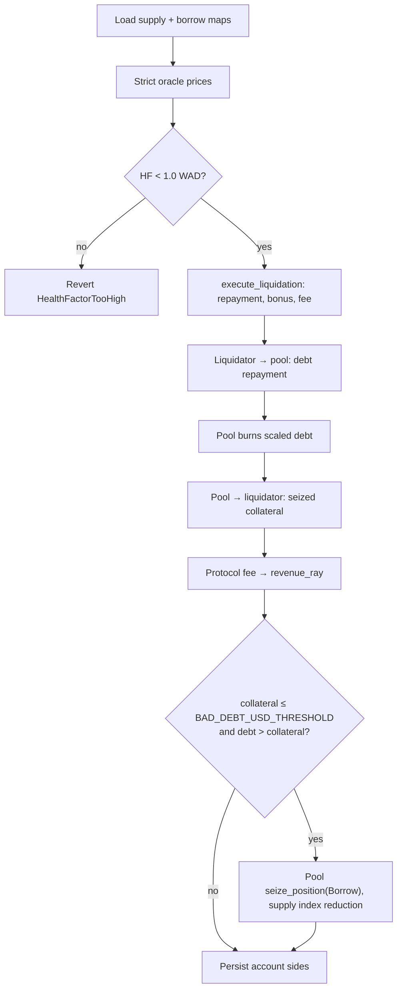

## 11. Strategy and Flash-Loan Flows

### 11.1 Strategies

`contracts/controller/src/strategies/` exposes:

- `multiply(caller, account_id, e_mode_category, collateral_token,
  debt_to_flash_loan, debt_token, mode, swap, initial_payment,
  convert_swap)`
- `swap_debt(caller, account_id, existing_debt_token, amount,
  new_debt_token, swap)`
- `swap_collateral(caller, account_id, current_collateral, amount,
  new_collateral, swap)`
- `repay_debt_with_collateral(caller, account_id, collateral_token,
  collateral_amount, debt_token, swap, close_position)`

All four require account-owner authorization and run market, oracle, e-mode,
cap, and health checks shared with the underlying flows.

`StrategySwap` shape (see `common/src/types/aggregator.rs`):

- opaque `Bytes` decoded by the aggregator/router.

`validate_strategy_swap` (`contracts/controller/src/strategies/helpers.rs`) rejects
`amount_in <= 0` or empty swap bytes. Lending does not inspect route paths,
venues, pools, hops, endpoint tokens, slippage floor, or referral id.

The router is invoked through `aggregator::AggregatorClient::execute_strategy`
with `sender = current_contract_address`, `total_in`, and the opaque swap
bytes. The aggregator payload owns endpoint validation, slippage, and route
execution.
The controller snapshots its input and output token balances around the call:

- If post-call input spend exceeds the committed `total_in`, the call
  reverts.
- If post-call output delta is not positive, the call reverts.

The router call runs while the flash-loan single-flight flag is set, so
mutating controller endpoints reject re-entry during routing.

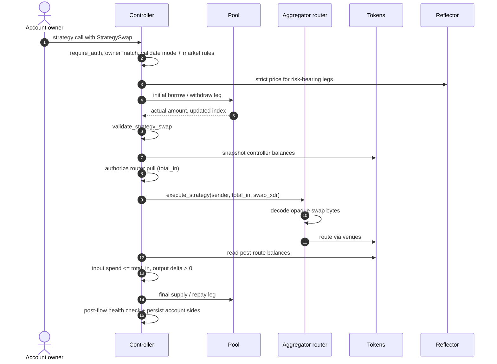

### 11.2 Flash Loans

A flash loan lets a contract borrow available liquidity with no collateral when
it repays principal plus fee in the same transaction. Missing repayment reverts
the transaction, so the pool keeps custody intact. The receiver contract performs
arbitrage, swap, or migration logic in a callback between borrow and repayment.

`flash_loan(caller, asset, amount, receiver, data)`
(`contracts/controller/src/strategies/flash_loan.rs`):

- `caller.require_auth()`.
- `require_market_active(asset)`, `is_flashloanable`, `amount > 0`.
- Verifies `receiver` is a deployed Wasm contract.
- Sets `FlashLoanOngoing = true`.
- Controller calls `pool.flash_loan(initiator, receiver, amount, fee, data)`.
- Pool transfers `amount` to `receiver` after taking a local balance snapshot.
- Pool invokes `execute_flash_loan(initiator, asset, amount, fee, pool, data)`
  on `receiver`; `data` is opaque to the controller and pool.
- The receiver authorizes the pool to pull `amount + fee`.
- Pool pulls repayment from `receiver` and verifies post-repay balance equals
  pre-balance + fee.
- The pool records the fee as protocol revenue.
- Controller clears `FlashLoanOngoing` and emits `FlashLoanEvent`.

The receiver contract must pre-authorize the pool's repayment pull during
its callback.

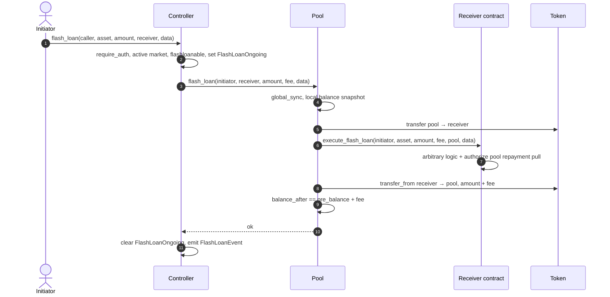

## 12. E-Mode

E-mode tunes risk for specific asset groups:

- **E-mode** groups assets that move together (for example, two stablecoins) and
  gives them a higher LTV and liquidation threshold, so users can borrow more
  against closely correlated collateral. Each asset in the category carries its
  own `can_collateral` / `can_borrow` flags and its own LTV, liquidation
  threshold, and liquidation bonus, so members of the same category can run
  different risk profiles.

E-mode is category-based. `ControllerKey::EModeCategory(u32)` stores
`EModeCategoryRaw { is_deprecated, assets: Map<Address, EModeAssetConfig> }`,
where `EModeAssetConfig { is_collateralizable, is_borrowable,
loan_to_value_bps, liquidation_threshold_bps, liquidation_bonus_bps }` holds
the per-asset risk parameters. Each market stores its reverse membership list
in `AssetConfigRaw.e_mode_categories: Vec<u32>`.

`remove_e_mode_category` flags the category deprecated, clears its asset
map, and removes the category id from each member market's reverse
membership list. Deprecated categories remain readable; new activity is
blocked.

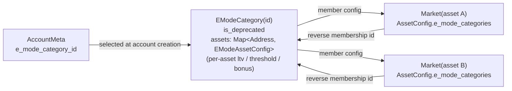

## 13. Access Control and Operations

Production authority is split across governance and controller roles.
Governance owns the controller and is the normal path for protocol-admin
changes. The controller keeps narrow operational roles for recurring work.

Governance roles (`contracts/governance/src/access.rs`,
`contracts/governance/src/forward.rs`, `contracts/governance/src/timelock.rs`,
`contracts/governance/src/self_timelock.rs`):

- Owner: deploys the controller, can pause/unpause the controller immediately,
  accepts governance ownership transfer, and is the admin behind role
  synchronization.
- `PROPOSER`: schedules typed controller-admin operations and governance-self
  operations. Proposal functions validate inputs before queuing the operation.
- `EXECUTOR`: may execute ready operations when `execute` receives an explicit
  executor. Passing `None` leaves execution open after the delay.
- `CANCELLER`: cancels pending operations.
- `ORACLE`: retained for governance's testing-only immediate oracle forwarders
  and as a known governance role. Production oracle config changes use typed
  proposers.

Controller owner and roles (`contracts/controller/src/governance/access.rs`):

- Owner (`#[only_owner]`): governance in production. Thin setters cover
  upgrades, market listing, asset/e-mode/limits/aggregator/accumulator/template
  configuration, pool parameter and pool WASM upgrades, token-listing approval,
  and controller role grants/revokes.
- `KEEPER` (`#[only_role(caller, "KEEPER")]`): `update_indexes`,
  `update_account_threshold`, `clean_bad_debt`. The on-chain `renew_account`
  TTL keepalive is caller-auth gated (account owner), not a role; the keeper
  service also runs the off-chain `ExtendFootprintTtl` flow. See
  Section 14.
- `ORACLE`: `disable_token_oracle` for emergency oracle shutdown.
- `REVENUE`: `claim_revenue`, `add_rewards`.

Controller constructor (`Controller::__constructor`):

- Sets the owner.
- Sets the access-control admin to the owner.
- Grants `KEEPER` to the deployer (`REVENUE` and `ORACLE` require an
  explicit `grant_role` after deploy).
- Sets default position limits to 10 supply and 10 borrow positions; the
  validated cap on `set_position_limits` is 10 per side (`POSITION_LIMIT_MAX`).
- Pauses the controller (`pausable::pause`).

`upgrade(new_wasm_hash)` auto-pauses before invoking
`upgradeable::upgrade`. `transfer_ownership` is two-step
(`stellar_access::role_transfer`); `accept_ownership` synchronizes the
access-control admin with the accepted owner.

Mainnet launch requires governance to own the controller, separated
maintenance/revenue/emergency-oracle roles, separated timelock executor and
canceller delegates where delegated, no residual deployer authority, and
immediate emergency pause authority. ADR 0009 defines the launch-control policy;
ADR 0010 defines the timelock.

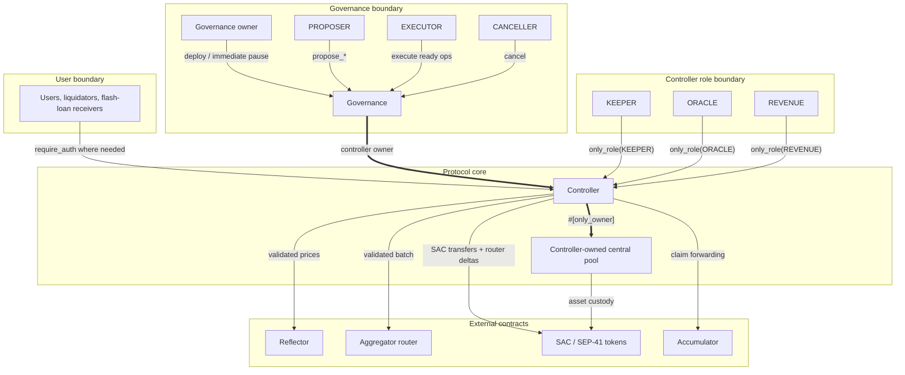

## 14. Storage and TTL Strategy

Soroban charges rent for stored data and archives entries whose time-to-live
(TTL) lapses. The protocol groups data by lifetime and maintainer, then bumps an
entry's TTL when a contract path touches it.

Soroban storage is partitioned by entry kind:

- **Instance** (`contracts/controller/src/storage/instance.rs`): the
  `ControllerKey::*` instance variants `PoolTemplate`, `Pool`, `Aggregator`,
  `Accumulator`, `AccountNonce`, `PositionLimits`, `LastEModeCategoryId`,
  `MinBorrowCollateralUsd`, `AppVersion`, plus the `ApprovedToken(asset)`
  allow-list (a `LocalKey` variant).
- **Temporary**: the `FlashLoanOngoing` single-flight flag (a `SessionKey`
  variant).
- **Persistent shared**: `Market(asset)`, `EModeCategory(id)`.
- **Persistent user**: `AccountMeta(id)`, `SupplyPositions(id)`,
  `BorrowPositions(id)`.
- **Pool instance**: owner and WASM instance metadata.
- **Pool persistent per-asset**: `PoolKey::Params(asset)` and
  `PoolKey::State(asset)`.

TTL is bumped two ways:

- **In-band**: each mutating contract entrypoint refreshes the
  controller's own instance entry, the per-account user keys it touches,
  and the per-asset shared keys it reads via its internal `renew_*`
  helpers. Activity on the protocol keeps the entries it touches alive.
- **Out-of-band**: the off-chain keeper service
  (`services/keeper`) issues permissionless `ExtendFootprintTtl`
  operations against each storage entry, contract instance, and wasm
  code entry whose `live_until` is inside the configured safety margin.
  The signer needs no on-chain role, only XLM for fees.

The split of account state per side lets each flow read/write the side
it mutates.

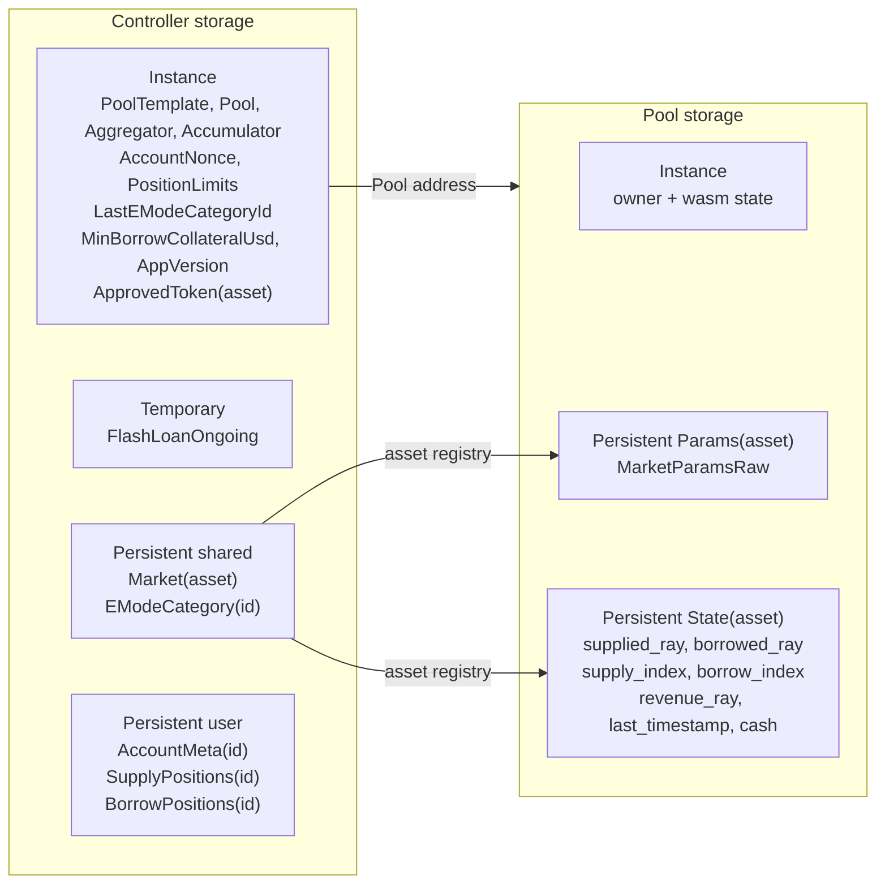

## 15. Implemented Safety Checks and Access Controls

A non-exhaustive list of checks present in the code:

- Controller starts paused after construction; `upgrade` auto-pauses.
- `#[only_owner]` and `#[only_role]` macros gate operator endpoints.
- Pool mutating accounting, maintenance, and WASM-upgrade endpoints are
  owner-gated with the `#[only_owner]` macro.
- Token-listing allow-list (`ApprovedToken(asset)`) is consumed at market
  creation.
- One deterministic central pool per controller (`POOL_DEPLOY_SALT`), with
  asset-keyed `Params` and `State` rows for listed markets.
- Cap on per-account positions: 10 per side at `set_position_limits`
  (`POSITION_LIMIT_MAX`).
- Protocol-wide minimum LTV-weighted collateral while debt exists:
  `MinBorrowCollateralUsd`, default `5 * WAD`.
- Numeric domains separated into BPS, WAD, RAY with type wrappers in
  `common::math::fp`.
- The pool checks reserve availability before transfers out
  (`contracts/pool/src/cache.rs::has_reserves`).
- Direct SAC transfers for deposits, repayments, and rewards, followed by
  central-pool accounting on the requested amount.
- Aggregator route output is checked by controller balance deltas. The
  controller treats route bytes as opaque.
- Single-flight `FlashLoanOngoing` guard during flash loans and router
  execution.
- Oracle deviation tolerance, staleness, and unconditional future-timestamp
  guard.
- Bad-debt socialization floor at `SUPPLY_INDEX_FLOOR_RAW`.
- Pool revenue routes through pool ownership (no caller-supplied
  destination in `claim_revenue`).

## 16. Verification Surface

The repository contains unit tests, the `tests/test-harness/`
integration suite, fuzz targets under `tests/fuzz/fuzz_targets/`,
Certora profiles under `certora/`, fixed-point and protocol
invariants in `architecture/INVARIANTS.md`, vulnerability reporting in
`SECURITY.md`, and ADRs under `architecture/decisions/`.

For mainnet launch, these artifacts form the acceptance matrix. The release
record pins the target commit, deployed contract addresses, command logs, and
result status before public unpause.

| Command / evidence | Purpose | Pass condition | Launch requirement | Result / status |
| --- | --- | --- | --- | --- |
| `cargo test --workspace` | Workspace unit and integration tests. | No test failures on the target commit. | Required before public unpause. | Target-commit log. |
| `make test` | Serial Soroban test-harness suite. | All `tests/test-harness` tests pass with `--test-threads=1`. | Required before public unpause. | Target-commit log. |
| `make test-pool` | Pool accounting unit tests. | Pool tests pass without ignored failure. | Required before public unpause. | Target-commit log. |
| `make clippy` | Rust lint gate. | Clippy completes with warnings denied. | Required before public unpause. | Target-commit log. |
| `make build` | Build controller and pool WASM artifacts. | WASM artifacts build for the target commit. | Required before deploy. | Artifact hashes. |
| `make optimize` | Optimize deployment WASM artifacts. | Optimized WASM artifacts are produced and hash-pinned. | Required before deploy. | Optimized hashes. |
| `make proptest PROPTEST_CASES=10000` | Contract-level property tests for auth, TTL, budget, strategy/flash-loan, liquidation, conservation, and multi-asset solvency. | All configured property tests pass at 10,000 cases. | Required before public unpause. | Target-commit log. |
| `make fuzz FUZZ_TIME=300` | Function-level fuzz targets (`fp_math`, `fp_ops`, `pool_native`, `rates_and_index`, and related targets). | Each target completes 300 seconds without crash or new corpus failure. | Required before public unpause. | Fuzz summary and artifacts if any. |
| `make fuzz-contract FUZZ_TIME=300` | Contract-flow fuzz targets (`flow_e2e`, `flow_strategy`, and related targets). | Each target completes 300 seconds without crash or invariant failure. | Required before public unpause. | Fuzz summary and artifacts if any. |
| Per-crate `cargo check --features certora` (common, pool, controller) | Compile all Certora feature paths. | Common, pool, and controller `certora` feature builds pass. | Required before proof submission. | Compile log. |
| `./certora/run_profile.py sanity` | Non-vacuity and reachability smoke proofs. | Profile completes without failed rules. | Required before public unpause. | Certora run links. |
| `./certora/run_profile.py fast` | Stable CI proof profile for common math/rates, pool integrity, and controller light safety. | Profile completes without failed rules. | Required before public unpause. | Certora run links. |
| `./certora/run_profile.py critical` | Highest-signal accounting and safety proofs. | Profile completes without failed rules or documented launch-blocking counterexamples. | Required before public unpause. | Certora run links. |
| `./certora/run_profile.py manual` | Core plus heavy audit proof profile. | Profile completes, or any timeout/deferred rule is documented with risk acceptance and launch impact. | Required before cap increase beyond launch caps. | Certora run links and residual-risk notes. |
| External audit closure | Independent review of the target branch. | Findings are fixed, accepted with rationale, or deferred from launch scope with a written decision. | Required before public unpause. | Audit closure record. |
| Testnet soak | Real deployment rehearsal. | 14 consecutive days with no unresolved P0/P1 incidents, no unexplained accounting drift, no stale TTL windows, and no oracle configuration drift. | Required before public unpause. | Monitoring summary. |
| Pause drill | Operational response rehearsal. | Testnet pause rejects user mutations, required views/checks remain usable, and unpause restores operation. | Required before public unpause. | Runbook transcript. |

Any failed command, unresolved P0/P1 incident, unexplained accounting drift,
or launch-blocking audit finding prevents public unpause until the issue is
resolved or deferred with documented risk acceptance and launch-impact
analysis.

The ADR index lists the accepted decision records that support this
architecture.

Areas with high implementation complexity remain the focus for extending
tests, fuzzing targets, and rules: liquidation and bad-debt socialization,
oracle fallback selection and disabled-market repayment, strategy router
validation, e-mode category deprecation,
low-liquidity revenue claims, flash-loan callback authorization, and storage
TTL behavior.

## 17. Deployment and Operations

Deployment is template-driven: governance deploys the controller, the
controller stores the pool WASM hash, and the controller deploys one
deterministic central pool. Listed assets become market rows inside that pool.

```mermaid
flowchart LR
    A["Build + optimize<br/>hash-pinned WASM"] --> B["Upload pool WASM"]
    B --> C["Deploy governance<br/>set timelock delay"]
    C --> D["Governance deploys controller<br/>controller constructor pauses"]
    D --> E["Set template + deploy central pool<br/>aggregator + accumulator"]
    E --> F["Assign roles<br/>separate proposer/executor/canceller"]
    F --> G["Create markets + oracles<br/>caps + e-mode while paused"]
    G --> H["Verification matrix<br/>release evidence"]
    H --> I["14-day testnet soak"]
    I --> J["Monitoring live<br/>pause drill complete"]
    J --> K["Capped mainnet unpause"]
    K --> L["7-day capped operation"]
    L --> M["Staged cap increases"]
```

ADR 0009 defines mainnet launch gates. Initial launch exposure is
capped at USD 250,000 total TVL, USD 100,000 total borrow, USD 100,000
per-market supply, and USD 50,000 per-market borrow. Caps may increase only
after a stage satisfies ADR 0009's 7-day incident-free review gate.

Mainnet launch completion requires more than deployment checks: the target
mainnet deployment must pass the verification matrix, satisfy ADR 0009 launch
gates, unpause with initial caps enforced, and complete the 7-day capped mainnet
operation window without unresolved launch-blocking incidents.

Operational maintenance:

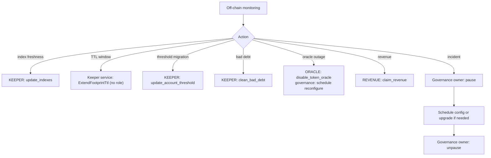

## 18. Source Map

- `contracts/governance/src/access.rs`: governance ownership, timelock roles,
  role separation, and governance-self apply helpers.
- `contracts/governance/src/deploy.rs`: one-time controller deployment.
- `contracts/governance/src/forward.rs`: typed controller-admin proposers and
  immediate pause/unpause.
- `contracts/governance/src/timelock.rs`: generic execute/cancel/query surface.
- `contracts/governance/src/self_timelock.rs`: scheduled governance-self admin.
- `contracts/controller/src/governance/access.rs`: controller ownership, roles, pause,
  upgrade, ownership transfer.
- `contracts/controller/src/router.rs`: market listing, central-pool deployment, pool
  parameter and WASM upgrades, revenue claim, reward injection, keepalive.
- `contracts/controller/src/governance/config.rs`: asset config, e-mode, oracle config,
  aggregator, accumulator, token approval, position limits.
- `contracts/controller/src/positions/*.rs`: supply, borrow, repay, withdraw,
  liquidation, account lifecycle, e-mode application, threshold updates.
- `contracts/controller/src/strategies/`: multiply, debt swap, collateral swap,
  collateral-funded repay, flash loan, aggregator route validation.
- `contracts/controller/src/oracle/`: oracle resolution (`price.rs`),
  strategy/tolerance gating, and providers (`providers/reflector/`,
  `providers/redstone/`).
- `contracts/controller/src/cache/mod.rs`: transaction-local cache.
- `contracts/controller/src/storage/*.rs`: controller storage layout, TTL helpers.
- `contracts/controller/src/validation.rs`: input and config validation.
- `contracts/controller/src/views/`: controller read surface.
- `contracts/pool/src/lib.rs`: pool ABI and accounting mutations.
- `contracts/pool/src/interest.rs`: interest accrual, revenue accrual, bad-debt
  socialization.
- `contracts/pool/src/cache.rs`: pool transient state and reserve checks.
- `contracts/pool/src/views.rs`: pool read surface.
- `interfaces/pool/src/lib.rs`: controller-to-pool ABI trait.
- `interfaces/controller/src/lib.rs`: controller external ABI trait and client.
- `interfaces/governance/src/lib.rs`: governance external ABI trait and client.
- `common/src/types/`: shared ABI types (storage keys, configs,
  positions, oracle, swap).
- `common/src/constants/`: fixed-point constants and protocol bounds.
- `common/src/rates.rs`: rate model and index math.
- `common/src/math/fp.rs`, `common/src/math/fp_core.rs`: typed fixed-point
  arithmetic.
- `architecture/INVARIANTS.md`: invariant inventory keyed to module paths.

## 19. Status

The repository is pre-audit. Production deployment is gated on
external audit completion, formal verification review against the target
branch, deployment runbook validation, ADR 0009 launch-gate completion,
governance/timelock setup, oracle and asset-listing procedures, and
incident-response procedures.
