# XOXNO Lending — Architecture Reference

This document describes the architecture implemented in this repository:
contract responsibilities, storage layout, risk checks, oracle validation,
strategy and flash-loan flows, verification requirements, and operational
boundaries. Module paths identify the implementation areas behind each
architecture claim.

## 1. Summary

The protocol is a multi-asset lending and borrowing system for Stellar
Soroban, implemented in Rust across four `no_std` crates:

- `controller`: single user-facing contract. Owns account state, market
  configuration, oracle resolution, access control, risk checks, liquidation,
  flash loans, and account-bound strategy flows.
- `pool`: one liquidity-pool contract per listed asset. Holds custody and
  asset-local accounting (supply, debt, indexes, reserves, protocol revenue,
  flash-loan settlement, rate-model updates).
- `pool-interface`: typed Soroban contract trait the controller uses to call
  pools.
- `common`: shared fixed-point math (`math::fp`, `math::fp_core`), rate model
  (`rates`), constants, errors, events, and contract types.

Pools are owner-gated. Mutating accounting and maintenance entrypoints enforce
controller ownership through `verify_admin` /
`ownable::enforce_owner_auth`; pool WASM upgrade is gated by `#[only_owner]`.
Pools do not call oracles, routers, or other pools.

## 2. Design Constraints

Properties enforced in the current implementation:

- Risk-increasing operations perform market, oracle, cap, e-mode, isolation,
  LTV, health-factor, and liquidity checks before final state persistence
  (`controller/src/positions/*.rs`, `controller/src/strategy.rs`,
  `controller/src/validation.rs`).
- Users interact only with the controller. The controller calls pools through
  `pool_interface::LiquidityPoolClient`.
- Pool mutating accounting and maintenance endpoints reject any caller other
  than the controller via `verify_admin` (`pool/src/lib.rs`); pool WASM
  upgrade uses the same owner relation through `#[only_owner]`.
- An account can hold supply and borrow positions in multiple assets within
  per-account limits stored in `ControllerKey::PositionLimits`. Isolated and
  e-mode accounts apply additional asset and category constraints.
- Strategy flows (`multiply`, `swap_collateral`, `swap_debt`,
  `repay_debt_with_collateral`) route through the same controller risk model
  as `supply`, `borrow`, `repay`, `withdraw`.
- Storage records are split per concern (account meta, per-side position
  maps, market config, isolated debt, e-mode category, pools list). Numeric
  domains are explicit per field (BPS, WAD, RAY, asset-native).

## 3. System Topology

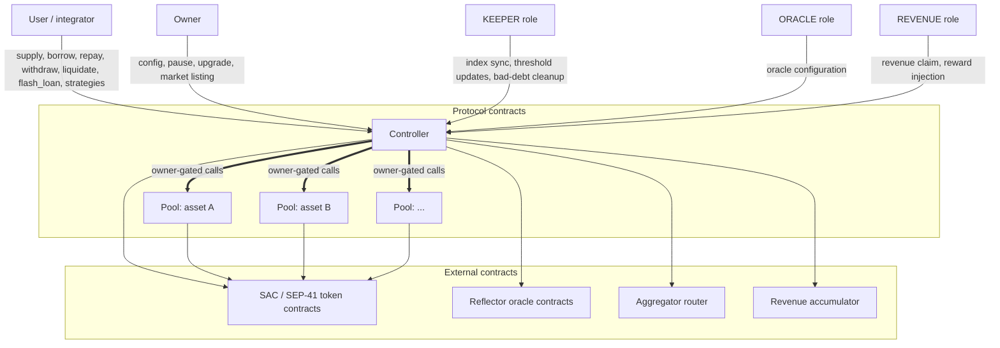

Boundaries enforced in code:

- The controller is the only user-facing protocol contract.
- Each pool is deployed by the controller and owned by it. Mutating accounting
  and maintenance endpoints call `verify_admin`; pool WASM upgrade is also
  owner-gated through `#[only_owner]`.
- Aggregator-router output is validated by balance-delta checks: the
  controller snapshots its token balances, authorizes a single pull of the
  committed input amount, and verifies on return that the output delta meets
  `total_min_out` (`controller/src/strategy.rs`).
- Oracle prices are validated before use: market status, oracle configuration
  presence, freshness, future-timestamp guard, exchange-source policy, and
  deviation tolerance (`controller/src/oracle/mod.rs`).
- Token contracts must be owner-approved before market listing (single-use
  allow-list at `ApprovedToken(asset)` in `controller/src/storage/instance.rs`),
  and runtime token credits are measured via balance-delta accounting where
  user funds enter the protocol.

## 4. Contract Responsibilities

### 4.1 Controller

Implemented entrypoints (`controller/src/*`):

- Account creation, ownership matching, position lifecycle.
- `supply`, `borrow`, `repay`, `withdraw`, `liquidate`, `clean_bad_debt`.
- Strategies: `multiply`, `swap_collateral`, `swap_debt`,
  `repay_debt_with_collateral`.
- `flash_loan`.
- Market listing: `approve_token_wasm`, `revoke_token_wasm`,
  `set_liquidity_pool_template`, `create_liquidity_pool`,
  `configure_market_oracle`, `edit_oracle_tolerance`, `disable_token_oracle`.
- Asset, e-mode, isolation, caps, position-limit, aggregator, accumulator
  configuration.
- Pool parameter and pool WASM upgrades (`upgrade_pool_params`,
  `upgrade_pool`).
- `claim_revenue`, `add_rewards`.
- TTL keepalive: performed off-chain by the keeper service
  (`services/keeper`) via permissionless `ExtendFootprintTtl` operations.
  No on-chain endpoint or role is required for TTL bumping; any wallet
  with XLM for fees can keep the protocol's storage alive.
- `pause`, `unpause`, `transfer_ownership`, `accept_ownership`,
  `grant_role`, `revoke_role`, `upgrade`.
- View surface: health, collateral, debt, positions, account attributes,
  market and e-mode configs, isolated-debt counter, batch market and index
  views, liquidation estimation.

### 4.2 Pool

Implemented in `pool/src/lib.rs`, `pool/src/cache.rs`, `pool/src/interest.rs`,
`pool/src/views.rs`. Each pool manages exactly one listed asset and:

- Holds the token balance for its asset.
- Tracks `supplied_ray`, `borrowed_ray`, `revenue_ray`, `supply_index_ray`,
  `borrow_index_ray`, `last_timestamp` in a single Instance record
  (`PoolKey::State`).
- Calls `interest::global_sync` before every mutation.
- Verifies reserve availability before outgoing transfers
  (`cache::has_reserves`).
- Records protocol revenue as a scaled supply claim and updates the supply
  index accordingly.
- Executes pool-owned `flash_loan`, snapshots the balance locally, calls the
  receiver callback, pulls repayment, and verifies post-repay balance equals
  pre-balance + fee.
- Reduces the supply index on bad-debt socialization, floored at
  `SUPPLY_INDEX_FLOOR_RAW`.
- Updates rate-model parameters (`update_params`) after syncing accrued
  interest.
- Upgrades pool WASM through `upgrade` when called by its owner
  (`#[only_owner]`).

Pools store no account ownership, oracle configuration, e-mode state, or
isolation rules.

### 4.3 Pool Interface

`pool-interface/src/lib.rs` defines the controller-to-pool ABI as the
`LiquidityPoolInterface` trait. Mutating: `supply`, `borrow`, `withdraw`,
`repay`, `update_indexes`, `add_rewards`, `flash_loan`, `create_strategy`,
`seize_position`, `claim_revenue`,
`update_params`, `upgrade`. Read-only: `capital_utilisation`,
`reserves`, `deposit_rate`, `borrow_rate`, `protocol_revenue`,
`supplied_amount`, `borrowed_amount`, `delta_time`, `get_sync_data`.

## 5. Account and Storage Model

Account state is split into metadata plus two position maps:

- `ControllerKey::AccountMeta(u64)` → `AccountMeta { owner, is_isolated,
  e_mode_category_id, mode, isolated_asset }`.
- `ControllerKey::SupplyPositions(u64)` → `Map<Address, AccountPosition>`.
- `ControllerKey::BorrowPositions(u64)` → `Map<Address, AccountPosition>`.

`AccountPosition` does not store the asset, account id, or side. Asset is the
enclosing map key, side is the enclosing storage key, and account id is the
discriminant inside that key. Fields:
`scaled_amount_ray`, `liquidation_threshold_bps`, `liquidation_bonus_bps`,
`liquidation_fees_bps`, `loan_to_value_bps`. The four risk-parameter fields
are an open-time snapshot. Liquidation-threshold updates are keeper-gated by
`update_account_threshold` and require a 5% health-factor buffer for
risk-increasing changes.

Splitting positions per side allows:

- supply-only flows to read and write only the supply side
  (`process_supply` in `controller/src/positions/supply.rs`),
- repay-only flows to touch only the borrow side (`process_repay` in
  `controller/src/positions/repay.rs`),
- full health-factor checks to load both sides where required.

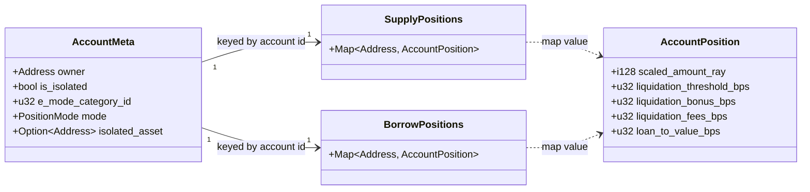

## 6. Market Lifecycle

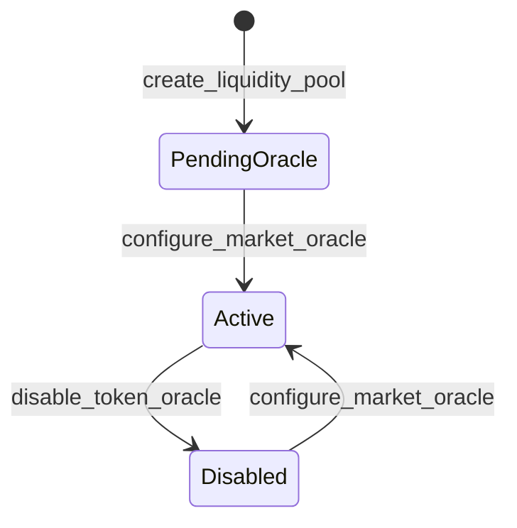

Listing path (`controller/src/router.rs::create_liquidity_pool`):

1. Owner sets the pool WASM template (`set_liquidity_pool_template`).
2. Owner approves the token contract address (`approve_token_wasm`).
3. Owner calls `create_liquidity_pool(asset, params, config)`.
4. The controller probes the token contract for `decimals` and `symbol`,
   rejects double-listing, and requires the token to be on the
   `ApprovedToken` allow-list. `validate_market_creation` runs
   `validate_asset_config` and `validate_interest_rate_model`.
5. The controller deploys a deterministic pool (salt derived from the asset
   address) with itself as owner and the asset `MarketParams` as
   constructor input.
6. The market is stored as `PendingOracle`. `e_mode_categories` is force-
   cleared at creation.
7. The `ApprovedToken` flag is consumed (single-use).
8. An `ORACLE` role calls `configure_market_oracle` to set Reflector wiring
   and transition the market to `Active`.

Constraints enforced at listing or oracle configuration:

- `MarketParams.asset_id` must equal the listed asset.
- In non-`testing` builds, `MarketParams.asset_decimals` must equal the
  token contract's reported decimals.
- `e_mode_categories` is controller-managed; membership is changed only
  through `add_asset_to_e_mode_category` /
  `edit_asset_in_e_mode_category` / `remove_asset_from_e_mode`.
- `ExchangeSource::SpotOnly` is rejected in non-`testing` builds at
  `configure_market_oracle`.
- Disabled markets reject normal risk operations. The `Repay`,
  `IsolatedRepay`, and `View` oracle policies keep the intended repay/read
  paths reachable.

## 7. Market Configuration and Risk Parameters

`ControllerKey::Market(asset)` stores `MarketConfig`:

- `status` (`MarketStatus`)
- `pool_address`
- `asset_config: AssetConfig`
- `oracle_config: OracleProviderConfig`
- Reflector wiring: `cex_oracle`, `cex_asset_kind`, `cex_symbol`,
  `cex_decimals`, `dex_oracle`, `dex_asset_kind`, `dex_symbol`,
  `dex_decimals`, `twap_records`.

`AssetConfig` fields: `loan_to_value_bps`, `liquidation_threshold_bps`,
`liquidation_bonus_bps`, `liquidation_fees_bps`, `is_collateralizable`,
`is_borrowable`, `is_isolated_asset`, `is_siloed_borrowing`,
`is_flashloanable`, `isolation_borrow_enabled`,
`isolation_debt_ceiling_usd_wad`, `flashloan_fee_bps`, `borrow_cap`,
`supply_cap`, `e_mode_categories`.

`validate_asset_config` (`controller/src/validation.rs`) rejects:

- `liquidation_threshold ≤ LTV` or `liquidation_threshold > BPS`.
- `liquidation_bonus > MAX_LIQUIDATION_BONUS` (1500 bps).
- `liquidation_fees > BPS` (10000 bps).
- Negative `supply_cap` or `borrow_cap` (zero is treated as uncapped per the
  cap-sentinel comment).
- Negative `isolation_debt_ceiling_usd_wad`.
- `flashloan_fee_bps > MAX_FLASHLOAN_FEE_BPS` (500 bps).

`validate_interest_rate_model` rejects:

- non-monotone slopes
  (`base ≤ slope1 ≤ slope2 ≤ slope3 ≤ max_borrow_rate`),
- `max_borrow_rate_ray > MAX_BORROW_RATE_RAY` (`2 * RAY`),
- `mid_utilization_ray ≤ 0`,
- `optimal_utilization_ray ≤ mid_utilization_ray`,
- `optimal_utilization_ray ≥ RAY`,
- `reserve_factor_bps ≥ BPS`.

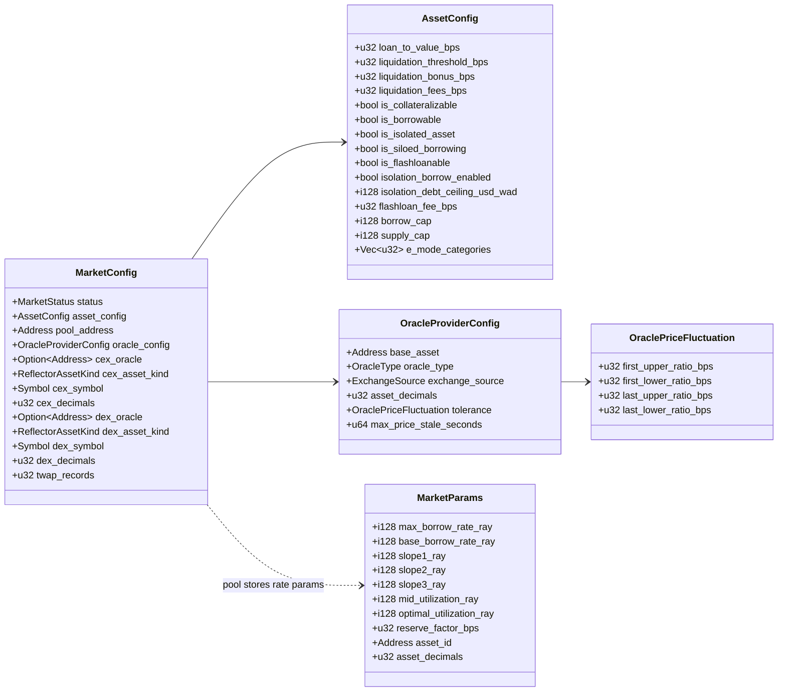

## 8. Fixed-Point Domains

Numeric domains (`common/src/constants.rs`, `common/src/math/fp.rs`):

- token-native units for token transfers,
- `BPS = 10_000` for percentages,
- `WAD = 10^18` for USD values and health factor,
- `RAY = 10^27` for indexes, rates, and scaled balances.

Positions store scaled balances. Actual amounts are reconstructed as:

- `supply_actual = scaled_supply * supply_index / RAY`
- `borrow_actual = scaled_debt * borrow_index / RAY`

Pool indexes are synced before each mutation, so accrual happens by updating
the indexes rather than rewriting positions.

Protocol revenue is held as a scaled supply claim in the pool: fees increase
`revenue_ray` and feed the supply index until `claim_revenue` burns the
realized scaled revenue and transfers tokens to the pool owner (the
controller), which forwards them to the configured accumulator.

## 9. Oracle Pricing

The controller resolves prices through `oracle::token_price`
(`controller/src/oracle/mod.rs`). Prices are normalized to WAD.

`ExchangeSource` modes:

- `SpotOnly`: development/testing path, rejected in non-`testing` builds at
  `configure_market_oracle`.
- `SpotVsTwap`: CEX spot vs CEX TWAP from the same Reflector contract,
  providing same-provider temporal diversity.
- `DualOracle`: CEX TWAP vs DEX spot, providing cross-source diversity where
  DEX unavailability falls back to CEX TWAP.

`configure_market_oracle` validates:

- token decimals and symbol via the token contract,
- `cex_decimals` from the CEX Reflector contract,
- `dex_decimals` when `dex_oracle` is set,
- CEX `lastprice` for the asset,
- DEX `lastprice` for the asset when `dex_oracle` is set,
- `twap_records ≤ 12`,
- `60 ≤ max_price_stale_seconds ≤ 86_400`,
- first tolerance in `[MIN_FIRST_TOLERANCE, MAX_FIRST_TOLERANCE]`,
- last tolerance in `[MIN_LAST_TOLERANCE, MAX_LAST_TOLERANCE]`,
- `first_tolerance < last_tolerance`.

Oracle policies (`OraclePolicy`, `controller/src/oracle/policy.rs`) define
how oracle results are gated:

- **RiskIncreasing**: deviation outside the last band reverts; stale sources
  and missing TWAP history revert. Used by `borrow`, `liquidate`, risky
  strategy paths, debt-backed `withdraw`, and `update_account_threshold`.
- **RiskDecreasing**: deviation outside the last band falls back to the safe
  price; stale sources and missing TWAP history may fall back only where the
  source module allows it. Used by `supply`, `flash_loan`, `update_indexes`,
  `claim_revenue`, and debt-free `withdraw`.
- **Repay**: same permissive source handling as `RiskDecreasing`, plus
  pricing remains available for `MarketStatus::Disabled` markets.
- **IsolatedRepay**: disabled-market pricing stays available, but isolated
  repay keeps strict stale/deviation/TWAP gates because the global
  isolated-debt counter is updated in USD WAD.
- **View**: read-only entrypoints use permissive pricing and can read
  disabled markets.

The future-timestamp guard (`check_not_future`, ±60 seconds clock skew) is
unconditional and applies in every mode.

Price selection inside `calculate_final_price`:

1. Aggregator and safe inside the first tolerance band → safe price.
2. Inside the last tolerance band → midpoint.
3. Outside the last band → revert if the cache is strict; otherwise return
   the safe price.

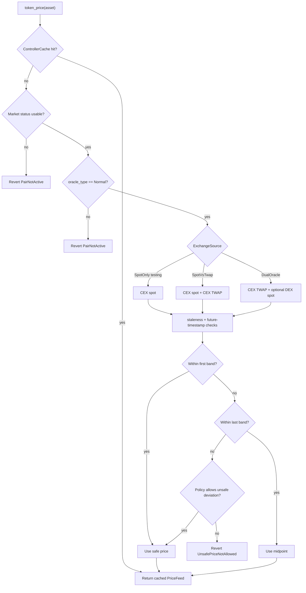

## 10. Common Controller Flow

Every user operation enters through the controller and proceeds through the
same skeleton (`controller/src/positions/*.rs`,
`controller/src/strategy.rs`, `controller/src/flash_loan.rs`):

```mermaid
flowchart LR
    Entry["Controller entrypoint"] --> Auth["require_auth + pause check"]
    Auth --> Load["Load AccountMeta and required position maps"]
    Load --> Plan["Aggregate batch + market/risk validation"]
    Plan --> Price["Resolve prices via ControllerCache"]
    Price --> TokenMove{"Token movement?"}
    TokenMove -->|inbound| DeltaIn["Transfer + balance-delta measurement"]
    TokenMove -->|outbound| PoolCall["Pool mutation"]
    DeltaIn --> PoolCall
    PoolCall --> PoolSync["Pool global_sync + scaled accounting"]
    PoolSync --> PostRisk{"Risk-increasing?"}
    PostRisk -->|yes| HF["require_healthy_account"]
    PostRisk -->|no| Persist["Persist touched account side"]
    HF --> Persist
    Persist --> Events["Emit events + flush isolated-debt cache"]
```

The remaining subsections list only the per-flow specifics that diverge
from this skeleton.

### 10.1 Supply

`supply(caller, account_id, e_mode_category, assets)`
(`controller/src/positions/supply.rs`):

- `account_id == 0` creates a new account owned by `caller`. Existing-account
  deposits from third parties are accepted because they only add collateral.
- Duplicate payments are aggregated before token movement.
- Cache is permissive (`new(env, true)`).
- Token credit is measured by the pool's balance delta (fee-on-transfer
  tokens supported; over-crediting rejected).
- Validates active markets, supply caps, e-mode, isolation, and bulk
  position limits before transferring.
- Writes only the supply side.

### 10.2 Borrow

`borrow(caller, account_id, borrows)`
(`controller/src/positions/borrow.rs`):

- Caller authorization and account-owner match.
- Cache uses `OraclePolicy::RiskIncreasing`.
- Validates borrowability, LTV, borrow caps, position limits, siloed
  borrowing, e-mode, and isolation debt ceilings.
- Pool checks reserve availability before transferring tokens.
- Isolated debt is tracked in `IsolatedDebt(asset)` USD WAD and flushed once
  per batch via `cache.flush_isolated_debts()`.
- Post-batch `require_healthy_account` gates the entire borrow batch.

### 10.3 Repay

`repay(caller, account_id, payments)`
(`controller/src/positions/repay.rs`):

- Any authenticated caller may repay any account.
- Cache uses `OraclePolicy::IsolatedRepay` for isolated accounts and
  `OraclePolicy::Repay` otherwise. Isolated accounts use strict pricing
  because `IsolatedDebt(asset)` is decremented in USD WAD; non-isolated
  accounts use permissive pricing and remain reachable for `Disabled`
  markets.
- Tokens are pulled into the pool with balance-delta accounting; the pool
  burns scaled debt and refunds overpayment.
- Full repay does not delete the account; account deletion is reserved for
  owner-driven `withdraw` flows.

### 10.4 Withdraw

`withdraw(caller, account_id, withdrawals)`
(`controller/src/positions/withdraw.rs`):

- Caller authorization and account-owner match.
- `amount == 0` is the withdraw-all sentinel; pools clamp full withdrawals
  to the post-accrual balance and apply a dust-lock guard.
- Borrow side is loaded only if the account has debt.
- Cache permissiveness mirrors debt presence:
  `new(env, account.borrow_positions.is_empty())`.
- `require_healthy_account` is invoked in both branches and short-circuits
  for debt-free accounts.
- Account storage is removed when both sides are empty after the batch.

### 10.5 Liquidation and Bad Debt

`liquidate(liquidator, account_id, debt_payments)`
(`controller/src/positions/liquidation.rs`):

- Liquidator `require_auth`. Permissionless beyond authorization for the
  liquidator's debt spend.
- Cache is strict (`new(env, false)`).
- `execute_liquidation` derives target repayment, bonus, and protocol fee
  for an account with health factor `< 1.0 WAD`.
- Repaid debt is pulled from the liquidator into the affected pools;
  collateral is seized to the liquidator with bonus and protocol fee
  applied.
- After execution, `check_bad_debt_after_liquidation` may invoke
  `seize_position(Borrow)` on each remaining debt asset when collateral
  ≤ `BAD_DEBT_USD_THRESHOLD` (5 USD WAD) and debt > collateral; the pool
  reduces the supply index with floor `SUPPLY_INDEX_FLOOR_RAW`.
- `clean_bad_debt(account_id)` is a `KEEPER`-only standalone path.

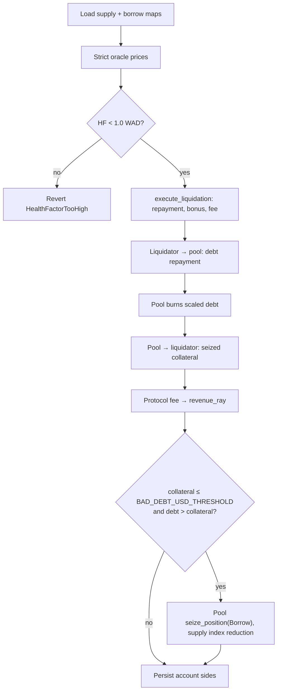

## 11. Strategy and Flash-Loan Flows

### 11.1 Strategies

`controller/src/strategy.rs` exposes:

- `multiply(caller, account_id, e_mode_category, collateral_token,
  debt_to_flash_loan, debt_token, mode, swap, initial_payment,
  convert_swap)`
- `swap_debt(caller, account_id, existing_debt_token, amount,
  new_debt_token, swap)`
- `swap_collateral(caller, account_id, current_collateral, amount,
  new_collateral, swap)`
- `repay_debt_with_collateral(caller, account_id, collateral_token,
  collateral_amount, debt_token, swap, close_position)`

All four require account-owner authorization and run market, oracle, e-mode,
isolation, cap, and health checks shared with the underlying flows.

`AggregatorSwap` shape (see `common/src/types.rs`):

- one or more `SwapPath`s,
- per-path `split_ppm` (parts per million),
- per-hop `token_in`, `token_out`, `pool`, `venue`, `fee_bps`,
- aggregate `total_min_out`.

`validate_aggregator_swap` (`controller/src/strategy.rs`) rejects:

- empty `paths`,
- `amount_in <= 0` or `total_min_out <= 0`,
- empty `hops` for any path,
- per-path `split_ppm == 0`,
- `sum_ppm != 1_000_000`,
- first hop `token_in != input token`,
- last hop `token_out != output token`.

The router is invoked through `aggregator::AggregatorClient::batch_execute`
with `BatchSwap { sender = current_contract_address, total_in, total_min_out,
referral_id = 0, paths }`. The controller snapshots its input and output
token balances around the call:

- If post-call input spend exceeds the committed `total_in`, the call
  reverts.
- If post-call output delta is below `total_min_out`, the call reverts.

The router call runs while the flash-loan single-flight flag is set, so
mutating controller endpoints reject re-entry during routing.

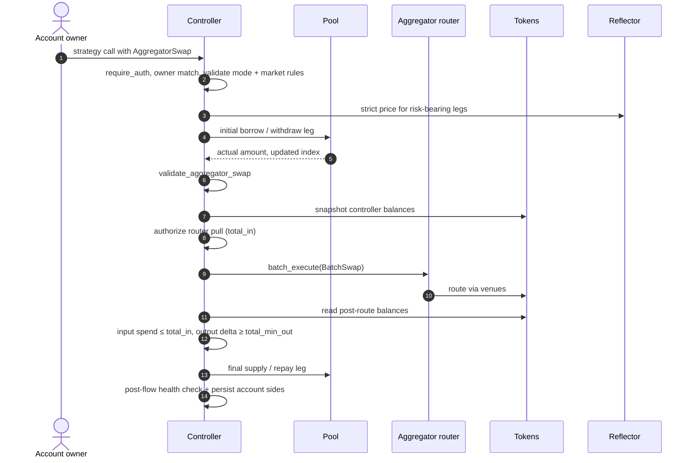

### 11.2 Flash Loans

`flash_loan(caller, asset, amount, receiver, data)`
(`controller/src/flash_loan.rs`):

- `caller.require_auth()`.
- `require_market_active(asset)`, `is_flashloanable`, `amount > 0`.
- Verifies `receiver` is a deployed Wasm contract.
- Sets `FlashLoanOngoing = true`.
- Controller calls `pool.flash_loan(initiator, receiver, amount, fee, data)`.
- Pool transfers `amount` to `receiver` after taking a local balance snapshot.
- Pool invokes `execute_flash_loan(initiator, asset, amount, fee, pool, data)`
  on `receiver`; `data` is opaque to the controller and pool.
- The receiver authorizes the pool to pull `amount + fee`.
- Pool pulls repayment from `receiver` and verifies post-repay balance equals
  pre-balance + fee.
- The fee is recorded as protocol revenue.
- Controller clears `FlashLoanOngoing` and emits `FlashLoanEvent`.

The receiver contract must pre-authorize the pool's repayment pull during
its callback.

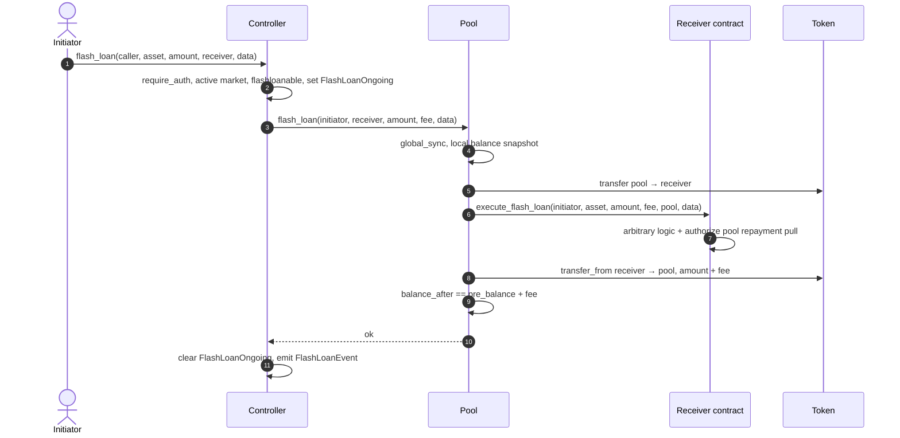

## 12. E-Mode, Isolation, and Siloed Borrowing

E-mode is category-based. `ControllerKey::EModeCategory(u32)` stores
`EModeCategory { loan_to_value_bps, liquidation_threshold_bps,
liquidation_bonus_bps, is_deprecated, assets: Map<Address,
EModeAssetConfig> }`. Each market stores its reverse membership list in
`AssetConfig.e_mode_categories: Vec<u32>`.

`remove_e_mode_category` flags the category deprecated, clears its asset
map, and removes the category id from each member market's reverse
membership list. Deprecated categories remain readable; new activity is
blocked.

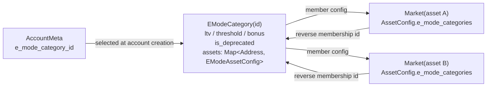

Isolation mode is account-level (`AccountMeta.is_isolated`,
`isolated_asset`):

- An isolated account uses one isolated collateral asset.
- Borrows are limited to assets with `isolation_borrow_enabled = true`.
- Total isolated debt is tracked in `ControllerKey::IsolatedDebt(asset)`
  in USD WAD.
- Borrowing increments the counter; repay and liquidation decrement it.

Siloed borrowing (`AssetConfig.is_siloed_borrowing`) is asset-level: if any
final debt asset is siloed, the account cannot hold multiple debt assets.

## 13. Access Control and Operations

Owner plus three roles (`controller/src/access.rs`):

- Owner (`#[only_owner]`): upgrades, pause/unpause, market listing,
  asset/e-mode/limits/aggregator/accumulator/template configuration, pool
  parameter and pool WASM upgrades, token-listing approval,
  `grant_role`/`revoke_role`.
- `KEEPER` (`#[only_role(caller, "KEEPER")]`): `update_indexes`,
  `update_account_threshold`, `clean_bad_debt`. TTL keepalive is no
  longer an on-chain endpoint — see Section 5 for the off-chain
  `ExtendFootprintTtl` flow.
- `ORACLE`: `configure_market_oracle`, `edit_oracle_tolerance`,
  `disable_token_oracle`.
- `REVENUE`: `claim_revenue`, `add_rewards`.

Constructor (`Controller::__constructor`):

- Sets the owner.
- Sets the access-control admin to the owner.
- Grants only `KEEPER` to the deployer (`REVENUE` and `ORACLE` require an
  explicit `grant_role` after deploy).
- Sets default position limits to 10 supply and 10 borrow positions; the
  validated cap on `set_position_limits` is 32 per side.
- Pauses the controller (`pausable::pause`).

`upgrade(new_wasm_hash)` auto-pauses before invoking
`upgradeable::upgrade`. `transfer_ownership` is two-step
(`stellar_access::role_transfer`); `accept_ownership` synchronizes the
access-control admin with the accepted owner.

Mainnet launch requires a multi-party owner, no residual deployer authority,
separated keeper/oracle/revenue roles, off-chain notice for non-emergency
privileged changes, and immediate emergency pause authority. ADR 0009 defines
the full launch-control policy.

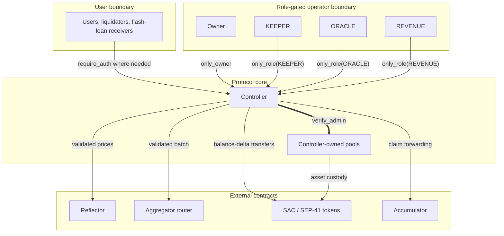

## 14. Storage and TTL Strategy

Soroban storage is partitioned by entry kind:

- **Instance** (`ControllerKey::*` variants and `ApprovedToken(asset)` in
  `controller/src/storage/instance.rs`): `PoolTemplate`, `Aggregator`,
  `Accumulator`, `AccountNonce`, `PositionLimits`, `LastEModeCategoryId`,
  `FlashLoanOngoing`, plus the `ApprovedToken` allow-list.
- **Persistent shared**: `Market(asset)`, `PoolsList`, `EModeCategory(id)`,
  `IsolatedDebt(asset)`.
- **Persistent user**: `AccountMeta(id)`, `SupplyPositions(id)`,
  `BorrowPositions(id)`.
- **Pool Instance** (`PoolKey::Params`, `PoolKey::State`).

TTL is bumped two ways:

- **In-band**: every mutating contract entrypoint refreshes the
  controller's own instance entry, the per-account user keys it touches,
  and the per-asset shared keys it reads via its internal `renew_*`
  helpers. Activity on the protocol keeps the entries it touches alive.
- **Out-of-band**: the off-chain keeper service
  (`services/keeper`) issues permissionless `ExtendFootprintTtl`
  operations against every storage entry, contract instance, and wasm
  code entry whose `live_until` is inside the configured safety margin.
  The signer needs no on-chain role — only XLM for fees.

The split of account state per side lets each flow read/write only the side
it mutates.

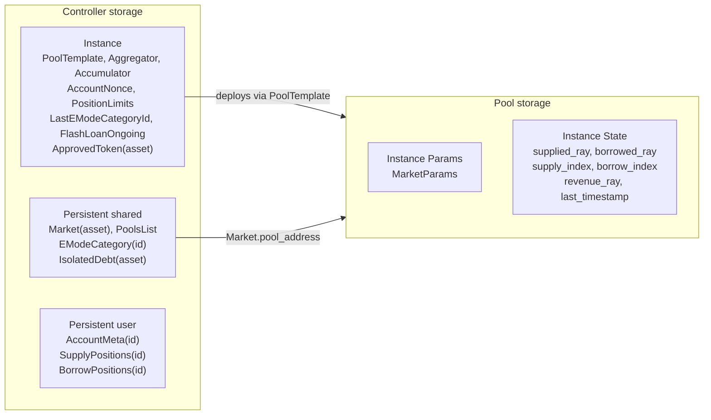

## 15. Implemented Safety Checks and Access Controls

A non-exhaustive list of checks present in the code:

- Controller starts paused after construction; `upgrade` auto-pauses.
- `#[only_owner]` and `#[only_role]` macros gate operator endpoints.
- Pool mutating accounting and maintenance endpoints call `verify_admin`;
  pool WASM upgrade is owner-gated with `#[only_owner]`.
- Token-listing allow-list (`ApprovedToken(asset)`) is consumed at market
  creation.
- One deterministic pool per listed asset (salt = keccak256 of asset
  address).
- Cap on per-account positions: 32 per side at `set_position_limits`.
- Numeric domains separated into BPS, WAD, RAY with type wrappers in
  `common::fp`.
- Reserve availability is checked before pool transfers out
  (`pool/src/cache.rs::has_reserves`).
- Balance-delta accounting on user deposits, repayments, reward transfers,
  and strategy router output.
- Aggregator route-shape validation and post-route output verification.
- Single-flight `FlashLoanOngoing` guard during flash loans and router
  execution.
- Oracle deviation tolerance, staleness, and unconditional future-timestamp
  guard.
- Bad-debt socialization floor at `SUPPLY_INDEX_FLOOR_RAW`.
- Pool revenue routes only through pool ownership (no caller-supplied
  destination in `claim_revenue`).

## 16. Verification Surface

The repository contains unit tests, the `verification/test-harness/`
integration suite, fuzz targets under `verification/fuzz/fuzz_targets/`,
Certora profiles under `verification/certora/`, fixed-point and protocol
invariants in `architecture/INVARIANTS.md`, vulnerability reporting in
`SECURITY.md`, and ADRs under `architecture/decisions/`.

For mainnet launch, these artifacts form the acceptance matrix. The release
record pins the target commit, deployed contract addresses, command logs, and
result status before public unpause.

| Command / evidence | Purpose | Pass condition | Launch requirement | Result / status |
| --- | --- | --- | --- | --- |
| `cargo test --workspace` | Workspace unit and integration tests. | No test failures on the target commit. | Required before public unpause. | Target-commit log. |
| `make test` | Serial Soroban test-harness suite. | All `verification/test-harness` tests pass with `--test-threads=1`. | Required before public unpause. | Target-commit log. |
| `make test-pool` | Pool accounting unit tests. | Pool tests pass without ignored failure. | Required before public unpause. | Target-commit log. |
| `make clippy` | Rust lint gate. | Clippy completes with warnings denied. | Required before public unpause. | Target-commit log. |
| `make build` | Build controller and pool WASM artifacts. | WASM artifacts build for the target commit. | Required before deploy. | Artifact hashes. |
| `make optimize` | Optimize deployment WASM artifacts. | Optimized WASM artifacts are produced and hash-pinned. | Required before deploy. | Optimized hashes. |
| `make proptest PROPTEST_CASES=10000` | Contract-level property tests for auth, TTL, budget, strategy/flash-loan, liquidation, conservation, and multi-asset solvency. | All configured property tests pass at 10,000 cases. | Required before public unpause. | Target-commit log. |
| `make fuzz FUZZ_TIME=300` | Function-level fuzz targets (`fp_math`, `fp_ops`, `pool_native`, `rates_and_index`, and related targets). | Every target completes 300 seconds without crash or new corpus failure. | Required before public unpause. | Fuzz summary and artifacts if any. |
| `make fuzz-contract FUZZ_TIME=300` | Contract-flow fuzz targets (`flow_e2e`, `flow_strategy`, and related targets). | Every target completes 300 seconds without crash or invariant failure. | Required before public unpause. | Fuzz summary and artifacts if any. |
| `./verification/certora/compile_all.sh` | Compile all Certora feature paths. | Common, pool, and controller `certora` feature builds pass. | Required before proof submission. | Compile log. |
| `./verification/certora/run_profile.py sanity` | Non-vacuity and reachability smoke proofs. | Profile completes without failed rules. | Required before public unpause. | Certora run links. |
| `./verification/certora/run_profile.py fast` | Stable CI proof profile for common math/rates, pool integrity, and controller light safety. | Profile completes without failed rules. | Required before public unpause. | Certora run links. |
| `./verification/certora/run_profile.py critical` | Highest-signal accounting and safety proofs. | Profile completes without failed rules or documented launch-blocking counterexamples. | Required before public unpause. | Certora run links. |
| `./verification/certora/run_profile.py manual` | Core plus heavy audit proof profile. | Profile completes, or any timeout/deferred rule is documented with risk acceptance and launch impact. | Required before cap increase beyond launch caps. | Certora run links and residual-risk notes. |
| External audit closure | Independent review of the target branch. | Findings are fixed, accepted with rationale, or explicitly deferred from launch scope. | Required before public unpause. | Audit closure record. |
| Testnet soak | Real deployment rehearsal. | 14 consecutive days with no unresolved P0/P1 incidents, no unexplained accounting drift, no stale TTL windows, and no oracle configuration drift. | Required before public unpause. | Monitoring summary. |
| Pause drill | Operational response rehearsal. | Testnet pause rejects user mutations, required views/checks remain usable, and unpause restores operation. | Required before public unpause. | Runbook transcript. |

Any failed command, unresolved P0/P1 incident, unexplained accounting drift,
or launch-blocking audit finding prevents public unpause until the issue is
resolved or explicitly deferred with documented risk acceptance and launch-impact
analysis.

The ADR index lists the accepted decision records that support this
architecture.

Areas with high implementation complexity remain the focus for extending
tests, fuzzing targets, and rules: liquidation and bad-debt socialization,
oracle fallback selection and disabled-market repayment, strategy router
validation, isolation debt accounting, e-mode category deprecation,
low-liquidity revenue claims, flash-loan callback authorization, and storage
TTL behavior.

## 17. Deployment and Operations

Deployment is template-driven: the pool WASM is uploaded once, the
controller stores its hash, and each listed asset gets a deterministic pool
deployed by the controller.

```mermaid
flowchart LR
    A["Build + optimize<br/>hash-pinned WASM"] --> B["Upload pool WASM"]
    B --> C["Deploy controller<br/>constructor pauses"]
    C --> D["Configure template<br/>aggregator + accumulator"]
    D --> E["Assign multisig owner<br/>and separated roles"]
    E --> F["Create markets + oracles<br/>caps + e-mode while paused"]
    F --> G["Verification matrix<br/>release evidence"]
    G --> H["14-day testnet soak"]
    H --> I["Monitoring live<br/>pause drill complete"]
    I --> J["Capped mainnet unpause"]
    J --> K["7-day capped operation"]
    K --> L["Staged cap increases"]
```

Mainnet launch gates are defined by ADR 0009. Initial launch exposure is
capped at USD 250,000 total TVL, USD 100,000 total borrow, USD 100,000
per-market supply, and USD 50,000 per-market borrow. Caps may increase only
after a stage satisfies ADR 0009's 7-day incident-free review gate.

Mainnet launch completion is verified beyond deployment checks: the target
mainnet deployment must pass the verification matrix, satisfy ADR 0009 launch
gates, unpause with initial caps enforced, and complete the 7-day capped
mainnet operation window without unresolved launch-blocking incidents.

Operational maintenance:

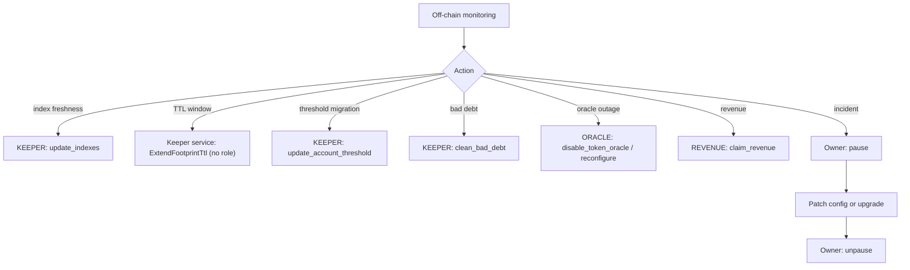

## 18. Source Map

- `controller/src/access.rs`: ownership, roles, pause, upgrade, ownership
  transfer.
- `controller/src/router.rs`: market listing, pool deployment, pool
  parameter and WASM upgrades, revenue claim, reward injection, keepalive.
- `controller/src/config.rs`: asset config, e-mode, oracle config,
  aggregator, accumulator, token approval, position limits.
- `controller/src/positions/*.rs`: supply, borrow, repay, withdraw,
  liquidation, account lifecycle, e-mode application, threshold updates.
- `controller/src/strategy.rs`: multiply, debt swap, collateral swap,
  collateral-funded repay, aggregator route validation.
- `controller/src/flash_loan.rs`: flash-loan entrypoint and callback.
- `controller/src/oracle/mod.rs`, `controller/src/oracle/reflector.rs`:
  Reflector integration and price selection.
- `controller/src/cache/mod.rs`: transaction-local cache, isolated-debt
  flush.
- `controller/src/storage/*.rs`: controller storage layout, TTL helpers.
- `controller/src/validation.rs`: input and config validation.
- `controller/src/views.rs`: controller read surface.
- `pool/src/lib.rs`: pool ABI and accounting mutations.
- `pool/src/interest.rs`: interest accrual, revenue accrual, bad-debt
  socialization.
- `pool/src/cache.rs`: pool transient state and reserve checks.
- `pool/src/views.rs`: pool read surface.
- `pool-interface/src/lib.rs`: controller-to-pool ABI trait.
- `common/src/types.rs`: shared ABI types (storage keys, configs,
  positions, oracle, swap).
- `common/src/constants.rs`: fixed-point constants and protocol bounds.
- `common/src/rates.rs`: rate model and index math.
- `common/src/math/fp.rs`, `common/src/math/fp_core.rs`: typed fixed-point
  arithmetic.
- `architecture/INVARIANTS.md`: invariant inventory keyed to module paths.

## 19. Status

The repository is pre-audit. Production deployment is gated on
external audit completion, formal verification review against the target
branch, deployment runbook validation, ADR 0009 launch-gate completion,
oracle and asset-listing procedures, and incident-response procedures.
