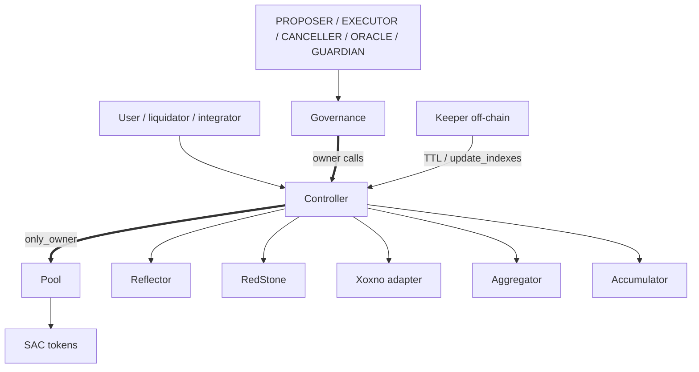

# XOXNO Lending — Architecture Reference

Build and audit reference for the **current** source tree. Not a deployment
announcement. Normative rules live in
[architecture/INVARIANTS.md](./architecture/INVARIANTS.md) and
[architecture/decisions/](./architecture/decisions/).

## 1. Summary

Three core Soroban contracts:

| Contract | Role |
|----------|------|
| **governance** | Owns the controller. Timelocks admin ops. Roles for propose/execute/cancel and incident keys. |
| **controller** | User-facing: accounts, risk, oracle, liquidation, flash loans, strategies. Sole mutator of the pool. |
| **pool** | Central liquidity. All mutations `#[only_owner]` (controller only). No risk/oracle decisions. |

Supporting in-repo contracts: `aggregator` (DEX router), `xoxno-oracle-adapter`
(multi-signer feed), `defindex-strategy` (vault adapter), `flash-loan-receiver`
(**test-only** receiver for smoke tests).

Shared library: `common/`. Published ABIs: `interfaces/`.

New deployments start with the controller **paused**. Go-live requires explicit
resume after configuration.

### Current truth

- Ownership: governance → controller → pool.
- Markets: `HubAssetKey { hub_id, asset }` — hubs isolate liquidity completely.
- Accounts bind spoke id ≥ 1; risk, caps, pause/freeze live on spoke listings.
- **Pause:** GUARDIAN can pause the controller immediately. **Unpause is
  risk-loosening** and uses timelocked `AdminOperation::Unpause` (there is no
  governance immediate `unpause` entrypoint). Controller `pause`/`unpause` are
  owner-only (owner = governance).
- Global pause keeps `repay`, `withdraw`, `liquidate`, `clean_bad_debt` open;
  spoke `paused`/`frozen` per [ADR 0011](./architecture/decisions/0011-pause-and-freeze-matrix.md).
- Oracle: token-rooted `AssetOracle(asset)`; Reflector / RedStone / Xoxno;
  dual-source tolerance; fail-closed.

## 2. Topology

The controller has **no** `KEEPER`, `REVENUE`, or `ORACLE` roles — only owner +
pausable. ORACLE/GUARDIAN live on governance. The keeper self-authorizes as a
signed caller (permissionless paths where the contract allows).

## 3. Addressing

- **Hubs** isolate markets: same token on hub 1 vs hub 2 → separate indexes,
  cash, revenue, debt, bad-debt socialization.
- **Spokes** (ids ≥ 1): each account binds one spoke; listings are
  `SpokeAsset(spoke_id, HubAssetKey)` with risk, caps, pause/freeze, optional
  oracle override.
- No market-status enum: price-active when token-rooted `AssetOracle(asset)`
  exists and source validation passes.

## 4. Storage shape

Keys: `ControllerKey` in `common/src/types/controller.rs`. Tiers from
`contracts/controller/src/storage/`.

### Controller — instance

- `Pool`, `PoolTemplate`, `Aggregator`, `Accumulator`
- `PositionLimits`, `MinBorrowCollateralUsd`, `AppVersion`
- `LastSpokeId`, `LastHubId` (id allocators)
- `PositionManager(Address)` (active managers; absence = inactive)
- Local registries: approved tokens, approved Blend pools, counts

### Controller — persistent

- `AccountNonce` (not instance: avoids re-renting the whole instance envelope)
- `Hub(u32)`
- `AssetOracle(Address)` — token-rooted oracle config
- `Spoke(u32)`, `SpokeAsset(u32, HubAssetKey)`, `SpokeUsage(u32, HubAssetKey)`
- `AccountMeta(u64)`, `Delegates(u64)`, `SupplyPositions(u64)`, `BorrowPositions(u64)`

### Controller — temporary

- Flash-loan ongoing flag (reentrancy session)

### Pool — persistent

- `Params(HubAssetKey)`, `State(HubAssetKey)`

## 5. Governance

Owns the controller, validates admin inputs, schedules ops by ledger delay,
executes when ready.

| Role | Typical power |
|------|----------------|
| **PROPOSER** | Schedule `AdminOperation` |
| **EXECUTOR** | Execute ready ops (or open execute when executor is `None`) |
| **CANCELLER** | Cancel pending ops (role revocations are non-cancellable) |
| **GUARDIAN** | Immediate: controller `pause`, tighten spoke pause/freeze, create hub/spoke |
| **ORACLE** | Immediate: move sanity band (must contain live price) |

**Timelocked (risk-loosening or structural):** market listing, oracle config,
caps, upgrades, role grants, **`AdminOperation::Unpause`**, ownership transfer
initiation, delay increases, etc.

See [ADR 0010](./architecture/decisions/0010-governance-timelock-for-controller-admin.md)
and [ADR 0011](./architecture/decisions/0011-pause-and-freeze-matrix.md).

## 6. Controller

User-facing surface:

- Accounts, delegates, renewal
- Supply, borrow, repay, withdraw, liquidate, `clean_bad_debt`
- Flash loans and strategies (multiply, swaps, repay-with-collateral, Blend migrate)
- Admin config (via owner = governance): hubs, spokes, oracles, pool deploy/upgrade, approvals

Risk-increasing and several maintenance paths are `#[when_not_paused]`. Exits and
liquidations stay available under global pause; spoke flags add finer brakes
(tainted-debt gate on paused debt listings). Full matrix: ADR 0011 + INVARIANTS.

## 7. Pool

Controller-owned:

- Token custody; params/state by `HubAssetKey`
- Tracked `cash` for borrowable reserves — **direct donations do not increase
  borrowable liquidity**
- Interest via supply/borrow indexes; revenue as scaled supply shares
- Flash loans: balance snapshot → callback → repay pull → verify (ADR 0006)
- Bad-debt socialization via supply-index floor when
  `debt > collateral` and collateral USD ≤ bad-debt threshold (ADR 0007)
- Free-borrow floor: positive raw borrow that rounds to zero scaled debt reverts

## 8. Spokes and risk

Spoke asset row: collateral/borrow flags, paused/frozen, LTV, threshold, bonus,
liquidation fee, supply/borrow caps, optional oracle override.

Borrow and indebted-withdraw load risk from the account’s spoke; unlisted assets
revert before risk math.

## 9. Oracle

1. Load token-rooted `AssetOracle(asset)`.
2. Optional spoke oracle override.
3. Read Reflector, RedStone, and/or Xoxno adapter.
4. Staleness, future skew, decimals, sanity, dual-source tolerance.
5. Normalize to USD WAD.

Missing or out-of-band sources **fail closed**. Dual-source markets require
primary and anchor within the tolerance band. Xoxno is a distinct provider kind
(`OracleProviderKind::XoxnoPriceFeed`). See ADR 0003 + INVARIANTS.

## 10. Accounts and positions

Account: owner, spoke id, mode, scaled supply/borrow maps keyed by `HubAssetKey`.
RAY for rates/indexes; WAD for USD risk; token-native at transfer boundaries.

## 11. Flash loans

Controller-routed, pool-settled: validate → pool loan + callback → pull
principal+fee → fee to revenue. Controller flash guard blocks reentrant mutators.

## 12. Strategies

Same health and position-limit gates as direct flows. Router output untrusted —
controller validates **balance delta**; slippage lives in the aggregator payload
(ADR 0005). DeFindex: one vault → one controller account for a configured hub-asset
and spoke.

## 13. Off-chain services

| Service | Role |
|---------|------|
| **keeper** | Separate workspace. TTL renew/restore for instances, wasm, oracles, spokes, accounts, pool params/state, governance. Config: `contracts.markets = [{ hub_id, asset }]`; `market_assets` remains hub_id=1 shorthand. |
| **lending-exporter** | Separate workspace. Metrics scrape for ops/observability. |

## 14. Verification surface

| Command | Scope |
|---------|--------|
| `cargo fmt --all -- --check` | Format |
| `cargo clippy --workspace --all-targets -- -D warnings` | Lint |
| `cargo test --workspace` | Unit tests (main workspace) |
| `make test` | Soroban integration harness |
| `make test-pool` | Pool-focused tests |
| `make certora-wasm` then Certora profiles | Formal verification |
| `make fuzz` | cargo-fuzz targets |
| `make proptest` | Property tests |
| `make mutants` | Mutation testing |
| `make miri-common` | UB checks on pure math |
| `scripts/scout-local.sh` | Static analysis |
| `cargo test --manifest-path services/keeper/Cargo.toml` | Keeper |
| `cargo check --manifest-path tests/fuzz/Cargo.toml --bin pool_native` | Fuzz build gate |

A check counts only if it ran on the current tree and output was reviewed.

## 15. Security review focus

- `HubAssetKey` isolation (controller, pool, keeper, docs)
- Oracle reconfigure via `AssetOracle(asset)` + tolerance re-validation
- Spoke listing, caps, pause/freeze / tainted debt
- Auth: owner, delegates, position managers
- Flash-loan and strategy reentrancy
- Pool `cash` and bad-debt floor
- Governance timelock, role separation, non-cancellable role revoke, Unpause path
- Keeper TTL coverage and config drift
