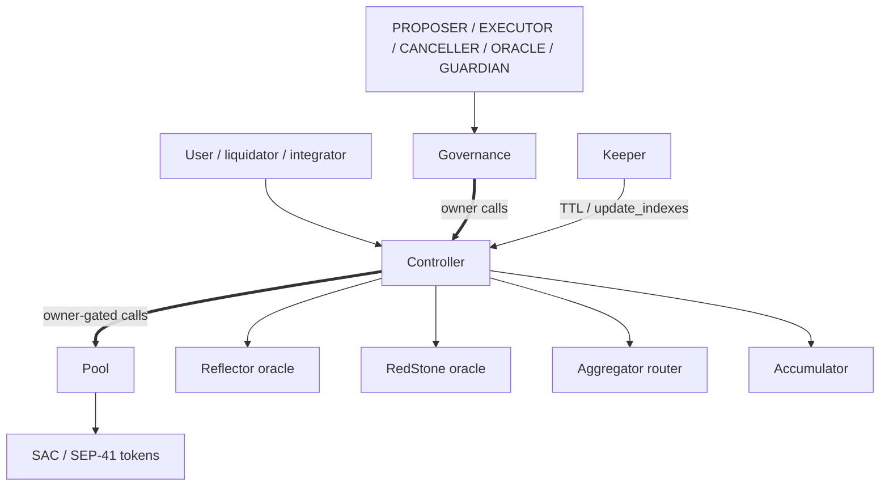

# XOXNO Lending Architecture Reference

This document is a build and audit reference for the protocol's current
source shape, not a deployment announcement.

## 1. Summary

XOXNO Lending has three core Soroban contracts:

- `governance`: owns the controller and timelocks protocol-admin operations.
- `controller`: user-facing contract for accounts, spoke configuration, oracle
  policy, risk checks, liquidation, flash loans, and strategy flows.
- `pool`: one central controller-owned liquidity contract with accounting rows
  keyed by `HubAssetKey { hub_id, asset }`.

Supporting in-repo contracts: `contracts/aggregator` (DEX aggregation router),
`contracts/xoxno-oracle-adapter` (multi-signer, SEP-40/Reflector-compatible
price feed), `contracts/defindex-strategy`, and
`contracts/flash-loan-receiver`.

The architecture has been extended with later decisions (ADR 0010 governance
timelock details, ADR 0011 pause/freeze matrix, ADR 0012 per-spoke liquidation
curve). New deployments start with the controller paused; the owner must
explicitly unpause after configuration. All pool state mutations are
controller-only (`#[only_owner]`). See §14 and the protocol invariants for
current verification expectations.

## 2. Contract Topology

The controller defines no `KEEPER`, `REVENUE`, or `ORACLE` roles (only owner + pausable) — those live on governance (plus GUARDIAN for immediate per-listing incident actions). The off-chain keeper self-authorizes via signed caller (no on-chain role on the controller).

## 3. Addressing Model

Markets are addressed by `HubAssetKey { hub_id: u32, asset: Address }`; the
same token on different hubs shares no indexes, revenue, cash, debt, or
bad-debt socialization.

Accounts bind to a spoke id `>= 1` (spokes are not base overlays); each spoke
keeps its own `SpokeAsset(spoke_id, HubAssetKey)` rows for risk and caps.

Hubs fully isolate markets: the same asset on different hubs has separate
indexes, cash, revenue, debt, and bad-debt socialization. Configs
(`configs/`) enumerate markets by `hub_id` (core hub 1 + RWA hub 2 and beyond);
addresses are confirmed live only after ADR 0009's launch-gate validation (see
DEPLOYMENT.md), not merely by appearing in config.

## 4. Storage Shape

Controller keys are defined by `ControllerKey`
(`common/src/types/controller.rs`).

- Instance: `Pool`, `PoolTemplate`, `Aggregator`, `Accumulator`,
  `AccountNonce`, `PositionLimits`, `AppVersion`, `MinBorrowCollateralUsd`,
  `LastSpokeId`, `LastHubId`, `Hub(u32)`, `PositionManager(Address)`.
- Persistent: `AssetOracle(Address)`, `Spoke(u32)`,
  `SpokeAsset(u32, HubAssetKey)`, `SpokeUsage(u32, HubAssetKey)`,
  `AccountMeta(u64)`, `Delegates(u64)`, `SupplyPositions(u64)`,
  `BorrowPositions(u64)`.
- Pool persistent: `Params(HubAssetKey)`, `State(HubAssetKey)`.

No market-status enum exists: an asset is price-active when its token-rooted
`AssetOracle(asset)` entry exists and its source passes validation.

## 5. Governance

Governance owns the controller, validates admin inputs, timelocks operations
by ledger delay, and executes them once ready. Roles: `PROPOSER`, `EXECUTOR`,
`CANCELLER`, `ORACLE`, `GUARDIAN` (immediate per-listing incident actions for
flags etc.).

Emergency `pause`/`unpause` stay immediate; governance-self operations (role
and delay changes, ownership-transfer initiation, upgrades) are timelocked.
See ADR 0010 and ADR 0011.

## 6. Controller Responsibilities

Controller entrypoints cover:

- Account creation, delegate management, and account renewal.
- Supply, borrow, repay, withdraw, liquidation, and bad-debt cleanup.
- Flash loans and strategy flows (multiply, collateral swap, debt swap, repay
  debt with collateral, Blend migration).
- Hub, spoke, spoke-asset, position-limit, minimum-borrow-collateral, pool,
  oracle, aggregator, and accumulator configuration, including pool
  deployment, params, caps, rewards, revenue claim, and WASM upgrade.

Risk-increasing/external-surface flows are `#[when_not_paused]`-gated (supply,
borrow, strategies, flash loans, `update_indexes`, `claim_revenue`,
`add_rewards`, `update_account_threshold`); repay, withdraw, liquidation,
bad-debt cleanup (`clean_bad_debt`), and account renewal stay open for
de-risking.

Global pause leaves exits and liquidations live. Per-spoke `paused` blocks
supply/borrow + exits for that listing (stronger brake). `frozen` blocks only
new supply/borrow (orderly wind-down). Liquidations and `clean_bad_debt` survive
global pause and `frozen`; a paused *debt* leg in liquidation reverts
(tainted-debt gate). See ADR 0011 (full matrix + 2026-07-11 addendum) and
`architecture/INVARIANTS.md`.

## 7. Pool Responsibilities

The controller-owned pool:

- Holds token custody and stores market params/state by `HubAssetKey`.
- Tracks `cash` as borrowable reserves and verifies it before outgoing
  transfers — a direct token donation does not raise borrowable liquidity.
- Accrues interest through borrow/supply indexes and stores revenue as scaled
  supply shares.
- Settles flash loans with balance snapshots, callback invocation, repayment
  pull, and post-repayment verification (see ADR 0006).
- Socializes unrecoverable bad debt through the supply index floor — only when
  `debt > collateral && collateral_usd <= BAD_DEBT_USD_THRESHOLD` (5 WAD); see
  ADR 0007 and `INVARIANTS.md`. Direct token donations never increase tracked
  `cash`.

## 8. Spokes And Risk

A spoke asset row holds collateral, borrow, paused, and frozen flags; LTV,
liquidation threshold, liquidation bonus, and liquidation fee; supply and
borrow caps; and an optional oracle override.

Borrow and indebted-withdrawal paths load risk from the account's spoke;
unlisted assets revert before risk math can use them.

## 9. Oracle Model

The controller resolves prices through a strict path:

1. Load token-rooted `AssetOracle(asset)`.
2. Apply an optional spoke oracle override.
3. Read Reflector, RedStone, or XOXNO-adapter source data. (Xoxno uses a
   distinct `OracleSourceConfig::Xoxno` + dedicated multi-signer adapter
   contract and `OracleProviderKind::XoxnoPriceFeed`; treated as an
   independent second opinion in dual-source markets.)
4. Enforce staleness, future-timestamp, decimals, sanity, and tolerance bounds.
5. Normalize to USD WAD.

Dual-source markets require the primary and anchor to stay within the
tolerance band; missing source data fails closed with source-specific errors.
See ADR 0003 and `INVARIANTS.md`.

## 10. Account And Position Model

Accounts store owner, active spoke id, mode, and supply/borrow positions keyed
by `HubAssetKey`, as scaled shares (supply index for supply, borrow index for
debt). Rates and indexes use RAY; USD risk math uses WAD; transfers use
token-native units.

## 11. Flash Loans

Flash loans are controller-routed and pool-settled:

1. Controller validates the hub asset and caller flow.
2. Pool snapshots its balance, transfers the loan amount, and verifies the
   drop matches exactly.
3. Receiver callback runs.
4. Pool re-checks that balance to confirm the callback left it unchanged.
5. Pool pulls principal plus fee and verifies the final balance covers both.
6. Fee becomes protocol revenue.

The controller flash-loan guard blocks reentrant mutators for the duration.

## 12. Strategies

Strategy flows route through the controller under the same account-health and
position-limit constraints as direct supply, borrow, repay, and withdraw.
Router output is untrusted and validated by balance delta; slippage is
enforced by the aggregator route payload, not the controller.

The DeFindex adapter is configured for one `HubAssetKey` and `spoke_id`; each
vault maps to one controller account id.

## 13. Keeper

`services/keeper` is a separate workspace that renews/restores TTL for
controller/governance instances, configured `AssetOracle(asset)` and
`Spoke(id)` rows, account persistent keys, access-control role-holder keys,
pool `Params`/`State` (`HubAssetKey`-keyed) rows, and instance/WASM code
entries.

Keeper config uses `contracts.markets = [{ hub_id, asset }]`; the legacy
`market_assets` field remains as `hub_id = 1` shorthand.

## 14. Verification Surface

Baseline local evidence:

| Command | Scope |
| --- | --- |
| `cargo fmt --check` | Workspace formatting. |
| `cargo test --workspace` | Workspace unit tests. |
| `make test` | Soroban integration harness. |
| `make test-pool` | Pool unit tests. |
| `cargo check -p common --features certora` | Certora common harness. |
| `cargo check -p pool --features certora --no-default-features` | Certora pool harness. |
| `cargo check -p controller --features certora --no-default-features` | Certora controller harness. |
| `cargo test --manifest-path services/keeper/Cargo.toml` | Keeper workspace tests. |
| `cargo check --manifest-path tests/fuzz/Cargo.toml --bin pool_native` | Fuzz harness build gate. |

Expected before launch: Certora profiles (math, pool accounting, controller
risk, oracle rules, liquidation, flash loans, strategy/controller-pool
consistency); fuzz builds and replay logs (`tests/fuzz`); coverage reports for
controller/pool critical paths; and static-analysis reports (Scout plus other
release-gating checks).

A check counts as passed only if it ran against the current tree and its
output was reviewed.

## 15. Security Review Focus

High-priority review areas: `HubAssetKey` isolation across controller, pool,
keeper, and docs; oracle reconfigure behavior through
`AssetOracle(asset)`; spoke asset listing and cap enforcement; account
authorization, delegates, and position managers; flash-loan and strategy
callback reentrancy; internal `cash` accounting and bad-debt socialization;
governance timelock, role separation, and upgrade hash control; and keeper TTL
coverage and configuration drift.
