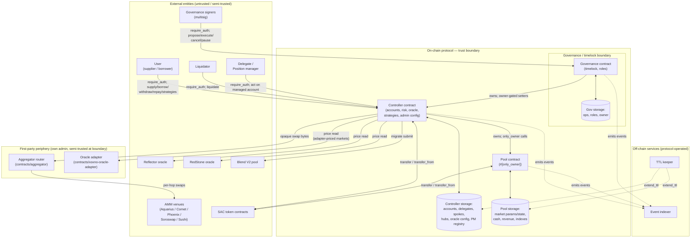

# STRIDE Threat Model — XOXNO Lending Protocol (Soroban)

**Scope:** the three core on-chain contracts — `contracts/governance`, `contracts/controller`, `contracts/pool` — analyzed in depth, plus the boundaries to the first-party periphery contracts `contracts/aggregator` (swap router) and `contracts/xoxno-oracle-adapter` (self-hosted price feed). The periphery contracts' internals warrant their own pass when adapter-priced markets list.

**Trust model:** the contract owner is a governance timelock backed by a multisig; listed tokens are standard Stellar Asset Contracts (SACs) with no transfer callback and full-value transfers, and fee-on-transfer or rebasing tokens are excluded by listing policy; oracle providers (Reflector, RedStone) are external dependencies that are not fully trusted. The DEX aggregator router is first-party code from this repository, deployed as a separate contract with its own admin; the controller still treats it as untrusted at the call boundary (balance-delta verification, ADR 0005), and the genuinely external swap surface is the AMM venues the router calls (Aquarius, Comet, Phoenix, Soroswap, Sushi). The `xoxno-oracle-adapter` is a first-party price source whose trust root is its protocol-operated N-of-M signer set. The off-chain indexer and TTL keeper are operated by the protocol team.

Severity tags and `file:line` references are included in the tables below as audit evidence.

## What are we working on?

XOXNO Lending is a multi-market, over-collateralized money market on Stellar. Users deposit SAC assets as collateral and borrow other listed assets against them. The system is three contracts in a strict ownership chain: **governance → owns → controller → owns → pool.**

- **Governance** owns the Controller. It wraps the OpenZeppelin `stellar-governance` timelock. Every privileged change is proposed as a single `AdminOperation`, waits out a delay measured in ledgers, then executes. Sensitive operations carry a higher minimum delay. Roles are proposer, executor, and canceller, plus a two-step owner transfer.
- **Controller** is the only contract users call directly. It owns accounts (numbered `account_id`, each with an owner address and optional delegates), enforces the risk engine (health factor, LTV, liquidation), prices collateral and debt through the oracle stack, runs strategies and flash loans, and holds all admin configuration. It owns the Pool.
- **Pool** is a single multi-market liquidity contract keyed by `HubAssetKey {hub_id, asset}`. It tracks scaled supply/borrow shares, per-market indexes, an internal `cash` counter, and protocol `revenue`. Every state-changing method is gated `#[only_owner]`, so the Controller is its sole caller.

Two further first-party contracts sit outside this ownership chain, each with its own admin: the **aggregator router** (`contracts/aggregator`, swap execution against AMM venues) and the **oracle adapter** (`contracts/xoxno-oracle-adapter`, a self-hosted N-of-M price feed). The Controller treats both as semi-trusted at the call boundary.

The typical flow ("happy path") is:

1. **Supply.** A user calls `supply` on the Controller. The Controller authenticates the caller (`require_auth`), creates or loads the account, checks spoke membership, and transfers the SAC into the Pool, which credits the market's `cash` and mints supply shares.
2. **Borrow.** The user calls `borrow`. The Controller prices every collateral and debt leg through the oracle stack (Reflector/RedStone, with tolerance banding), enforces the health-factor and LTV gates, and the Pool transfers the borrowed asset out.
3. **Strategy / flash loan.** The user runs `multiply`, `swap_collateral`, `swap_debt`, `repay_debt_with_collateral`, `flash_loan`, or `migrate_from_blend`. Swaps route through the first-party aggregator router (`contracts/aggregator`) as opaque bytes; a reentrancy guard is held across every external callback.
4. **Repay / withdraw.** The user calls `repay` (oracle-free) or `withdraw` (risk-gated for debt-bearing accounts). A delegate or a governance-approved position manager may act on an account it was granted.
5. **Liquidation.** When an account's health factor falls below one, a liquidator calls `liquidate`; the Controller seizes collateral, awards a bonus, and may socialize bad debt.
6. **Governance.** Governance signers `propose` an `AdminOperation` (list asset, set oracle/tolerance, change caps, upgrade, grant/revoke role, pause). It waits the timelock delay, then `execute`/`execute_self` applies it; `cancel` (canceller role) can withdraw a pending operation.
7. **Maintenance.** The keeper extends storage TTLs; the indexer consumes emitted events as the audit trail. `renew_account`, `update_indexes`, `claim_revenue`, and `add_rewards` are permissionless.

### Data-flow diagram

### Trust boundaries

1. **On-chain protocol boundary** — the three contracts. Input crossing it from a user, liquidator, or delegate is attacker-controlled and is authenticated with `require_auth` before any state change.
2. **Governance / timelock boundary** — separates ordinary operation from privileged change. Admin input is validated in `governance/src/validate/` before it reaches the Controller's owner-gated setters. A few invariants (oracle shape rules, tolerance bounds) hold only on this path, not on a direct owner call — see Tamper.5 and DoS.6.
3. **Oracle boundary** — Reflector and RedStone are external contracts; the first-party `xoxno-oracle-adapter` is listed as its own `Xoxno` provider variant (RedStone wire shape, listing-time-probed decimals) with a protocol-operated N-of-M signer set as its trust root, and counts as an independent provider next to both. Return values are bounded, staleness-checked, and fail-closed. A single unanchored feed remains a trusted input for a market configured that way — see Spoof.1.
4. **Swap / Blend boundary** — the aggregator router is first-party code deployed with its own admin; the Controller still passes it opaque swap bytes and measures its own balance delta, and the router enforces the slippage gate — see Elevation.3. The genuinely external surface is one hop further out: the AMM venues, whose outputs the router credits by its own balance delta per hop, not venue self-reports. Blend pools are governance-approved external addresses.
5. **Off-chain boundary** — the indexer and keeper. Indexer fidelity depends on event coverage (Repudiate.*); the keeper's uptime backs the archival mitigation (DoS.8).

## What can go wrong?

### STRIDE reminders

| Mnemonic Threat | Definition | Question |
| --- | --- | --- |
| **S**poofing | The ability to impersonate another user or system component to gain unauthorized access. | Is the user who they say they are? |
| **T**ampering | Unauthorized alteration of data or code. | Has the data or code been modified in some way? |
| **R**epudiation | The ability for a system or user to deny having taken a certain action. | Is there enough data to "prove" the user took the action if they were to deny it? |
| **I**nformation Disclosure | The over-sharing of data expected to be kept private. | Is there anywhere where excessive data is being shared or controls are not properly in place to protect private information? |
| **D**enial of Service | The ability for an attacker to negatively affect the availability of a system. | Can someone, without authorization, impact the availability of the service or business? |
| **E**levation of Privilege | The ability for an attacker to gain additional privileges and roles beyond what they initially were granted. | Can someone gain additional privileges without proper authentication and authorization? |

### Threat table

| Threat | Issues |
| --- | --- |
| **S**poofing | **Spoof.1** — (Step 2, 5) [Low] For a `Single`-shaped market with no cross-provider anchor, a compromised or manipulated provider returns an in-bounds but wrong price; the only gates are positivity, freshness, and a coarse sanity band. `oracle/providers/mod.rs`, `oracle/price.rs:40-50`.    **Spoof.2** — (Step 5) [Informational] The self-liquidation block compares only the owner address, so an owner can liquidate their own underwater account from a second address they control and take the bonus. `positions/liquidation/mod.rs:148-152`. |
| **T**ampering | **Tamper.1** — (Step 2, 5) [Medium] For an anchored market the final price is the anchor/primary midpoint; a primary at the edge of the tolerance band shifts the final price by half the band width. `oracle/tolerance.rs:24-32`, `common/src/constants/shared.rs:34`.    **Tamper.2** — (Step 1) [Medium] `supply`, `repay`, and `add_rewards` credit the Pool `cash` counter from the nominal amount with no received-token measurement; a fee-on-transfer or rebasing token would leave `cash` overstating the real balance. `pool/src/lib.rs:116,206,385`.    **Tamper.3** — (Step 1) [Low] Third-party `supply` into a matching-spoke victim account can dust-fill collateral slots and force a risk-parameter re-stamp. `account/mod.rs:73`, `positions/supply.rs:146`.    **Tamper.4** — (Step 3) [Low] `flash_loan` loads the market cache before the external callback and saves it after, a checks-effects-interactions deviation. `pool/src/lib.rs:407,431,461-466`.    **Tamper.5** — (Step 6) [Low] `set_oracle_tolerance` stores a new tolerance band without re-running the band-order check; `set_market_oracle_config` already re-validates shape/band/staleness/decimals via `validate_market_oracle_config`, but `set_oracle_tolerance` bypasses it. `config/oracle.rs:109-120`.    **Tamper.6** — (Step 2, 6) [Low] The primary oracle source is checked against a self-pointer sentinel but the anchor source is not. `oracle/price.rs:30-38`.    **Tamper.7** — (Step 1–5) [Informational] The IRM has no explicit minimum-notional floor; RAY-precision multiplicative compounding could in theory under-accrue interest on an extreme low-decimal, near-zero-notional market. `common/src/rates.rs:72-134`. |
| **R**epudiation | **Repudiate.1** — (Step 1, 4) [Informational] Position-mutation events omit the acting caller, so owner, delegate, and position-manager actions are indistinguishable in the event stream. `events/mod.rs:388-397`.    **Repudiate.2** — (Step 1) [Low] `add_delegate` and `remove_delegate` change a persistent authorization list but emit no event. `account/delegation.rs:17-33`.    **Repudiate.3** — (Step 6) [Low] `pause` and `unpause` emit empty events with no actor or reason. `governance/access.rs:109-119`.    **Repudiate.4** — (Step 6) [Low] `OperationScheduled` omits the proposer address. `governance/timelock.rs:111-128`.    **Repudiate.5** — (Step 6) [Informational] An operation scheduled with `executor = None` executes without recording an invoker. `governance/timelock.rs:132-157`. |
| **I**nformation Disclosure | **Info.1** — (Step 2) [Informational] Detail views expose the primary and anchor price legs separately, a marginal MEV signal with no confidential data. `views/mod.rs:300-311`.    **Info.2** — (general) [Informational] All position, ownership, delegate, and market data is public ledger state; no secret material or PII is stored on-chain, and view inputs are bounded at `MAX_VIEW_INPUTS = 256`. `constants.rs:8`. |
| **D**enial of Service | **DoS.1** — (Step 6) [High] A canceller can cancel any pending operation; if a role-revocation operation were cancellable a canceller could veto its own removal, and with no non-timelocked owner path to strip a role that would permanently freeze governance. `governance/timelock.rs`.    **DoS.2** — (Step 5) [Medium] Account risk totals price every leg; one stale or reverting feed blocks withdraw, borrow, `is_liquidatable`, and liquidation, so an underwater position touching a bad feed accrues bad debt. `risk/totals.rs:138-173`.    **DoS.4** — (Step 6) [Medium] `pause` is owner-immediate with no timelock and `unpause` is owner-only, so a compromised owner key can halt the controller and withhold resume. `governance/timelock.rs:295-313`.    **DoS.5** — (Step 7) [Low] `Delegates(account_id)` is excluded from account TTL renewal and can archive independently, locking a delegate out. `storage/account.rs:231-246`.    **DoS.6** — (Step 6) [Low] A direct owner call to `set_oracle_tolerance` can store an inverted or zero tolerance band (`lower > upper`) that makes every price read for the market revert; `set_market_oracle_config` already re-validates this. `config/oracle.rs:109-120`.    **DoS.7** — (Step 1–5) [Low] Batch entrypoints take unbounded `Vec`s; a position spanning many markets could exceed the ledger budget and become un-exitable in one transaction. `pool/src/lib.rs:326,522`.    **DoS.8** — (Step 7) [Low] Load-bearing persistent keys (account map, market params/state, hubs/spokes, oracle config) freeze pending a Soroban restore if their TTL lapses. `storage/ttl.rs:11-21`.    **DoS.9** — (Step 3) [Informational] The aggregator's `WhitelistedTokens` instance `Vec<Address>` has no `MAX_WHITELISTED_TOKENS` bound, unlike every controller registry; an unbounded list raises `load_whitelist`'s per-call read cost. `contracts/aggregator/src/lib.rs` (`add_to_whitelist`). |
| **E**levation of Privilege | **Elevation.1** — (Step 6) [Low] The constructor enforces only a non-zero delay, not `TIMELOCK_MIN_DELAY_LEDGERS = 34_560`, so a `min_delay = 1` deployment gives every standard admin operation a ~5-second delay. `governance/access.rs:177`.    **Elevation.2** — (Step 5) [Low] A registered delegate can liquidate the account it manages once health factor drops below one, moving the bonus from owner to delegate. `positions/liquidation/mod.rs:148-152`.    **Elevation.3** — (Step 3) [Informational] The Controller passes the aggregator router opaque swap bytes; a buggy router, a compromised router admin, or a malicious AMM venue could underdeliver on a swap. `strategies/swap/mod.rs:22`.    **Elevation.4** — (Step 6) [Informational] The owner holds executor and canceller roles; the separation check runs only on delegated grants. `governance/access.rs:105-127`. |

## What are we going to do about it?

| Threat | Issues |
| --- | --- |
| **S**poofing | **Spoof.1** — Single-market oracle provider is a trusted price source.   **S1R1** — Mitigated. Production listing forces TWAP for `Single` shapes and cross-provider anchoring otherwise (`governance/src/validate/oracle_config.rs:35-66`); the per-asset sanity band can be tightened further.    **Spoof.2** — Self-liquidation via a second controlled address.   **S2R1** — Accepted. Self-liquidation of an underwater position is economically neutral to the protocol. |
| **T**ampering | **Tamper.1** — Oracle midpoint over-weights a manipulable leg.   **T1R1** — Implemented. `MAX_TOLERANCE` is `2_500` bps, so the band cannot exceed ±25% and the midpoint shift is at most ~12.5%; out-of-band prices revert (`oracle/tolerance.rs:19-23`).    **Tamper.2** — Pool `cash` trusts the nominal transfer amount.   **T2R1** — Accepted. Fee-on-transfer, rebasing, and core tokens are excluded by listing policy; per-asset `balance_after − balance_before` measurement is not added, as it costs a storage read and instructions on every supply and repay for a case the policy already prevents. `flash_loan` measures balances.    **Tamper.3** — Third-party supply griefs a victim's collateral slots.   **T3R1** — Restrict third-party `supply` to assets the account already holds, or accept the griefing surface. Lowering a threshold is already blocked unless post-change health factor stays ≥ 1.05 (`risk/params.rs:57-88`).    **Tamper.4** — `flash_loan` saves pool state after the callback.   **T4R1** — Mitigated by the controller `require_not_flash_loaning` guard and pre/post balance bracketing. Saving before the callback, or a pool-level reentrancy flag, would add defense in depth.    **Tamper.5** — Controller oracle setters skip re-validation.   **T5R1** — Partially implemented. `set_market_oracle_config` re-validates shape/band/staleness/decimals via `validate_market_oracle_config` (`config/oracle.rs:18-45`). `set_oracle_tolerance` still stores its new band with no re-validation (`config/oracle.rs:109-120`) — mirror the same band-order check there.    **Tamper.6** — Anchor source not checked for the self-pointer sentinel.   **T6R1** — Assert `config.anchor != asset` alongside the existing primary check. Currently fail-closed (reverts rather than misprices).    **Tamper.7** — IRM has no explicit minimum-notional floor.   **T7R1** — Accepted, 2026-07-09. Structurally different from OctoLend A9 (multiplicative RAY-precision compounding vs. additive per-period truncation); `MIN_ASSET_DECIMALS` floors listed assets at 6 decimals, bounding how extreme any rounding case can get. No reproducible under-accrual found. Theoretical residual, not actionable — no code change. |
| **R**epudiation | **Repudiate.1** — Position-mutation event omits the acting caller.   **R1R1** — Accepted. The acting caller is recoverable from the transaction envelope; the event stays lean rather than carrying an extra address per mutation.    **Repudiate.2** — Delegate grant/revoke emits no event.   **R2R1** — Emit `DelegateUpdated { account_id, owner, delegate, added }` for indexer convenience; the caller remains visible from the transaction.    **Repudiate.3** — Pause/unpause event has no actor.   **R3R1** — Emit a controller-owned pause event including the caller, or rely on envelope attribution.    **Repudiate.4** — `OperationScheduled` omits the proposer.   **R4R1** — Emit a governance-side event stamping the proposer.    **Repudiate.5** — Open execution records no executor identity.   **R5R1** — Require a non-`None` executor in production where attribution is needed. |
| **I**nformation Disclosure | **Info.1** — Views split primary/anchor price legs.   **I1R1** — No action required; the values are on-chain-derivable public data.    **Info.2** — All position and market data is public ledger state.   **I2R1** — No action required; no secret material or PII is on-chain, and view inputs are bounded at 256 (`constants.rs:8`). |
| **D**enial of Service | **DoS.1** — Role revocation cancellable by a rogue canceller.   **D1R1** — Implemented. Role revocations are marked uncancellable at `propose` time (`storage::mark_uncancellable`) and `cancel` rejects them with `OperationNotCancellable`, so a canceller cannot veto its own removal and a rogue role holder can always be ejected. Regression test: `cannot_cancel_role_revocation`.    **DoS.2** — One bad feed blocks liquidation of a multi-asset account.   **D2R1** — Interim mitigation in place: `repay` is oracle-free and debt-free accounts skip the post-pool gate, so a user can repay to zero then withdraw without the oracle (`risk/validation.rs:48-50`).   **D2R2** — Isolate a per-asset pricing failure for liquidation, or add a bounded last-good-price fallback used only for liquidation.    **DoS.3** — `disable_token_oracle` bricks live positions.   **D3R1** — Implemented by removal. The entrypoint (and its `AdminOperation::DisableTokenOracle` op) no longer exists; there is no admin op that removes a market's oracle entry outright. Winding down a risky asset uses the existing per-spoke `paused`/`frozen` flags (ADR 0011), which contain exposure without ever making the asset unpriceable.    **DoS.4** — Owner can pause and withhold resume.   **D4R1** — Accepted as an emergency-halt tradeoff under an owner multisig. A separate `GUARDIAN` pause role distinct from the resume authority would remove the single-key concentration.    **DoS.5** — `Delegates` key left out of account TTL renewal.   **D5R1** — Implemented. `Delegates(account_id)` is renewed alongside the account's other persistent keys (`storage/account.rs:237-240`).    **DoS.6** — Controller setters can store an unpriceable band.   **D6R1** — Partially implemented, same fix as T5R1. `set_market_oracle_config` re-validates; `set_oracle_tolerance` still doesn't. The governance op path already validates either way.    **DoS.7** — Unbounded batch `Vec` on entrypoints.   **D7R1** — Bound batch length or guarantee controller-side chunking so critical flows stay schedulable.    **DoS.8** — Load-bearing persistent keys freeze on TTL lapse.   **D8R1** — Mitigated by 120–180 day TTL bumps, self-renewal on any user activity, a permissionless `renew_account`, and the keeper. Inherent to Soroban archival.    **DoS.9** — Aggregator whitelist has no size cap.   **D9R1** — Accepted, 2026-07-09. `add_to_whitelist` is owner-gated (`require_admin`); no attacker-controlled growth path exists. The whitelist is policy-scoped to a small set of major/stable assets (USDC/XLM/EURC-class), never intended to grow large — iterating a handful of addresses costs nothing on Soroban's budget. Revisit with a `MAX_WHITELISTED_TOKENS` bound only if whitelist policy ever opens to broad or permissionless listing. |
| **E**levation of Privilege | **Elevation.1** — Constructor does not enforce the mainnet min-delay floor.   **E1R1** — Mitigated operationally. The mainnet bootstrap deliberately deploys with a tiny delay while paused; `update_delay` is an increase-only ratchet and the unpause tooling refuses until the live delay reaches the production floor (DEPLOYMENT.md §3). A constructor floor assert would break that bootstrap pattern.    **Elevation.2** — A delegate can liquidate the account it manages.   **E2R1** — Accepted. The delegate is owner-opted-in and governance-curated, and health factor < 1 is enforced. Rejecting callers in `get_delegates(account_id)` would remove the transfer if undesired.    **Elevation.3** — Approved-aggregator blast radius on swaps.   **E3R1** — Mitigated. The aggregator enforces a `total_min_out` slippage gate (`aggregator/src/lib.rs:530`, `Error::SlippageExceeded`), and the controller scopes the token pull to `transfer(controller, router, amount_in)` on the input token via per-token, per-amount invoker auth (`strategies/swap/auth.rs`), bounding exposure to the swap input.    **Elevation.4** — Owner holds executor and canceller roles.   **E4R1** — Accepted. Separation of duties holds for delegated grants; the owner concentration is bounded by owner-key custody. |

## Did we do a good job?

- **Has the data flow diagram been referenced since it was created?**
  - Yes. Its trust boundaries — user to controller, governance to controller, controller to the oracle sources and the swap path — are where the material findings concentrate. It also showed that the Pool has no direct user attack surface: its `#[only_owner]` gate routes every pool-level threat through the Controller.

- **Did the STRIDE model uncover any new design issues or concerns that had not been previously addressed or thought of?**
  - Yes. The role-revocation cancellation freeze (DoS.1) surfaced from the Denial-of-Service question applied to the cancellation role itself, and the oracle midpoint weighting (Tamper.1) from the Tampering question about an in-band but manipulated price. Both are now fixed. The model also confirmed the fee-on-transfer `cash` assumption (Tamper.2) as a listing-policy dependency rather than a code control.

- **Did the treatments identified in the "What are we going to do about it" section adequately address the issues identified?**
  - The High and both Medium code issues are addressed by local changes (an uncancellable marker on role revocations, a tolerance-band cap, and the aggregator's existing slippage gate). The one open Medium item (DoS.2) follows from the fail-closed oracle design; an oracle-free repay path provides a partial exit, and the fuller fix requires care so that liquidation robustness does not open a manipulation path. DoS.3 was closed by removing `disable_token_oracle` outright.

- **Have additional issues been found after the threat model?**
  - Yes, 2026-07-09: an external-audit cross-reference (Alula/Blend/OctoLend vs. this codebase) surfaced two low-severity residuals not previously modeled here — Tamper.7 (IRM minimum-notional floor) and DoS.9 (aggregator whitelist size cap). Both accepted with rationale, no code change required; see their remediation rows above.

- **Any additional thoughts or insights on the threat modeling process that could help improve it next time?**
  - Re-run the model whenever the oracle composition, the delegation and manager model, the strategy and aggregator interface, or the governance role set changes; the material findings concentrate in those four areas, and a change there can invalidate a mitigation stated here.
