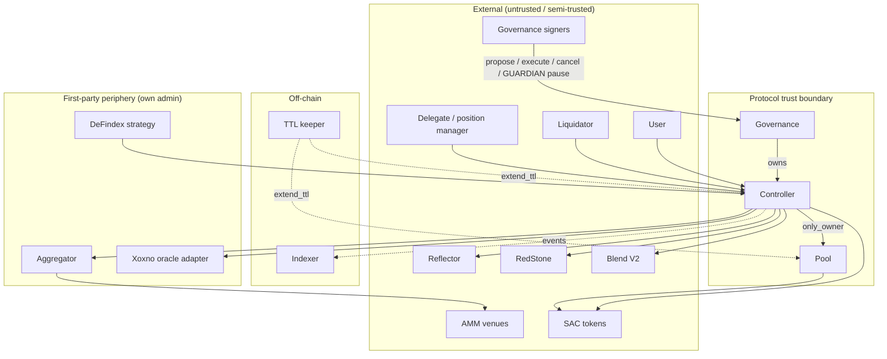

# STRIDE Threat Model — XOXNO Lending (Soroban)

**Last status refresh:** 2026-07-17 (aligned with current controller/governance
source). Narrative findings below; status tags in the summary table win when
prose and code disagree.

**Scope:** core contracts `contracts/governance`, `controller`, `pool`, plus
boundaries to first-party periphery (`aggregator`, `xoxno-oracle-adapter`,
`defindex-strategy`). Adapter signer model, vault harvest, position-manager
registry, and accumulator warrant separate deep dives.

**Trust model:** owner is a governance timelock behind a multisig account;
listed tokens are SACs (no transfer hooks / FoT / rebasing — listing policy);
oracles (Reflector, RedStone, Xoxno adapter) fail-closed on bounds/staleness;
aggregator is first-party but untrusted at the controller boundary
(balance-delta, ADR 0005); AMM venues untrusted; keeper/indexer protocol-operated.

---

## Status at a glance

| ID | Severity | Status | One-line |
|----|----------|--------|----------|
| Spoof.1 | Low | **Accepted** / mitigated for anchored | Single-source markets trust one feed + tight sanity band |
| Spoof.2 | Info | **Accepted** | Self-liquidation via second address |
| Tamper.1 | Medium | **Fixed** | Midpoint band capped (`MAX_TOLERANCE`) |
| Tamper.2 | Medium | **Accepted** | Pool `cash` trusts nominal amount; FoT/rebase excluded by listing |
| Tamper.3 | Low | **Open** / partial | Third-party supply can dust-fill collateral slots |
| Tamper.4 | Low | **Mitigated** | Flash loan CEI deviation; flash guard + balance bracket |
| Tamper.5 | Low | **Fixed** | `set_oracle_tolerance` re-validates band (`validate_oracle_tolerance`) |
| Tamper.6 | Low | **Open** | Anchor not checked for self-pointer sentinel (fail-closed) |
| Tamper.7 | Info | **Accepted** | No IRM min-notional; residual only |
| Repudiate.1–5 | Low–Info | **Accepted** / optional events | Prefer envelope attribution or add events later |
| Info.1–2 | Info | **No action** | Public ledger data only |
| DoS.1 | High | **Fixed** | Role revocations non-cancellable |
| DoS.2 | Medium | **Mitigated** | Fail-closed oracle; oracle-free repay; small bad-debt path |
| DoS.3 | — | **Fixed** | `disable_token_oracle` removed |
| DoS.4 | Medium | **Mitigated** | GUARDIAN pause immediate; **unpause is timelocked** `AdminOperation::Unpause` |
| DoS.5 | Low | **Fixed** | `Delegates` TTL renewed with account keys |
| DoS.6 | Low | **Fixed** | Same as Tamper.5 — tolerance validated on setter |
| DoS.7 | Low | **Open** | Large batch / multi-market exit budget |
| DoS.8 | Low | **Mitigated** | TTL bumps + keeper + permissionless renew |
| DoS.9 | Info | **Accepted** | Aggregator whitelist owner-gated, small set |
| Elevation.1 | Low | **Mitigated (ops)** | Constructor allows short delay; mainnet bootstrap + unpause floor |
| Elevation.2 | Low | **Accepted** | Delegate can liquidate managed account when HF < 1 |
| Elevation.3 | Info | **Mitigated** | Slippage gate + scoped invoker auth on swaps |
| Elevation.4 | Info | **Accepted** | Owner holds executor/canceller; separation on delegated grants |

**Open / watch:** DoS.2 (full liquidation isolation), Tamper.3, Tamper.6, DoS.7.
**Do not re-open as open:** Tamper.5, DoS.5, DoS.6 (code fixed).

---

## What are we working on?

Three contracts: **governance → owns → controller → owns → pool.**

- **Governance** — OZ-style timelock; every privileged change is an
  `AdminOperation` after a ledger delay. Roles: PROPOSER, EXECUTOR, CANCELLER,
  plus GUARDIAN / ORACLE for limited **immediate** incident actions. Unpause is
  **not** immediate: `AdminOperation::Unpause` only.
- **Controller** — only user-facing surface: accounts, risk, oracle,
  liquidation, strategies, flash loans, admin config. Owns the pool.
- **Pool** — multi-market liquidity by `HubAssetKey { hub_id, asset }`; all
  mutations `#[only_owner]`.

Happy path: supply → borrow (oracle + HF) → strategies/flash loan →
repay/withdraw → liquidate when HF < 1 → governance propose/execute →
keeper TTL / permissionless `renew_account`, `update_indexes`, `claim_revenue`.

### Data-flow diagram

### Trust boundaries

1. **Protocol** — user/liquidator/delegate input is attacker-controlled;
   `require_auth` before state change.
2. **Governance / timelock** — privileged change; validation in
   `governance/src/validate/` before controller owner setters. GUARDIAN pause
   is the main non-timelocked global brake; unpause is timelocked.
3. **Oracle** — Reflector / RedStone / Xoxno; `PrimaryWithAnchor` needs non-spot
   primary + different provider/contract; `Single` allows spot with ≤10%
   sanity. Fail-closed on read.
4. **Swap / Blend** — opaque swap bytes + balance delta; venues untrusted;
   Blend pools governance-approved.
5. **Delegate / position manager** — powerful once granted; still under risk
   gates and flash guard.
6. **Accumulator** — misconfig can lock/divert fees.
7. **Off-chain** — indexer event fidelity; keeper uptime for archival.

---

## What can go wrong?

### STRIDE reminders

| Letter | Meaning |
|--------|---------|
| **S**poofing | Impersonation / fake identity |
| **T**ampering | Unauthorized data or code change |
| **R**epudiation | Deny an action happened |
| **I**nfo disclosure | Excess exposure of private data |
| **D**oS | Availability impact |
| **E**levation | Gain privileges without grant |

### Threat table

| Threat | Issues |
| --- | --- |
| **S**poofing | **Spoof.1** — [Low] `Single` market: compromised provider can return in-bounds wrong price. Defense: positivity, freshness, ≤10% sanity band. Anchored markets: non-spot primary + cross-provider. `governance/src/validate/oracle_config.rs`, `common/src/validation.rs`.    **Spoof.2** — [Info] Self-liquidation via a second address the owner controls. `positions/liquidation/`. |
| **T**ampering | **Tamper.1** — [Medium] **Fixed.** Midpoint can shift with in-band primary; `MAX_TOLERANCE` caps band. `oracle/tolerance.rs`, `common/src/constants/shared.rs`.    **Tamper.2** — [Medium] `supply` / `repay` / `add_rewards` credit `cash` from nominal amount (no receive measure). FoT/rebase excluded by listing. `pool/src/lib.rs`.    **Tamper.3** — [Low] Third-party supply into matching-spoke account can dust-fill slots / restamp risk params.    **Tamper.4** — [Low] Flash loan loads market cache before callback, saves after (CEI deviation). Mitigated by controller flash guard + balance checks.    **Tamper.5** — [Low] **Fixed.** `set_oracle_tolerance` calls `validate_oracle_tolerance` before store (`config/oracle.rs`).    **Tamper.6** — [Low] Anchor not asserted against self-pointer sentinel (primary is). Fail-closed rather than silent misprice.    **Tamper.7** — [Info] No explicit IRM min-notional; theoretical residual at extreme low notional. |
| **R**epudiation | **Repudiate.1** — [Info] Position events omit acting caller (owner vs delegate vs PM).   **Repudiate.2** — [Low] Delegate add/remove may lack dedicated events.   **Repudiate.3** — [Low] Pause events may omit actor.   **Repudiate.4** — [Low] `OperationScheduled` omits proposer.   **Repudiate.5** — [Info] `executor = None` leaves open execute without invoker stamp. |
| **I**nfo | **Info.1–2** — [Info] Price legs and positions are public ledger state; views bounded (`MAX_VIEW_INPUTS`). |
| **D**oS | **DoS.1** — [High] **Fixed.** Role revocations non-cancellable; canceller cannot veto own removal.    **DoS.2** — [Medium] One stale/reverting feed blocks risk-gated paths for multi-asset accounts. Repay + debt-free withdraw oracle-free; small bad-debt clean path exists (ADR 0011).    **DoS.3** — **Fixed by removal.** No `disable_token_oracle`; wind-down uses spoke pause/freeze.    **DoS.4** — [Medium] **Updated model.** GUARDIAN can pause immediately (incident brake). Resume is **timelocked** `AdminOperation::Unpause` — not an owner-immediate unpause. Residual: compromised GUARDIAN can halt; resume still needs proposer + delay + execute. Compromised owner multisig still controls the long game.    **DoS.5** — [Low] **Fixed.** `Delegates(account_id)` renewed in account TTL path (`storage/account.rs`).    **DoS.6** — [Low] **Fixed.** Same validation as Tamper.5; inverted/zero band rejected on setter (governance path also validates).    **DoS.7** — [Low] Large multi-market positions may hit ledger budget on batch exits.    **DoS.8** — [Low] Persistent keys freeze if TTL lapses; keeper + renew mitigate.    **DoS.9** — [Info] Aggregator whitelist unbounded in code; owner-gated and policy-small. |
| **E**levation | **Elevation.1** — [Low] Constructor allows `min_delay = 1`. Ops: mainnet bootstrap while paused + delay floor before go-live ([DEPLOYMENT.md](./DEPLOYMENT.md) §3).    **Elevation.2** — [Low] Delegate can liquidate managed account when HF < 1.    **Elevation.3** — [Info] Aggregator / venue underdelivery bounded by slippage + scoped token pull.    **Elevation.4** — [Info] Owner holds executor + canceller; separation applies to delegated grants. |

---

## What are we going to do about it?

| Threat | Treatment |
| --- | --- |
| **S**poofing | **Spoof.1** — Anchored markets mitigated; `Single` accepted with tight band + listing discipline. Adapter N-of-M is a separate trust root.   **Spoof.2** — Accepted (economically neutral to protocol). |
| **T**ampering | **Tamper.1** — Fixed via tolerance cap.   **Tamper.2** — Accepted (listing policy).   **Tamper.3** — Open option: restrict third-party supply to assets already held.   **Tamper.4** — Mitigated by flash guard; optional pool-level flag for depth.   **Tamper.5 / DoS.6** — **Fixed** in code; keep regression tests.   **Tamper.6** — Optional: assert anchor ≠ asset.   **Tamper.7** — Accepted 2026-07-09. |
| **R**epudiation | Prefer tx envelope attribution; emit leaner events only where indexer cost is justified. |
| **I**nfo | No action. |
| **D**oS | **DoS.1 / DoS.3 / DoS.5 / DoS.6** — Fixed.   **DoS.2** — Mitigated; fuller per-leg isolation still a design tradeoff (manipulation vs liveness).   **DoS.4** — Design: fail-safe GUARDIAN pause + timelocked unpause. Ops: guardian key custody + multisig owner.   **DoS.7** — Bound batches / chunk exits.   **DoS.8** — Keeper + TTL policy.   **DoS.9** — Accepted. |
| **E**levation | **Elevation.1** — Ops bootstrap (DEPLOYMENT §3).   **Elevation.2–4** — Accepted or mitigated as above. |

---

## Did we do a good job?

- Data-flow still concentrates findings on oracle, governance roles, strategies,
  and delegation — pool stays behind `#[only_owner]`.
- High (DoS.1) and prior medium band issues are closed or accepted with policy.
- **2026-07-17 code sync:** Tamper.5 / DoS.6 and DoS.5 marked Fixed; DoS.4
  rewritten for GUARDIAN pause + timelocked Unpause (docs no longer claim
  owner-immediate unpause).
- **2026-07-09:** Tamper.7 and DoS.9 accepted after external-audit cross-check.
- Re-run or delta-review when oracle composition, role set (GUARDIAN),
  strategies/aggregator, position managers, or periphery (defindex,
  accumulator) change.
