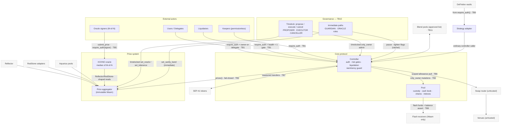
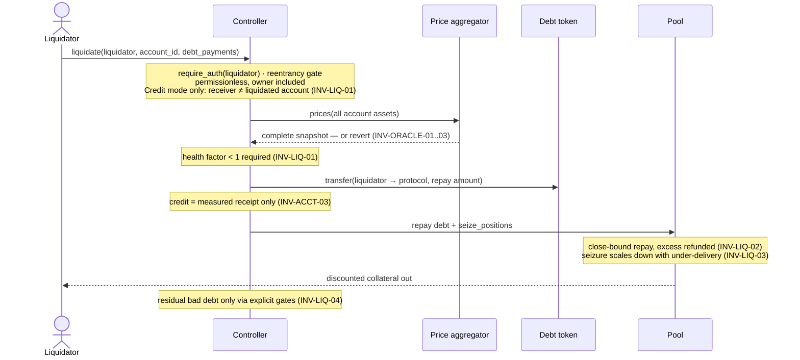
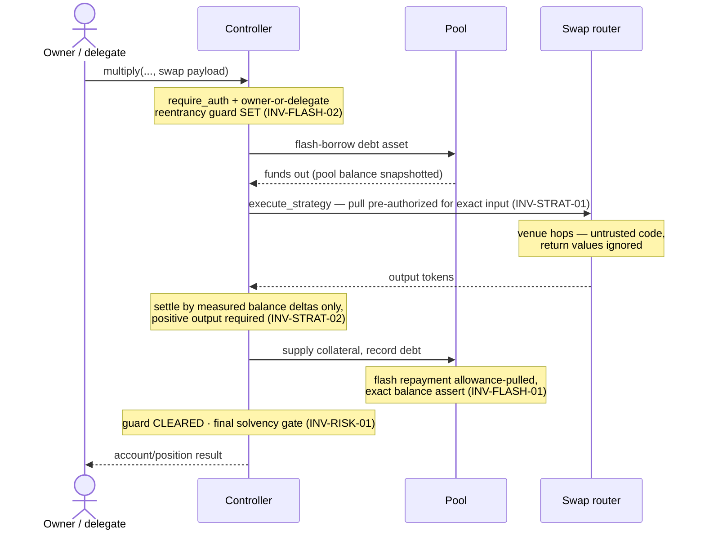

# XOXNO Lending STRIDE Threat Model

This document captures a Soroban-specific STRIDE threat model for the on-chain
contracts in `contracts/`, following the
[Stellar Foundation STRIDE template](https://developers.stellar.org/docs/build/security-docs/threat-modeling/STRIDE-template).

It complements, and cross-references, the repository's standing security
documentation:

- [Architecture](docs/reference/architecture.md)
- [Runtime invariants](docs/reference/invariants.md) (`INV-*` identifiers below)
- [Threat model narrative](docs/explanation/threat-model.md)
- [Decision records](docs/explanation/decisions/README.md) (`ADR-*` references below)

---

## What are we working on?

XOXNO Lending is an over-collateralized money market on Stellar Soroban. A
single custody pool holds liquidity for many isolated markets; a controller is
the only mutator of pool accounting and enforces authorization, price
validity, and post-operation solvency; a governance timelock owns the
controller and the price system; prices fail closed.

### Scope

| Contract | Path | Role |
|---|---|---|
| Governance | `contracts/governance` | Timelock root: typed proposal validation, raw execution, roles, guardian ratchet, recovery, deterministic deploys of controller and price aggregator |
| Controller | `contracts/controller` | User-facing lending state machine: accounts, positions, risk gates, liquidation, flash loans, swap strategies, Blend migration, admin surface |
| Pool | `contracts/pool` | Custody and per-market accounting (cash, scaled shares, indexes, revenue); controller-only mutation |
| Price aggregator | `contracts/price-aggregator` | Validated price snapshots: per-source reads, staleness, dual-source tolerance and midpoint blending, sanity bands |
| XOXNO oracle | `contracts/xoxno-oracle` | First-party M-of-N signer median oracle with a Reflector-compatible read interface |
| Swap aggregator | `contracts/swap-aggregator` | Untrusted route executor: compact instruction payloads over registries, multi-venue hops, fee accounting |
| DeFindex strategy | `contracts/defindex-strategy` | Adapter that lets external DeFindex vaults hold supply-only lending positions through ordinary controller rules |
| Position NFT | `contracts/position-nft` | Account-ownership authority: one sequential-id, OZ-enumerable token per controller account (token id == account id); mint/burn require the controller's authorization, `owner_of` is a public read, transfer is ordinary holder-authorized NFT semantics the controller does not gate |

Shared arithmetic, types, and validation live in `common/`; public client
interfaces live in `interfaces/`. Mock contracts and the test harness are out
of scope for deployment but in scope for the release-artifact leakage threat
(Elevation.8).

### Assets to protect

- Supplier claims and pool cash per market (custody in the pool contract).
- Borrower collateral and account authority (owner and delegate boundaries).
- Market accounting integrity: supply/debt indexes, scaled share totals,
  revenue entitlement, reserves, backing.
- Price integrity used for solvency, borrowing capacity, and liquidation.
- Governance authority: timelock state, role assignments, delay configuration,
  upgrade capability.
- Protocol liveness: liquidation availability, exit paths during halts,
  governance recovery from lost keys.
- Fee balances and referral entitlements held by the swap aggregator.
- Oracle feed integrity in the XOXNO oracle (signer set, threshold, freshness
  windows).

### Actors and privilege hierarchy

| Actor | Set by | Powers |
|---|---|---|
| **Governance owner** | Governance `__constructor` (`contracts/governance/src/access.rs`); two-step `transfer_ownership` thereafter (timelocked, Sensitive tier) | Ownable owner of the governance contract; initially holds all five operational roles; only identity allowed to propose governance ownership transfer, deploy the controller/price aggregator, and trigger canceller recovery |
| **PROPOSER** | Timelocked `GrantGovRole` | Schedules typed `AdminOperation`s (`propose`); cannot propose revocation of itself or the owner |
| **EXECUTOR** | Timelocked `GrantGovRole` | Optional execution gate. When an executor is named it must sign; when `None` is passed, execution of a ready operation is permissionless |
| **CANCELLER** | Timelocked `GrantGovRole`; recoverable via canceller reset | Cancels scheduled operations before execution; cannot cancel recovery operations or its own revocation; cannot simultaneously hold EXECUTOR (`require_executor_canceller_separation` in `contracts/governance/src/access.rs`) |
| **GUARDIAN** | Timelocked `GrantGovRole`; owner may revoke immediately | Immediate protocol pause, immediate tightening of spoke asset flags, hub/spoke creation. Cannot unpause or relax flags |
| **ORACLE role** | Timelocked `GrantGovRole`; owner may revoke immediately | Immediate sanity-band updates on the price aggregator. The write is a **tighten-only ratchet**: `set_sanity_band` (`contracts/price-aggregator/src/admin.rs:197`) rejects any widening with `SanityBandMustTighten`, so this role can narrow a band (a fail-closed per-asset kill switch) but never loosen the backstop. Widening requires the timelocked `ConfigureAssetOracle` |
| **Account owner** | Position-NFT `owner_of(account_id)` (`contracts/position-nft`) — minted to the creator at account creation; thereafter whoever holds the token, since transfer is a standard OZ NFT operation the controller does not gate | Full authority over its account: borrow, withdraw, delegate management, renewal |
| **Delegate** | Account owner (`add_delegate`) **and** governance (`set_position_manager`) | Owner-equivalent position authority, only while both listed on the account, globally active as a position manager, and the account's position NFT is still held by the address that granted the delegation (`is_owner_or_delegate` in `contracts/controller/src/account.rs`) |
| **Liquidator** | Anyone, including the account owner | Repays unhealthy debt for discounted collateral |
| **Keeper** | Anyone | Permissionless maintenance: index accrual, revenue claim to treasury path, threshold refresh, recapitalization. Controller account renewal is **not** a keeper power — `renew_account` requires the account owner (`contracts/controller/src/account.rs`). The position NFT's own `renew` is permissionless, but it only extends the token's `Owner` entry |
| **Oracle signer** | XOXNO oracle owner (`add_signer`/`remove_signer`) | Submits signed price observations; median of the freshest M-of-N submissions becomes the feed value |
| **XOXNO oracle owner** | Oracle `__constructor`; two-step Ownable transfer | Manages signers, threshold, feeds, freshness windows, resolution; can upgrade the oracle Wasm immediately |
| **Router owner** | Router `__constructor`; two-step Ownable transfer | Sets static/referral fees (capped), fee whitelist, sweeps non-fee balances, upgrades the router Wasm immediately |
| **DeFindex vault** | External DeFindex deployment | Calls the strategy adapter; owns (indirectly) one supply-only controller account per vault address |
| **Flash receiver / venues / tokens** | Attacker-choosable | Untrusted code executed inside protocol transactions |

> **The Sensitive tier is currently a one-minute delay, not seven days.**
> `TIMELOCK_SENSITIVE_MIN_DELAY_LEDGERS` is **12 ledgers (about one minute)**
> in `contracts/governance/src/constants.rs`. The in-code comment marks the
> value temporary until audits conclude; the intended production value is
> 120_960 ledgers (about 7 days). Every mitigation in this document that rests
> on "Sensitive-tier timelock" — Wasm upgrades, ownership transfers, the
> price-aggregator repoint, position-manager changes — is therefore backed by a
> one-minute review window today. Restoring 120_960 requires a
> governance-executed `UpgradeGov` operation and must happen before mainnet
> funding.

### Trust boundaries

1. **TB1 — User ↔ Controller** — every user entrypoint takes an explicit caller
   address (`caller`, `liquidator`, `payer`, or `from`) and requires its
   authorization; risk-increasing account actions
   additionally require owner-or-delegate authority (INV-AUTH-02).
2. **TB2 — Controller ↔ Pool** — the pool's mutating interface is entirely
   `#[only_owner]` and the owner is the controller (`__constructor` and the
   `LiquidityPoolInterface` impl in `contracts/pool/src/lib.rs`, ADR-0001). The
   controller is the sole path from user intent to custody.
3. **TB3 — Controller ↔ Price aggregator** — the controller consumes complete,
   validated snapshots; any missing, stale, out-of-band, or disagreeing
   required price reverts the mutation (INV-ORACLE-01..03, ADR-0005).
4. **TB4 — Price aggregator ↔ External sources** — Reflector, RedStone-style
   adapters, Aquarius, and the XOXNO oracle are availability and integrity
   boundaries; admission is governed (ADR-0014).
5. **TB5 — Signers ↔ XOXNO oracle** — individually authenticated submissions,
   aggregated by median at a configured threshold with monotonic package
   timestamps and skew/freshness bounds (`contracts/xoxno-oracle/src/submit.rs`).
6. **TB6 — Controller ↔ Swap router and venues** — the router is untrusted: pull
   authority is scoped to the stated input, return values are ignored, and
   settlement uses measured balance deltas (INV-STRAT-01/02, ADR-0011).
   Inside the router, venues are equally untrusted and the payload registries
   are attacker-supplied (ADR-0018).
7. **TB7 — Controller ↔ Token contracts** — transfers are credited by measured
   receipt, never by requested amount (INV-ACCT-03, ADR-0013).
8. **TB8 — Controller/Pool ↔ Flash receiver** — cash `flash_loan` requires deployed
   Wasm, allowance-pulled principal plus fee, and exact pool balance
   assertions (INV-FLASH-01/02, ADR-0010). `flash_position` shares the Wasm
   and reentrancy wall but **does not repay**: it mints strategy debt, credits
   measured collateral, and requires solvency (INV-STRAT-04, ADR-0020).
9. **TB9 — DeFindex vault ↔ Strategy adapter ↔ Controller** — the adapter is an
   ordinary controller caller; a vault's authority is limited to the single
   account the adapter binds to that vault address.
10. **TB10 — Governance ↔ Controller / Price aggregator** — ordinary administration
    is typed, validated at proposal, delayed, and bound to its payload;
    emergency power can only tighten (ADR-0006, ADR-0007).
11. **TB11 — Blend pool ↔ Controller** — position migration only against
    governance-approved Blend pools (`approve_blend_pool`).
12. **TB12 — Stored state ↔ Runtime** — persistent entries follow a renewal
    lifecycle; instance state is renewed on privileged calls; account renewal
    is available to the owner (INV-STOR-01).
13. **TB13 — Controller ↔ Position NFT** — the position NFT (`contracts/position-nft`)
    is the account-ownership authority: `mint` and `burn` require the
    controller's authorization, but `owner_of` is a public read and standard
    OZ `transfer` is holder-authorized, entirely outside the controller's
    control. The controller never caches ownership — `storage::account_owner`
    calls `owner_of` live on every account access — so a transfer takes effect
    immediately and lazily revokes the prior owner's delegate grants
    (`DelegateGrant.granted_by`, filtered in `get_delegates`,
    `contracts/controller/src/storage/account.rs`).
    Because ownership of the token *is* ownership of the account, standard OZ
    `approve`/`approve_for_all` are not scoped to "move this collectible" —
    they hand the approved address the ability to take the entire lending
    position (collateral, debt, withdraw rights) via `transfer_from`. The
    accepted mitigation is loud, explicit warning at every wallet/front-end
    approval surface, not an on-chain restriction (`docs/explanation/threat-model.md`,
    Controller ↔ Position NFT boundary).

### High-level dataflow

```mermaid
flowchart TB
  subgraph ACTORS[External actors]
    U["Users / Delegates"]
    LQ["Liquidators"]
    KP["Keepers (permissionless)"]
    SG["Oracle signers (M-of-N)"]
  end

  subgraph GOV["Governance — TB10"]
    G["Timelock: propose / execute / cancel<br/>PROPOSER · EXECUTOR · CANCELLER"]
    GR["Immediate paths<br/>GUARDIAN · ORACLE roles"]
  end

  subgraph CORE["Core protocol"]
    C["Controller<br/>auth · risk gates · liquidation<br/>reentrancy guard"]
    P["Pool<br/>custody · cash book · shares · indexes"]
  end

  subgraph PRICE["Price system"]
    PA["Price aggregator<br/>(immutable Wasm)"]
    XO["XOXNO oracle<br/>median of M-of-N"]
  end

  RF["Reflector"]:::ext --> PA
  RS["RedStone adapters"]:::ext --> PA
  AQ["Aquarius pools"]:::ext --> PA
  SG -- "submit_price · require_auth(signer) · TB5" --> XO
  XO -- "Reflector/RedStone-shaped reads" --> PA

  U -- "require_auth + owner-or-delegate · TB1" --> C
  LQ -- "require_auth + health < 1 gate · TB1" --> C
  KP -- "require_auth · TB1" --> C

  G -- "timelocked only_owner admin" --> C
  G -- "timelocked set_oracle / set_tolerance" --> PA
  GR -- "pause · tighten flags (ratchet)" --> C
  GR -- "set_sanity_band (immediate)" --> PA

  C -- "only_owner mutations · TB2" --> P
  C -- "prices() · fail-closed · TB3" --> PA
  C -- "scoped allowance pull · TB6" --> SW["Swap router (untrusted)"]:::ext
  SW --> V["Venues (untrusted)"]:::ext
  P -- "flash funds + balance assert · TB8" --> FR["Flash receivers (Wasm only)"]:::ext
  C <-- "measured transfers · TB7" --> TK["SEP-41 tokens"]:::ext
  BL["Blend pools (approved list) · TB11"]:::ext <--> C

  DF["DeFindex vaults"]:::ext -- "from.require_auth() · TB9" --> DS["Strategy adapter"]
  DS -- "ordinary controller caller" --> C

  classDef ext fill:#f6f6f6,stroke:#999,stroke-dasharray: 3 3;
```

Off-chain services (keeper bots, lending exporter, oracle submitter infrastructure, deployment tooling) are out of scope and appear only as the external actors above.

### Key flows in sequence

**Liquidation (I5)** — the boundary crossings a reviewer must trace:

```mermaid
sequenceDiagram
  actor L as Liquidator
  participant C as Controller
  participant PA as Price aggregator
  participant T as Debt token
  participant P as Pool
  L->>C: liquidate(liquidator, account_id, debt_payments)
  Note over C: require_auth(liquidator) · reentrancy gate<br/>permissionless, owner included<br/>Credit mode only: receiver ≠ liquidated account (INV-LIQ-01)
  C->>PA: prices(all account assets)
  PA-->>C: complete snapshot — or revert (INV-ORACLE-01..03)
  Note over C: health factor < 1 required (INV-LIQ-01)
  C->>T: transfer(liquidator → protocol, repay amount)
  Note over C: credit = measured receipt only (INV-ACCT-03)
  C->>P: repay debt + seize_positions
  Note over P: close-bound repay, excess refunded (INV-LIQ-02)<br/>seizure scales down with under-delivery (INV-LIQ-03)
  P-->>L: discounted collateral out
  Note over C: residual bad debt only via explicit gates (INV-LIQ-04)
```

**Flash-loan-backed strategy (`multiply`, I7 + I8)** — the guard window and
untrusted-router settlement:

```mermaid
sequenceDiagram
  actor A as Owner / delegate
  participant C as Controller
  participant P as Pool
  participant R as Swap router
  A->>C: multiply(..., swap payload)
  Note over C: require_auth + owner-or-delegate<br/>reentrancy guard SET (INV-FLASH-02)
  C->>P: flash-borrow debt asset
  P-->>C: funds out (pool balance snapshotted)
  C->>R: execute_strategy — pull pre-authorized for exact input (INV-STRAT-01)
  Note over R: venue hops — untrusted code,<br/>return values ignored
  R-->>C: output tokens
  Note over C: settle by measured balance deltas only,<br/>positive output required (INV-STRAT-02)
  C->>P: supply collateral, record debt
  Note over P: flash repayment allowance-pulled,<br/>exact balance assert (INV-FLASH-01)
  Note over C: guard CLEARED · final solvency gate (INV-RISK-01)
  C-->>A: account/position result
```

### Interaction inventory

"Pause" column: `P` = blocked by global pause (`#[when_not_paused]`), `–` =
callable while paused (safe-exit or emergency path).

| # | Interaction | Mutates | Auth | Pause | Trust boundary crossed |
|---|---|---|---|---|---|
| I1 | Anyone → `supply` (third-party supply only tops up an existing position, INV-AUTH-03) | Yes | `require_auth(caller)` | P | User ↔ Controller, Controller ↔ Token/Pool |
| I2 | Owner/delegate → `borrow` | Yes | `require_auth` + owner-or-delegate + post-op risk gates | P | User ↔ Controller, Controller ↔ Pool/Token |
| I3 | Owner/delegate → `withdraw` | Yes | `require_auth` + owner-or-delegate + post-op risk gates | – | User ↔ Controller, Controller ↔ Pool/Token |
| I4 | Anyone → `repay` | Yes | `require_auth(caller)` (permissionless third-party repay) | – | User ↔ Controller, Controller ↔ Token/Pool |
| I5 | Liquidator → `liquidate` | Yes | `require_auth` + health < 1 (permissionless, owner included) + seize-receiver ≠ liquidated account | – | Liquidator ↔ Controller, Controller ↔ Pool/Token |
| I6 | Anyone → `clean_bad_debt` | Yes | `require_auth(caller)` + bad-debt gates | – | Keeper ↔ Controller, Controller ↔ Pool |
| I7 | Anyone → `flash_loan` | Yes | `require_auth` + Wasm receiver + reentrancy guard | P | Controller/Pool ↔ Flash receiver, Pool ↔ Token |
| I8 | Owner/delegate → strategies (`multiply`, `flash_position`, `swap_debt`, `swap_collateral`, `repay_debt_with_collateral`) | Yes | `require_auth` + owner-or-delegate + reentrancy gate + final solvency gate | P | Controller ↔ Router/Venues/Token/Pool/Wasm receiver |
| I9 | Owner/delegate → `migrate_from_blend` | Yes | `require_auth` + approved Blend pool + reentrancy gate | P | Controller ↔ Blend pool/Token/Pool |
| I10 | Keeper → `update_indexes`, `claim_revenue`, `update_account_threshold` | Yes | `require_auth(caller)`; permissionless | P | Keeper ↔ Controller, Controller ↔ Pool |
| I11 | Keeper → `recapitalize` | Yes | `require_auth(payer)`; bounded by backing shortfall (INV-ACCT-04) | – | Keeper ↔ Controller, Controller ↔ Token/Pool |
| I12 | Account owner → `renew_account`, `remove_delegate` | Yes | `require_auth` + owner-only | – | User ↔ Controller storage |
| I13 | Account owner → `add_delegate` | Yes | `require_auth` + owner-only | P | User ↔ Controller storage |
| I14 | Anyone → controller/pool view methods | No protocol state; price-reading views extend the aggregator's instance TTL | None | – | Caller ↔ storage |
| I15 | PROPOSER → `governance.propose(op, salt)` | Yes | `require_auth` + PROPOSER role + typed per-op validation | – | Governance internal |
| I16 | EXECUTOR/anyone → `governance.execute` (raw, external target) | Yes | Optional executor auth; payload-identity hash; readiness + expiry; delete-on-execute | – | Governance ↔ Controller / Price aggregator |
| I17 | EXECUTOR/anyone → `governance.execute_self` (gov upgrade, roles, delay, ownership, price-aggregator pointer) | Yes | Same as I16, self-target only | – | Governance internal |
| I18 | CANCELLER → `governance.cancel` | Yes | `require_auth` + CANCELLER role; recovery ops and own-revocation not cancellable | – | Governance internal |
| I19 | GUARDIAN → `pause`, `set_spoke_asset_flags` (tighten-only), `create_hub`, `add_spoke` | Yes | `require_auth` + GUARDIAN role; controller enforces flag ratchet | – | Governance ↔ Controller |
| I20 | ORACLE role → `set_sanity_band` | Yes | `require_auth` + ORACLE role; no timelock, but tighten-only — widening reverts with `SanityBandMustTighten`, and requires the timelocked `ConfigureAssetOracle` | – | Governance ↔ Price aggregator |
| I21 | Owner → `revoke_role_immediate` (GUARDIAN/ORACLE only) | Yes | `#[only_owner]` | – | Governance internal |
| I22 | Owner → `propose_canceller_reset`; anyone → `execute_canceller_reset` | Yes | Owner proposes; Recovery-tier delay (≥ ~30 days); non-cancellable | – | Governance internal |
| I23 | Owner → `deploy_controller` / `deploy_price_aggregator` (once each) | Yes | `#[only_owner]`; constructor wires ownership atomically | – | Governance ↔ Soroban deployer |
| I24 | Controller → pool mutations — all 14 `#[only_owner]` entrypoints of `contracts/pool/src/lib.rs`: `create_market`, `update_params`, `upgrade`, `supply`, `borrow`, `withdraw`, `repay`, `update_indexes`, `recapitalize`, `flash_loan`, `create_strategy`, `seize_positions`, `net_settle`, `claim_revenue`. `create_strategy` is the lending leg the controller uses for Blend migration | Yes | Pool `#[only_owner]` (owner = controller) | n/a | Controller ↔ Pool |
| I25 | Controller → `price_aggregator.prices()` | TTL only | None; the call extends the aggregator's instance TTL and writes no protocol state, so it needs a write footprint. The controller enforces fail-closed consumption | n/a | Controller ↔ Price aggregator |
| I26 | Controller → `router.execute_strategy` | Yes (router-local) | Scoped pre-authorized pull from controller; deltas measured by controller | n/a | Controller ↔ Router ↔ Venues |
| I27 | Signer → `xoxno_oracle.submit_price(s)` | Yes | `require_auth(signer)` + registered-signer check + freshness/monotonicity/skew bounds | – | Signers ↔ XOXNO oracle |
| I28 | XOXNO oracle owner → signer/feed/threshold/windows admin + `upgrade` | Yes | `#[only_owner]` (immediate, no timelock) | – | Owner ↔ XOXNO oracle |
| I29 | Router owner → fees, whitelist, referrals, `sweep_balance`, `upgrade` | Yes | `#[only_owner]` (immediate, no timelock); fees capped by `FEE_CAP` | – | Owner ↔ Router |
| I30 | DeFindex vault → strategy adapter `deposit` / `withdraw` / `harvest` (`balance` is an unauthenticated read) | Yes | `from.require_auth()` on the three mutators; adapter maps one controller account per vault address | – | Vault ↔ Adapter ↔ Controller |
| I31 | Ownership transfers (governance, controller, router, XOXNO oracle) | Yes | Two-step transfer + acceptance; governance and controller transfers are timelocked Sensitive operations. The **pool has no ownership-transfer path at all**: `__constructor` sets the owner once (`contracts/pool/src/lib.rs`) and neither `contracts/pool/src/` nor `interfaces/pool/src/` exposes `transfer_ownership`, `accept_ownership`, or any other Ownable transfer entrypoint, so the pool owner can only change by upgrading the pool Wasm | – | Cross-contract authority |
| I32 | Upgrades: controller, pool, governance, position NFT (timelocked); the router is deliberately **outside governance** — a utility contract whose `upgrade` is owner-immediate under its multisig Ledger owner, with no timelocked path (see threat-model.md); XOXNO oracle owner-immediate. The position NFT is upgradeable only through the controller's `#[only_owner]` `upgrade_position_nft`, proposed as the Sensitive-tier `UpgradePositionNft` operation. The price aggregator has **no upgrade entrypoint and no ownership transfer** — replacement means deploying a new aggregator and repointing via the timelocked `SetPriceAggregator` operation | Yes | Timelock Sensitive tier or `#[only_owner]`; controller upgrade forces pause | – | Governance/Owner ↔ Wasm store |

---

## What can go wrong?

### STRIDE reminders

| Threat | Definition | Question |
|---|---|---|
| **S**poofing | Impersonating another user or component | Is the caller who they say they are? |
| **T**ampering | Unauthorized alteration of data or code | Has state, a price, or code been modified outside the rules? |
| **R**epudiation | Denying an action without evidence to the contrary | Can operators and users prove what happened? |
| **I**nformation Disclosure | Over-sharing data expected to be private | Is anything exposed that enables an attack? |
| **D**enial of Service | Degrading availability | Can someone stop supply, exit, or liquidation? |
| **E**levation of Privilege | Gaining powers beyond those granted | Can a role reach beyond its intended boundary? |

### Severity rubric

Ratings are derived, not asserted. Likelihood and impact use these definitions;
severity is read off the matrix. **Inherent** assumes the code-enforced
controls do not exist; **Residual** assumes they do, plus the documented
operational controls (residuals that lean on an operational control say so).

| Likelihood | Definition |
|---|---|
| High | Reachable by any unprivileged actor under normal market conditions |
| Medium | Needs one attainable precondition: a single dependency failure, a single misconfiguration, or a thin-liquidity market state |
| Low | Needs privileged-key compromise (hardened custody assumed), multi-party collusion, or an engineered extreme state |

| Impact | Definition |
|---|---|
| High | Protocol-wide fund loss, insolvency, or irreversible authority loss |
| Medium | Single-market loss, or temporary protocol-wide liveness failure |
| Low | Bounded, account-local, or fully recoverable |

| | Impact Low | Impact Medium | Impact High |
|---|---|---|---|
| **Likelihood High** | Medium | High | Critical |
| **Likelihood Medium** | Low | Medium | High |
| **Likelihood Low** | Low | Low | Medium |

Status tags: ✅ code-enforced · ⚙ operational · ◻ accepted.

### Threat table

| Threat | Issues |
|---|---|
| **Spoofing** | **Spoof.1** — A compromised privileged key (governance owner, PROPOSER/EXECUTOR/CANCELLER/GUARDIAN/ORACLE, router owner, XOXNO oracle owner, oracle signer) acts as its role. *Inherent: M×H = High. Residual: Medium (⚙).* Interactions: I15–I23, I27–I29, I31, I32. |
| | **Spoof.2** — Deployment-time identity confusion: a wrong `admin` constructor argument or a deployment that skips the governance deploy path yields a mis-owned contract. Every contract sets its authority in `__constructor` (atomic with deploy) — an owner for governance, controller, pool, aggregators, and oracle; the controller address for the position NFT; no owner at all for the DeFindex adapter, whose authority is the authenticated caller. Governance deploys the controller and price aggregator itself with `deploy_v2` (`contracts/governance/src/deploy.rs:44` and `:77`), so there is no separate `initialize()` to front-run; the residual risk is purely configuration of standalone deploys (pool via controller is wired automatically; router/oracle/adapter are manual). *Inherent: M×H = High. Residual: Low (✅ + ⚙).* Interaction: I23. |
| | **Spoof.3** — A former or unlisted delegate acts on an account. Delegation requires both account listing and a globally active position manager; either side can kill it (`is_owner_or_delegate` in `contracts/controller/src/account.rs`). A third, implicit kill switch: a `DelegateGrant` is live only while its `granted_by` address still holds the account's position NFT, so transferring the NFT lazily revokes every delegate the prior owner had granted, with no separate revocation call needed. *Inherent: M×H = High. Residual: Low (✅ + ⚙).* Interactions: I2, I3, I8. |
| | **Spoof.4** — A flash "receiver" that is a classic account rather than code, enabling repayment games. `require_wasm_receiver` rejects non-contract receivers; it is defined in `common/src/validation.rs` and called by the controller on both `flash_loan` (`contracts/controller/src/strategies/flash_loan.rs`) and `flash_position` (`contracts/controller/src/strategies/flash_position.rs`), and by the pool (`contracts/pool/src/ops/flash.rs`). Allowance-repayment games apply only to I7; I8 `flash_position` cannot impersonate repayment because it never pulls principal back. *Inherent: H×M = High. Residual: Low (✅).* Interactions: I7, I8. |
| | **Spoof.5** — A caller poses as a DeFindex vault to reach another vault's account. The adapter keys accounts by the authenticated caller address; authority never crosses vault boundaries. *Inherent: H×L = Medium. Residual: Low (✅).* Interaction: I30. |
| **Tampering** | **Tamper.1** — Manipulated, stale, or partially failed external price source moves valuations. Per-leg staleness and validity checks, dual-source tolerance bands with midpoint blending (`blend` in `contracts/price-aggregator/src/engine.rs`), governed sanity bands, and fail-closed consumption bound the damage (INV-ORACLE-01/02, ADR-0004/0005/0014). *Inherent: H×L = Medium. Residual: Low (✅).* Interactions: I25, I20. |
| | **Tamper.2** — A subset of XOXNO oracle signers submits bad prices. Aggregation takes the median of fresh submissions at a configured threshold; submissions must be signer-authenticated, non-future, fresh, and per-signer monotonic (`submit_price` in `contracts/xoxno-oracle/src/submit.rs`). Below-threshold participation produces no aggregate rather than a thin one. *Inherent: M×H = High. Residual: Low (✅, ⚙ threshold > n/2).* Interaction: I27. |
| | **Tamper.3** — Fee-on-transfer, rebasing, or otherwise non-standard tokens deliver less than requested; donations attempt to rewrite accounting. Credit uses measured receipt only, and liquidity checks use the internal cash book, not token balances (INV-ACCT-02/03, ADR-0013). *Inherent: M×H = High. Residual: Low (✅, ⚙ threshold > n/2).* Interactions: I1, I4, I5, I11. |
| | **Tamper.4** — A malicious router or venue overspends input, retains funds, or lies about output. Pull authority is pre-authorized for the exact stated input, return values are ignored, settlement is by balance deltas, residue is returned, and output must be positive and meet minimums (INV-STRAT-01/02, ADR-0011/0018). *Inherent: H×H = Critical. Residual: Low (✅, route quality residual ◻).* Interactions: I8, I26. |
| | **Tamper.5** — A flash-loan callback, flash-position callback, or router callback re-enters monetary paths to observe or mutate intermediate state. A temporary-storage guard (`with_flash_guard` in `contracts/controller/src/storage/account.rs`) is set around the callback and checked at every monetary entrypoint. Eight literal `require_not_flash_loaning` call sites cover 18 entrypoints: 4 position verbs and 7 strategy paths through the shared `require_authorized_caller` wrapper (`contracts/controller/src/risk/validation.rs`), plus 3 liquidation and bad-debt entrypoints and 4 keeper paths that call the guard directly. *Inherent: H×H = Critical. Residual: Low (✅).* Interactions: I7, I8. |
| | **Tamper.6** — Interest-index manipulation through time gaps or extreme rates. Accrual is chunked and monotone with bounded indexes (INV-IDX-01..05, ADR-0016). *Inherent: M×M = Medium. Residual: Low (✅).* Interaction: I10. |
| | **Tamper.7** — Malicious or accidental Wasm upgrade changes protocol behavior. Controller, pool, governance, and position-NFT upgrades are timelocked Sensitive operations; a controller upgrade forcibly re-enters the paused state (`upgrade` in `contracts/controller/src/governance.rs`). The Sensitive floor is currently 12 ledgers (about one minute), so the delay brake is nominal until 120_960 is restored. The price aggregator is immutable (no upgrade entrypoint; replacement only via timelocked `SetPriceAggregator` repoint). Router upgrades are owner-immediate by design: the router is a utility contract operated by a multisig Ledger wallet, and has no governance operation. XOXNO oracle upgrades are owner-immediate — see Elevation.6/7. *Inherent: M×H = High. Residual: Medium (✅ + ⚙).* Interaction: I32. |
| | **Tamper.8** — Blend migration executes against a hostile external pool. Only governance-approved Blend pools are accepted, flows are measured, and the final solvency gate applies. *Inherent: M×M = Medium. Residual: Low (✅).* Interaction: I9. **Tamper.9** — The `FeedNature::Market **Tamper.10** — Admission attestation is point-in-time: `set_oracle` checks the XOXNO oracle's `max_submission_age_seconds()` against the asset's staleness window (`attest_feed` in `contracts/price-aggregator/src/admin.rs:52-63`), but nothing re-attests if the oracle owner later raises that window — the admission invariant silently degrades. *Inherent: M×M = Medium. Residual: Medium (⚙).* Interactions: I25, I28. |Fundamental` tag on RedStone/XOXNO feeds is operator-asserted configuration, not verified on-chain. Tagging a spot market feed `Fundamental` defeats the anti-spot-only smoothing rule (`contracts/price-aggregator/src/validation.rs`), admitting an unsmoothed, manipulable market leg. *Inherent: M×M = Medium. Residual: Medium (⚙).* Interactions: I16, I25. |
| **Repudiation** | **Repudiate.1** — Operators deny configuration or emergency actions. All config/admin paths emit typed events (`contracts/controller/src/events/`), and constructors explicitly emit ownership-transfer events so replay-from-genesis indexers learn initial authority (`init` in `contracts/controller/src/governance.rs`, `__constructor` in `contracts/governance/src/access.rs`). *Inherent: M×M = Medium. Residual: Low (✅).* Interactions: I15–I23, I31, I32. |
| | **Repudiate.2** — Users or liquidators deny position actions. Every mutation requires the actor's signature and emits position/liquidation/strategy events keyed by account; oracle submissions are stored per-signer. A share-credit liquidation writes two accounts, so it emits two position batches (liquidated first, receiver second) and tags their collateral legs distinctly: `LiqSeize` is the debit **gross** of the protocol fee, `LiqCredit` the receiver's credit **net** of it (ADR-0019). One tag carrying both senses would let an observer overstate liquidator proceeds by the fee; `LiquidationEvent.repaid_usd_wad` likewise reports the **measured** receipt, not the planned repayment, so an under-delivering debt token cannot inflate the recorded repayment. *Inherent: M×L = Low. Residual: Low (✅).* Interactions: I1–I11, I27. **Repudiate.3** — The XOXNO oracle emits no events at all (verified: no `contractevent`/`publish` in the crate). Signer rotations, threshold changes, feed remaps, staleness-window edits, upgrades, and every submission are invisible to event-sourced indexers; a signer-set compromise in progress produces no on-chain signal short of polling storage. *Inherent: M×M = Medium. Residual: Medium (⚙ + ◻).* Interactions: I27, I28, I32. |
| **Information Disclosure** | **Info.1** — All state, prices, and pending governance operations are public. Accepted: expected on-chain transparency; no confidentiality assumptions exist. *Inherent: L×L = Low. Residual: Low (◻).* All interactions. |
| | **Info.2** — Public health factors and positions enable liquidation front-running and MEV extraction. Accepted with mitigation: the liquidation curve bounds the bonus and couples repayment to seizure, so racing liquidators compete on speed, not on extractable excess (INV-LIQ-02). *Inherent: L×L = Low. Residual: Low (◻).* Interactions: I5, I14. |
| | **Info.3** — Scheduled timelock operations disclose upcoming parameter changes, enabling positioning ahead of execution. Accepted: the observation window is the point of the timelock. *Inherent: L×L = Low. Residual: Low (◻).* Interactions: I15–I17. **Info.4** — `quotes()` returns the blended midpoint in its payload even when `valid:false` (deviation case). The controller never values a position from `quotes()` — mutating paths read `prices()`, which fails closed inside the aggregator (`fetch_prices`, `contracts/controller/src/external/price_aggregator.rs:20`); `quotes()` reaches only the `get_market_indexes_detailed` view, which forwards the `valid` flag verbatim (`contracts/controller/src/views.rs:181`). An off-chain consumer reading the price field without the flag uses an out-of-tolerance price. *Inherent: M×M = Medium. Residual: Low (◻).* Interactions: I14, I25. |
| **Denial of Service** | **DoS.1** — Price-source outage or one unusable dual-source leg halts valuation-dependent actions **including liquidation** (fail-closed by design). A prolonged outage can delay liquidations and grow bad debt. *Inherent: M×M = Medium. Residual: Medium (◻ + ⚙).* Interactions: I2, I3, I5, I25. |
| | **DoS.2** — A paused debt listing blocks its liquidation leg (ADR-0008); a stuck flag can trap a liquidation path until governance acts. The debt side is opt-in — the pause check iterates only the payments the liquidator named, so a paused debt asset blocks only a liquidation that tries to repay it. Seizure is governed separately by `no_seize`, because seizure is pro-rata over every collateral the account holds: gating it on `paused` would turn one listing-level halt into a protocol-wide liquidation halt for every holder. *Inherent: M×M = Medium. Residual: Medium (◻).* Interactions: I5, I19. |
| | **DoS.3** — Guardian pause plus timelocked unpause means recovery from a false-alarm pause takes at least the configured delay. Intentional ratchet cost (ADR-0007). *Inherent: M×M = Medium. Residual: Low (◻ + ⚙).* Interactions: I16, I19. |
| | **DoS.4** — Governance deadlock through lost keys. Mitigations: the last PROPOSER cannot be revoked, execution can be permissionless when no executor is named, the owner can immediately revoke GUARDIAN/ORACLE, and a non-cancellable Recovery-tier canceller reset (~30-day floor, `TIMELOCK_RECOVERY_MIN_DELAY_LEDGERS = 518_400` in `contracts/governance/src/constants.rs`) restores cancellation capability. *Inherent: M×H = High. Residual: Low (✅).* Interactions: I15–I18, I21, I22. |
| | **DoS.5** — Resource exhaustion: unbounded iteration or oversized payloads. Position counts are capped (`POSITION_LIMIT_MAX` in `common/src/constants/shared.rs`, applied by the controller constructor: 5 supply / 5 borrow), route payloads are parsed with bounds and continuity checks, accrual is chunked, and batch entrypoints iterate only caller-supplied vectors. *Inherent: M×M = Medium. Residual: Low (✅).* Interactions: I1–I11. |
| | **DoS.6** — Persistent-entry TTL expiry archives account or market state. Storage lifecycle renews entries on read/write, instance TTL is renewed on privileged calls, and `renew_account` gives owners an explicit renewal path (INV-STOR-01). *Inherent: M×M = Medium. Residual: Low (✅ + ⚙).* Interaction: I12. |
| | **DoS.7** — XOXNO oracle signer liveness: fewer than `threshold` fresh submissions means the feed goes stale and dependent markets fail closed (a safety choice that becomes an availability incident). *Inherent: M×M = Medium. Residual: Low (✅ + ⚙).* Interactions: I27, I25. |
| | **DoS.8** — Utilization and cash limits block borrows or withdrawals when liquidity is thin; caps admit nothing when set to zero (INV-HALT-03, ADR-0015). Accepted, monitorable. *Inherent: L×L = Low. Residual: Low (◻).* Interactions: I2, I3. |
| | **DoS.9** — Dust griefing: zero-share conversions revert (INV-ACCT-05) and a minimum borrow-collateral floor blocks uneconomic accounts that would be unprofitable to liquidate. *Inherent: H×L = Medium. Residual: Low (✅).* Interactions: I1, I2, I5. **DoS.10** — `renounce_ownership` is exposed on the router (`contracts/swap-aggregator/src/lib.rs`) and the XOXNO oracle (`contracts/xoxno-oracle/src/lib.rs`). A mistaken or coerced renounce permanently freezes signer rotation, feed/staleness configuration, fee configuration, and upgrades for that contract; for the oracle this eventually starves every feed it backs into fail-closed staleness. *Inherent: M×H = High. Residual: Medium (⚙).* Interactions: I28, I29, I31. |
| **Elevation of Privilege** | **Elevation.1** — Governance-owner compromise grants, after the delay, full control: upgrades, oracle configuration, role edits, unpause. The timelock is the only brake; delay tiers are **floors**, and the constructor only requires a nonzero `min_delay` (`require_nonzero_delay` in `contracts/governance/src/timelock/mod.rs`, called from `__constructor` in `contracts/governance/src/access.rs`). A deployment with a small `min_delay` has effectively immediate governance. The shipped Sensitive floor of 12 ledgers means the highest tier is also about one minute today. *Inherent: M×H = High. Residual: Medium (⚙).* Interactions: I15–I17, I23, I31, I32. |
| | **Elevation.2** — Guardian tries to relax protection (unpause, clear flags). The controller enforces the ratchet at the callee: `require_flag_ratchet` rejects any flag relaxation on the guardian's immediate path (`set_spoke_asset_flags` in `contracts/controller/src/config/asset.rs`), and no immediate unpause path exists — `Unpause` is a timelocked operation. The ratchet guards that path only: the timelocked full rewrite `edit_asset_in_spoke` rebuilds the whole listing config from caller arguments and can clear a flag. *Inherent: M×M = Medium. Residual: Low (✅).* Interaction: I19. |
| | **Elevation.3** — Role-boundary erosion inside governance: an EXECUTOR+CANCELLER combination could both push and shield operations. Grants enforce executor/canceller separation; proposers cannot propose revoking themselves or the owner; revocation targets cannot cancel their own revocation; only the owner can propose governance ownership transfer (`require_executor_canceller_separation` in `contracts/governance/src/access.rs`; `propose` and `cancel` in `contracts/governance/src/timelock/lifecycle.rs`). *Inherent: M×M = Medium. Residual: Low (✅).* Interactions: I15, I16, I18. |
| | **Elevation.4** — Delegate escalation: a delegate adding delegates or outliving its mandate. Delegate management is owner-only, and governance can globally deactivate a position manager, instantly disabling all of its delegations. *Inherent: M×M = Medium. Residual: Low (✅).* Interactions: I8, I13. |
| | **Elevation.5** — Permissionless paths creating foreign risk: supplying into someone else's account only tops it up — `require_third_party_existing_supply` (`contracts/controller/src/positions/supply.rs`) limits a non-owner, non-delegate caller to hub assets the account already holds, and the supply guard pins the account's spoke. A caller who passes `account_id = 0` opens a fresh account, but that account is owned by the caller, so no foreign slot is created (INV-AUTH-03); repay/recapitalize/liquidate only reduce risk or restore backing. *Inherent: H×M = High. Residual: Low (✅).* Interactions: I1, I4, I5, I11. |
| | **Elevation.6** — Router-owner powers: fees up to `FEE_CAP`, fee-whitelist edits, sweeping non-fee balances, and **Wasm upgrade — immediate for whoever holds the router's Ownable owner**. Governance has a timelocked route to that upgrade only when the controller is that owner (`AdminOperation::UpgradeSwapAggregator`, `contracts/governance/src/op.rs:315`, reaching the router through `contracts/controller/src/markets.rs:123`); with the `deploy-aggregator` default of a standalone signer, no delayed path exists and the other three powers have no governance path at any ownership. The controller's balance-delta settlement bounds what a malicious router build can steal from a strategy to the stated input of in-flight calls, but an upgraded router is a live trust downgrade for every route executed after it. *Inherent: M×H = High. Residual: Medium (⚙).* Interactions: I26, I29, I32. |
| | **Elevation.7** — XOXNO-oracle-owner powers: signer-set/threshold rotation and immediate Wasm upgrade let the owner fabricate feed values for its feeds. The price aggregator bounds the blast radius: dual-source tolerance disagreement, sanity bands, and staleness checks reject a lying leg where a second independent source is configured (ADR-0004/0014). Feeds configured single-source get no cross-source check at all; their only bound is the sanity band, whose width is capped at admission by `validate_single_source_sanity_band` (`common/src/validation.rs`). That band can be tightened at will by the ORACLE role (I20) but not widened, so the ORACLE role can fail a single-source feed closed but cannot loosen the backstop that bounds the oracle owner. *Inherent: M×H = High. Residual: Medium (⚙).* Interactions: I27, I28, I25. |
| | **Elevation.8** — Test-only entrypoints reaching a release artifact would bypass all governance. Two contracts declare them: the price aggregator exposes `seed_oracle` and `remove_oracle` (`contracts/price-aggregator/src/lib.rs`), and governance exposes `set_controller`, `set_price_aggregator`, and `execute_immediate` (`contracts/governance/src/deploy.rs`, `contracts/governance/src/timelock/testing.rs`). `execute_immediate` is the most dangerous of the set: it applies any `AdminOperation` with zero delay. They are feature-gated, and the release process greps the built artifact's exported ABI rather than trusting feature selection (ADR-0017). The gate covers only `governance.wasm` and `price_aggregator.wasm` (`wasm-testing-abi-check` in `Makefile`) — the other six artifacts are never grepped, so a test-only entrypoint added to another contract would ship unchecked. *Inherent: M×H = High. Residual: Low (✅ + ⚙).* Interaction: I32. |
| | **Elevation.9** — The DeFindex adapter holds owner authority over vault-bound accounts. A compromised or malicious vault is confined to its own adapter account (supply-only positions); it cannot reach other vaults' accounts or borrow. *Inherent: M×M = Medium. Residual: Low (✅).* Interaction: I30. **Elevation.10** — `set_sanity_band` is the only immediate (non-timelocked) privileged path into price behavior (ORACLE role, `contracts/governance/src/timelock/immediate.rs`). A band excluding the current price fails the asset closed at read — an undeclared per-asset kill switch: valuable for emergencies, abusable as instant per-market DoS by a compromised ORACLE key. *Inherent: M×M = Medium. Residual: Medium (⚙, fail-closed bound ✅).* Interactions: I20, I25. |

---

## What are we going to do about it?

Status legend: ✅ enforced in code · ⚙ operational/deployment control · ◻ accepted residual risk.

| Threat | Remediations |
|---|---|
| **Spoof.1** | **R.1 ⚙** Key custody: governance owner should be a multisig-controlled identity; PROPOSER/EXECUTOR/CANCELLER/GUARDIAN/ORACLE keys segregated per function; oracle signers on independent infrastructure. **R.2 ✅** Compromise of a single non-owner role is bounded by design: proposals still wait out the delay, cancellers can veto, guardians can only tighten, oracle signers are outvoted by the median. **R.3 ✅** Owner-held immediate revocation for the two hot roles (GUARDIAN, ORACLE) shortens the exposure window (`revoke_role_immediate`). |
| **Spoof.2** | **R.1 ✅** No `initialize()` pattern exists; every contract fixes its authority in `__constructor`, atomic with deployment. **R.2 ✅** Governance deploys the controller and price aggregator itself with deterministic salts and wires ownership pointers in the same transaction (`contracts/governance/src/deploy.rs`); the controller deploys the pool. **R.3 ⚙** Deployment scripts must verify the owner argument of the standalone deploys (router, XOXNO oracle, DeFindex adapter) against the intended addresses before use. This falls under audit priority 1, "Verify deployment ownership, roles, delay, and active configuration", in [threat-model.md](docs/explanation/threat-model.md); that list does not name the standalone deploys, so the specific check belongs in the deployment runbook. |
| **Spoof.3** | **R.1 ✅** Triple gate: account-listed, globally active position manager, and the grant's stamped owner must still hold the position NFT — checked at every risk-increasing use (INV-AUTH-02). **R.2 ✅** `remove_delegate` works while paused; `set_position_manager(false)` gives governance a global kill switch; transferring the position NFT is a third, automatic kill switch requiring no explicit revocation call. |
| **Spoof.4** | **R.1 ✅** `require_wasm_receiver` plus allowance-based repayment: a receiver cannot fake repayment by pushing tokens, and pool balance assertions catch shortfalls (INV-FLASH-01). **R.2 ✅** The same Wasm check on `flash_position`; repayment impersonation is not in scope because that path never collects principal (INV-STRAT-04). |
| **Spoof.5** | **R.1 ✅** Adapter accounts are keyed by the authenticated caller; stale bindings are reconciled against `account_exists` before reuse (`resolve_vault_account` in `contracts/defindex-strategy/src/lib.rs`). |
| **Tamper.1** | **R.1 ✅** Per-leg validation (staleness, validity, decimals normalization), dual-source tolerance + midpoint blending, sanity bands, fail-closed consumption; one warmed session yields one coherent snapshot per invocation (INV-ORACLE-01..03). **R.2 ✅** Source admission and tolerance edits go through the timelock (`ConfigureAssetOracle`, `EditOracleTolerance`); only sanity-band edits are immediate (ORACLE role). **R.2a ✅** The immediate band write is tighten-only (`SanityBandMustTighten`), so a compromised ORACLE key can fail an asset closed but cannot loosen the backstop that carries single-source and Aquarius-LP feeds; widening requires the timelocked `ConfigureAssetOracle`. The residual is availability, not mispricing — treat the ORACLE key as price-critical custody. **R.3 ⚙** Operate monitoring on source disagreement and staleness; treat sustained deviation alarms as incident triggers. |
| **Tamper.2** | **R.1 ✅** Median-at-threshold aggregation with authenticated, fresh, monotonic submissions; no aggregate below threshold. **R.2 ⚙** Keep `threshold > n/2` of active signers so a minority cannot move the median; distribute signer keys across independent operators. `set_threshold` (`contracts/xoxno-oracle/src/admin.rs`) accepts any value from 1 to the signer count, so the majority rule is operational only and is not enforced on-chain. |
| **Tamper.3** | **R.1 ✅** Measured receipt on every inbound path, internal cash book for liquidity decisions, zero-share rejection, backing-shortfall gate on new supply (INV-ACCT-02..05). **R.2 ✅** Liquidation seizure scales down with measured under-delivery (INV-LIQ-03). |
| **Tamper.4** | **R.1 ✅** Exact-input pre-authorization, ignored return values, balance-delta settlement, residue return, positive-output and min-out enforcement, final solvency gate (INV-STRAT-01/02). **R.2 ✅** The payload parser validates registry bounds, sequencing, token continuity, and split accounting before dispatch (ADR-0018). **R.3 ◻** Route *quality* is not verified on-chain: a valid but economically poor route loses value inside the caller's permitted risk envelope. |
| **Tamper.5** | **R.1 ✅** Shared temporary-storage reentrancy guard set around flash-loan, flash-position, and router callbacks and checked at every monetary entrypoint (`require_not_flash_loaning`). **R.2 ✅** Soroban transaction atomicity rolls back all intermediate state on any failure — the guard defends against *nested entry*, not partial commits. |
| **Tamper.6** | **R.1 ✅** Chunked, monotone, bounded accrual (INV-IDX-01..05); rounding remainders assigned explicitly. **R.2 ✅** Fuzz and formal (Certora) coverage over arithmetic boundaries — see `certora/` and `tests/fuzz`. |
| **Tamper.7** | **R.1 ✅** Sensitive-tier timelock on controller/pool/governance upgrades, with payload identity binding the exact Wasm hash; the price aggregator is immutable by construction and replaceable only through the timelocked `SetPriceAggregator` repoint. **R.2 ✅** Controller upgrade forces the paused state, so post-upgrade activity requires an explicit, delayed unpause. **R.3 ⚙** Router upgrades are owner-immediate by design and have no governance operation: the router is a utility contract held by a multisig Ledger wallet. Hold that key to the same custody standard as governance keys. XOXNO oracle upgrades are owner-immediate with no governance route — accept and monitor them as hot trust (see Elevation.6/7). Verify the deployed owners, do not assume them. |
| **Tamper.8** | **R.1 ✅** Governance-approved Blend pool allowlist; measured token flows; ordinary post-operation risk gates. |
| **Repudiate.1/2** | **R.1 ✅** Typed events on config, position, liquidation, strategy, and deploy actions; constructors emit initial-ownership events for indexers. **R.2 ✅** Liquidation legs are self-describing: `LiqSeize` (gross) and `LiqCredit` (net) are distinct tags, and the headline repayment figure is the measured receipt, so gross/net and planned/delivered cannot be conflated by a reader. Covered by `credit_mode_debits_the_victim_gross_and_credits_the_receiver_net` and `liquidation_event_reports_the_delivered_repayment_not_the_planned_one`. **R.2 ⚙** The lending exporter and monitoring services maintain the off-chain audit trail; alert on admin events that lack a matching operational ticket. A share-credit liquidation emits **two** batches — an exporter that assumes one per liquidation under-reports. |
| **Info.1/3** | **R.1 ◻** Accepted: on-chain transparency and timelock observability are features. Avoid adding event payloads that leak operational key relationships. |
| **Info.2** | **R.1 ◻** Accepted: liquidation competition is intended. **R.2 ✅** The liquidation curve caps bonus extraction and couples repayment to seizure, bounding MEV per liquidation (INV-LIQ-02). |
| **DoS.1** | **R.1 ◻** Fail-closed pricing is a deliberate safety-over-availability choice (ADR-0005). **R.2 ⚙** Operate redundant source monitoring and a runbook for re-establishing a failed leg quickly (timelocked `ConfigureAssetOracle`); sanity-band tightening (immediate) can bound damage while a leg misbehaves. |
| **DoS.2** | **R.1 ◻** Halt-flag semantics are deliberate (ADR-0008), now three independent flags: `frozen` blocks new exposure and preserves exits, `paused` blocks user verbs including a named debt leg, `no_seize` blocks the seizure leg and nothing else. **R.2 ✅** Splitting seizure off `paused` removed the collateral-side blast radius — pausing a widely held collateral no longer makes every holder unliquidatable. Pinned by `a_paused_collateral_can_still_be_seized` and `no_seize_blocks_the_seizure_leg_in_both_modes`. **R.3 ⚙** Residual: pausing a *debt* listing still stops liquidations that repay it, and `no_seize` stops seizure outright — monitor unhealthy positions in listings carrying either flag. |
| **DoS.3** | **R.1 ◻** The ratchet's asymmetry is the control (ADR-0007). **R.2 ⚙** Pre-draft the unpause proposal so the delay clock starts immediately after a false alarm. |
| **DoS.4** | **R.1 ✅** Last-proposer protection, optional-executor permissionless execution, immediate revocation for hot roles, non-cancellable Recovery-tier canceller reset with a ~30-day floor. **R.2 ⚙** Keep at least two independent PROPOSER and CANCELLER identities. |
| **DoS.5** | **R.1 ✅** Position-count limits, payload bounds, chunked accrual, batch sizes bounded by caller input. **R.2 ⚙** Re-verify worst-case liquidation cost against network limits when raising position limits. |
| **DoS.6** | **R.1 ✅** Renewal on read/write plus explicit `renew_account`; instance TTL renewed on privileged calls. **R.2 ⚙** Run a keeper that renews protocol-critical entries on a schedule. |
| **DoS.7** | **R.1 ⚙** Signer-liveness monitoring with paging before the freshness window lapses; keep spare registered signers. **R.2 ✅** Dual-source configuration means one healthy independent leg still fails closed rather than silently serving thin data — the failure is visible, not corrupting. |
| **DoS.8/9** | **R.1 ✅** Caps are literal (zero admits nothing), exits never consume caps (INV-HALT-03); zero-share rejection and the minimum borrow-collateral floor price out dust griefing. |
| **Elevation.1** | **R.1 ⚙** **Deployment checklist item:** set `min_delay` to a real review window (the repository's reference constant is `TIMELOCK_MIN_DELAY_LEDGERS = 34_560` ≈ 2 days; the constructor itself only rejects zero). Verify the deployed value with `get_min_delay` before funding markets. **R.2 ✅** `UpdateGovDelay` can only increase the delay within `TIMELOCK_MAX_DELAY_LEDGERS` (INV-AUTH-05). **R.3 ✅** Governance ownership transfer is itself timelocked, Sensitive-tier, and owner-proposed only, so a stolen proposer key cannot rotate the root. |
| **Elevation.2** | **R.1 ✅** Callee-side ratchet: the controller rejects flag relaxation from any caller; unpause exists only as a timelocked operation. **R.2 ⚙** When editing a listing through the timelocked full rewrite, restate intended halt flags — the rewrite path can clear them (ADR-0007). |
| **Elevation.3** | **R.1 ✅** Executor/canceller mutual exclusion, proposer self-revocation ban, owner-revocation ban, revocation-target cancellation ban. **R.2 ⚙** Periodically review role membership against the operational roster. |
| **Elevation.4** | **R.1 ✅** Owner-only delegate management plus the governance-side position-manager gate; either revocation path is immediate. |
| **Elevation.5** | **R.1 ✅** Third-party supply restricted to existing positions; permissionless paths are risk-reducing by construction (INV-AUTH-03). |
| **Elevation.6** | **R.1 ✅** Fee cap enforced at write time; sweep excludes reserved fee buckets; controller-side delta settlement bounds in-flight exposure to the stated input. **R.2 ⚙** Hold the router Ownable owner to the same custody standard as governance keys. It is a multisig Ledger wallet by design, not the controller and not governance: all ten of the router's owner powers are operational (referrals, fees, whitelist, sweep, upgrade), and a single Ownable owner cannot both serve those and expose `upgrade` to the timelock, since the only timelocked route runs governance → controller → router and needs the controller to pass the router's `#[only_owner]` gate. Monitor router upgrade events. |
| **Elevation.7** | **R.1 ✅** Aggregator-side independence: dual-source tolerance, sanity bands, staleness. **R.2 ⚙** Do not configure lending-critical feeds single-source on the XOXNO oracle; treat its owner key as price-critical custody; monitor signer-set changes and upgrades. |
| **Elevation.8** | **R.1 ✅** Feature-gated testing surfaces plus a release-artifact ABI check for forbidden exports (ADR-0017). **R.2 ⚙** Keep the artifact check in the release pipeline for every network deployment. |
| **Elevation.9** | **R.1 ✅** Per-vault account isolation in the adapter; positions are supply-only, so a hostile vault cannot create debt. |

---

## Soroban-specific notes

- **Constructor-based initialization**: all contracts use `__constructor`,
  which Soroban executes atomically with deployment. The `initialize()`
  front-running class common to other chains does not exist here; the residual
  risk is passing the wrong admin argument (Spoof.2).
- **Reentrancy model**: Soroban cross-contract calls are synchronous and the
  transaction is atomic; there is no EVM-style mid-state external observation
  after failure. The temporary-storage flash guard defends against *nested
  entry into monetary paths during callbacks*, which is the reachable variant.
- **Auth model**: `require_auth()` is invocation-scoped. The controller
  authenticates the transacting `caller` and separately evaluates account
  authority (owner-or-delegate) — possession of an address parameter is never
  treated as authorization.
- **Storage and TTL**: persistent entries (accounts, markets, delegates) renew
  on access; instance state renews on privileged calls; `renew_account` is an
  explicit owner-facing renewal. Expired-but-restorable state is a liveness
  concern (DoS.6), not a correctness one, because accounting lives in the
  entries themselves.
- **Resource limits**: Soroban budgets fail transactions atomically. Bounded
  position counts and payload parsing keep worst-case liquidation and route
  execution within budget; raising limits requires re-verification (DoS.5).
- **Pause semantics**: `#[when_not_paused]` gates risk-increasing entrypoints
  only. Exits (`withdraw`, `repay`, `liquidate`, `clean_bad_debt`,
  `recapitalize`, `remove_delegate`) remain callable during a global pause,
  subject to listing flags (INV-HALT-01/02). The controller deploys paused and
  re-enters the paused state on upgrade. Listing flags are three independent
  one-way ratchets — `frozen`, `paused`, `no_seize` — and the guardian may only
  set them; clearing any is timelocked (ADR-0007/0008). A listing with no
  config at all (delisted) blocks nothing, so exits and seizure stay reachable.
- **Deterministic deploys**: governance deploys the controller and price
  aggregator with fixed salts and refuses redeployment, making the ownership
  chain reproducible and auditable from the genesis event stream.
- **Testing surfaces**: `testing`/`certora` feature gates expose seed/set
  helpers that must never ship; the release pipeline checks the built
  artifact's exported ABI (ADR-0017).
- **Account ownership is NFT-anchored, not cached**: `storage::account_owner`
  calls the position-NFT's `owner_of` on every account access rather than
  storing ownership in controller state, so a transfer changes account
  authority mid-session with no controller-side lag; an unresolvable owner
  (never minted, or burned) fails closed with `AccountNotFound`.

---

## Did we do a good job?

### Checklist

- [x] Has the data flow diagram been referenced since it was created?
  - Yes — every threat maps to interactions I1–I32, and the remediation table
    references the same identifiers.
- [x] Did the STRIDE model uncover new design issues or concerns?
  - The exercise confirmed the standing controls and surfaced seven
    design and operational findings:
    - Price-aggregator immutability correction: no upgrade entrypoint and replacement only via timelocked repoint.
    - Oracle event blackout (Repudiate.3): XOXNO oracle emits no events; indexers must poll for signer/threshold/feed changes.
    - Renounce freeze (DoS.10): `renounce_ownership` on router and XOXNO oracle permanently freezes configuration; procedurally prohibited.
    - Sanity-band kill switch (Elevation.10): `set_sanity_band` is the only immediate privileged path into price behavior; an undeclared per-asset DoS.
    - Attestation drift (Tamper.10): admission attestation is point-in-time; oracle config changes after `set_oracle` silently degrade the invariant.
    - FeedNature smoothing-tag gap (Tamper.9): `FeedNature::Fundamental` tags defeat anti-spot-only smoothing; tagging is operator-asserted, not verified.
    - Quotes() integrator footgun (Info.4): `quotes()` returns the blended midpoint even when `valid:false`; off-chain consumers MUST gate on `valid`.
- [x] Did the treatments adequately address the issues identified?
  - Code-enforced controls (✅) were verified by direct source inspection at
    the cited locations. Operational controls (⚙) require deployment-time
    verification and are folded into the audit priorities of
    [threat-model.md](docs/explanation/threat-model.md).
- [ ] Have additional issues been found after the threat model?
  - To be updated after external audit and after mainnet deployment review.

### Severity summary

Residual ratings from the rubric above; the four buckets partition all 42 threats.

| Residual severity | Count | Items |
|---|---|---|
| **Medium (operational)** | 9 | Spoof.1, Tamper.1*, Tamper.7, Tamper.9, Tamper.10, DoS.10, Elevation.1, Elevation.6, Elevation.7 |
| **Medium (accepted / monitored)** | 5 | DoS.1, DoS.2, DoS.7, Repudiate.3, Elevation.10 |
| **Low (code-enforced)** | 23 | Spoof.2, Spoof.3, Spoof.4, Spoof.5, Tamper.2, Tamper.3, Tamper.4, Tamper.5, Tamper.6, Tamper.8, Repudiate.1, Repudiate.2, Info.2, DoS.4, DoS.5, DoS.6, DoS.9, Elevation.2, Elevation.3, Elevation.4, Elevation.5, Elevation.8, Elevation.9 |
| **Low (accepted)** | 5 | Info.1, Info.3, Info.4, DoS.3, DoS.8 |

*The dual-source tolerance, sanity bands, and staleness controls carry this threat most of the way; the Medium residual reflects that source independence is deployment configuration.

### Review cadence

Revisit this model when any of the following occurs:

- A new public entrypoint, strategy, venue adapter, or oracle provider is
  added, or an existing auth gate/macro (`only_owner`, `when_not_paused`,
  `require_not_flash_loaning`) changes coverage.
- Governance structure changes: new `AdminOperation` variants, delay-tier
  edits, role additions, or changes to the recovery path.
- Storage schema, TTL policy, or persistence lifetimes change.
- Soroban SDK, protocol version, or network resource limits change
  materially (current pin: `soroban-sdk 27.0.6`).
- Any upgrade is executed on a live network, and after every external audit
  round or accepted bug-bounty finding.
- Deployment configuration changes: timelock delay, role rosters, oracle
  source composition, signer sets, or Blend pool approvals.
