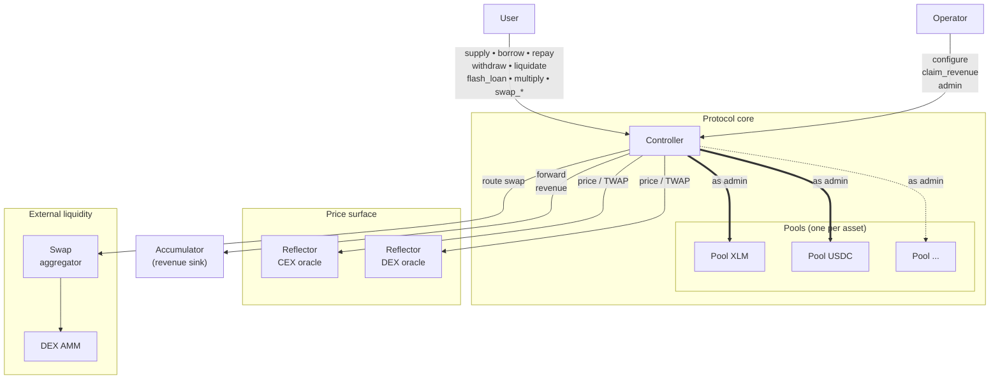
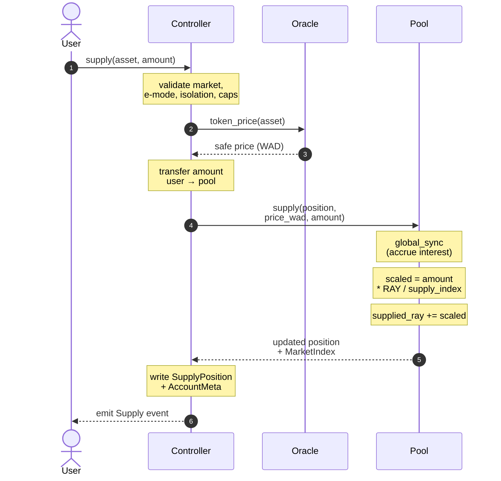
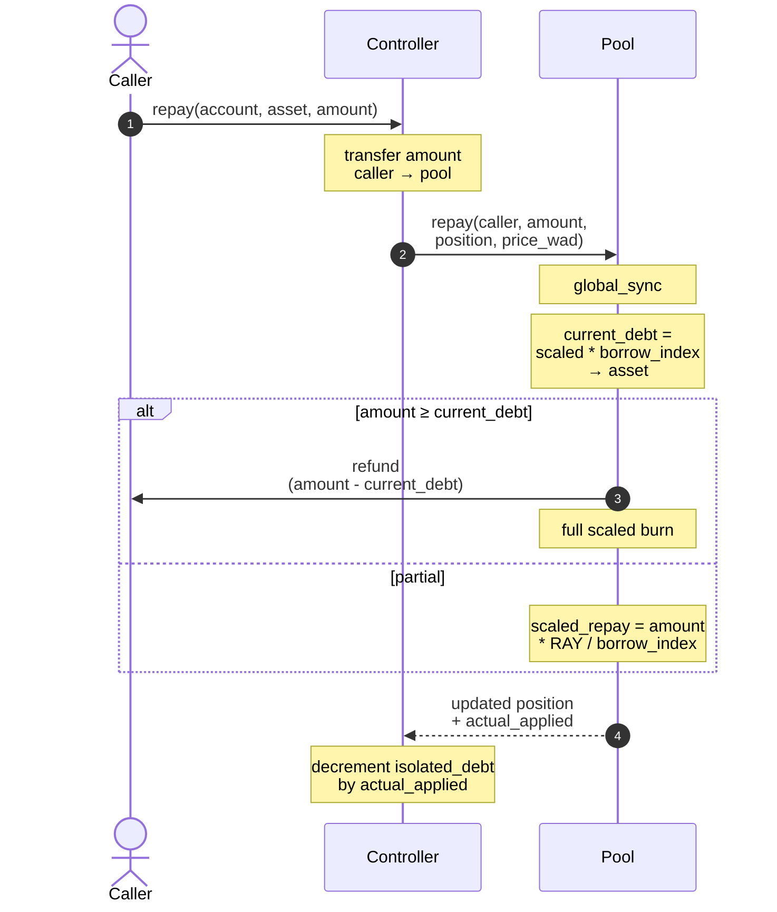
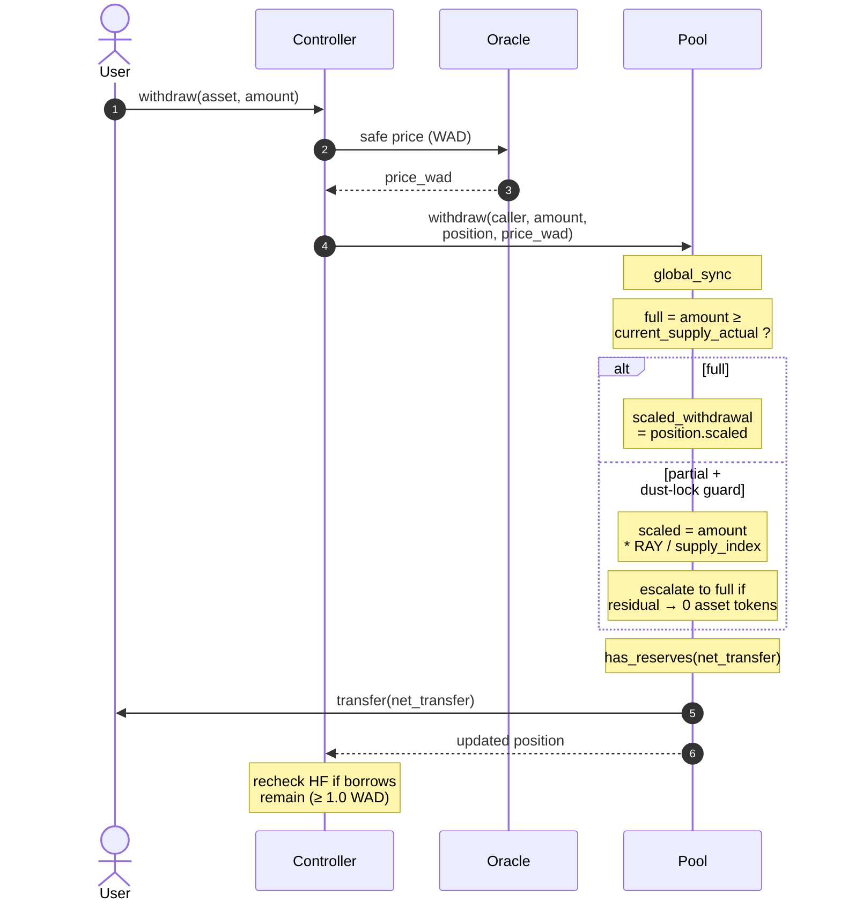
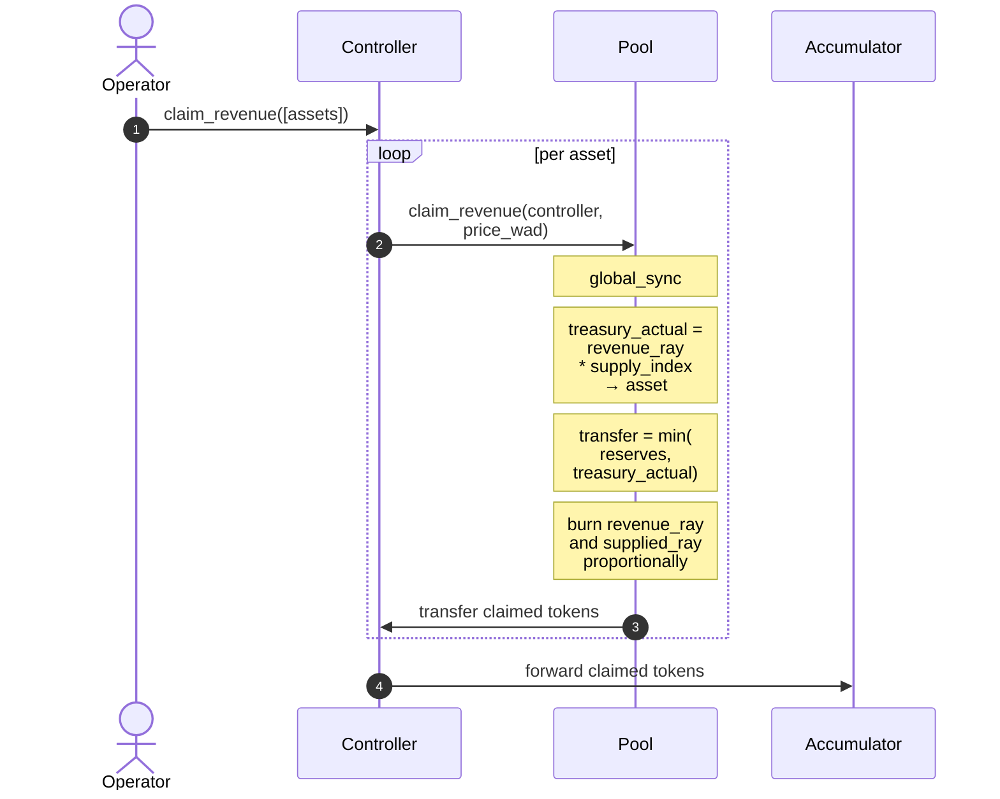
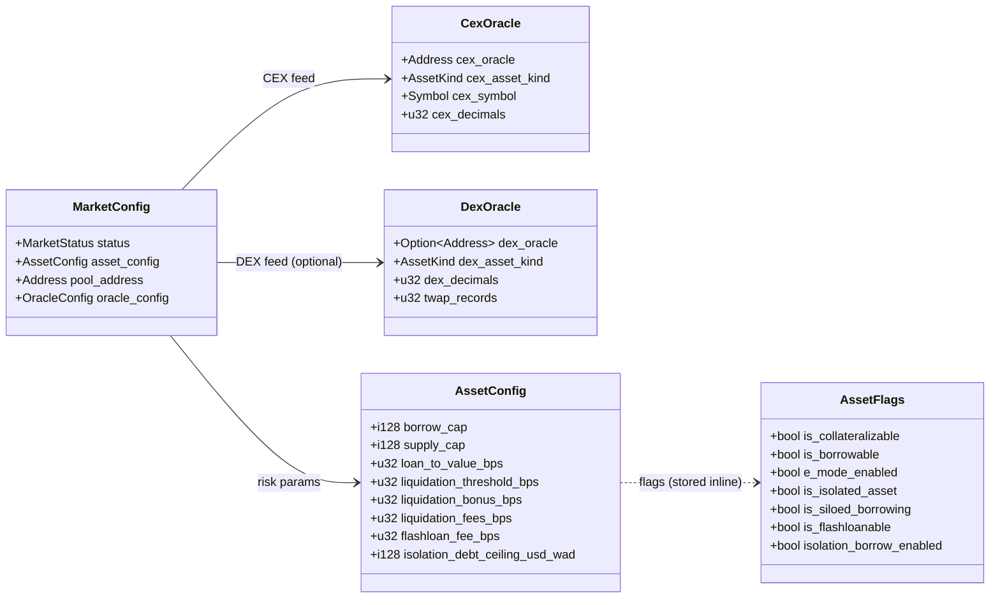
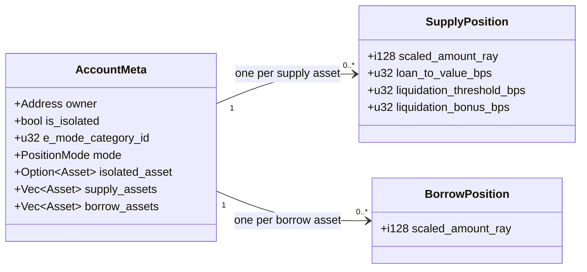
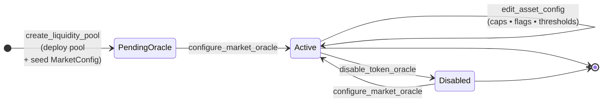

# Architecture

Two-tier Soroban system:

1. `controller` — single protocol entrypoint for every lending flow.
2. `pool` — one child contract per listed asset. Owns liquidity, interest
   accrual, reserves, and revenue accounting.

The controller deploys pools from a stored WASM template and retains
owner/admin control.

## System topology



Trust boundaries:

- Controller trusts pools only for asset-local accounting.
- Pools trust the controller as admin for every mutation.
- Controller validates every oracle response before use.
- Aggregator calls run inside the controller, which verifies input/output
  balances around the call (`strategy.rs::swap_tokens`).

## Component Boundaries

### Controller

Owns: user-facing endpoints, risk checks, account lifecycle and storage,
market registry, oracle/price-safety logic, e-mode, isolation mode,
liquidation orchestration, strategy orchestration, flash-loan
orchestration, pool deployment and upgrades, and revenue routing to the
accumulator.

Protocol-wide storage: `MarketConfig`, `EModeCategory`, `EModeAsset`,
`IsolatedDebt`, `PoolsList`, `PositionLimits`.

Per-account storage (split):

- `AccountMeta(account_id)`
- `SupplyPosition(account_id, asset)`
- `BorrowPosition(account_id, asset)`

### Pool

Asset-local. Owns token custody, aggregate scaled supply and debt,
supply/borrow indexes, interest-rate model execution, protocol revenue
accrual, reserve availability checks, and socialization of bad debt into
the supply index.

Pools make no protocol-level solvency decisions; they execute the
accounting the controller requests.

### Pool interface

The controller depends on `pool-interface`, not on the `pool` crate.
This keeps the pool contract out of controller runtime WASM, shrinks
controller exports and spec, and makes the trust boundary explicit.

Mutating calls: `supply`, `borrow`, `withdraw`, `repay`, `update_indexes`,
`add_rewards`, `create_strategy`, `seize_position`, `claim_revenue`,
`update_params`, `upgrade`, `flash_loan_begin`, `flash_loan_end`.

Read calls: `capital_utilisation`, `reserves`, `deposit_rate`,
`borrow_rate`, `protocol_revenue`, `supplied_amount`, `borrowed_amount`,
`delta_time`, `get_sync_data`.

## Controller-to-Pool Communication

Every pool mutation is gated by `verify_admin` (the controller is the
pool's admin).

### Supply flow



### Borrow flow

```mermaid
sequenceDiagram
    autonumber
    actor U as User
    participant C as Controller
    participant O as Oracle
    participant P as Pool

    U->>C: borrow(asset, amount)
    Note over C: validate LTV, HF,<br/>borrowability, caps,<br/>silo, e-mode, isolation
    C->>O: token_price(asset)
    O-->>C: safe price (WAD)
    C->>P: borrow(caller, amount,<br/>position, price_wad)
    Note over P: global_sync
    Note over P: has_reserves(amount)<br/>or revert
    Note over P: scaled_debt = amount<br/>* RAY / borrow_index
    Note over P: borrowed_ray<br/>+= scaled_debt
    P->>U: transfer amount
    P-->>C: updated position<br/>+ MarketIndex
    Note over C: write BorrowPosition;<br/>bump IsolatedDebt if isolated
```

### Repay flow



### Withdraw flow



"Withdraw all" uses two sentinels. The controller maps `amount == 0` to
`i128::MAX` (`controller/src/positions/withdraw.rs:84`). The pool takes
the full-withdraw branch via `amount ≥ current_supply_actual`
(`pool/src/lib.rs:181-183`). Passing `0`, or any value ≥ current actual
supply, triggers a full close.

### Revenue flow



## Storage Model

### Market storage

One canonical per-market record: `ControllerKey::Market(asset) -> MarketConfig`.



Oracle wiring is flat on `MarketConfig`; no separate reflector key.

### Account storage

Split into three key families so hot paths touch only what they need.



Avoids rewriting nested account maps on every change, lets views touch
only relevant positions, and supports targeted TTL bumps per account and
per position.

## Oracle Architecture

Oracle state lives in `MarketConfig`. Operator endpoint:
`configure_market_oracle(caller, asset, cfg)`.

- Operators pass neither token decimals nor oracle-feed decimals.
- Controller reads token decimals from the asset contract, CEX oracle
  decimals from the CEX oracle, and DEX oracle decimals from the DEX
  oracle when configured.
- Unreadable required decimals revert the transaction.

Price resolution tiers and the `allow_unsafe_price` rule:
[INVARIANTS.md §14](./INVARIANTS.md#14-market-oracle-invariants).

## Market Lifecycle



User operations unlock only after `configure_market_oracle` and the final
`edit_asset_config` land. See [DEPLOYMENT.md](./DEPLOYMENT.md).

## Deployment

Template-driven:

- Pool WASM uploads once per deployment round.
- Controller stores the pool template hash.
- Subsequent `create_liquidity_pool` calls deploy child pools from that
  template.

Deployment Make targets update `configs/networks.json` with the
controller contract id and pool WASM hash.

Live path: `controller`, `pool`, `pool-interface`, `common`, `Makefile`,
`configs/script.sh`.

## Read This Next

- [README.md](./README.md)
- [DEPLOYMENT.md](./DEPLOYMENT.md)
- [INVARIANTS.md](./INVARIANTS.md)
- [MATH_REVIEW.md](./MATH_REVIEW.md) — rule-coverage audit of the math flows above.
