# Data-Flow Diagram

Authoritative dataflow with explicit trust boundaries for the Stellar /
Soroban contracts in `controller/`, `pool/`, `pool-interface/`, `common/`.

This document is the data-flow visual and trust-boundary reference for the
system. For sequence diagrams of individual flows (supply, borrow, repay,
withdraw, liquidate, flash-loan, revenue), see
[`architecture/ARCHITECTURE.md §Controller-to-Pool Communication`](./ARCHITECTURE.md#controller-to-pool-communication).

## Entities

### External entities (outside protocol control)

| Entity | Notes |
|---|---|
| **User (EOA)** | Account owner. Initiates `supply` / `borrow` / `repay` / `withdraw` / strategy / `flash_loan`. Signs the outer tx; Soroban `Address::require_auth()` validates. |
| **Liquidator (EOA)** | A specialised user. Calls `liquidate(liquidator, account_id, debt_payments)` against unhealthy accounts. |
| **Owner (EOA, single key today)** | Two-step transferable. Mutates protocol-wide config; deploys / upgrades pools; grants / revokes roles. |
| **KEEPER (role-Address)** | Index maintenance, bad-debt cleanup, TTL keepalive. |
| **REVENUE (role-Address)** | Claims protocol revenue, adds rewards. |
| **ORACLE (role-Address)** | Configures market oracles, edits tolerance bands, disables oracles. |
| **Reflector CEX oracle** | SEP-40 PriceOracle contract — `lastprice` / `prices` / `decimals` / `resolution`. |
| **Reflector DEX oracle** | Optional, used in `DualOracle` exchange-source mode. |
| **Aggregator** | External swap router used by strategy primitives. Operator-set, Owner-changeable. |
| **Accumulator** | External revenue sink. Address-only trust; tokens forwarded blindly. |
| **Token SACs / SEP-41** | Soroban Asset Contracts on the operator allowlist. Provide `transfer`, `balance`, `decimals`. |
| **Flash-loan receiver** | User-deployed contract exporting `execute_flash_loan(initiator, asset, amount, fee, data)`. |

### Processes (inside protocol control)

| Process | Notes |
|---|---|
| **Controller** | Single protocol entrypoint. Owns risk decisions, account lifecycle, oracle dispatch, e-mode/isolation logic, liquidation orchestration, strategy orchestration, flash-loan orchestration, pool deployment, revenue routing. |
| **Pool (one per asset)** | Asset-local accounting: token custody, scaled supply / debt, supply / borrow indexes, interest accrual, reserves, revenue accrual, bad-debt socialization. Trusts the controller as admin. |

### Data stores

| Store | Tier | Owner | TTL strategy |
|---|---|---|---|
| `ControllerKey::Market(asset)` | Persistent (shared) | Controller | threshold 30d / bump 120d via `keepalive_shared_state` |
| `ControllerKey::AccountMeta(id)` | Persistent (user) | Controller | threshold 100d / bump 120d via `keepalive_accounts` |
| `ControllerKey::SupplyPosition(id, asset)` | Persistent (user) | Controller | as above |
| `ControllerKey::BorrowPosition(id, asset)` | Persistent (user) | Controller | as above |
| `ControllerKey::EModeCategory(u32)` | Persistent (shared) | Controller | shared keepalive |
| `ControllerKey::EModeAsset(u32, asset)` | Persistent (shared) | Controller | shared keepalive |
| `ControllerKey::AssetEModes(asset)` | Persistent (shared) | Controller | shared keepalive |
| `ControllerKey::IsolatedDebt(asset)` | Persistent (shared) | Controller | shared keepalive |
| `ControllerKey::PoolsList(u32)` | Persistent (shared) | Controller | shared keepalive |
| `LocalKey::PoolTemplate` | Instance | Controller | bump 180d on every controller call |
| `LocalKey::Aggregator` | Instance | Controller | as above |
| `LocalKey::Accumulator` | Instance | Controller | as above |
| `LocalKey::AccountNonce` | Instance | Controller | as above |
| `LocalKey::PositionLimits` | Instance | Controller | as above |
| `LocalKey::LastEModeCategoryId` | Instance | Controller | as above |
| `LocalKey::FlashLoanOngoing` | Instance | Controller | re-entrancy guard |
| `LocalKey::PoolsCount` | Instance | Controller | as above |
| `LocalKey::ApprovedToken(addr)` | Instance | Controller | token allowlist |
| `OwnableStorageKey::Owner` etc. | Instance | `stellar-access` | access-control storage |
| `PoolKey::Params` | Instance | Pool | per-pool bump 180d |
| `PoolKey::State` | Instance | Pool | per-pool bump 180d via `keepalive_pools` |
| `PoolKey::Accumulator` | Instance | Pool | per-pool bump 180d |
| `FL_PREBAL` (pool/cache.rs) | Temporary | Pool | single-tx scratch; cleared in `flash_loan_end` |

## Trust boundaries

The boundaries below are the source of truth for architecture-level trust
analysis.

```mermaid
flowchart TB
    subgraph TB_user["TB-1 · User trust boundary (untrusted)"]
        direction TB
        User["User EOA"]
        Liq["Liquidator EOA"]
        FLR["Flash-loan receiver contract"]
    end

    subgraph TB_op["TB-2 · Operator trust boundary (semi-trusted, role-gated)"]
        direction TB
        Owner["Owner key"]
        Keeper["KEEPER role"]
        Revenue["REVENUE role"]
        Oracle["ORACLE role"]
    end

    subgraph TB_protocol["TB-3 · Protocol core (trusted, on-chain)"]
        direction TB
        Controller["Controller process"]
        subgraph TB_pools["TB-4 · Pool processes (trusted by controller as admin)"]
            direction LR
            PoolXLM["Pool XLM"]
            PoolUSDC["Pool USDC"]
            PoolN["Pool ..."]
        end
    end

    subgraph TB_oracle["TB-5 · Oracle surface (trusted-but-validated)"]
        direction LR
        ReflectorCex["Reflector CEX feed"]
        ReflectorDex["Reflector DEX feed (optional)"]
    end

    subgraph TB_external["TB-6 · External liquidity (trusted-but-validated)"]
        direction LR
        Agg["Swap aggregator"]
        Acc["Accumulator (revenue sink)"]
    end

    subgraph TB_tokens["TB-7 · Token contracts (allowlisted SAC / SEP-41)"]
        direction LR
        Tok["Token SAC contracts"]
    end

    User -- "Auth via require_auth()" --> Controller
    Liq -- "Auth via require_auth()" --> Controller
    FLR -- "Callback execute_flash_loan" --> Controller
    Owner -- "#only_owner gated calls" --> Controller
    Keeper -- "#only_role(KEEPER)" --> Controller
    Revenue -- "#only_role(REVENUE)" --> Controller
    Oracle -- "#only_role(ORACLE)" --> Controller

    Controller == "verify_admin · controller-as-admin" ==> PoolXLM
    Controller == "verify_admin · controller-as-admin" ==> PoolUSDC
    Controller -.-> PoolN

    Controller -- "lastprice / prices / decimals / resolution" --> ReflectorCex
    Controller -- "lastprice / prices (DualOracle only)" --> ReflectorDex
    ReflectorCex -- "PriceData (validated: non-positive, staleness, future-ts, ≥50% TWAP, tolerance bands)" --> Controller
    ReflectorDex -- "PriceData (or None — soft staleness)" --> Controller

    Controller -- "swap call · pre/post balance + amount_out_min postcheck" --> Agg
    Agg -- "SAC transfers · validated by controller-side balance delta" --> Controller

    Controller -- "transfer revenue · address-only trust" --> Acc

    Controller -- "transfer · balance · decimals" --> Tok
    PoolXLM -- "transfer · balance" --> Tok
    PoolUSDC -- "transfer · balance" --> Tok
    Tok -- "panic-or-success (no return value)" --> Controller
```

### Boundary notes

| ID | Boundary | Validation responsibility |
|---|---|---|
| **TB-1** | User ↔ Controller | Soroban host auth + per-fn `caller.require_auth()` + `validation::require_account_owner` (account-owner check); `validate_bulk_position_limits`; per-asset cap / silo / e-mode / isolation checks. Receiver-callback re-entry blocked by `FlashLoanOngoing` Instance flag (`flash_loan.rs:43, 61`). |
| **TB-2** | Operator ↔ Controller | Role gating via `stellar-access` macros (`#[only_owner]`, `#[only_role]`). Pre-validation in `validate_asset_config`, `validate_interest_rate_model`, `set_position_limits` clamp `[1,32]`, oracle tolerance min/max bounds. Operator trust and decentralization assumptions are tracked in `architecture/ACTORS.md` and `architecture/CONFIG_INVARIANTS.md`. |
| **TB-3** | Controller ↔ Pool | `verify_admin(&env)` on every pool mutator; the pool's `Admin` is set to the controller at `pool::__constructor`. Pool returns `MarketIndex` to the controller after each mutation; controller writes user-facing position state. |
| **TB-4** | Pool ↔ Pool | None — pools never call each other. The controller is the only mediator. |
| **TB-5** | Controller ↔ Reflector | `controller/src/oracle/mod.rs` enforces non-positive rejection (error 217 `InvalidPrice`), hard-staleness vs `max_price_stale_seconds` (error 206 `PriceFeedStale`), 60-s future-timestamp clamp, ≥50% TWAP coverage (error 219 `TwapInsufficientObservations`), two-tier tolerance bands, fail-closed on risk-increasing ops (error `UnsafePriceNotAllowed`). Reflector contract upgrades are an open ask in `architecture/STELLAR_NOTES.md §Reflector`. |
| **TB-6** | Controller ↔ Aggregator | `strategy::swap_tokens` snapshots `balance(controller)` for in/out tokens before the call (`strategy.rs:456-457`), re-reads after (`:481, :496`), enforces spend ≤ `amount_in` (`:482-488`), and panics if `received < steps.amount_out_min` (`:517`). The aggregator call is bracketed by `set_flash_loan_ongoing(true/false)` (`:467, :487`) — re-entry into any controller mutating endpoint panics. |
| **TB-6** | Controller ↔ Accumulator | Address-only trust; tokens forwarded blindly. The accumulator address is Owner-set. |
| **TB-7** | Pool / Controller ↔ Token SAC | Allowlist gate at market creation via `LocalKey::ApprovedToken(addr)`. Operator-policy: allowlist must exclude fee-on-transfer and rebasing tokens (documented in `architecture/DEPLOYMENT.md "Token allowlist policy"`). `supply`, `repay`, and `add_rewards` verify balance delta as defence-in-depth before crediting accounting state. |

## Data flows (numbered)

The flows below trace data crossing trust boundaries. They reference the
sequence diagrams in `architecture/ARCHITECTURE.md`.

### F1. Supply

1. User → Controller: `supply(caller, account_id, e_mode, assets)` carrying
   `caller.require_auth()` (TB-1).
2. Controller → Reflector: `lastprice(asset)` and `prices(asset, twap_records)`
   for each asset; cached for the rest of the tx (TB-5).
3. Reflector → Controller: `Option<PriceData>` validated and rescaled to WAD.
4. Controller → Token SAC: `transfer(caller → pool_address, amount)`; balance
   delta verified after the call (TB-7).
5. Controller → Pool: `pool.supply(position, price_wad, amount)` under
   `verify_admin` (TB-3).
6. Pool → Controller: returns `MarketIndex` (updated `supply_index_ray` /
   `borrow_index_ray`, fresh `last_timestamp`).
7. Controller → Persistent storage: writes `SupplyPosition(id, asset)` and
   `AccountMeta(id)`; bumps Persistent TTL.
8. Controller → Event log: emits `UpdatePositionEvent(action="supply")`.

### F2. Borrow

1. User → Controller: `borrow(caller, account_id, borrows)` (TB-1).
2. Controller → Reflector: cached prices for collateral + borrow assets
   (TB-5; `allow_unsafe = false`).
3. Controller → Persistent storage: reads `AccountMeta`, all
   `SupplyPosition(id, *)`, all `BorrowPosition(id, *)`, `MarketConfig` for
   each touched asset, `EModeCategory` and `EModeAsset` if applicable,
   `IsolatedDebt` if isolated.
4. Controller: validates LTV (post-borrow), borrow-cap, silo, e-mode,
   isolation-debt-ceiling.
5. Controller → Pool: `pool.borrow(caller, amount, position, price_wad)`
   under `verify_admin` (TB-3).
6. Pool → Token SAC: `transfer(pool → caller, amount)` (TB-7).
7. Pool → Controller: returns `MarketIndex`.
8. Controller → Persistent storage: writes `BorrowPosition(id, asset)`,
   bumps `IsolatedDebt(asset)` if applicable, writes back `AccountMeta`.
9. Controller → Event log: emits `UpdatePositionEvent(action="borrow")`.

### F3. Withdraw

1. User → Controller: `withdraw(caller, account_id, withdrawals)` (TB-1).
2. Controller → Reflector: cached prices for collateral + remaining borrow
   assets (TB-5; `allow_unsafe = false` for the post-batch HF check).
3. Controller → Pool: `pool.withdraw(caller, amount, position, price_wad)`
   under `verify_admin`. Sentinel `amount == 0 → i128::MAX` (`withdraw.rs:84`).
4. Pool → Token SAC: `transfer(pool → caller, net_transfer)` (TB-7).
5. Pool → Controller: returns updated position + `MarketIndex`.
6. Controller: post-batch HF re-check when borrows remain (HF ≥ 1.0 WAD).
7. Controller → Persistent storage: writes `SupplyPosition`, updates
   `AccountMeta` if asset list shrank.
8. Controller → Event log: emits `UpdatePositionEvent(action="withdraw")`.

### F4. Repay

1. Caller (any address) → Controller: `repay(caller, account_id, payments)`
   (TB-1; permissionless on the target account).
2. Controller → Token SAC: `transfer(caller → pool_address, amount)`; balance
   delta verified (TB-7).
3. Controller → Pool: `pool.repay(caller, amount, position, price_wad)` under
   `verify_admin` (TB-3).
4. Pool → Token SAC (overpayment branch): `transfer(pool → caller,
   amount - current_debt)` — refund target is the caller.
5. Pool → Controller: returns updated position + `actual_applied`.
6. Controller → Persistent storage: decrements `IsolatedDebt(asset)` by
   `actual_applied`; sub-$1 dust erasure rule applies.

### F5. Liquidate

1. Liquidator → Controller: `liquidate(liquidator, account_id, debt_payments)`
   (TB-1).
2. Controller → Reflector: cached prices for every collateral and every debt
   asset on the target account (TB-5; `allow_unsafe = false`).
3. Controller: HF cascade `1.02 → 1.01 → fallback` (`helpers/mod.rs:216, 231,
   261, 284`). Fallback regression guard at `:295`.
4. For each debt payment: Controller → Pool (debt asset): `pool.repay(...)`
   under `verify_admin`.
5. For each collateral asset on the account: Controller → Pool (collateral
   asset): `pool.seize_position(...)` under `verify_admin`. Per-asset split:
   `base = capped/(1+bonus)`, `bonus = capped-base`, `protocol_fee =
   bonus*liquidation_fees_bps`.
6. Bad-debt branch: when `debt_usd > coll_usd && coll_usd ≤ 5*WAD`, controller
   triggers `apply_bad_debt_to_supply_index` on the affected pool. Supply-index
   floor at `10^18 raw` clamps the maximum drop.
7. Pool → Token SAC: collateral transfers to liquidator; protocol fee retained
   in pool reserves.
8. Controller → Event log: `LiquidationEvent` with full payment / seizure
   vectors; `PoolInsolventEvent` if bad-debt branch triggered.

### F6. Flash-loan

1. User → Controller: `flash_loan(caller, asset, amount, receiver, data)` (TB-1).
2. Controller: `set_flash_loan_ongoing(true)` (Instance write,
   `flash_loan.rs:43`).
3. Controller → Pool: `pool.flash_loan_begin(asset, amount, receiver)` under
   `verify_admin` (TB-3). Pool snapshots reserves to `FL_PREBAL` (Temporary
   storage).
4. Pool → Token SAC: `transfer(pool → receiver, amount)` (TB-7).
5. Controller → Receiver: `env.invoke_contract::<()>(receiver,
   "execute_flash_loan", (initiator, asset, amount, fee, data))`
   (`flash_loan.rs:51-55`). Receiver is in TB-1 (untrusted).
6. Receiver → External contracts (TB-1 boundary): can call aggregator,
   tokens, or other DeFi — but cannot call back into controller mutating
   endpoints (every endpoint reads `FlashLoanOngoing` and panics).
7. Receiver → Token SAC: must `env.authorize_as_current_contract` for the
   pull-back transfer.
8. Controller → Pool: `pool.flash_loan_end(asset, amount, fee, receiver)`.
9. Pool → Token SAC: `transfer(receiver → pool, amount + fee)` (TB-7;
   Soroban-native auth, not allowance pattern). Pool verifies post-balance
   ≥ pre-balance + fee.
10. Controller: `set_flash_loan_ongoing(false)`. Panic anywhere reverts the
    entire tx including the guard write.

### F7. Strategy (multiply / swap_debt / swap_collateral / repay_debt_with_collateral)

1. User → Controller: `multiply(...)` etc. (TB-1).
2. Controller: `set_flash_loan_ongoing(true)` for the strategy duration —
   in addition to the per-step bracket around the aggregator call.
3. Controller → Pool: `pool.create_strategy(...)` (atomic single-call) for the
   borrow-side leg.
4. Controller → Aggregator (TB-6): pre-balance snapshot, call, post-balance
   snapshot, slippage postcheck. Bracketed by
   `set_flash_loan_ongoing(true/false)` so the aggregator-side callback
   cannot re-enter the controller.
5. Controller → Pool: settlement legs (supply, repay, withdraw as appropriate
   for the strategy).
6. Controller: `set_flash_loan_ongoing(false)`.

### F8. Oracle configuration

1. ORACLE role → Controller: `configure_market_oracle(caller, asset, cfg)`
   (TB-2).
2. Controller → Token SAC: `decimals()` discovery (TB-7).
3. Controller → Reflector: `decimals()`, `lastprice` probe to validate
   `cex_symbol`/`cex_asset_kind` configuration (TB-5).
4. Controller → Persistent storage: writes `MarketConfig` with the resolved
   `OracleProviderConfig`. Status transitions `PendingOracle → Active` if it
   was the first config call.
5. Controller → Event log: `UpdateAssetOracleEvent` with full payload.

### F9. Revenue claim

1. REVENUE role → Controller: `claim_revenue([assets])` (TB-2).
2. For each asset: Controller → Pool: `pool.claim_revenue(controller,
   price_wad)` under `verify_admin` (TB-3). Pool burns proportional supply +
   revenue scaled.
3. Pool → Controller (Token SAC transfer): tokens transferred to controller
   address.
4. Controller → Accumulator (Token SAC transfer): tokens forwarded blindly
   (TB-6).
5. Controller → Event log: `ClaimRevenueEvent` per asset.

### F10. Bad-debt cleanup (KEEPER standalone)

1. KEEPER → Controller: `clean_bad_debt(caller, account_id)` (TB-2).
2. Controller: same `execute_bad_debt_cleanup` math path as in-liquidation
   socialization (`liquidation.rs:463`).
3. Controller → Pool: `apply_bad_debt_to_supply_index` (per affected supply
   asset).
4. Controller → Event log: `CleanBadDebtEvent`, `PoolInsolventEvent`.

## Threat-relevant data crossing each boundary

| From → To | Data | Threat exposure |
|---|---|---|
| User → Controller | `caller`, `account_id`, asset list, amount list, e-mode category, receiver address, callback data | Spoofing of identity (mitigated by `require_auth`); repudiation of action (mitigated by events); tampering of bulk amounts (mitigated by `validate_bulk_position_limits`) |
| Reflector → Controller | `(price, timestamp)`, `decimals`, `resolution` | Tampering with prices (mitigated by tolerance bands + staleness + non-positive rejection); decimal-upgrade tampering (open ask, operator runbook mitigation) |
| Aggregator → Controller | Token balance delta after swap | Tampering with `received` (mitigated by `received >= amount_out_min`); re-entry (mitigated by FlashLoanOngoing bracket) |
| Token SAC → Pool | `transfer` panic-or-success; `balance` query result | Tampering by fee-on-transfer / rebasing (mitigated by allowlist policy + balance-delta verification on supply / repay / add_rewards) |
| Receiver callback → External world | Whatever the receiver chooses | Information disclosure / tampering blocked at the controller boundary by FlashLoanOngoing |
| Owner → Controller | New WASM hash, new aggregator, new accumulator, new asset config, new e-mode definitions, new oracle wiring, new position limits, role grants, pause / unpause | Elevation of privilege via single-key compromise (residual: no on-chain timelock — Maturity H-1) |

## What's not here

- **No off-chain pipelines.** The protocol does not run keepers, indexers, or
  monitors itself. Operator runbooks for these live in
  `architecture/DEPLOYMENT.md` and the (in-progress)
  `architecture/INCIDENT_RESPONSE.md`.
- **No cross-chain flows.** The protocol is single-chain Stellar / Soroban.
- **No fiat ramps.** All value is on-chain in SAC / SEP-41 tokens.

## Update protocol

Per the STRIDE template's "Did we do a good job?" section, this diagram is
re-read on every architecture-affecting change:

- new entrypoint added to `controller/` or `pool/` ABI;
- new actor / role introduced;
- change to flash-loan / strategy / liquidation flow;
- change to the oracle pipeline (additional sources, fallbacks, decimals);
- change to storage durability tier of any key.

The owning maintainer updates this file and the affected companion documents
in `architecture/` in the same change.
