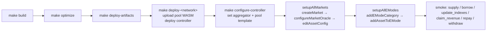

# Deployment

Operator runbook for the Stellar contracts. The interface is the Makefile plus `configs/script.sh`.

## Pipeline



`make setup-<network>` wraps `deploy-<network> → configure-controller → _setup-markets` end-to-end.

## Source Of Truth

- `configs/networks.json` — per-network RPC metadata, latest controller id, uploaded pool wasm hash.
- `configs/testnet_markets.json` — testnet market definitions.
- `configs/mainnet_markets.json` — mainnet market definitions.
- `configs/emodes.json` — e-mode categories and memberships.
- `configs/script.sh` — config-driven setup actions.
- `Makefile` — supported build, deploy, setup, and invoke commands.

## Prerequisites

- `stellar` CLI
- `jq`
- Rust toolchain compatible with the repo
- A funded identity such as `deployer`, or `SIGNER=ledger` for ledger-backed signing.

## Deploy Steps

Run these in order. Testnet and mainnet share the same steps; substitute `testnet` or `mainnet` for `<network>`.

1. Build artifacts.
   ```bash
   make build
   make optimize
   make deploy-artifacts
   ```
2. Deploy controller and upload pool WASM. Updates `configs/networks.json` with `controller` and `pool_wasm_hash`.
   ```bash
   make deploy-<network>
   ```
3. Configure the controller (sets aggregator if configured, sets pool template hash). A blank `aggregator` logs a warning and continues.
   ```bash
   make configure-controller NETWORK=<network>
   ```
4. Create markets and e-modes from config. Runs `setupAllMarkets` then `setupAllEModes`.
   ```bash
   NETWORK=<network> SIGNER=<signer> ./configs/script.sh setupAll
   ```

Shortcut: `make setup-<network>` runs steps 2, 3, and 4 together.

Artifact directories produced by step 1:
- `target/wasm32v1-none/release/` — raw build outputs.
- `target/optimized/` — optimized WASM for local tooling.
- `target/deploy/` — deploy artifacts consumed by Makefile targets.

## Market Setup Flow

For each market in `configs/<network>_markets.json`, `setupAllMarkets` runs these actions in order. The order is load-bearing: the pool must exist before its oracle config, and the final risk config lands last.

1. `createMarket`
   - Reads `asset_address` from config.
   - Reads asset decimals on-chain from the asset contract (config is not trusted for live decimals).
   - Assembles `MarketParams`.
   - Deploys the pool through `create_liquidity_pool`.
   - Seeds the controller market in `PendingOracle`.
2. `configureMarketOracle`
   - Calls `configure_market_oracle` with operator-supplied fields: exchange source, stale threshold, tolerance bands, CEX oracle address, CEX asset kind, CEX symbol, optional DEX oracle address, DEX asset kind, TWAP record count.
   - Controller discovers token decimals, CEX oracle decimals, and (when configured) DEX oracle decimals on-chain. A failed required read reverts the transaction.
3. `editAssetConfig`
   - Enables the final market risk flags and caps: borrowability, collateralizability, flashloanability, e-mode flag, liquidation parameters, caps.

The market is operational only after both oracle config and final asset config land.

## E-Mode Setup Flow

`setupAllEModes` reads `configs/emodes.json`. For each category:

1. `addEModeCategory`
2. `addAssetToEMode` for each configured asset.

## Direct Invocation

Generic Makefile helpers for controller and pool calls.

Controller invoke:
```bash
make invoke NETWORK=<network> FN=supply ARGS="..."
make view NETWORK=<network> FN=get_market_config ARGS="..."
```

Explicit contract id invoke:
```bash
make invoke-id NETWORK=<network> CONTRACT_ID=<id> FN=claim_revenue ARGS="..."
make view-id NETWORK=<network> CONTRACT_ID=<id> FN=protocol_revenue
```

Use these for smoke tests and one-off operations.

## Smoke-Test Runbook

Validate after deployment.

Required:
1. market config reads
2. detailed market views
3. supply
4. borrow
5. update indexes
6. claim revenue
7. repay
8. withdraw

Recommended:
1. duplicate same-token entries in a batch supply
2. post-update index reads
3. pool-side `protocol_revenue`
4. pool-side `reserves`

Reference commands:
```bash
make view NETWORK=<network> FN=get_all_markets_detailed ARGS="--assets-file-path /tmp/assets.json"
make view NETWORK=<network> FN=get_all_market_indexes_detailed ARGS="--assets-file-path /tmp/assets.json"
make invoke NETWORK=<network> FN=supply ARGS="..."
make invoke NETWORK=<network> FN=borrow ARGS="..."
make invoke NETWORK=<network> FN=update_indexes ARGS="..."
make invoke NETWORK=<network> FN=claim_revenue ARGS="..."
make invoke NETWORK=<network> FN=repay ARGS="..."
make invoke NETWORK=<network> FN=withdraw ARGS="..."
```

## Upgrade / Rollback

Upgrades that change storage layout (for example, adding a required field to `MarketConfig`) are breaking. Procedure:

1. Deploy the new controller WASM.
2. For every affected existing market, re-run `configure_market_oracle` with the required parameters so the stored `MarketConfig` repopulates with the new field.
3. Run `make view NETWORK=<network> FN=get_market_config ARGS="..."` per market to verify deserialization.
4. Until step 2 completes per market, oracle reads from that market will panic on the new mandatory probe.

Rollback: redeploy the previous controller id recorded in `configs/networks.json` history and repeat steps 2 and 3 against the prior layout.

## Failure Modes To Investigate Immediately

- `configure_market_oracle` cannot read token decimals.
- `configure_market_oracle` cannot read CEX or DEX oracle decimals.
- `configure_market_oracle` cannot validate ticker availability.
- Market stays `PendingOracle` after setup.
- `configs/networks.json` did not update with controller or pool wasm hash.
- `protocol_revenue` increases but `claim_revenue` returns zero unexpectedly.

## Operational Notes

### Decimals

Two distinct decimal domains, neither supplied by the operator:
- Token decimals — sourced from the asset contract.
- Oracle-feed decimals — sourced from the oracle contracts.

### Active Deployment Scope

The operator flow depends only on: controller, pool, pool-interface, common, config files, Makefile.

### Token Allowlist Policy

`approve_token_wasm` admits a token contract. Protocol accounting assumes 1:1 transfer semantics and a fixed per-address balance. Operators MUST NOT allowlist:

- **Fee-on-transfer tokens.** Borrow, withdraw, liquidation seizure, and `add_rewards` do not balance-delta on the egress side. Borrowers under-receive while debt is booked at the requested amount; liquidators get less bonus than the math books; bad debt cascades.
- **Rebasing tokens (positive or negative).** Pool reserves are read live via `tok.balance(pool)`; rebases drift reserves from scaled supply. Positive rebases let `claim_revenue` extract the rebase delta; negative rebases stall withdrawals while debt accounting is unchanged.

Approved tokens MUST be standard SAC or audited SEP-41 with strict 1:1 transfer semantics. On-chain validation cannot enforce this property.

### SAC Issuer Upgrade

A Stellar issuer can upgrade their issued-asset SAC. If the upgrade changes `decimals()` or transfer semantics, `MarketParams.asset_decimals` and `MarketConfig.cex_decimals`/`dex_decimals` go stale. There is no on-chain endpoint to refresh these values. Runbook:

1. Monitor issuers for upgrade events.
2. On any change, `pause()` and review.
3. If the change is benign, document and unpause.
4. If the change breaks accounting, migrate users to a new market backed by a different token contract.

## Related Documents

- [README.md](./README.md)
- [ARCHITECTURE.md](./ARCHITECTURE.md)
- [INVARIANTS.md](./INVARIANTS.md)
- [MATH_REVIEW.md](./MATH_REVIEW.md)
