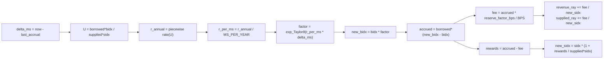
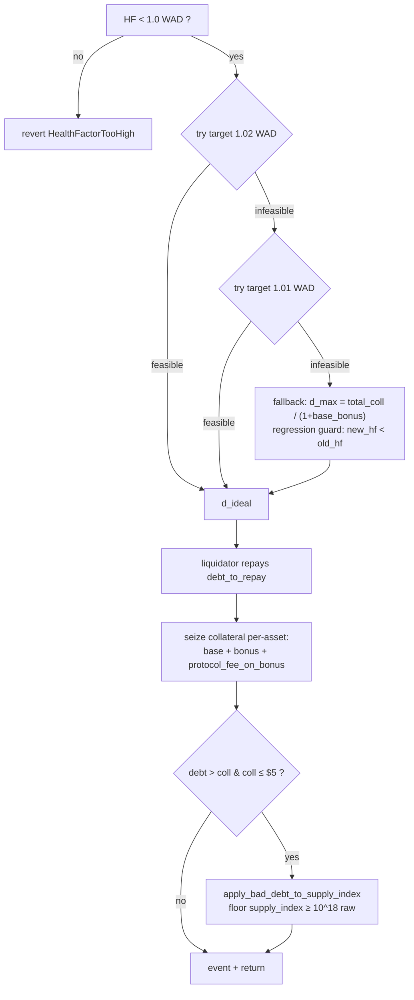
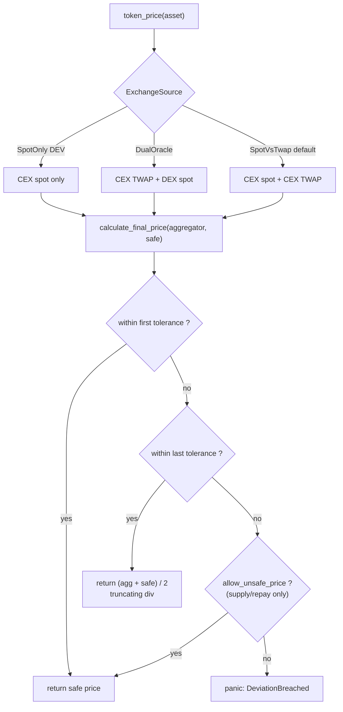

# Invariants

Algebraic invariants the protocol must uphold. Each entry lists: the claim, where
it is enforced, where it is verified, and any bounded-rounding tolerance.

Citations:
- Enforced: `file:symbol` (source of truth at runtime).
- Verified: Certora rule module (`controller/certora/spec/*_rules.rs`),
  fuzz target (`fuzz/fuzz_targets/*.rs`), or integration test.

The line between *enforced* (checked in code every call) and *aspirational*
(documented property, not yet fully formalized) is preserved below.

## 1. Fixed-Point Domains

**Statement.** Cross-domain arithmetic must explicitly rescale into the target
domain before comparison or persistence. Domains:
- asset-native units (per-token decimals)
- `BPS = 10^4` (percentages: LTV, liquidation threshold, reserve factor, fees)
- `WAD = 10^18` (USD values, health factor)
- `RAY = 10^27` (indexes, rates, scaled balances)

**Enforced.** `common::fp::Wad::from_token`, `common::fp_core::rescale_half_up`.

**Verified.** `math_rules`, `fuzz_targets/fp_math.rs`.

**Example.** 7-decimal XLM `12_0000000` rescales to WAD as `12 * 10^18`.

## 2. Rounding Discipline

**Statement.** All fixed-point arithmetic uses half-up rounding unless the
function explicitly states otherwise.
- multiply: `(a * b + precision / 2) / precision`
- divide:   `(a * precision + b / 2) / b`

**Enforced.** `mul_half_up`, `div_half_up`, and signed variants in `common::fp_core`.

**Verified.** `math_rules`, `fuzz_targets/fp_math.rs`.

**Tolerance.** Half-ULP at the target precision per operation.

## 3. Scaled Balance Reconstruction

**Statement.** Positions store scaled amounts; actuals reconstruct as
`scaled * index / RAY`.
- `actual >= 0`
- with scaled fixed, `index` increasing implies actual increasing (interest accrues in O(1) per market).

**Enforced.** Scaled storage in `pool/src/lib.rs` (supply/borrow paths); reconstruction
in `pool/src/views.rs`.

**Verified.** `index_rules`, `position_rules`, `fuzz_targets/rates_and_index.rs`.

**Tolerance.** Half-up rounding on each `scaled -> actual -> scaled` round-trip.

## 4. Pool State Identity: `revenue_ray <= supplied_ray`

**Statement.** `0 <= revenue_ray <= supplied_ray`. Protocol revenue is a supply
claim that appreciates with `supply_index`.

**Enforced.**
- `add_protocol_revenue` (pool): increments both `revenue_ray` and `supplied_ray`.
- Revenue claim path: burns scaled revenue from both proportionally.
- `seize_position` on a `Deposit` position (`pool/src/lib.rs:441-446`): moves
  scaled from user into `revenue_ray` without changing `supplied_ray`, because
  the scaled was already counted in `supplied_ray`.

**Verified.** `solvency_rules`, `fuzz_targets/flow_e2e.rs`.

## 5. Interest Split Identity

**Statement.** On borrow-index accrual:
- `accrued_interest = new_total_debt - old_total_debt`
- `protocol_fee     = accrued_interest * reserve_factor_bps / BPS`
- `supplier_rewards = accrued_interest - protocol_fee`
- Identity: `accrued_interest = supplier_rewards + protocol_fee`.

**Enforced.** `pool/src/interest.rs` accrual pipeline.

**Verified.** `interest_rules`, `fuzz_targets/rates_and_index.rs`.

**Accrual pipeline.**

Edge-to-rule mapping is in `MATH_REVIEW.md` §3.7.

## 6. Borrow Index Monotonicity

**Statement.** If utilization, borrow rate, and elapsed time are all
non-negative, then `interest_factor >= RAY` and
`new_borrow_index >= old_borrow_index`.

**Enforced.** `common::rates::compound_interest` (8-term Taylor of
`e^(rate*time)`); annual rate capped at `max_borrow_rate_ray` before per-ms
conversion.

**Verified.** `index_rules`, `interest_rules`, `fuzz_targets/rates_and_index.rs`.

## 7. Supply Index Monotonicity (Single Sanctioned Exception)

**Statement.** Outside bad-debt socialization,
`new_supply_index >= old_supply_index`. The only sanctioned decrease is
`apply_bad_debt_to_supply_index`.

**Enforced.** `pool/src/interest.rs`.

**Safety floor.** `SUPPLY_INDEX_FLOOR_RAW = 10^18` (raw Ray), declared at
`pool/src/interest.rs:14`. That is `10^-9` below nominal `1.0 RAY = 10^27`.
Hence `supply_index_ray >= 10^18` always holds, preventing
divide-by-near-zero in `amount / supply_index`.

**Paired silent-drop rule.** `add_protocol_revenue_ray`
(`pool/src/interest.rs:63-75`) skips fee accrual when
`supply_index < SUPPLY_INDEX_FLOOR_RAW`. The asset-decimal variant
`add_protocol_revenue` (lines 49-59) does not mirror this guard; it is safe only
because the floor clamp in `apply_bad_debt_to_supply_index` prevents the
trigger condition from arising.

**Verified.** `index_rules`, `interest_rules`.

## 8. Utilization Definition At Empty Market

**Statement.** `U = borrowed_actual / supplied_actual`, with
`U := 0` when `supplied_actual = 0`.

**Enforced.** `pool/src/interest.rs`, `pool/src/views.rs`.

**Verified.** `interest_rules`.

## 9. Health Factor

**Statement.** `HF = weighted_collateral / total_borrow` in USD WAD, where
`weighted_collateral = Σ(collateral_value * liquidation_threshold_bps / BPS)`
and `total_borrow = Σ(borrow_value)`.
- With debt: `HF >= 1e18` solvent; `HF < 1e18` liquidatable.
- Without debt: `HF = i128::MAX`.

**Enforced.** `controller/src/positions/liquidation.rs`, `controller/src/helpers/mod.rs`.

**Verified.** `health_rules`, `solvency_rules`, `liquidation_rules`,
`fuzz_targets/flow_e2e.rs`.

**Liquidation cascade.**

## 10. LTV Borrow Bound

**Statement.** `post_borrow_total_debt <= Σ(collateral_value * loan_to_value_bps / BPS)`.
LTV controls borrow admission; liquidation threshold (§9) controls liquidation.

**Enforced.** `controller/src/positions/borrow.rs`.

**Verified.** `boundary_rules`, `position_rules`.

## 11. Isolation Debt

**Statement.** For an isolated asset:
- isolated debt is never negative
- for new borrows, isolated debt is bounded by the configured debt ceiling
- debt tracked in USD WAD; incremented on borrow, decremented on repay/liquidation, clamped at zero

**Enforced.**
- Increment: `handle_isolated_debt` (`controller/src/positions/borrow.rs:204-242`).
- Decrement and clamp: `adjust_isolated_debt_usd` (`controller/src/utils.rs:61-92`).

**Dust rule.** If remaining debt is `0 < debt < 1 USD WAD`, the tracker is
zeroed in `adjust_isolated_debt_usd`.

**Asymmetry (aspirational fix).** Dust erasure runs only on decrement. The
increment path does not apply a symmetric rule. Borrow + full-repay cycles
therefore ratchet the tracker downward by up to the sub-$1 residual per cycle.
See `MATH_REVIEW.md` §5.1 for the proposed symmetric rule.

**Verified.** `isolation_rules`.

## 12. Claim Revenue Cap And Proportional Burn

**Statement.**
- `claimed_amount <= current_reserves`
- On partial claim (`reserves < treasury_actual`), pool transfers `reserves` and
  burns a proportional slice of both totals (`pool/src/lib.rs:478-496`):
  - `ratio = amount_to_transfer / treasury_actual`
  - `scaled_to_burn = revenue_scaled * ratio`
  - `revenue_ray  -= min(scaled_to_burn, revenue_ray)`
  - `supplied_ray -= min(scaled_to_burn, supplied_ray)`
- Preserves §4 (`revenue_ray <= supplied_ray`) and §13 (reserve cap).

**Enforced.** `pool/src/lib.rs` claim path.

**Verified.** `solvency_rules`, `boundary_rules`.

## 13. Reserve Availability

**Statement.** Any outgoing transfer requiring liquidity must satisfy
`current_reserves >= requested_amount`. Applies to withdrawals, borrows, and
flash-loan starts.

**Enforced.** `pool/src/lib.rs`; controller paths in
`controller/src/positions/{withdraw,borrow}.rs` and
`controller/src/flash_loan.rs`.

**Verified.** `boundary_rules`, `flash_loan_rules`,
`fuzz_targets/flow_e2e.rs`.

## 14. Market Oracle Configuration

**Statement.** For each `MarketConfig`:
1. token decimals are read from the token contract during configuration
2. CEX oracle decimals are read from the CEX oracle during configuration
3. DEX oracle decimals are read from the DEX oracle during configuration when DEX is configured
4. unreadable required decimals revert configuration
5. oracle-feed decimals are never inferred from token decimals

**Enforced.** `controller/src/config.rs`, `controller/src/oracle/mod.rs`.

**Verified.** `oracle_rules`, `fuzz_targets/flow_e2e.rs`.

**Price resolution.**

Tolerance bands live on `MarketConfig` in BPS:
`first_tolerance_bps < last_tolerance_bps <= MAX_LAST_TOLERANCE (5000 bps)`.

## 15. Controller / Pool Separation

**Statement.** Controller runtime code may only assume the pool ABI, not pool
internals. Controller depends on `pool-interface`, not the full pool crate at
runtime.

**Enforced.** Crate topology; `controller/Cargo.toml` uses `pool-interface`.

**Verified.** Build-time dependency graph.

## 16. Account Storage Canonical Index

**Statement.** `AccountMeta` is the canonical index of position keys for the
account. Reading starts from meta; removal removes all listed positions and then
meta; TTL bumps iterate through meta's asset lists.

**Enforced.** `controller/src/storage/mod.rs`.

**Verified.** `position_rules`.

## 17. Intentional Design Decisions

These are design choices, not enforced invariants. They are documented so future
changes do not accidentally reverse them.

- **Half-up rounding** instead of truncation: less directional bias, consistent
  across multiply/divide flows.
- **Revenue as scaled supply**: protocol revenue appreciates with supplier
  balances until claimed, rather than sitting in a non-interest-bearing bucket.
- **Flat oracle fields in `MarketConfig`**: one record reads and audits more
  easily than a split storage layout.
- **On-chain decimal discovery**: decimals are read from contracts during
  setup; operator-supplied decimals are rejected as error-prone.

## 18. Re-Verification Checklist After Math Changes

Touching the rate model, index updates, liquidation math, isolation debt,
revenue claim, or precision/rescaling logic requires re-verifying:

1. `scaled -> actual -> scaled` consistency (§3)
2. `accrued_interest = supplier_rewards + protocol_fee` (§5)
3. `revenue_ray <= supplied_ray` (§4)
4. `HF` transitions around `1.0 WAD` (§9)
5. Reserve caps on borrow, withdraw, claim revenue (§12, §13)
6. Isolated-debt clamping and dust erasure (§11)
7. Bad-debt socialization cannot drive supply index below the raw `10^18` floor (§7)

## Related Documents

- [README.md](./README.md)
- [ARCHITECTURE.md](./ARCHITECTURE.md)
- [DEPLOYMENT.md](./DEPLOYMENT.md)
- [MATH_REVIEW.md](./MATH_REVIEW.md) — rule-coverage audit and remediation plan
  for the invariants on this page.
