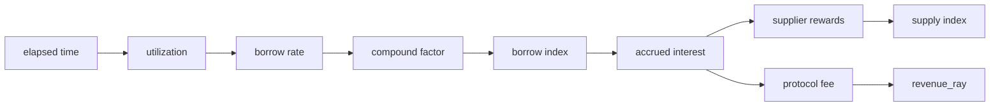
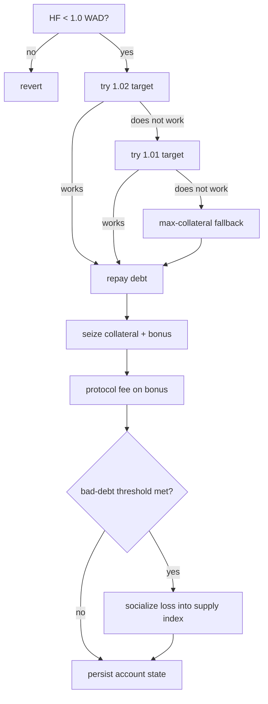
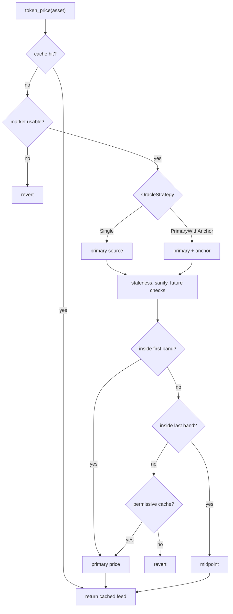

# Protocol Invariants

This reference records the lending protocol's runtime safety properties. Use it
when reviewing changes to accounting, solvency, oracle pricing, storage, or
governance boundaries.

An invariant is a condition preserved by every successful operation. A break
points to an implementation bug, an invalid configuration, or a missing
validation step.

Runtime behavior comes from the Rust contracts. Module paths identify the code
and verification assets that enforce each property.

## Scales

| Domain | Scale | Purpose |
|---|---:|---|
| Asset-native | token decimals | Token transfers and user-entered amounts |
| BPS | `10^4` | LTV, liquidation thresholds, fees, reserve factor, tolerances |
| WAD | `10^18` | USD values, health factor, normalized prices |
| RAY | `10^27` | Rates, indexes, scaled balances |

## Evidence

| Evidence | Location |
|---|---|
| Runtime code | `common/src/*`, `contracts/pool/src/*`, `contracts/controller/src/*` |
| Certora rules | `certora/{common,pool,controller}/spec/*_rules.rs` |
| Fuzz and property tests | `tests/fuzz/fuzz_targets/*`, `tests/test-harness/tests/*` |

## Review Method

For each protocol change:

1. Identify the section touched by the change.
2. Check the invariant statements against the modified code path.
3. Use the verification matrix near the end of this file to select tests,
   fuzz targets, or Certora rules.
4. Re-check storage and oracle assumptions when a change crosses contract
   boundaries.

## 1. Numeric Model

### 1.1 Scale Boundaries

Convert values into the target scale before comparison, storage, or transfer.
Token amounts enter protocol math in asset-native decimals. Solvency and prices
use WAD. Rates, indexes, and scaled balances use RAY.

Scale bugs usually come from comparing asset-native values with WAD values,
mixing WAD prices with RAY indexes, or truncating before conversion.

### 1.2 Fixed-Point Rounding

Fixed-point multiplication and division use half-up rounding unless the call
site explicitly chooses floor or truncation.

```text
mul(a, b, precision) = (a * b + precision / 2) / precision
div(a, b, precision) = (a * precision + b / 2) / b
```

Each operation may differ from the exact value by at most half of one unit in
the target precision. Review call sites that change operation order, because
moving a division earlier can change the rounded result.

### 1.3 Scaled Balances

Positions store scaled balances. Current balances are reconstructed from the
latest market indexes.

```text
supply_actual = scaled_supply * supply_index / RAY
borrow_actual = scaled_debt   * borrow_index / RAY
```

For a fixed scaled amount, higher indexes produce higher reconstructed
balances. Storage writes update scaled shares; views and solvency checks derive
actual amounts from the current indexes.

### 1.4 Borrow Index

When elapsed time, utilization, and borrow rate are non-negative, borrow
interest cannot reduce the borrow index.

```text
interest_factor >= RAY
new_borrow_index >= old_borrow_index
```

The rate model is capped by `MAX_BORROW_RATE_RAY`. Pool accrual splits long
idle intervals into bounded chunks before applying compound interest.

### 1.5 Supply Index

The supply index cannot decrease during normal interest accrual.

```text
new_supply_index >= old_supply_index
```

`apply_bad_debt_to_supply_index` is the only path allowed to reduce it. That
path floors the result at `SUPPLY_INDEX_FLOOR_RAW = 10^18` raw RAY. Revenue
accrual stops at or below the floor.

### 1.6 Empty-Market Utilization

Utilization is borrowed value divided by supplied value.

```text
U = borrowed_actual / supplied_actual
```

If supplied value is zero, utilization is zero. This avoids undefined rates for
new or fully emptied markets.

## 2. Pool Accounting

### 2.1 Interest Split

Borrow-index accrual creates interest. The reserve factor divides that interest
between protocol revenue and supplier rewards.

```text
accrued_interest = new_total_debt - old_total_debt
protocol_fee     = accrued_interest * reserve_factor_bps / BPS
supplier_rewards = accrued_interest - protocol_fee

accrued_interest = supplier_rewards + protocol_fee
```

Fee and supplier paths share the same source amount. Any new accrual branch
needs to preserve the split identity above.



### 2.2 Revenue Bound

Protocol revenue is stored as a scaled supply claim.

```text
0 <= revenue_ray <= supplied_ray
```

Fee accrual increases `revenue_ray` and `supplied_ray` together. Revenue then
appreciates with the supply index until it is claimed.

### 2.3 Reserve Availability

No operation may transfer more liquidity than the pool currently holds. This
cap applies to borrow, withdraw, strategy borrow legs, flash-loan starts, and
revenue claims.

Reserve checks belong before token transfers. A path that mutates accounting
first and checks liquidity later can leave state inconsistent after a failed
transfer.

### 2.4 Revenue Claims

A revenue claim cannot exceed current reserves. If reserves are lower than the
realized treasury claim, the pool transfers the available amount and burns the
matching share of scaled revenue. The burn keeps `revenue_ray <= supplied_ray`.

### 2.5 Flash-Loan Repayment

Every pool flash loan exits with the original pool balance plus the fee.

```text
pool_balance_after >= pool_balance_before + fee
```

`pool.flash_loan` snapshots the pool balance, sends funds to the receiver,
executes the receiver callback, pulls `amount + fee`, and checks the final
balance.

## 3. Account Solvency

### 3.1 Health Factor

Health factor is calculated in USD WAD.

```text
weighted_collateral = sum(collateral_value * liquidation_threshold_bps / BPS)
total_borrow        = sum(borrow_value)
HF                  = weighted_collateral / total_borrow
```

Rules:

- Debt plus `HF >= 1.0 WAD`: the account is solvent.
- Debt plus `HF < 1.0 WAD`: liquidation is available.
- No debt: `HF = i128::MAX`.

The health factor uses liquidation thresholds, not LTV. A borrow check that
uses liquidation thresholds would admit too much debt.

### 3.2 Borrow Admission

LTV-weighted collateral caps new debt.

```text
post_borrow_total_debt <= sum(collateral_value * loan_to_value_bps / BPS)
```

LTV gates new borrowing. The liquidation threshold gates liquidation.
Configuration requires `liquidation_threshold_bps > loan_to_value_bps`.

### 3.3 Liquidation Progress

Liquidation is allowed only when `HF < 1.0 WAD`. The controller first attempts
the primary target, then the fallback target, then a maximum-collateral path for
accounts that cannot be restored by the target paths. The fallback path cannot
make account health worse.

Liquidation review needs before-and-after account snapshots: debt repaid,
collateral seized, protocol fee applied to the bonus, and any bad debt pushed
through the supply-index floor path.



## 4. Market and Oracle Configuration

### 4.1 Market Parameters

Market configuration enforces these constraints:

- `liquidation_threshold_bps > loan_to_value_bps`
- `liquidation_threshold_bps <= BPS`
- `liquidation_threshold_bps * (BPS + liquidation_bonus_bps) <= BPS * BPS`
- `liquidation_fees_bps <= BPS`
- `flashloan_fee_bps <= MAX_FLASHLOAN_FEE_BPS`
- supply cap and borrow cap are non-negative
- `reserve_factor_bps < BPS`
- `0 < mid_utilization_ray < optimal_utilization_ray < RAY`
- `optimal_utilization_ray <= max_utilization_ray <= RAY`
- rate slopes are monotonic and bounded by `MAX_BORROW_RATE_RAY`
- `MinBorrowCollateralUsd` is non-negative

The liquidation-bonus bound is a per-asset seizure ceiling. There is no flat
`MAX_LIQUIDATION_BONUS`. `MinBorrowCollateralUsd` gates debt-bearing accounts
through the post-pool LTV collateral check.

### 4.2 Oracle Setup

For each active market:

- token decimals come from the token contract
- per-source decimals come from the configured oracle source
- Reflector decimals fall in `[1, 18]`
- RedStone decimals are fixed
- `PrimaryWithAnchor` requires an anchor source
- `primary != anchor`
- required feeds resolve during configuration
- Reflector `Twap` sources require `twap_records <= 12`
- stale-price windows stay in `[60, 86_400]` seconds
- sanity bounds use `0 < min_sanity_price_wad < max_sanity_price_wad`
- tolerance bounds use `first_tolerance_bps < last_tolerance_bps`

Operators do not supply token or oracle decimals directly; the contracts read
them on-chain during configuration.

### 4.3 Price Resolution

Supported `OracleStrategy` values:

- `Single`: use the primary source only. A `Single` strategy with Reflector
  `Spot` is rejected in non-testing builds.
- `PrimaryWithAnchor`: use primary and anchor sources, then apply tolerance and
  policy checks.

When primary and anchor prices are both available:

1. Return the primary price inside the first tolerance band.
2. Return the midpoint inside the last tolerance band.
3. Outside the last tolerance band, strict paths revert and permissive paths
   return the primary price.

`PrimaryWithAnchor` can degrade to primary-only only when the anchor is missing,
unreadable, or stale and unusable, and only when the active `OraclePolicy`
allows `allows_degraded_dual_source`.

Oracle samples dated beyond the clock-skew window always revert. Review new
oracle code for timestamp handling, stale-cache behavior, degraded dual-source
policy, and WAD normalization.



## 5. Storage and Boundaries

### 5.1 Governance, Controller, and Pool Boundary

Governance owns the production controller and routes protocol-admin changes
through typed timelock proposers. The controller depends on the pool ABI, not
pool internals.

The central pool is owner-gated. Accounting and maintenance mutations require
controller ownership, pool WASM upgrades require the owner, and the pool does
not make protocol-level risk decisions.

### 5.2 Account Storage

Account state is split into three storage families:

- `AccountMeta(account_id)`
- `SupplyPositions(account_id): Map<Address, AccountPositionRaw>`
- `BorrowPositions(account_id): Map<Address, DebtPositionRaw>`

The asset address is the map key. The storage family identifies the side.
Collateral positions carry the open-time risk snapshot. Debt positions carry
only the scaled share. Position rows do not duplicate asset, account id, or
side.

Side-map writes remove empty maps and extend account metadata TTL when metadata
exists. Account removal deletes metadata and both side maps.

### 5.3 TTL Maintenance

Persistent account state and shared protocol state require explicit TTL
extension. Keeper keepalive covers:

- shared market and spoke state
- account metadata and position maps
- governance, controller, and pool instance state
- the central pool's asset-keyed `Params` and `State` rows

Storage review should confirm that new persistent keys have a TTL path and that
position updates do not force unrelated side maps into memory.

## 6. Design Commitments

These choices are intentional. Changing any of them requires protocol review:

- Half-up rounding is the default for fixed-point multiplication and division.
- Protocol revenue is stored as scaled supply.
- Token and oracle decimals are discovered on-chain during configuration.
- Account storage is split by side to avoid loading unrelated positions.
- Strategy routes are validated against controller commitments, not trusted from
  an off-chain quote or router response alone.

## 7. Verification Matrix

| Area | Runtime | Verification |
|---|---|---|
| Numeric model | `common::math::fp`, `common::math::fp_core`, `common::rates`, pool cache and views | `math_rules`, `fp_math`, `fp_ops`, `index_rules`, `rates_and_index`, `interest_rules` |
| Pool accounting | pool interest, reserve checks, revenue claims, flash-loan entrypoints | `solvency_rules`, `boundary_rules`, `flash_loan_rules`, `flow_e2e`, `flow_strategy`, `fuzz_strategy_flashloan` |
| Account solvency | controller helpers, borrow and liquidation positions, pool seizure logic | `health_rules`, `position_rules`, `liquidation_rules`, `fuzz_liquidation_differential` |
| Market and oracle configuration | validation modules, governance config, oracle composition, cache reads | `oracle_rules`, `oracle_compose_rules`, `tolerance_math_rules`, oracle tests, config tests |
| Storage and boundaries | governance contracts, pool ABI, account storage, TTL renewal, keeper `ExtendFootprintTtl` | build graph, governance/controller/pool tests, storage tests, `account_ttl_regression_tests` |

## 8. Re-Verification Checklist

Re-run the relevant tests, fuzz targets, and Certora rules after changes to:

- fixed-point arithmetic, rate curves, or index updates
- pool reserve accounting, `cash`, or protocol revenue accounting
- liquidation, health-factor, or LTV admission logic
- oracle configuration or price resolution
- account storage layout or TTL keepalive paths
- governance, controller, or pool ABI signatures

Minimum properties to check:

- scaled-to-actual reconstruction
- `revenue_ray <= supplied_ray`
- interest split identity
- health factor around `1.0 WAD`
- borrow admission against LTV
- supply-index floor during bad-debt socialization
- reserve caps for borrow, withdraw, flash loan, and revenue claim

## Related Documents

- [README.md](../README.md)
- [SECURITY.md](../SECURITY.md)
