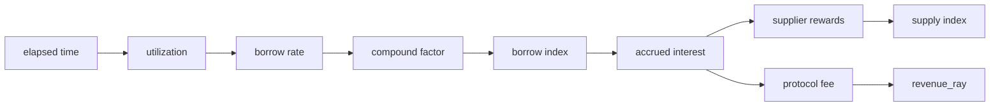
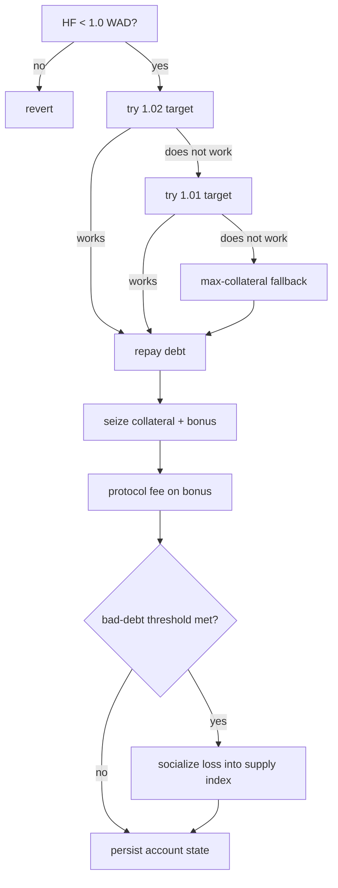
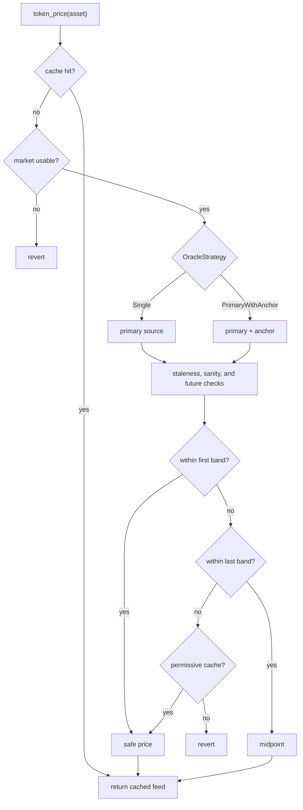

# Protocol Invariants

This document summarizes the safety properties the lending protocol is expected
to preserve at runtime. An **invariant** is a rule that must stay true at every
moment — before and after every operation. If one ever breaks, the protocol has
a bug. This document is the catalog of those rules, written for auditors,
researchers, integrators, and operators who need a concise map of how the
protocol protects solvency, accounting, and oracle-dependent state.

Runtime behavior is defined by the Rust contracts. References use module paths
rather than line numbers so the document remains stable as the code evolves.

## Notation

| Domain | Scale | Used for |
|---|---:|---|
| Asset-native | token decimals | Token transfers and user-entered amounts |
| BPS | `10^4` | LTV, liquidation thresholds, fees, reserve factor, tolerances |
| WAD | `10^18` | USD values, health factor, isolated debt, normalized prices |
| RAY | `10^27` | Rates, indexes, scaled balances |

Evidence references:

- Runtime code: `common/src/*`, `contracts/pool/src/*`, `contracts/controller/src/*`
- Certora rules: `verification/certora/{common,pool,controller}/spec/*_rules.rs`
- Fuzz/property tests: `verification/fuzz/fuzz_targets/*`, `verification/test-harness/tests/*`

---

## 1. Numeric Model

### 1.1 Fixed-Point Boundaries

Values must be rescaled into the target domain before comparison, persistence,
or transfer. Asset-native values cross into protocol math through token
decimals. Prices and solvency are WAD. Rates and indexes are RAY.

| Runtime | Verification |
|---|---|
| `common::math::fp`, `common::math::fp_core`, `common::rates` | `math_rules`, `fp_math`, `fp_ops` |

### 1.2 Rounding

Fixed-point multiply/divide uses half-up rounding unless a call site explicitly
requires floor or truncation.

```text
mul(a, b, precision) = (a * b + precision / 2) / precision
div(a, b, precision) = (a * precision + b / 2) / b
```

Expected tolerance is at most half of one target-precision unit per operation.

| Runtime | Verification |
|---|---|
| `common::math::fp_core::mul_div_half_up`, `Bps`, `Wad`, `Ray` | `math_rules`, `fp_math` |

### 1.3 Scaled Balance Reconstruction

Positions store scaled balances. Actual balances are reconstructed from the
current market indexes.

```text
supply_actual = scaled_supply * supply_index / RAY
borrow_actual = scaled_debt   * borrow_index / RAY
```

With a fixed scaled amount, increasing indexes imply increasing actual balances.

| Runtime | Verification |
|---|---|
| `contracts/pool/src/lib.rs`, `contracts/pool/src/cache.rs`, `contracts/pool/src/views.rs`, `common::rates::scaled_to_original` | `index_rules`, `position_rules`, `rates_and_index` |

### 1.4 Borrow Index

If elapsed time, utilization, and borrow rate are non-negative:

```text
interest_factor >= RAY
new_borrow_index >= old_borrow_index
```

The borrow-rate model is bounded by `MAX_BORROW_RATE_RAY`. Pool accrual splits
long idle periods into bounded chunks before applying compound interest.

| Runtime | Verification |
|---|---|
| `common::rates`, `contracts/pool/src/interest.rs` | `index_rules`, `interest_rules`, `rates_and_index` |

### 1.5 Supply Index

Outside bad-debt socialization, the supply index must not decrease.

```text
new_supply_index >= old_supply_index
```

The only permitted decrease is `apply_bad_debt_to_supply_index`. The result is
floored at `SUPPLY_INDEX_FLOOR_RAW = 10^18` raw RAY. Revenue-accrual paths
short-circuit at or below that floor.

| Runtime | Verification |
|---|---|
| `common::rates::update_supply_index`, `contracts/pool/src/interest.rs`, `common/src/constants/` | `index_rules`, `interest_rules` |

### 1.6 Empty-Market Utilization

Utilization is:

```text
U = borrowed_actual / supplied_actual
```

When supplied value is zero, utilization is defined as zero.

| Runtime | Verification |
|---|---|
| `contracts/pool/src/cache.rs`, `contracts/pool/src/views.rs`, `common::rates::utilization` | `interest_rules` |

---

## 2. Pool Accounting

### 2.1 Interest Split

Borrow-index accrual must preserve:

```text
accrued_interest = new_total_debt - old_total_debt
protocol_fee     = accrued_interest * reserve_factor_bps / BPS
supplier_rewards = accrued_interest - protocol_fee

accrued_interest = supplier_rewards + protocol_fee
```

| Runtime | Verification |
|---|---|
| `common::rates::calculate_supplier_rewards`, `contracts/pool/src/interest.rs` | `interest_rules`, `rates_and_index` |



### 2.2 Revenue Bound

Protocol revenue is represented as a scaled supply claim:

```text
0 <= revenue_ray <= supplied_ray
```

Fees increase `revenue_ray` and `supplied_ray` together. Revenue appreciates
with the supply index until claimed.

| Runtime | Verification |
|---|---|
| `contracts/pool/src/interest.rs`, `contracts/pool/src/lib.rs::claim_revenue`, `contracts/pool/src/lib.rs::seize_position` | `solvency_rules`, `flow_e2e` |

### 2.3 Reserve Availability

Outgoing liquidity must be bounded by current reserves. This applies to
borrow, withdraw, strategy borrow legs, and flash-loan starts. Revenue claim is
capped to the currently available reserves.

| Runtime | Verification |
|---|---|
| `contracts/pool/src/cache.rs::has_reserves`, `contracts/pool/src/lib.rs`, controller borrow/withdraw/flash-loan paths | `boundary_rules`, `flash_loan_rules`, `flow_e2e` |

### 2.4 Revenue Claim

Revenue claim cannot transfer more than current reserves. If reserves are below
the realized treasury claim, the pool transfers the available amount and burns
the proportional scaled revenue. The burn preserves `revenue_ray <= supplied_ray`.

| Runtime | Verification |
|---|---|
| `contracts/pool/src/lib.rs::claim_revenue`, `contracts/controller/src/router.rs::claim_revenue` | `solvency_rules`, `boundary_rules` |

### 2.5 Flash-Loan Repayment

A pool flash loan must end with:

```text
pool_balance_after >= pool_balance_before + fee
```

`pool.flash_loan` snapshots the pool balance before funds leave, calls the
receiver callback, pulls `amount + fee` from the receiver, and verifies the
post-repayment balance.

| Runtime | Verification |
|---|---|
| `contracts/controller/src/strategies/flash_loan.rs`, `contracts/pool/src/lib.rs::flash_loan` | `flash_loan_rules`, `flow_strategy`, `fuzz_strategy_flashloan` |

---

## 3. Account Solvency

### 3.1 Health Factor

Health factor is computed in USD WAD.

```text
weighted_collateral = Σ(collateral_value * liquidation_threshold_bps / BPS)
total_borrow        = Σ(borrow_value)
HF                  = weighted_collateral / total_borrow
```

Rules:

- With debt, `HF >= 1.0 WAD` is solvent.
- With debt, `HF < 1.0 WAD` is liquidatable.
- With no debt, `HF = i128::MAX`.

| Runtime | Verification |
|---|---|
| `contracts/controller/src/helpers/mod.rs`, borrow/withdraw/liquidation paths | `health_rules`, `solvency_rules`, `liquidation_rules`, `flow_e2e` |

### 3.2 Borrow Admission

New debt is bounded by LTV-weighted collateral.

```text
post_borrow_total_debt <= Σ(collateral_value * loan_to_value_bps / BPS)
```

LTV controls borrow admission. Liquidation threshold controls liquidation.
Configuration requires `liquidation_threshold_bps > loan_to_value_bps`.

| Runtime | Verification |
|---|---|
| `contracts/controller/src/positions/borrow.rs`, `contracts/controller/src/validation.rs` | `boundary_rules`, `position_rules` |

### 3.3 Liquidation Progress

Liquidation is available only below `1.0 WAD` health factor. The controller
tries a primary target, then a fallback target, then a maximum-collateral path
for unrecoverable accounts. The fallback path must not worsen account health.

| Runtime | Verification |
|---|---|
| `contracts/controller/src/helpers/mod.rs`, `contracts/controller/src/positions/liquidation.rs`, `contracts/pool/src/lib.rs::seize_position` | `liquidation_rules`, `solvency_rules`, `fuzz_liquidation_differential` |



### 3.4 Isolation Debt

For isolated collateral:

```text
0 <= isolated_debt_usd_wad <= isolation_debt_ceiling_usd_wad
```

The tracker is denominated in USD WAD. Borrow increments it. Repay and
liquidation decrement it. Residual debt below `1 WAD` is rounded down to zero
on decrement to avoid persistent dust.

| Runtime | Verification |
|---|---|
| `contracts/controller/src/positions/isolated_debt.rs` (`adjust_isolated_debt_usd`, `adjust_isolated_debt_for_repay`), `contracts/controller/src/cache/mod.rs` | `isolation_rules`, `fuzz_multi_asset_solvency` |

Note: dust removal is applied on decrement. This is conservative for ceiling
enforcement. Any reuse of the isolated-debt tracker for settlement accounting
requires a separate review.

Note (accepted limitation — soft bound, not a hard guarantee): the tracker is
*asymmetric* across the interest dimension. Borrow increments by the borrowed
**principal** valued at borrow-time price; repay and liquidation decrement by
the repaid amount **including accrued interest** valued at current price
(`scaled_amount * borrow_index -> to_asset`). Because interest accrues outside
transactions and is never added on the increment side but is subtracted on the
decrement side, the counter drifts monotonically *below* true aggregate
outstanding isolated debt over time. As the counter is global per collateral
asset (shared by every account isolated on it), one account's
interest-inflated decrement can consume another account's still-outstanding
principal contribution, freeing ceiling headroom below the configured cap.

Consequence: `isolation_debt_ceiling_usd_wad` is a **monitored soft bound**,
not a hard cap on marked-to-market aggregate exposure. The drift is always in
the permissive direction (under-count), so aggregate exposure to a risky
isolated asset can exceed the configured ceiling over long-lived, multi-account
positions. This is accepted because (a) every individual isolated position
remains LTV-collateralized and independently liquidatable, and (b) operators
monitor `IsolatedDebt(asset)` and can pause or re-cap a market. It is **not**
direct insolvency or theft. If the ceiling must become a hard guarantee, track
each account's recorded contribution and clamp its decrement to that
contribution (per-account isolated-debt key), or add a keeper recompute of the
counter from live positions. See ADR 0008 (accepted-costs) and the 2026-05-29
security audit.

---

## 4. Market and Oracle Configuration

### 4.1 Market Parameters

Market configuration must preserve:

- `liquidation_threshold_bps > loan_to_value_bps`
- `liquidation_threshold_bps <= BPS`
- `liquidation_threshold_bps * (BPS + liquidation_bonus_bps) <= BPS * BPS`
  (derived per-asset seizure ceiling; there is no flat `MAX_LIQUIDATION_BONUS`)
- `liquidation_fees_bps <= BPS`
- `flashloan_fee_bps <= MAX_FLASHLOAN_FEE_BPS`
- non-negative supply cap, borrow cap, and isolation debt ceiling
- dust floors are zero (disabled) or `>= MIN_DUST_FLOOR_WAD`
- `reserve_factor_bps < BPS`
- `0 < mid_utilization_ray < optimal_utilization_ray < RAY` and
  `optimal_utilization_ray <= max_utilization_ray <= RAY`
- monotonic rate slopes bounded by `MAX_BORROW_RATE_RAY`

| Runtime | Verification |
|---|---|
| `contracts/controller/src/validation.rs`, `contracts/controller/src/config.rs`, `contracts/pool/src/lib.rs::update_params` | `boundary_rules`, `interest_rules`, config tests |

### 4.2 Oracle Configuration

For each active market:

- token decimals are read from the token contract
- per-source oracle decimals are read from each configured source (Reflector
  decimals in `[1, 18]`; RedStone fixed)
- strategy and anchor are consistent (`PrimaryWithAnchor` ⇔ an anchor exists)
  and `primary != anchor`
- required feeds must resolve during configuration
- `twap_records <= 12` for any Reflector `Twap` source
- stale-price window is within `[60, 86_400]` seconds
- sanity bounds satisfy `0 < min_sanity_price_wad < max_sanity_price_wad`
- `first_tolerance_bps < last_tolerance_bps`

Required decimals are discovered on-chain, not supplied by operators.

| Runtime | Verification |
|---|---|
| `contracts/controller/src/config.rs`, `contracts/controller/src/oracle/mod.rs` | `oracle_rules`, oracle tests |

### 4.3 Price Resolution

Supported strategies (`OracleStrategy`):

- `Single`: primary source only. A `Single` + Reflector `Spot` configuration is
  rejected in non-testing builds.
- `PrimaryWithAnchor`: primary checked against an anchor source; a missing,
  unreadable, or stale-and-unusable anchor degrades to the primary only where
  the active policy allows it.

If both anchor and primary prices are available:

1. Inside the first tolerance band, return the primary price.
2. Inside the last tolerance band, return the midpoint.
3. Outside the last tolerance band, strict paths revert and permissive paths
   return the primary price.

`PrimaryWithAnchor` may degrade to primary-only when the anchor is missing,
unreadable, or stale-and-unusable, but only if the active `OraclePolicy`
allows `allows_degraded_dual_source`.

Future-dated oracle samples beyond the clock-skew window always revert.

| Runtime | Verification |
|---|---|
| `contracts/controller/src/oracle/mod.rs`, `contracts/controller/src/oracle/compose.rs`, `contracts/controller/src/cache/mod.rs` | `oracle_rules` (policy branches, harness-summarised), `oracle_compose_rules` (dual-source degradation), `tolerance_math_rules` (production ratio-band math), oracle tests |



---

## 5. Storage and Boundaries

### 5.1 Controller and Pool Boundary

The controller depends on the pool ABI, not pool internals. Pools are
owner-gated: accounting and maintenance mutations enforce controller
ownership, pool WASM upgrade is owner-gated, and pools do not make
protocol-level risk decisions.

| Runtime | Verification |
|---|---|
| `interfaces/pool/src/lib.rs`, `contracts/controller/Cargo.toml`, `contracts/pool/src/lib.rs` (`#[only_owner]`) | build graph, controller-to-pool tests |

### 5.2 Account Storage

Account state is split into:

- `AccountMeta(account_id)`
- `SupplyPositions(account_id): Map<Address, AccountPositionRaw>`
- `BorrowPositions(account_id): Map<Address, DebtPositionRaw>`

The asset is the map key. The position side is the storage family. Collateral
positions (`AccountPositionRaw`) carry the open-time risk snapshot; debt
positions (`DebtPositionRaw`) carry only the scaled share. Neither duplicates
asset, account id, or side.

Side-map writes remove empty maps and bump account metadata TTL when metadata
exists. Account removal removes metadata and both side maps.

| Runtime | Verification |
|---|---|
| `contracts/controller/src/storage/account.rs` | `position_rules`, storage tests |

### 5.3 TTL Maintenance

Persistent account and shared protocol state require explicit TTL extension.
Keeper keepalive paths cover shared market/e-mode state, account metadata and
position maps, and pool instance state.

| Runtime | Verification |
|---|---|
| `contracts/controller/src/storage/ttl.rs`, on-chain `renew_account`, off-chain keeper `ExtendFootprintTtl` | `account_ttl_regression_tests` |

---

## 6. Design Commitments

These are intentional design choices. Changes to them require protocol review:

- Half-up rounding is the default for fixed-point multiply/divide.
- Protocol revenue is represented as scaled supply.
- Token and oracle decimals are discovered on-chain during configuration.
- Account storage is split by side to avoid loading unrelated positions.
- Strategy routes are validated against controller commitments, not trusted
  from an off-chain quote or router response alone.

---

## 7. Re-Verification Checklist

Re-run the relevant tests, fuzz targets, and Certora rules after changes to:

- fixed-point arithmetic, rate curves, or index updates
- pool reserve accounting or protocol revenue accounting
- liquidation, health-factor, or LTV admission logic
- isolation debt accounting
- oracle configuration or price resolution
- account storage layout or TTL keepalive paths
- controller-to-pool ABI signatures

Minimum properties to re-check:

- scaled-to-actual reconstruction
- `revenue_ray <= supplied_ray`
- interest split identity
- health factor around `1.0 WAD`
- borrow admission against LTV
- isolated-debt ceiling and decrement behavior
- supply-index floor during bad-debt socialization
- reserve caps for borrow, withdraw, flash loan, and revenue claim

## Related Documents

- [README.md](../README.md)
- [SECURITY.md](../SECURITY.md)
