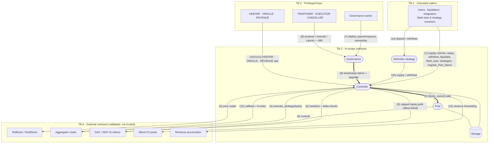

# XOXNO Lending — STRIDE Threat Model

## What are we working on?

### Project summary

XOXNO Lending is an over-collateralized lending and borrowing protocol on Stellar Soroban. Users supply listed assets as collateral, borrow against them, and are liquidated when a position's health factor falls below 1.0.

The protocol uses a governance → controller → pool architecture. Governance owns the controller and schedules admin changes through a 48-hour timelock. The controller is the single user-facing contract: it owns accounts, market and oracle config, risk checks, liquidation, flash loans, and strategies. One central pool, owned by the controller, holds custody and per-market accounting.

A DeFindex strategy adapter exposes a vault deposit/withdraw surface over the controller for a single asset market. All claims in this document are grounded in the contract source at the revision listed in Scope.

### Scope

| Field | Value |
| --- | --- |
| Project | XOXNO Lending (multi-asset lending protocol for Stellar Soroban) |
| Repository | `XOXNO/rs-lending-xlm` |
| Revision | `80ffa64` (2026-06-20) |
| In scope | `contracts/governance`, `contracts/controller`, `contracts/pool`, `contracts/defindex-strategy` (with their interfaces and the shared `common` library) |
| Out of scope | Off-chain components (indexer, API, UI, keeper service) |
| Framework | STRIDE (SDF Audit Bank guidance) |
| Status | Pre-audit |

### In-scope contracts

| Contract | Role | Authority / trust | Key security behavior |
| --- | --- | --- | --- |
| Governance | Owns the controller; schedules admin changes. | Owner and timelock delegates hold privileged authority; controller trusts governance as owner. | All governance-self mutations are timelocked; only `deploy_controller`, `pause`, `unpause`, and `accept_ownership` are owner-immediate (`self_timelock.rs`, `forward.rs:252-263`). |
| Controller | Single user-facing contract for accounts, risk, liquidation, flash loans, and strategies. | Owned by governance; scoped `KEEPER`/`ORACLE`/`REVENUE` roles. | Starts paused (`governance/access.rs:89-112`); enforces auth, validation, and oracle policy on every mutation. |
| Pool | Central liquidity custody and per-market accounting. | Owned by controller; trusts controller as sole mutator. | Every mutating/upgrade entrypoint is `#[only_owner]` (controller-only); borrowable liquidity tracked by internal `cash`, not live balance (`pool/lib.rs`, `pool/cache.rs:108-112`). |
| DeFindex strategy | Vault adapter over the controller for one asset. | No protocol role; bound at construction to one market. | `deposit`/`withdraw` require `from.require_auth()` (`defindex-strategy/src/lib.rs:158,190`). |

### External dependencies and trust assumptions

| Dependency | Trust treatment |
| --- | --- |
| Wallets / users / liquidators / integrators | Untrusted; authorized per call via `require_auth` and account-owner match. |
| Oracle adapters (Reflector / RedStone) | Untrusted; governance-configured and validated for staleness, sanity, deviation, and future-skew. |
| Aggregator router | Untrusted; governance-set address; output validated by balance delta. |
| SAC / SEP-41 token contracts | Untrusted; accounted by balance delta. |
| Blend V2 pools | Untrusted; usable only as an allow-listed migration source with capped pulls. |
| Revenue accumulator | Governance-set destination; no caller-chosen target. |
| Test-only contracts / `#[cfg(testing)]` entrypoints | `mock-oracle`, `mock-redstone`, `flash-loan-receiver`, and gated test entrypoints. Must not ship in production WASM. |

### Primary flows

1. **Entry.** The caller authorizes; a flash-loan re-entrancy guard runs; the controller validates inputs and the pool accrues interest before each mutation.
2. **Supply / borrow.** Supply adds collateral without a health gate. Borrow disburses funds, then enforces LTV and health factor ≥ 1.0 in the same transaction (`validation.rs:58-93`).
3. **Repay / withdraw.** Repay is permissionless with overpayment refunded. Withdraw is owner-gated and subject to a post-state health gate.
4. **Liquidate.** Permissionless once health factor < 1.0; seizes collateral plus bonus and fee. Residual bad debt is socialized via a floored supply-index reduction (`pool/interest.rs:73-97`).
5. **Strategies / governance.** Strategies route through the governance-set router under a single-flight guard. Governance changes admin config through the timelock; pause and unpause are immediate.

### Data-flow diagram and trust boundaries

Edge numbers `(n)` are referenced by the threat table.

- **TB-1 — Untrusted callers.** Every submitter may craft arbitrary parameters. Enforcement is on-chain via `require_auth`, account-owner match, input validation, and the post-state health gate.
- **TB-2 — Privileged keys.** Governance owner plus scoped controller roles (`KEEPER`, `ORACLE`, `REVENUE`) and timelock delegates (`PROPOSER`, `EXECUTOR`, `CANCELLER`).
- **TB-3 — In-scope protocol contracts.** Governance owns the controller, which owns the pool; the pool trusts its owner exclusively. DeFindex holds no protocol role.
- **TB-4 — External contracts.** Oracle, router, token, Blend, and accumulator outputs are validated at the boundary and never trusted implicitly.

### Reviewer navigation note

Flow numbers in the diagram above are referenced by issue IDs in the threat table. Each threat ID maps to one or more remediation IDs in the next section. Status labels distinguish implemented controls, launch gates, planned hardening, and accepted residual risk.

---

## What can go wrong?

### STRIDE reminders

| Mnemonic Threat | Definition | Question |
| --- | --- | --- |
| **S**poofing | Impersonating another user or component to gain unauthorized access. | Is the user who they say they are? |
| **T**ampering | Unauthorized alteration of data or code. | Has the data or code been modified? |
| **R**epudiation | Denying having taken an action. | Can the action be proven if denied? |
| **I**nformation Disclosure | Over-sharing of data expected to be private. | Is excessive data exposed? |
| **D**enial of Service | Harming availability of the system. | Can someone impact availability without authorization? |
| **E**levation of Privilege | Gaining privileges beyond those granted. | Can a user gain access they should not have? |

### Threat table

| Threat | Issues |
| --- | --- |
| **S**poofing | **Spoof.1 — Flow 1: Unauthorized account action.** A caller may attempt to borrow from or withdraw against an account they do not own, gaining access to another user's collateral or debt position.  **Spoof.2 — Flow 9: Admin impersonation.** A non-governance caller may attempt to invoke owner-only setters or `upgrade` on the controller or pool, altering protocol configuration or code.  **Spoof.3 — Flow 3: Counterfeit oracle source.** A market may be priced against a fake or compromised oracle feed if source configuration is not strictly governed and validated.  **Spoof.4 — Flow 6/1a: Substituted integration source.** An attacker may supply a spoofed Blend pool in `migrate_from_blend`, or perform a DeFindex vault action on behalf of another account.  **Spoof.5 — Test entrypoints in production.** A production build may ship with the `testing` feature enabled, or a mock oracle may be wired as a live price source. |
| **T**ampering | **Tamper.1 — Flow 1: Crafted parameters.** A caller may submit amounts or asset lists designed to violate risk rules, such as exceeding LTV or driving health factor below 1.0 while still completing the mutation.  **Tamper.2 — Flow 4: Router output manipulation.** A malicious or sandwiched aggregator route may return materially less than expected. The controller validates only `received > 0` (`swap.rs:175`), while slippage protection is delegated to the router payload.  **Tamper.3 — Flow 5: Donation / inflation.** A caller may donate tokens directly to the pool in an attempt to inflate borrowable liquidity or manipulate share price accounting.  **Tamper.4 — Flow 2: Direct pool mutation.** A non-controller caller may attempt to mutate pool accounting or balances without going through the controller's validation path.  **Tamper.5 — Flow 3: Oracle price manipulation.** A stale, future-dated, or diverging oracle price may be used to over-borrow against inflated collateral values or to trigger incorrect liquidations. |
| **R**epudiation | **Repudiate.1 — Flow 8/9: Unattributable governance execution.** Governance actions are signed ledger entries and non-repudiable by default. The one gap is `execute(executor = None)`, which runs permissionlessly so the executor identity may be unrecorded (`timelock.rs:47-52`). |
| **I**nformation Disclosure | **Info.1 — Public-ledger baseline.** All on-chain state is public and holds no secrets. Account enumeration and MEV visibility are inherent to a public chain, not protocol-specific vulnerabilities.  **Info.2 — View/mutation divergence.** View functions use the permissive `View` oracle policy while mutations use strict `RiskIncreasing`. A quoted figure from a view may imply an action that the corresponding mutation would reject. |
| **D**enial of Service | **DoS.1 — Flow 3: Oracle outage halt.** When all oracle sources are stale, risk-increasing flows and liquidation fail closed until price feeds recover, temporarily blocking borrows and liquidations.  **DoS.2 — Flow 16: Storage archival.** Contract storage archives if its TTL lapses, requiring an explicit restore before mutating entrypoints can be called again.  **DoS.3 — Flow 5/6: Bad-debt socialization.** Residual bad debt from liquidations is socialized by reducing the supply index, imposing a loss on suppliers who remain in the pool.  **DoS.4 — Flow 7: Indefinite pause.** The governance owner can pause the protocol immediately with no delay, guardian role, or auto-expiry (`forward.rs:252-263`). |
| **E**levation of Privilege | **Elevation.1 — Flow 7/8/9: Governance key compromise.** Admin changes are timelocked, but the owner holds PROPOSER, EXECUTOR, and CANCELLER simultaneously, so the delay only protects when a separate canceller is configured (`access.rs:109-127`).  **Elevation.2 — Flow 10/11/12: Role abuse.** Scoped roles carry operational power: `KEEPER` can restamp account risk params, `ORACLE` can disable markets, and `REVENUE` can claim accumulated protocol revenue.  **Elevation.3 — Flow 2/9: Malicious upgrade.** A malicious controller or pool upgrade, once executed through the timelock, bypasses all on-chain risk checks encoded in the current WASM.  **Elevation.4 — Flow 15: Callback re-entrancy.** A flash-loan receiver, aggregator router, or Blend callback may re-enter a controller mutator mid-transaction, attempting to bypass single-flight guards or observe inconsistent state. |

---

## What are we going to do about it?

Status labels: **Implemented** (in code), **Launch gate** (required before mainnet unpause), **Accepted** (residual risk), **Planned** (scheduled hardening).

| Threat | Issues |
| --- | --- |
| **S**poofing | **Spoof.1.R.1 — Implemented. Authorization gates.** `require_auth` plus account-owner match on every borrow, withdraw, and strategy path (`borrow.rs:40`, `withdraw.rs:66`).  **Spoof.2.R.1 — Implemented. Owner-only admin surface.** Owner-only setters and `upgrade` are `#[only_owner]`; `upgrade` auto-pauses the controller.  **Spoof.2.R.2 — Launch gate. Ownership transfer.** Transfer ownership to governance and remove deployer authority before unpause.  **Spoof.3.R.1 — Implemented. Governed oracle configuration.** Oracle sources are governance-configured and live-probed; risk-increasing flows require a primary and an anchor within tolerance (`oracle/policy.rs`).  **Spoof.4.R.1 — Implemented. Allow-listed integrations.** Blend pools are allow-listed with capped pulls (`migrate_blend.rs:117-121`); DeFindex is bound to one market and requires `from.require_auth()`.  **Spoof.5.R.1 — Launch gate. Production build hygiene.** Production builds disable the `testing` feature and use no mock oracles, enforced by a build/deploy check. |
| **T**ampering | **Tamper.1.R.1 — Implemented. On-chain input re-validation.** All inputs are re-validated on-chain, ending in the post-state health gate (`validation.rs:58-93`).  **Tamper.2.R.1 — Accepted. Router-level slippage control.** Slippage is enforced in the governance-set router payload; route bytes are opaque to the controller.  **Tamper.2.R.2 — Planned. Controller-side minimum-output floor.** Add an optional caller-supplied minimum-output parameter to strategy entrypoints as defense in depth.  **Tamper.3.R.1 — Implemented. Internal cash accounting.** Borrowable liquidity is tracked by internal `cash`, so direct token donations to the pool are inert (`pool/cache.rs:108-112`).  **Tamper.4.R.1 — Implemented. Controller-only pool mutations.** Pool mutating and upgrade entrypoints are `#[only_owner]` (controller-only).  **Tamper.5.R.1 — Implemented. Fail-closed oracle policy.** Risk-increasing and liquidation flows fail closed on stale, deviating, or out-of-sanity prices, with an unconditional future-skew guard (`oracle/policy.rs`, `oracle/price.rs`).  **Tamper.6.R.1 — Accepted / Planned. SAC-only re-entrancy assumption for post-state persistence.** Withdraw, repay, liquidation, and strategy flows persist the controller account *after* the pool's `transfer_out`/SAC transfer (`withdraw.rs:89-93`, `liquidation.rs:76-87,198`), and the pool itself commits (`save`) before `transfer_out` (`pool/lib.rs:178-179`). This is safe today because listed assets are SAC/SEP-41 tokens with no transfer hook, and the `FlashLoanOngoing` single-flight guard brackets the only callback-bearing flows (flash loan, Blend submit, aggregator swap). A non-SAC / hookable token could re-enter against pre-persistence account state and double-spend; mitigated operationally by SAC-only governance onboarding. **Planned defense-in-depth (not required pre-launch):** add a transient re-entrancy lock to state-changing entrypoints (reusing the `FlashLoanOngoing` pattern) and pin a "listed assets must be non-reentrant SAC/SEP-41" invariant at token onboarding, so safety does not rest solely on token semantics. |
| **R**epudiation | **Repudiate.1.R.1 — Implemented. Signed ledger entries and events.** Every change is a signed ledger entry with a typed event; timelock operations record the proposer over a fixed delay.  **Repudiate.1.R.2 — Launch gate. Explicit executor identity.** Pass an explicit `EXECUTOR` address to `execute` so the executing identity is recorded on-chain. |
| **I**nformation Disclosure | **Info.1.R.1 — Accepted. Public-ledger baseline.** No secrets are stored on-chain; MEV exposure is mitigated by permissionless, competitive liquidations.  **Info.2.R.1 — Implemented. Conservative view limits.** Views never overstate feasibility (`views/limits.rs`); the mutation path is the authoritative gate. |
| **D**enial of Service | **DoS.1.R.1 — Implemented. Fail-closed with de-risk paths.** Fail-closed is the safe mode during oracle outages; `ORACLE` role can scope an outage and repay/withdraw remain open so users can de-risk.  **DoS.2.R.1 — Implemented / Launch gate. TTL refresh and restore.** Mutating entrypoints refresh TTL in-band (`storage/ttl.rs`); a restore procedure covers prolonged inactivity.  **DoS.3.R.1 — Accepted. Bounded bad-debt socialization.** Socialization is bounded by a supply-index floor and a bad-debt threshold (`pool/interest.rs:73-97`); caps and timely cleanup limit accumulation.  **DoS.4.R.1 — Launch gate / Planned. Pause governance hardening.** A multisig owner holds pause authority; a separate guardian role and bounded pause window are planned.  **DoS.5.R.1 — Implemented. Intentional pause coverage (freeze risk-increasing, keep self-defense open).** `pause` is an operational risk brake, **not** a full system halt. Risk-increasing and external-surface flows are gated `#[when_not_paused]`: `supply`, `borrow`, all strategies, `repay_debt_with_collateral` (touches the aggregator), `claim_revenue`, `add_rewards`, `update_indexes`, `update_account_threshold`. Risk-decreasing self-defense and liquidation flows stay **open by design**: `repay`, `withdraw`, `liquidate`, `clean_bad_debt`, `renew_account`. Rationale: liquidations and interest accrual continue during a pause, so `repay`/`withdraw` must stay available or borrowers could be liquidated with no recourse — and since `supply` is paused, `repay` is a borrower's only self-rescue. These flows extract no value beyond entitlement: indebted withdraws remain strict-`RiskIncreasing`-oracle + post-pool-HF gated, and plain `repay` runs under the lenient `Repay` policy with no load-bearing oracle dependency, so it is safe even during an oracle-triggered pause. A true full-stop is the separate `upgrade`-to-frozen path (the controller starts paused and `upgrade` auto-pauses, `governance/access.rs:83,89`). |
| **E**levation of Privilege | **Elevation.1.R.1 — Implemented. Timelocked admin changes.** Governance-self and controller admin changes are timelocked ~48h and monotonic (`self_timelock.rs`, `timelock.rs:32-40`).  **Elevation.1.R.2 — Launch gate. Role separation.** Multisig owner with a distinct canceller delegate so the timelock delay provides meaningful protection.  **Elevation.2.R.1 — Implemented. Minimally scoped roles.** Roles are minimally scoped; threshold updates carry a health-factor buffer, and LTV/bonus do not affect the health factor (`router.rs:364-377`, `helpers/math.rs:158-159`); revenue has a fixed destination.  **Elevation.3.R.1 — Implemented / Planned. Timelocked upgrades with hash pinning.** Upgrades are owner-only and reach the controller only via the timelock; release WASM hashes are pinned, and a non-zero-hash check at proposal time is planned.  **Elevation.4.R.1 — Implemented. Re-entrancy guards.** A single-flight `FlashLoanOngoing` guard blocks re-entrant mutators, and the pool asserts its balance is unchanged across the flash callback (`validation.rs:44-50`, `pool/lib.rs:383-388`). |

---

## Did we do a good job?

**Has the data flow diagram been referenced since it was created?**  
Yes. The four trust boundaries structured the threat list, and each issue ID maps to one or more numbered diagram edges.

**Did the STRIDE model uncover any new design issues or concerns that had not been previously addressed or thought of?**  
Yes. The model surfaced a small set of items not previously tracked:

1. No controller-side swap minimum-output enforcement (Tamper.2; planned: Tamper.2.R.2).
2. Governance owner holding all three timelock roles simultaneously (Elevation.1; launch gate: Elevation.1.R.2).
3. Indefinite owner pause with no guardian or expiry (DoS.4; launch gate / planned: DoS.4.R.1).
4. Upgrade WASM hash not validated at proposal time (Elevation.3; planned: Elevation.3.R.1).
5. `testing`-feature build hygiene for production deployments (Spoof.5; launch gate: Spoof.5.R.1).

One candidate was retired after review: LTV and liquidation-bonus do not enter the health factor, so `update_account_threshold` correctly gates only the threshold branch (Elevation.2.R.1).

**Did the treatments adequately address the issues in the threat table?**  
The core auth, oracle, accounting, and re-entrancy risks are covered by implemented controls verified by the unit, property, fuzz, and formal-verification suites. The remainder are launch gates (ownership transfer, role separation, build hygiene) or small planned hardenings. The main residual risk is concentration of authority in the governance owner key, reduced but not eliminated by the timelock.

**Have any additional issues been found by other reviewers, testers, or users since the threat model was completed?**  
None outstanding. The model is re-run when a trust boundary changes (new integrations, oracle or router changes, new strategy entrypoints, role or timelock changes). The external audit may surface additional items.

**Is there anything you wish you had done differently when building this threat model?**  
Grounding each item in the contract source kept the analysis verifiable and right-sized. The status labels also serve as a pre-unpause checklist: no public unpause until every launch gate has release evidence and every planned item is delivered or accepted.