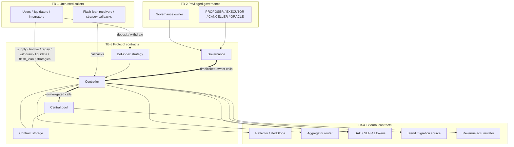

# XOXNO Lending STRIDE Threat Model

## Scope

| Field | Value |
| --- | --- |
| Project | XOXNO Lending |
| Repository | `XOXNO/rs-lending-xlm` |
| Revision | `f0a6057` |
| Framework | STRIDE |
| Status | Pre-audit |
| In scope | `contracts/governance`, `contracts/controller`, `contracts/pool`, `contracts/defindex-strategy`, shared `common` and interface crates |
| Out of scope | API, UI, indexer, and keeper service runtime operations |

This model describes the current governance -> controller -> central pool
protocol design. It should be re-run when storage keys, trust boundaries,
oracle policy, router behavior, strategy flows, governance roles, or upgrade
paths change.

## System Summary

Users interact with the controller. The controller owns account state, spoke
risk configuration, oracle checks, liquidation, flash loans, and strategy
entrypoints. Governance owns the controller and schedules admin changes through
timelock. The controller owns one central pool. Pool liquidity rows are keyed by
`HubAssetKey { hub_id, asset }`.

There are no controller `KEEPER`, `REVENUE`, or `ORACLE` roles in the current
design. Governance has operational roles `PROPOSER`, `EXECUTOR`, `CANCELLER`,
and `ORACLE`. The off-chain keeper renews TTLs and may call `update_indexes`,
which requires the caller signature but no controller role.

## In-Scope Contracts

| Contract | Role | Authority | Key Security Behavior |
| --- | --- | --- | --- |
| Governance | Owns controller and schedules protocol-admin operations. | Owner plus governance roles. | Timelocks admin proposals; keeps `deploy_controller`, `pause`, `unpause`, and `accept_ownership` immediate. |
| Controller | User-facing protocol contract. | Owned by governance. | Enforces auth, spoke config, oracle policy, health factor, position limits, flash-loan guard, and pool ownership boundary. |
| Pool | Central liquidity and accounting contract. | Owned by controller. | Mutating calls are owner-gated; tracks internal `cash`; stores `Params` and `State` by `HubAssetKey`. |
| DeFindex Strategy | Vault adapter over one configured `HubAssetKey` and `spoke_id`. | No protocol role. | Requires vault `from` auth; maps each vault to a controller account. |

## Trust Boundaries

## STRIDE Analysis

| Threat | Risk | Current Control | Residual / Gate |
| --- | --- | --- | --- |
| Spoofing | Caller acts for another account. | `require_auth`, account owner checks, delegate checks, and strategy `from` auth. | Keep delegate and position-manager changes covered by tests. |
| Spoofing | Fake or wrong oracle source. | Governance validates oracle configuration; reads require active `AssetOracle(asset)` and source-specific checks. | Production deployment must not wire mocks or testing feature artifacts. |
| Tampering | Crafted asset lists or amounts bypass risk. | Controller revalidates inputs, spoke listing, caps, indexes, and post-state health factor on-chain. | Strategy route slippage remains delegated to router payloads unless controller-side minimum output is added. |
| Tampering | Direct pool token donation inflates liquidity. | Pool uses internal `cash` for borrowable reserves; direct token balance changes do not increase borrowable liquidity. | Monitor integrations that depend on visible token balance rather than pool accounting. |
| Tampering | Non-controller mutates pool accounting. | Pool mutating and upgrade entrypoints are owner-gated to the controller. | Upgrade hash review remains a launch gate. |
| Repudiation | Governance execution cannot be attributed. | Soroban authorization records signer identity; governance events and timelock operation ids record scheduled execution. | Off-chain monitoring should preserve proposal and execution evidence. |
| Information Disclosure | Users expect private positions. | Stellar ledger state is public; no on-chain secrets are stored. | UI/API must not imply privacy. |
| Denial of Service | Oracle outage blocks risk flows. | Risk-increasing flows fail closed; repay and supported de-risk paths remain available. | Operational runbooks must cover oracle disable/reconfigure and pause decisions. |
| Denial of Service | Storage TTL expiry archives protocol state. | Contracts renew active keys; keeper renews and restores configured surface. | Keeper config must include current `markets = [{ hub_id, asset }]` rows. |
| Denial of Service | Indefinite pause blocks normal use. | Pause is immediate owner control and intentionally gates risk-increasing/external flows. | Multisig, pause policy, and release evidence are launch gates. |
| Elevation of Privilege | Governance key compromise upgrades protocol or changes risk. | Admin changes go through governance ownership and timelock except emergency operations. | Separate role holders, monitoring, and hash pinning remain launch hardening items. |
| Elevation of Privilege | Callback reentrancy bypasses state assumptions. | Controller flash-loan guard blocks reentrant mutators; pool verifies callback balance behavior. | New callbacks must be reviewed against the same guard surface. |

## Primary Residual Items

1. Controller-side minimum-output checks for strategy swaps are still defense in
   depth if router payload slippage is misconfigured.
2. Governance role separation and monitoring are required before public launch.
3. Production build hygiene must prove testing-only entrypoints and mock oracles
   are absent.
4. Upgrade WASM hashes need release evidence and independent review before
   execution.
5. Keeper configuration must stay synchronized with `HubAssetKey` markets and
   governance role storage.

## Review Triggers

Re-run this threat model when any of these change:

- `ControllerKey`, `PoolKey`, or account storage shape.
- Oracle source configuration or price policy.
- Strategy route format, callbacks, or migration integrations.
- Governance roles, timelock flow, or owner emergency powers.
- Keeper TTL discovery surface.
- Pool accounting, flash-loan settlement, or bad-debt socialization.
