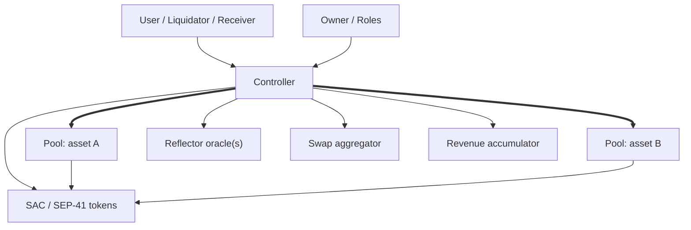

# System Overview

XOXNO Lending is a two-tier Soroban system:

1. `controller` is the only user-facing protocol entrypoint.
2. `pool` is deployed once per listed asset and owns custody plus asset-local accounting.

This separation gives the system a clean boundary. The controller decides whether an action is allowed. The pool executes the asset-local mutation requested by the controller.

## Components

| Component | Trust role | Responsibilities |
| --- | --- | --- |
| Controller | Protocol brain | Auth, account ownership, market registry, risk checks, oracle dispatch, e-mode, isolation, liquidation, strategy orchestration, flash-loan orchestration, pool deployment, pool upgrades, revenue forwarding. |
| Pool | Asset-local ledger | Token custody, reserves, scaled supply/debt totals, supply/borrow indexes, interest accrual, protocol revenue, rewards, bad-debt socialization, pool-side flash-loan repayment verification. |
| Pool interface | Stable cross-contract ABI | Contract client trait consumed by `controller`, keeping controller runtime code independent from `pool` internals. |
| Common | Shared model | Types, errors, events, fixed-point math, constants, interest-rate model helpers. |
| Reflector | Price provider | Spot, TWAP, decimals, and sample resolution. Controller validates every response before using it. |
| Aggregator | External liquidity router | Used by strategy operations. Controller enforces pre/post balance deltas and slippage floors. |
| Accumulator | Revenue sink | Receives claimed protocol revenue from the controller. |

## Controller responsibilities

The controller owns the protocol-level state and all user-facing decisions:

- Creates accounts and resolves account ownership.
- Stores `MarketConfig` for each listed asset.
- Stores per-account metadata plus supply and borrow maps.
- Validates LTV, health factor, caps, e-mode, isolation, siloed borrowing, and market status.
- Pulls prices from Reflector and applies strict or permissive oracle modes depending on operation risk.
- Calls pools as their owner/admin.
- Owns operator roles: `KEEPER`, `REVENUE`, and `ORACLE`.
- Routes strategy swaps through the configured aggregator.
- Pulls revenue from pools and forwards it to the accumulator.

## Pool responsibilities

Each pool handles exactly one asset:

- Stores immutable asset parameters in `MarketParams`.
- Stores mutable aggregate state in `PoolState`.
- Updates `borrow_index_ray` and `supply_index_ray`.
- Converts asset-native amounts to scaled RAY balances.
- Checks available reserves before borrow, withdraw, flash-loan, and claim flows.
- Accrues borrower interest and splits it between suppliers and protocol revenue.
- Holds protocol revenue as scaled supply until claimed.
- Verifies flash-loan repayment with a pre-balance snapshot.

Pools do not decide whether an account is solvent. The controller sends the current account position and price context; the pool mutates only the asset-local balance.

## Aave-style model, Stellar implementation

The protocol borrows the clean documentation model from Aave, but implements it with Soroban-native primitives:

| Concept | Implementation |
| --- | --- |
| Market / reserve | `MarketConfig` in the controller plus one deployed pool. |
| aToken | No tokenized receipt; supply is an `AccountPosition` scaled by `supply_index_ray`. |
| variable debt token | No tokenized debt; debt is an `AccountPosition` scaled by `borrow_index_ray`. |
| PoolConfigurator | Owner and role-gated controller config endpoints. |
| Oracle | Reflector spot/TWAP feeds with controller-side staleness and deviation checks. |
| Flash-loan receiver | Receiver contract must export `execute_flash_loan(initiator, asset, amount, fee, data)`. |

## Contract boundary

Every mutating pool ABI calls `verify_admin`, and the pool owner is set to the controller at construction. This means:

- Users never call pools directly for protocol actions.
- A pool mutation succeeds only when invoked through the controller.
- Pool upgrades and parameter updates are controller-mediated.
- Pool revenue claims transfer first to the controller, then to the configured accumulator.

## Core safety pattern

The system uses a consistent checks-effects-interactions style:

1. Authenticate the caller or role.
2. Reject flash-loan or strategy reentry when the shared guard is active.
3. Load market/account state through the controller cache.
4. Resolve prices and indexes.
5. Validate risk invariants.
6. Transfer tokens only when the accounting path is committed or about to be committed.
7. Flush changed side maps and isolated debt deltas.
8. Emit protocol events.
