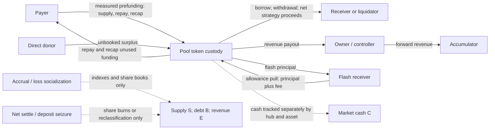

# Pool accounting, fixed-point arithmetic, and rates audit

Revision: `99613335b410f70ff42dd99d13ff530f6adaee67`. Completed 2026-09-05. Scope: all 34 production files in `contracts/pool/src/`, `common/src/math/`, and `common/src/rates/`. Production source unchanged.

No new ordinary-user fund-extraction path was confirmed in this scope. The review reproduced a known large-value accrual freeze, a conditional treasury fee-entitlement loss near the share ceiling, and two signed arithmetic helper defects outside valid pool inputs. This is a source and local host-test conclusion, conditional on the controller boundary and token behavior below; it is not a mainnet safety certification.

## Results requiring attention

| Item | Evidence and effect | Classification / reachability |
|---|---|---|
| Value ceiling freezes repayment and withdrawal | Existing controller regression passed again: one billion tokens, raised caps, disabled utilization cap, initial 98% utilization, XLM curve. Fourth annual accrual returns `MathOverflow`; repay and withdraw return the same error. Last committed borrow index is about 121.3, far below the index cap. | **Known material liveness limit**, already documented in `numeric-bounds.md`. This test establishes the configured local sequence, not current mainnet exposure. |
| Liquidation fee minted against pre-burn headroom | A 100-token gross withdrawal with a 10-token fee pays 90 correctly, but near maximum total supply the treasury receives only about 0.0000000316873 tokens of shares. Burning the withdrawn shares afterward frees capacity that was unavailable when fees were minted. | **Reproduced conditional accounting limitation.** Lost treasury entitlement, retained surplus; no liquidator overpayment or custody deficit. Controller liquidation and deployed-cap reachability unproved. |
| Negative downscale bias underflows | `rescale_half_up(env, i128::MIN, 1, 0)` panics although the quotient fits. | **Informational library defect.** No production pool caller supplying this signed extreme was found. |
| Negative integer-division bias underflows | `div_by_int_half_up(env, i128::MIN, 2)` panics although the quotient fits. | **Informational library defect.** Actual rate/compound callers use bounded nonnegative values. |
| Loss-index floor preserves unpaid claims | Writing off 900 tokens of debt against 900 tokens of supply leaves 0.9 token of claims at the 0.001 floor, with zero cash/debt. A 0.4 recap followed by 2.0 retains 0.4 then 0.5 and refunds 1.5; full withdrawal pays 0.9. | **Deliberate loss-policy limit**, reproduced through funded public pool operations. Supply entry rejects a material backing shortfall; recap restores backing without changing the index. |

Detailed independent reviews: [cash and operations](reviews/cash.md), [rates and interest](reviews/rates.md), [fixed-point math](reviews/math.md). Those records preserve each reviewer's original validation limits. The coordinator subsequently recovered the integration build and ran the ceiling/lifecycle tests described here.

## Trust and units

The controller owns the pool. Every exposed accounting mutator and WASM upgrade has an owner gate. Users reach the accounting through controller transactions. The pool trusts its owner to supply authentic stored positions, consistent asset decimals, correctly prefunded amounts, intended receivers, and liquidation/strategy mode flags. Minimal controller call-site inspection established this boundary; the controller, oracle, governance, and strategy routers were not re-audited here.

The pool stores aggregate markets, not individual user accounts. For each hub and asset:

| Symbol | Meaning / unit |
|---|---|
| `C` | Tracked market cash, native token units |
| `S` | Total scaled supply, including treasury shares |
| `B` | Total scaled debt |
| `E` | Treasury scaled supply, a subset of `S` |
| `Is`, `Ib` | Supply and borrow indexes, RAY fixed point |
| `T_asset` | Physical token balance of the pool contract; shared by all its hubs using this token |
| `R` | `10^27`, the RAY scale |
| `m` | `10^(27-decimals)`, raw RAY units per native token unit |

Pool parameter validation permits decimals 0 through 18; governance listing validation is stricter at 3 through 18. The arithmetic checks covered the entire pool range.

At successful operation boundaries, with authentic controller positions and ordinary exact-debit tokens:

```text
S = sum(user supply shares) + E
B = sum(user debt shares)
0 <= E <= S; C >= 0; B >= 0

T_asset = sum(C for all hub markets using that asset) + unbooked surplus
unbooked surplus >= 0

supply_claim = floor(S * Is / (R * m))
debt_backing = ceil(B * Ib / (R * m))
backing_shortfall = max(supply_claim - (C + debt_backing), 0)
```

The custody equation applies after the whole prefunding/call/refund sequence completes. It does not require a single market's cash to equal the shared token balance. Direct donations increase unbooked surplus, not tracked cash, user shares, or lending capacity. Revenue must not be added a second time to supplier liabilities. Integer aggregate claim/debt values differ from summing individually rounded positions; these are the guard's precise book values, not an equality of every rounded getter.

Backing and liquidity are separate. Debt backs supply accounting but cannot satisfy a token payout. The loss floor can also leave `backing_shortfall > 0`; that is an explicit exception to a fully backed market, not an invariant silently assumed for all states.

## Money-flow map



All following deltas exclude the interest sync performed immediately before the action. `A` is measured input or gross draw, `F` an asset fee, `O` a refund, and `J` retained recap funding. `q` denotes fee supply shares rounded down and capped to representable headroom. Deltas to token custody include the controller's prefunding where applicable.

| Operation | Money in/out | Accounting changes | Critical rule |
|---|---|---|---|
| Supply | Payer → pool `A` before call | `C += A`; `S` and user supply gain `floor(A*m*R/Is)` | Backing check occurs before accepting new supply; positive input must mint positive shares. Pool performs no incoming transfer itself. |
| Borrow | Pool → receiver `A` | `C -= A`; `B` and user debt gain `ceil(A*m*R/Ib)` | Positive draw; reserves; 2% liquidation buffer; post-mint utilization. |
| Ordinary withdrawal | Pool → receiver gross `G` | `C -= G`; burn identical user and total supply shares | Partial burns ceil shares; full close pays floor claim. Reserves, utilization, and no-orphan-debt guard. |
| Liquidation withdrawal | Pool → liquidator `G-F` | `C -= G-F`; mint `q` into `S,E`, then burn user supply | Require `0 <= F <= G`; reserves and no-orphan guard; utilization deliberately skipped. Returned actual amount is gross `G`. |
| Repay | Prefund `A`; pool → payer `O` | `C += A-O`; burn user/total debt | Full close charges ceil debt and refunds excess; partial burn rounds down. Refund was never credited to cash, so it needs no second cash debit. |
| Recapitalize | Prefund `A`; refund `A-J` | `J=min(A,shortfall)`; `C += J`; no share changes | Restores backing only. No reward shares and no index reset. Healthy market refunds everything. |
| Strategy draw | Pool → receiver `A-F` | Mint debt for gross `A`; `C -= A-F`; mint `q` into `S,E` | Shared borrow checks conservatively reserve gross `A`; fee may be disabled by authorized owner. |
| Flash loan | Send `A`, callback, pull `A+F` | Principal does not change `C` or `B`; successful net effect `C += F`, `S,E += q` | Exact balance brackets after send, callback, and pull. Callback must provide allowance for the prescribed pull. |
| Net settle | None | Burn supply and debt over conservative overlap; `C` unchanged | `min(request,floor supply,ceil debt)`; partial supply ceil and debt floor. Positive settled amount must burn both sides positively. |
| Seize deposit | None | `E += seized shares`, `S` unchanged | Reclassifies an existing entitlement. Controller must remove/reassign user ownership; `E <= S` enforced. |
| Seize debt | None | Burn `B`; reduce `Is` pro rata subject to floor | Ceil-valued debt loss; treasury bears same index loss as suppliers. No tokens are recovered by the write-off itself. |
| Claim revenue | Pool → owner/controller | Pay `min(C,floor treasury claim)`; burn `S,E` equally; debit `C` | Partial claim burns a ceiling proportion; normal utilization/no-orphan gates still apply. |
| Accrue interest | None | Increase indexes and mint treasury supply | Same per-step engine as simulated indexes. Fee mint participates in next step's supply denominator. |
| Create / update / upgrade | None | Initialize zero books; replace validated model after old-rate sync; owner-authorized WASM replacement | Asset identity stays fixed on model updates. Upgrade trust remains with owner. |
| Direct token donation | Donor → pool | No `C,S,B,E` change | Cannot inflate exchange rate by changing live token balance. |

### Reproduced lifecycle

The new lifecycle test uses a 6-decimal fixture with initial liquidity explicitly set to zero. A second hub supplies 100 tokens into the same physical pool/token; an extra 7-token donation remains outside both books. At every checkpoint:

```text
physical balance = primary cash + 100 secondary cash + 7 donation
```

Primary market cash, in whole tokens:

```text
supply 1000               1000
borrow 100                900
repay 40                  940
pay 100, use 60/refund 40  1000
withdraw 100              900
strategy 100, retain 1    801
net settle 50             801
reclassify deposit 10     801
claim revenue 11          790
liquidation gross10/fee1  781
flash 100, collect fee1   782
write off remaining debt 782
healthy recap3/refund3   782
```

The pool-layer tests mock owner authorization and supply authentic position DTOs. Their successful custody/share reconciliation does not prove controller health-factor or liquidation eligibility. The floor lifecycle intentionally sets maximum utilization to RAY, the documented disable setting, to permit withdrawing the remaining cash before debt seizure. It uses no fabricated nonzero market accounting state.

## Arithmetic and conservation

The core multiply/divide routines first attempt checked native arithmetic and widen products to signed I256 when needed. Products of two i128 values fit that width; final values still must fit i128. Native and widened signed floor/ceil paths were checked against Python unbounded integers. Half-up multiplication validates its nonnegative domain even without debug assertions. Raw `Ray`, `Wad`, and `Bps` constructors do not themselves validate sign.

Conversions favor the market: supply mints floor, debt mints ceil, partial supply burns ceil, and partial debt burns floor. Floor/floor and ceil/ceil composition preserves the required direction across RAY and asset scales. Full withdrawal's half-up display threshold does not cause a rounded-up payout; settlement still pays the floor value. Positive zero-share supply, withdrawal, repay, and net-settle changes are rejected at their respective boundaries.

For accrual, write `H` for nonnegative half-up rounding of an exact rational. The shared engine derives supplier reward and fee from the same debt-value increase:

```text
interest = H(B*Ib'/R) - H(B*Ib/R)
distributed = H(S*Is'/R) - H(S*Is/R)
effective_fee = interest - distributed
q = min(floor(effective_fee*R/Is'), i128::MAX-S)

H((S+q)*Is'/R) - H(S*Is/R) <= interest
```

Thus accrual does not worsen the half-up backing gap while values remain representable. Both the mutator and simulator include fee shares in the next chunk's supply denominator. Without share saturation, the unallocated remainder is bounded by `ceil(Is'/R)` raw RAY units per step, at most `10^-18` whole token at the maximum index. It is not universally one raw RAY unit. At share saturation more fee entitlement can remain unallocated; that creates surplus rather than excess claims.

The rate curve's validated domain has ordered nonnegative parameters and nonzero utilization spans; output is capped at 200% APR. Accrual splits time gaps into at most one-year chunks. At the maximum index and rate, index multiplication itself remains representable. Market **value**, or `value + rewards`, can overflow much earlier. Index caps therefore do not protect every sync-first operation from the value ceiling.

Away from the loss floor, debt seizure reduces supplier value conservatively using two downward roundings. The floor at `RAY/1000` is the explicit exception. Recapitalization covers its integer backing shortfall, not the original pre-loss value. Existing suppliers can still exit using available cash subject to normal exit gates; there is no general proportional-payout rule for underbacked markets. That consequence should be part of the accepted recovery policy.

## Guard and ordering audit

| Boundary | Verified protection / dependency |
|---|---|
| Public pool entry | Owner required for every accounting mutator and upgrade. Constructor sets owner once. Read views may renew TTL but do not accrue stored indexes. |
| Input amount | Shared leg loader rejects negative amounts; borrow/flash require positive principal; fee paths reject negative/excessive fee. Seize and net settle explicitly validate position signs. |
| Authentic position | User share totals live in controller. The pool cannot independently establish that a supplied DTO belongs to a particular user. Supply/borrow/strategy rely on this boundary for position sign and consistency. |
| Cash helper | Signed `checked_sub` detects integer underflow, not a negative result. Every current production debit caller establishes nonnegative payout and sufficient reserves first. `credit_cash` likewise relies on caller sign checks. |
| Supply backing | `require_backed_market` rejects floored aggregate claims exceeding tracked cash plus ceiled debt, before supply credits/mints. It does not inspect physical token balance. |
| Exit solvency | `require_solvent_withdraw_state` only rejects zero total supply with nonzero debt. Its name must not be interpreted as a full backing check. |
| Borrow reserve | Ordinary borrow and strategy enforce reserves, a 2% liquidation buffer, and utilization. Liquidation reserve is not a blanket restriction on every withdrawal. |
| Utilization | Normal borrow, strategy, withdrawal and revenue gates; liquidation skips it. Zero supply or maximum utilization at RAY bypasses this check by design. |
| Revenue | Burn/reclassify checks prevent treasury shares exceeding total supply. Fee mint headroom bounds both additions because treasury is already a subset of supply. |
| Commit then token transfer | Normal outbound operations commit before calling token transfer. Failures propagate and atomically roll back; no catch-and-keep-booking path was found. |
| Batches | Each leg reloads current market state. Repeated-market entries see previous leg changes. A later failure rolls back the containing call; owner must still provide sequentially consistent positions. |
| External flash callback | Exact balances are checked after principal send, after callback, and after allowance pull. Soroban indirect reentry prohibition prevents reentering the active pool; controller guards supply another boundary. No callback cache-overwrite path found. |
| Model update | Accrues under old parameters before validating/storing new ones. Invalid update failure rolls back the preceding commit. |
| Storage/time | Params/state keyed by hub and asset; missing market fails closed. Hot paths renew both persistent keys. Ledger seconds convert with checked multiplication to milliseconds; already-synced timestamps avoid duplicate accrual. |
| Reports/events | Snapshot uses post-operation state. Treasury revenue is current shares, not a cumulative fee counter. Ordinary getters use stored indexes; bulk-index simulation projects accrual. Returned gross withdrawal/strategy amounts must not be confused with net token delivery. |

The new tests verify successful lifecycle composition; they do not add exhaustive rejected-call/rollback or owner-auth tests. Existing pool tests cover representative failures. The rollback conclusion also relies on Soroban transaction semantics and uncaught SDK client errors.

## Concrete edge cases and disposition

### Fee entitlement lost before supply burn

Source: [withdraw accounting](https://github.com/XOXNO/rs-lending-xlm/blob/99613335b410f70ff42dd99d13ff530f6adaee67/contracts/pool/src/ops/withdraw.rs#L55), [fee headroom](https://github.com/XOXNO/rs-lending-xlm/blob/99613335b410f70ff42dd99d13ff530f6adaee67/common/src/rates/index.rs#L94).

Let `H=i128::MAX-S`, `q_desired=floor(F*m*R/Is)` and `b` be the withdrawal burn. Current mint is `min(q_desired,H)`; after the burn, capacity would be `H+b`. This is avoidable clipping tied to action ordering, even though generic fee saturation is documented.

The real SAC reproduction deposits `1701411834604692317` native units at 7 decimals and index RAY. It withdraws 100 tokens gross, retains 10, and pays 90. Desired revenue is `10*RAY` shares; actual revenue is `31687303715884105727` shares, whose current native payout rounds to zero. Cash and custody both equal `1701411833704692317` afterward. No storage injection is used. The numerical state requires about 170.141 billion deposited tokens at index one; lower indexes reduce the asset value needed to exhaust shares.

Remediation direction, if this boundary must preserve fee entitlement: compute fee headroom against final post-burn supply, while retaining all burn/fee/revenue checks. No production change was made. Governance caps and real liquidation reachability need validation before assigning deployed financial severity.

### Signed arithmetic underflows

Source: [downscale negative bias](https://github.com/XOXNO/rs-lending-xlm/blob/99613335b410f70ff42dd99d13ff530f6adaee67/common/src/math/fp_core.rs#L251), [integer division negative bias](https://github.com/XOXNO/rs-lending-xlm/blob/99613335b410f70ff42dd99d13ff530f6adaee67/common/src/math/fp_core.rs#L303).

Both routines subtract a rounding bias before dividing a negative input. Near `i128::MIN`, that intermediate underflows although division would reduce the magnitude into range. Actual production source was compiled with overflow checks enabled and debug assertions disabled and reproduced both panics. Quotient/remainder rounding would avoid the biased intermediate if the library retains its signed contract. Current pool uses do not reach these values. Positive `div_by_int_half_up(MAX,2)` rejection is separately documented and tested; it is not counted as a third new defect.

### Token semantics are a listing assumption

Ordinary [transfer_out](https://github.com/XOXNO/rs-lending-xlm/blob/99613335b410f70ff42dd99d13ff530f6adaee67/contracts/pool/src/cache/cash.rs#L42) sends the requested amount without measuring sender balance change. Receiver-side tax with exact sender debit preserves pool cash/custody alignment, though the recipient gets less. A sender surcharge decreases custody by more than the book debit and can spend backing assigned to any hub sharing the token. Rebases, clawbacks, dishonest balances, or mutable token semantics can break custody too.

Flash rejects inexact balance deltas. Ordinary paths require exact-debit token economics as an admission constraint; parameter validation alone does not establish it. No deployed hostile-token proof was attempted. This is a conditional integration risk, not a demonstrated vulnerability from ordinary receiver tax. A separate sender-debit delta check is a possible hardening measure if such tokens must be supported, but listing semantics must also address changes outside protocol transfers.

### Precision and cadence statements need qualification

Eighth-order Taylor truncation alone underestimates the exponential; the complete integer algorithm is not universally below it because annual-to-millisecond rate conversion and term half-up rounding can reverse an extremely small error. Independent Decimal replay shows one-year 1% and 5% growth above exact continuous growth by approximately `1.91e-18` and `4.53e-18`. This is a documentation precision issue, not a meaningful financial exploit.

Accrual is not partition-neutral: more calls resample utilization/rates and use smaller Taylor intervals. Both view and mutation agree for identical initial state and time partition. Long idle gaps also increase chunk count, bounded by elapsed years rather than an attacker-chosen arbitrary interval in normal transactions. No material fee-erasure or cadence-extraction path was established.

## Verification and limits

**397 distinct Rust tests passed in this audit:** 168 pool unit tests, 149 math tests, 76 rates tests, three retained audit tests, and one existing large-value controller regression. The separately executed 22 pool-interest tests and one existing floor test are already inside the 168; the standalone fee probe was also repeated in the three retained tests and is not counted twice.

Additional actual-source arithmetic probes passed **83,792 assertions**: 72,378 multiply/divide assertions over 20,840 independent bigint vectors; 684 conversions; 10,001 Bps ratios; 729 rescale checks. A separate equation replay checked 105 directed-conversion combinations and quantified precision errors; that replay is not contract execution. Existing rates tests additionally contain their own 120,000-case conservation sweep.

The shared Cargo target first produced conflicting Soroban trait metadata after scratch builds; the cause was not fully diagnosed. An isolated target successfully built and ran the same workspace code. Initial lifecycle failures then exposed default seeded fixture cash; setting initial liquidity to zero corrected the test setup. Neither issue required production or dependency changes.

Reproduction instructions and logs: [validation record](validation.md). Retained tests: [pool_money_flow_audit.rs](../../../tests/test-harness/tests/pool_money_flow_audit.rs). Complete inventory and source hashes: [coverage](coverage.md).

Three context-free independent reviewers covered cash/operations, fixed-point arithmetic, and rates/interest. The coordinator reconciled their reports, validated caller assumptions, and added the composed lifecycle checks. Graph discovery was used first; omitted method/test edges were resolved against source. No mainnet calls, exploit transactions, deployed-config proof, WASM budget benchmark, dependency audit, formal proof, or production fixes were performed. Passing host tests and broad arithmetic sampling do not exhaust every state or input.
