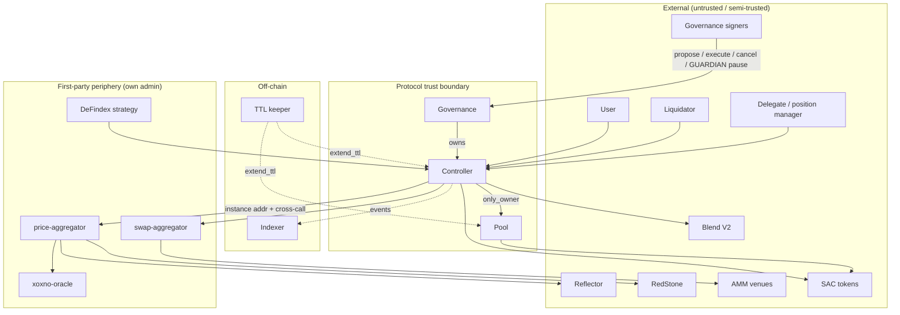

# STRIDE Threat Model — XOXNO Lending (Soroban)

**Status:** accepted residual risks only.  
**Last refresh:** 2026-07-24.

**Scope:** core contracts `contracts/governance`, `controller`, `pool`, plus
boundaries to first-party periphery (`price-aggregator`, `swap-aggregator`,
`xoxno-oracle`, `defindex-strategy`).

**Trust model:** owner is a governance timelock behind a multisig account;
listed tokens are SACs (no transfer hooks / FoT / rebasing — listing policy);
oracle authority is first-party **price-aggregator** (controller holds its
address and cross-calls it; token-rooted config is
`AggregatorKey::AssetOracle(asset)` on price-aggregator — not on controller);
providers (Reflector, RedStone, xoxno-oracle) fail-closed on bounds/staleness;
**swap-aggregator** is first-party but untrusted at the controller boundary
(balance-delta, ADR 0005); AMM venues untrusted; keeper/indexer protocol-operated.

---

## Accepted residual risks

| ID | Severity | One-line |
|----|----------|----------|
| Spoof.1 | Low | Single-source markets trust one feed + tight sanity band |
| Spoof.2 | Info | Self-liquidation via second address |
| Tamper.2 | Medium | Pool `cash` trusts nominal amount; FoT/rebase excluded by listing |
| Tamper.7 | Info | No IRM min-notional; residual only |
| Repudiate.1–5 | Low–Info | Prefer envelope attribution; optional events later |
| DoS.9 | Info | Swap-aggregator whitelist owner-gated, small set |
| Elevation.2 | Low | Delegate can liquidate managed account when HF < 1 |
| Elevation.4 | Info | Owner holds executor/canceller; separation on delegated grants |

---

## What are we working on?

Three contracts: **governance → owns → controller → owns → pool.**

- **Governance** — OZ-style timelock; every privileged change is an
  `AdminOperation` after a ledger delay. Roles: PROPOSER, EXECUTOR, CANCELLER,
  plus GUARDIAN / ORACLE for limited **immediate** incident actions. Unpause is
  **not** immediate: `AdminOperation::Unpause` only. Only pending ops keep
  `OperationLedger` storage; execute/cancel erase the entry. `salt` uniquifies
  re-proposes; `predecessor` is always `0`.
- **Controller** — only user-facing surface: accounts, risk, pricing via
  price-aggregator cross-call, liquidation, strategies, flash loans, admin
  config. Owns the pool. Does **not** call Reflector / RedStone / xoxno-oracle
  directly.
- **Pool** — multi-market liquidity by `HubAssetKey { hub_id, asset }`; all
  mutations `#[only_owner]`.

Happy path: supply → borrow (oracle + HF) → strategies/flash loan →
repay/withdraw → liquidate when HF < 1 → governance propose/execute →
keeper TTL / permissionless `renew_account`, `update_indexes`, `claim_revenue`.

### Data-flow diagram

### Trust boundaries

1. **Protocol** — user/liquidator/delegate input is attacker-controlled;
   `require_auth` before state change.
2. **Governance / timelock** — privileged change; validation in
   `governance/src/validate/` before controller owner setters. GUARDIAN pause
   is the main non-timelocked global brake; unpause is timelocked.
3. **Oracle** — controller cross-calls **price-aggregator** only (instance
   `PriceAggregator` addr). Config lives at
   `AggregatorKey::AssetOracle(asset)` on price-aggregator. Providers:
   Reflector / RedStone / Xoxno; `PrimaryWithAnchor` needs non-spot primary +
   different provider/contract; `Single` allows spot with ≤10% sanity.
   Fail-closed on read.
4. **Swap / Blend** — opaque swap bytes + balance delta; venues untrusted;
   Blend pools governance-approved.
5. **Delegate / position manager** — powerful once granted; still under risk
   gates and flash guard.
6. **Off-chain** — indexer event fidelity; keeper uptime for archival.

---

## Accepted findings

### Spoofing

**Spoof.1** — [Low] `Single` market: a compromised provider can return an
in-bounds wrong price. Defense is positivity, freshness, and a ≤10% sanity
band. Anchored markets use a non-spot primary plus cross-provider check.
`governance/src/validate/oracle_config.rs`, `common/src/validation.rs`.  
**Treatment:** accepted for `Single` with tight band + listing discipline;
adapter N-of-M is a separate trust root.

**Spoof.2** — [Info] Self-liquidation via a second address the owner controls.
`positions/liquidation/`.  
**Treatment:** accepted (economically neutral to the protocol).

### Tampering

**Tamper.2** — [Medium] `supply` / `repay` / `add_rewards` credit pool `cash`
from the nominal amount (no receive measure). FoT/rebase tokens are excluded by
listing policy. `pool/src/lib.rs`.  
**Treatment:** accepted (listing policy).

**Tamper.7** — [Info] No explicit IRM min-notional; theoretical residual only at
extreme low notional.  
**Treatment:** accepted (2026-07-09).

### Repudiation

**Repudiate.1** — [Info] Position events omit acting caller (owner vs delegate
vs position manager).  
**Repudiate.2** — [Low] Delegate add/remove may lack dedicated events.  
**Repudiate.3** — [Low] Pause events may omit actor.  
**Repudiate.4** — [Low] `OperationScheduled` omits proposer.  
**Repudiate.5** — [Info] `executor = None` allows open execute without invoker
stamp.  
**Treatment:** prefer tx envelope attribution; emit leaner events only where
indexer cost is justified.

### Denial of service

**DoS.9** — [Info] Swap-aggregator whitelist is unbounded in code; owner-gated and
kept small by policy.  
**Treatment:** accepted.

### Elevation of privilege

**Elevation.2** — [Low] A delegate can liquidate a managed account when HF < 1.  
**Treatment:** accepted (delegate already has powerful position rights).

**Elevation.4** — [Info] Owner holds executor + canceller; separation applies to
delegated grants only.  
**Treatment:** accepted (multisig owner is the root of trust).

---

## Re-review triggers

Delta-review when oracle composition, role set (GUARDIAN), strategies /
swap-aggregator, position managers, or periphery (defindex, accumulator,
price-aggregator) change.
Closed (fixed/mitigated) items from earlier STRIDE passes are not re-listed
here unless a code change reopens them.
