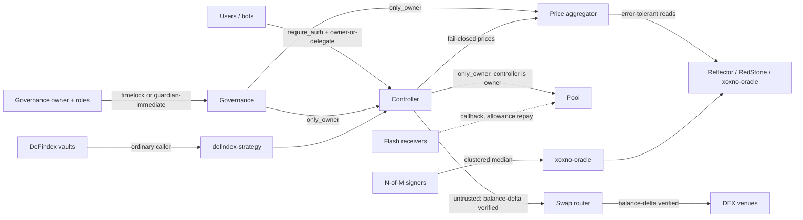

# Threat model

Who can attack the XOXNO Lending protocol, what they can reach, and what
stops them. Properties are catalogued in `docs/reference/invariants.md` and
referenced here by domain (e.g. §INV-LIQ); every mechanism claim is anchored
as `path::symbol` in the current tree.

## 1. Scope and assets at risk

Assets an attacker could target:

- **Supplier deposits** — pool-held token balances and RAY-scaled supply
  shares. The pool tracks `cash` internally rather than reading its token
  balance, so donations do not count as reserves
  (`contracts/pool/src/cache/cash.rs::require_reserves`).
- **Borrower collateral** — per-account scaled positions in controller user
  storage (`contracts/controller/src/storage/account.rs::write_side_map`),
  seizable only through liquidation or bad-debt cleanup (§INV-LIQ, §INV-ACCT).
- **Protocol revenue** — revenue shares inside `supplied`
  (`contracts/pool/src/cache/shares.rs::accrue_revenue`), claimed and
  forwarded to the accumulator
  (`contracts/controller/src/keepers/mod.rs::claim_revenue_for_asset_with_cache`).
- **Oracle integrity** — the price-aggregator's per-key `AssetOracle` config
  and the feeds behind it; every solvency decision consumes its output
  (`contracts/price-aggregator/src/registry.rs::AggregatorKey`) (§INV-ORACLE).
- **Governance control** — the governance owner, the five operational roles,
  and the timelock ledger (`contracts/governance/src/access.rs::default_operational_roles`).

Scope follows `SECURITY.md`: in scope are the on-chain crates
(`contracts/controller`, `pool`, `governance`, `swap-aggregator`,
`price-aggregator`, `xoxno-oracle`, `defindex-strategy`, plus `common/` and
`interfaces/`), `services/keeper`, `services/lending-exporter`, and the
Makefile/`configs/` operator tooling. Out of scope: upstream dependencies,
issues requiring already-compromised operator keys (governance owner, role
holders including GUARDIAN, keeper keys), theoretical issues without a
reproducible PoC, and `mock/flash-loan-receiver`, which is test-only.

## 2. Actors and capabilities

| Actor | Capabilities |
|---|---|
| Anonymous address | Call any non-view controller entrypoint with own auth: create accounts via `supply`, `repay` anyone's debt, `liquidate`, `clean_bad_debt`, `recapitalize`, run keepers (`contracts/controller/src/positions/repay.rs::process_repay`) |
| Supplier / borrower | Own accounts (`u64` ids); full verb set on owned accounts (`contracts/controller/src/account/mod.rs::require_owner_or_delegate`) |
| Liquidator | Any address; repays underwater debt and receives discounted collateral (`contracts/controller/src/positions/liquidation/mod.rs::process_liquidation`) |
| Delegate | Acts on owner-gated verbs, but only while also an active governance-registered position manager (`contracts/controller/src/account/mod.rs::is_owner_or_delegate`) |
| Position manager | Governance-registered address eligible to be a delegate (`contracts/controller/src/lib.rs::Controller::set_position_manager`) |
| GUARDIAN | Immediate pause, tighten-only spoke-asset flags, create hub/spoke (`contracts/governance/src/timelock/immediate.rs`) |
| ORACLE role | One immediate power: `set_sanity_band` on the aggregator (`contracts/governance/src/timelock/immediate.rs::set_sanity_band`) |
| PROPOSER / EXECUTOR / CANCELLER | Schedule / execute / veto timelocked operations; EXECUTOR and CANCELLER are mutually exclusive for non-owners (`contracts/governance/src/access.rs::require_executor_canceller_separation`) |
| Governance owner | Root authority; holds all roles; only proposer of ownership transfer; immediate revocation of GUARDIAN/ORACLE only (`contracts/governance/src/timelock/immediate.rs::revoke_role_immediate`) |
| xoxno-oracle signers | Registered addresses submitting prices with own auth; median-of-cluster limits any minority (`contracts/xoxno-oracle/src/submit.rs::XoxnoOracle::submit_price`) |
| External feed operators | Reflector / RedStone contracts read by the aggregator; error-tolerant reads degrade to a missing leg (`common/src/oracle/providers/reflector.rs::reflector_last_price`) |
| Keeper (`services/keeper`) | Off-chain TTL renewal/restoration; holds no protocol privilege (`services/keeper/README.md`) |
| Token contracts | SAC or arbitrary Wasm; controller measures balance deltas instead of trusting transfer amounts (`contracts/controller/src/payments/transfer.rs::transfer_amount_measured`) |
| DEX venues | Soroswap/Aquarius/Phoenix/Sushi/Comet behind the router; the router distrusts their return values (`contracts/swap-aggregator/src/venues/mod.rs::dispatch_hop`) |
| DeFindex vaults | Any address calling the strategy adapter's `deposit`/`withdraw`; no registry check on the vault identity (`contracts/defindex-strategy/src/lib.rs::Strategy::deposit`) |
| Flash-loan receivers | Arbitrary Wasm contracts invoked mid-transaction (`contracts/pool/src/ops/flash.rs::apply`) |

## 3. Trust boundaries

```mermaid
flowchart LR
    U[Users / bots] -->|require_auth + owner-or-delegate| C[Controller]
    G[Governance owner + roles] -->|timelock or guardian-immediate| GOV[Governance]
    GOV -->|only_owner| C
    GOV -->|only_owner| PA[Price aggregator]
    C -->|only_owner, controller is owner| P[Pool]
    C -->|fail-closed prices| PA
    C -->|untrusted: balance-delta verified| R[Swap router]
    R -->|balance-delta verified| DEX[DEX venues]
    PA -->|error-tolerant reads| EXT[Reflector / RedStone / xoxno-oracle]
    S[N-of-M signers] -->|clustered median| XO[xoxno-oracle]
    XO --> EXT
    FR[Flash receivers] -.->|callback, allowance repay| P
    DV[DeFindex vaults] -->|ordinary caller| DFS[defindex-strategy] --> C
```

- **User → controller.** The controller is the only user-facing contract.
  Every mutating verb requires caller auth; risk-bearing verbs additionally
  require account owner-or-delegate, and delegation is double-gated —
  listed on the account *and* an active position manager
  (`contracts/controller/src/account/mod.rs::is_owner_or_delegate`) (§INV-AUTH).
- **Controller → pool.** All mutating pool entrypoints are `#[only_owner]`
  and the controller is the owner set at deploy
  (`contracts/controller/src/markets/mod.rs::deploy_pool`). The pool holds no
  risk, oracle, or pause logic; its guards are purely accounting
  (`contracts/pool/src/guards.rs::require_utilization_below_max`).
- **Controller → router.** Fully untrusted. The controller grants exactly one
  scoped `transfer(controller, router, amount_in)` authorization
  (`contracts/controller/src/strategies/swap/auth.rs::pre_authorize_router_pull`),
  wraps the call in the reentrancy guard
  (`contracts/controller/src/strategies/swap/route.rs::call_router_with_reentrancy_guard`),
  discards the router's return value, and settles on measured balance deltas —
  overspend reverts, unspent input is refunded, output must be positive
  (`contracts/controller/src/strategies/swap/balances.rs::settle_router_input`,
  `::verify_router_output`).
- **Controller → oracle.** Trusted after aggregator-side validation. The
  controller performs no independent staleness/deviation/sanity checks; it
  consumes `prices()`, which is fail-closed — any unresolvable key reverts the
  whole flow (`contracts/price-aggregator/src/engine.rs::force`,
  `contracts/controller/src/external/price_aggregator.rs::fetch_prices`) (§INV-ORACLE).
- **Governance → everything.** Config changes ride the timelock
  (`contracts/governance/src/timelock/lifecycle.rs::Governance::propose`);
  the GUARDIAN's immediate powers are one-directional — pause and tighten-only
  flags — while every reopening path (unpause, flag clearing) is timelocked
  (`contracts/governance/src/timelock/immediate.rs::pause`,
  `contracts/controller/src/config/asset.rs::require_flag_ratchet`) (§INV-HALT).
- **xoxno signers → median.** Submissions require signer auth, registration,
  and bounded, non-future, per-signer-monotonic timestamps
  (`contracts/xoxno-oracle/src/submit.rs::XoxnoOracle::submit_price`); the
  aggregate keeps only fresh submissions clustered within the relative skew
  of the newest, requires the cluster to reach the N-of-M threshold, and
  publishes the lower-middle median
  (`contracts/xoxno-oracle/src/aggregation.rs::recompute_aggregate`).

## 4. Attack surfaces and mitigations

### Position verbs (supply / borrow / withdraw / repay)

Attacker controls: call arguments, token choice within listed assets, own
funds. `supply` into an *existing* account is permissionless, but a non-owner
may only top up hub assets that already have an open supply position — a third
party cannot open new supply slots on someone else's account
(`contracts/controller/src/positions/supply.rs::process_supply`, regression
`tests/test-harness/tests/controller/security_audit.rs::regression_third_party_cannot_open_new_supply_slots`).
`repay` is permissionless by design — it only reduces debt and refunds
overpayment to the payer (`contracts/controller/src/positions/repay.rs::process_repay`,
PoC `security_audit.rs::poc_permissionless_repay_any_caller`). `borrow` and
`withdraw` require owner-or-delegate and enforce post-pool risk gates —
LTV ≥ debt, HF ≥ 1 WAD, min-collateral floor
(`contracts/controller/src/risk/validation.rs::require_post_pool_risk_gates`)
(§INV-RISK). Entry paths enforce spoke caps with no unlimited sentinel — a
zero cap admits nothing (`contracts/controller/src/spoke/caps.rs::enforce_spoke_cap`) —
and fee-on-transfer tokens cannot inflate credit: only measured receipt is
credited (`contracts/controller/src/payments/transfer.rs::transfer_amount_measured`).

### Liquidation

Attacker controls: liquidator identity, debt payment selection and amounts.
Mitigations: HF < 1 WAD gate, self-liquidation rejected, repayment capped at
the curve's ideal amount with excess refunded, seizures scaled down when a
debt token under-delivers
(`contracts/controller/src/positions/liquidation/plan.rs::build_liquidation_plan`,
`contracts/controller/src/positions/liquidation/math.rs::normalize_repayment_plan`,
`::scale_seizures_to_received`) (§INV-LIQ). Two fail-closed edges deserve
attention because they *block* liquidation rather than the attacker:

- **Tainted debt.** Both liquidation legs enforce spoke flags with
  `AllowOnExit`, which still reverts on `paused`
  (`contracts/controller/src/positions/mod.rs::enforce_spoke_asset_flags`,
  `contracts/controller/src/positions/liquidation/apply.rs::apply_liquidation_repayments`,
  `::apply_liquidation_seizures`). Pausing a debt listing therefore blocks
  repay *and* liquidation of that debt
  (`security_audit.rs::poc_paused_debt_blocks_liquidation_repay`) (§INV-HALT).
- **Unpriceable or degenerate collateral leg.** Liquidation prices every
  account asset through the fail-closed path, so one stale or unpriceable
  leg — even dust — bricks the whole liquidation
  (`security_audit.rs::poc_stale_oracle_blocks_liquidation`,
  `tests/test-harness/tests/controller/audit_liquidate_and_clean_stale_leg.rs::audit_liquidate_and_clean_bricked_by_unpriceable_dust_leg`).
  The sibling `audit_*.rs` regressions in the same directory pin the dust-fee
  full-close DoS, the sub-unit-leg brick, and the supply-time stale-dust
  shield (`tests/test-harness/tests/controller/audit_liquidate_dust_fee_dos.rs::audit_liquidate_contracts_dust_fee_full_close_dos` and siblings).

### Oracle reads

The dual-source design is fail-closed, not gracefully degrading: if exactly
one of two configured legs is readable, the outcome is `Partial` with
`price_wad = 0` and `deviation = true`, which `force` turns into a hard
revert (`contracts/price-aggregator/src/engine.rs::Outcome::partial`,
`::force`). A half-alive oracle halts borrows *and* liquidations rather than
falling back to one source. Sanity bands must overlap the previous band on
update, preventing a single jump to a disjoint range
(`contracts/price-aggregator/src/admin.rs::set_sanity_band`).

### Flash loans

Attacker controls: receiver contract and callback logic. The receiver must be
a Wasm contract (`common/src/validation.rs::require_wasm_receiver`), repayment
is allowance-based only, and the pool asserts the exact expected balance both
after payout and after the callback — pushing tokens back directly during the
callback fails `InvalidFlashloanRepay`
(`contracts/pool/src/ops/flash.rs::apply`, `::collect_repayment`). During the
callback the pool state is uncommitted, and reentry into controller position
verbs is blocked by the temporary flash guard
(`contracts/controller/src/storage/session.rs::with_flash_guard`,
`contracts/controller/src/risk/validation.rs::require_not_flash_loaning`,
matrix test `tests/test-harness/tests/meta/reentrancy_matrix.rs`) (§INV-FLASH).
The controller checks only hub activity — flash loans consult no spoke
pause/freeze flags (`contracts/controller/src/strategies/flash_loan.rs::process_flash_loan`).

### Strategies and the router

Attacker controls: the opaque swap payload (`Bytes`, never parsed by the
controller — `common/src/types/aggregator.rs::StrategySwap`) and, in the worst
case, the router contract itself. On-chain enforcement is delta-based
(section 3) plus the post-flow solvency gates in
`contracts/controller/src/strategies/mod.rs::strategy_finalize` (§INV-STRAT).
Route *quality* is not enforced on-chain beyond the payload's own
`total_min_out` inside the router
(`contracts/swap-aggregator/src/lib.rs::execute_payload`); a bad route loses
value up to what the solvency gates tolerate. Router misbehavior modes are
exercised by `tests/test-harness/src/mock_aggregator.rs::BadAggregator`.

### DeFindex strategy accounts

Donation/NAV inflation is real and documented: any address can `supply` into
the strategy's existing controller account and inflate the vault's reported
balance (`contracts/defindex-strategy/tests/strategy.rs::test_donation_via_controller_supply_inflates_nav`),
because permissionless top-up of existing positions is allowed
(`contracts/controller/src/positions/supply.rs::process_supply`). The donor
cannot withdraw it back — withdraw stays owner-gated
(`contracts/controller/src/positions/withdraw.rs::process_withdraw`). Vault
identity is unregistered: anyone becomes a "vault" by calling `deposit` with
their own address; each address maps to an isolated account
(`contracts/defindex-strategy/src/lib.rs::Strategy::deposit`).

### Keepers

`update_indexes`, `claim_revenue`, and `update_account_threshold` are
permissionless with caller auth (`contracts/controller/src/keepers/mod.rs::update_indexes`).
Threshold refresh cannot push accounts underwater: with `has_risks = true`
the resulting HF must clear 1.05 WAD
(`contracts/controller/src/keepers/mod.rs::sync_account_thresholds`,
`contracts/controller/src/constants.rs::THRESHOLD_UPDATE_MIN_HF_RAW`), and
liquidator-favoring parameter changes are gated the same way
(`contracts/controller/src/risk/params.rs::apply_gated_liquidation_params`).

### Admin and governance

- **Guardian ratchet vs. edit rewrite.** `set_spoke_asset_flags` may only set
  flags, never clear (`contracts/controller/src/config/asset.rs::require_flag_ratchet`).
  The timelocked clearing path, `EditAssetInSpoke`, is a *full listing
  rewrite* with no ratchet — an operator who omits the current
  `paused`/`frozen` values silently reopens a halted listing
  (`contracts/controller/src/config/asset.rs::edit_asset_in_spoke`) (§INV-HALT).
- **Salt reuse and dead predecessors.** After execution the operation ledger
  entry is *removed*, returning the id to `Unset`
  (`contracts/governance/src/timelock/mod.rs::finish_execute`), so an
  identical (target, function, args, salt) tuple can be re-proposed without a
  new salt, and — since every scheduled op pins `predecessor` to 32 zero bytes
  (`contracts/governance/src/timelock/mod.rs::operation_for_admin_op`) — the
  upstream predecessor-chaining mechanism is unusable by construction.
- **Sensitive tier is nominal.** The Sensitive floor is 12 ledgers
  (`contracts/governance/src/constants.rs::TIMELOCK_SENSITIVE_MIN_DELAY_LEDGERS`),
  far below the 34 560-ledger recommended minimum, so at any production
  `min_delay` the Sensitive tier equals Standard
  (`contracts/governance/src/timelock/mod.rs::operation_delay`). Only the
  Recovery tier (518 400 ledgers) adds real delay.
- **Bootstrap delay.** `configs/networks.json` records
  `timelock_min_delay_ledgers: 1` for mainnet, and the mainnet unpause guard
  compares the on-chain delay against that same config value
  (`configs/script.sh::unpause_protocol`) — the guard has no teeth until the
  config is raised. The delay itself is a one-way ratchet once raised
  (`contracts/governance/src/timelock/mod.rs::validate_delay_update`).

### Oracle submission (xoxno)

A minority of compromised signers below the threshold cannot move the
published median; a signer replaying old data is stopped by per-signer
monotonic package timestamps, and stale submissions age out of the cluster
(`contracts/xoxno-oracle/src/submit.rs::XoxnoOracle::submit_price`,
`contracts/xoxno-oracle/src/aggregation.rs::recompute_aggregate`). No deployed
market currently consumes the xoxno adapter as an aggregator source
(`configs/mainnet/markets.json`, `configs/testnet/markets.json`).

## 5. Denial of service and resource risks

- **Unbounded keeper loops.** `update_indexes`, `claim_revenue`, and
  `update_account_threshold` iterate caller-supplied vectors with no length
  cap (`contracts/controller/src/keepers/mod.rs::update_indexes`); Soroban
  resource metering is the only backstop, and the caller pays. Views are
  bounded only where they recurse into heavy work:
  `get_market_indexes_detailed` and `get_liquidation_estimate` cap inputs at
  256 (`contracts/controller/src/views/mod.rs::require_view_inputs_bound`,
  `contracts/controller/src/constants.rs::MAX_VIEW_INPUTS`).
- **Storage TTL and archival.** All controller persistent state can archive:
  shared keys use a 5-day threshold / 180-day bump, per-user keys 30 days /
  120 days, renewed implicitly on every successful read and write
  (`contracts/controller/src/storage/ttl.rs::get_persistent`,
  `common/src/constants/shared.rs::TTL_BUMP_USER`). An idle account's owner
  can self-renew via `renew_account`
  (`contracts/controller/src/account/mod.rs::renew_account`); operationally,
  `services/keeper` discovers and extends/restores controller, pool,
  aggregator, and governance entries before the safety margin
  (`services/keeper/README.md`) (§INV-STOR).
- **Liquidation worst case.** Position limits default to 10/10 and are capped
  at `POSITION_LIMIT_MAX` (`contracts/controller/src/config/limits.rs::set_position_limits`);
  the harness proves a 5-supply/5-borrow liquidation fits the default budget
  and asserts the configured cap matches what the bench covers
  (`tests/test-harness/tests/meta/bench_liquidate_max_positions.rs::bench_liquidate_5_supply_5_borrow_within_default_budget`,
  `::test_position_limit_cap_matches_bench_coverage`).
- **Liquidation-bricking griefing.** The dust-leg shapes in section 4 are the
  practical DoS risk: cheap third-party supply of a soon-to-be-stale asset
  into a victim account is bounded by the new-slot restriction
  (`contracts/controller/src/positions/supply.rs::process_supply`).

## 6. Assurance map

| Layer | Covers | Anchor |
|---|---|---|
| In-crate unit tests | Per-contract behavior, flag matrices, timelock lifecycle | `contracts/*/tests/` |
| Test harness | Cross-contract flows, adversarial PoCs, reentrancy matrix, economic attacks | `tests/test-harness/tests/controller/security_audit.rs`, `tests/test-harness/tests/meta/reentrancy_matrix.rs` |
| Proptest | Accounting conservation, liquidation vs. exact rational reference, router invariants | `tests/test-harness/tests/fuzz/main.rs` |
| libFuzzer | Math kernels plus end-to-end flow/state targets | `tests/fuzz/Cargo.toml` |
| Mutation testing | Twelve scopes, diff-scoped on PRs, nightly full lanes | `Makefile::mutants`, `.github/workflows/fuzz.yml` |
| Certora (Sunbeam) | 253 rules over common math/rates, controller solvency/liquidation/isolation, pool state invariant, aggregator fail-closed behavior | `certora/README.md`, `certora/pool/spec/state_invariant_rules.rs` |
| Live testnet e2e | Full lifecycle, strategies over real routes, governance timelock, on release only | `tests/integration/scenarios/parallel_e2e.sh`, `.github/workflows/release.yml` |

Honest gaps: no Certora rules exist for `governance`, `swap-aggregator`,
`xoxno-oracle`, or `defindex-strategy` (`certora/` top-level directories).
Controller verdicts are conditional on trusted pool summaries, and the
controller-side `fetch_prices` harness always returns a positive feed, so
solvency/liquidation proofs are oracle-success-conditional
(`certora/README.md` — Production boundary, Oracle modeling notes). Certora
workflows are `workflow_dispatch`-only — no formal job runs on PRs
(`.github/workflows/certora-verification.yml`), and the repo carries no proof
verdict record; the README states local gates "are not proof verdicts".
`services/keeper` and `services/lending-exporter` are separate workspaces, so
`cargo test --workspace` in CI never runs their tests (`Cargo.toml` members
list, `services/keeper/Cargo.toml`). Coverage excludes governance,
swap-aggregator, xoxno-oracle, and defindex-strategy (`Makefile::coverage-merged`).

## 7. Accepted residual risks and non-goals

- **Tainted debt.** Pausing a debt listing blocks its repayment and
  liquidation until a timelocked `EditAssetInSpoke` clears the flag
  (section 4). Accepted as the cost of a hard halt; operational recovery only.
- **Fail-closed liquidation.** A single stale/unpriceable/paused leg blocks
  the whole liquidation. Solvency depends on feed operations staying healthy;
  the protocol prefers halting to acting on bad prices.
- **Route quality is off-chain.** On-chain checks bound router *theft*
  (overspend, zero output), not bad pricing; `total_min_out` comes from the
  off-chain quoter (`contracts/swap-aggregator/src/lib.rs::execute_payload`).
- **DeFindex NAV donation.** Third parties can inflate a vault account's NAV
  (section 4); accepted and pinned by test, since donated value is trapped in
  the account.
- **Untimelocked router upgrade.** The swap-aggregator owner can swap its
  WASM immediately (`contracts/swap-aggregator/src/lib.rs::Router::upgrade`);
  tolerable because the controller treats the router as fully untrusted.
- **Immutable pool owner.** The pool has no ownership-transfer entrypoint;
  re-pointing it requires a WASM upgrade
  (`contracts/pool/src/lib.rs::LiquidityPool::__constructor`).
- **Bootstrap governance.** Mainnet ships with `min_delay = 1` ledger and a
  config-relative unpause guard until operators ratchet the delay up
  (section 4); the Sensitive tier adds no delay over Standard in production.
- **Fee-on-transfer tokens.** Measured transfers protect pool crediting, but
  `multiply`'s optional `initial_payment` uses a raw transfer and does not
  support such tokens (`contracts/controller/src/strategies/multiply.rs::collect_initial_multiply_payment`).
- **Compromised operator keys** (governance owner, role holders, keeper keys)
  and theoretical issues without a PoC are explicitly out of scope
  (`SECURITY.md`).
