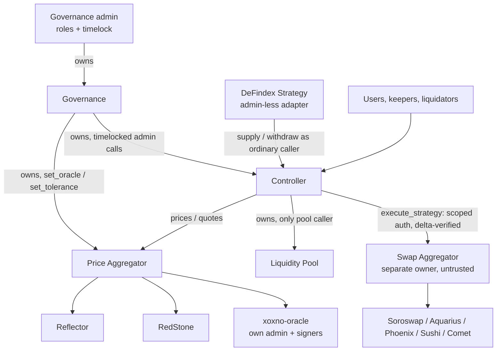

# Architecture Reference

This document describes the contract topology of the XOXNO Lending protocol on Stellar
Soroban: which contracts exist, who owns and calls whom, how markets and accounts are
modeled, where state lives, how tokens move, and how the system is deployed and
upgraded. It is a reference, not a tutorial. The source code is the single source of
truth; every claim below is anchored as `path::symbol`, and where any other document
disagrees with the code, the code wins.

## System topology

The core is a strict three-contract ownership chain. Governance owns the controller
(`contracts/governance/src/deploy.rs::deploy_controller` passes its own address as the
controller's constructor admin), and the controller owns the pool
(`contracts/controller/src/markets/mod.rs::deploy_pool` passes its own address as the
pool's constructor admin). Every mutating pool entrypoint is `#[only_owner]`
(`contracts/pool/src/lib.rs`, `LiquidityPoolInterface` impl), so the controller is the
only caller for all pool mutations; pool views are public. The pool holds no account
risk, oracle, or pause logic — that lives in the controller; the pool keeps only
market-level arithmetic guards (backing, utilization, withdraw solvency:
`contracts/pool/src/guards.rs`). Fresh controller
deployments start paused (`contracts/controller/src/governance/access.rs::init` calls
`stellar_contract_utils::pausable::pause`).

Governance is the root of authority. Its constructor sets one admin as `Ownable` owner,
`AccessControl` admin, and holder of all five operational roles — `ORACLE`, `PROPOSER`,
`EXECUTOR`, `CANCELLER`, `GUARDIAN`
(`contracts/governance/src/access.rs::Governance::__constructor`,
`::default_operational_roles`). Admin changes route through a timelock
(`contracts/governance/src/timelock/lifecycle.rs`); a small set of role-gated immediate
powers exists: `GUARDIAN` may `pause`, `set_spoke_asset_flags`, `create_hub`, and
`add_spoke`, and `ORACLE` may `set_sanity_band`
(`contracts/governance/src/timelock/immediate.rs`).

The oracle stack hangs off governance. Governance deploys and owns the
price-aggregator (`contracts/governance/src/deploy.rs::deploy_price_aggregator`), the
protocol's single price entrypoint. The aggregator composes per-asset configs from up
to two sources drawn from three provider kinds — Reflector, RedStone, and the
xoxno-oracle adapter (`common/src/types/composable_oracle.rs::ProviderRef`) — through
source shapes `Feed`, `Scaled`, `AquariusLp`, and `AquariusStableLp`
(`common/src/types/composable_oracle.rs::PriceSource`). Its three writers
(`set_oracle`, `set_sanity_band`, `set_tolerance`) are `#[only_owner]`
(`contracts/price-aggregator/src/lib.rs`). The controller consumes the fail-closed
`prices` path for all risk math and the fail-open `quotes` path only in the detailed
market view (`contracts/controller/src/external/price_aggregator.rs`). The
xoxno-oracle itself is a multi-signer median price contract with its own transferable
`Ownable` admin; registered signers submit prices under their own auth
(`contracts/xoxno-oracle/src/submit.rs::submit_price`), and admin knobs are
`#[only_owner]` (`contracts/xoxno-oracle/src/admin.rs`).

Two periphery contracts sit outside the ownership chain. The swap-aggregator
(`Router`, `contracts/swap-aggregator/src/lib.rs`) is a separately-owned DEX routing
executor that the controller treats as untrusted: the controller grants it exactly one
scoped `transfer` authorization per call
(`contracts/controller/src/strategies/swap/auth.rs::pre_authorize_router_pull`) and
verifies the result by its own balance deltas
(`contracts/controller/src/strategies/swap/balances.rs::settle_router_input`,
`::verify_router_output`). The defindex-strategy
(`contracts/defindex-strategy/src/lib.rs::Strategy`) is an admin-less adapter that maps
one DeFindex vault address to one controller account; it has no owner, pause, or
upgrade entrypoint, and its `Config` is immutable after construction.

## Per-contract roles

| Contract | Crate path | Owner | Role | Mutating-entrypoint gate |
|---|---|---|---|---|
| Governance | `contracts/governance` | External admin (constructor); two-step transferable | Timelock, role registry, deployer of controller and price-aggregator | `#[only_owner]` for deploys/recovery; role gates for immediates; `PROPOSER` gates propose, `CANCELLER` gates cancel; execution of a Ready operation with `executor: None` is permissionless (`contracts/governance/src/timelock/mod.rs::authorize_executor`) |
| Controller | `contracts/controller` | Governance; two-step `transfer_ownership`/`accept_ownership` (`contracts/controller/src/lib.rs`) | The user-facing lending contract: accounts, risk checks, oracle validation, liquidations, flash loans, strategies | `#[only_owner]` on every `ControllerAdmin` method except the `get_app_version` view and `accept_ownership` (pending-owner auth); user verbs gate on `caller.require_auth()` plus the pause matrix |
| Liquidity Pool | `contracts/pool` | Controller — immutable; the pool does not export `transfer_ownership` (`contracts/pool/src/lib.rs::LiquidityPool::__constructor` is the only owner write) | Single liquidity vault and interest accounting per market | `#[only_owner]` on all 14 mutating entrypoints; 10 views are public |
| Price Aggregator | `contracts/price-aggregator` | Governance — no ownership-transfer entrypoint on its ABI (`contracts/price-aggregator/src/lib.rs`) | Price composition, staleness/tolerance/sanity validation | `#[only_owner]` on `set_oracle`, `set_sanity_band`, `set_tolerance` |
| xoxno-oracle | `contracts/xoxno-oracle` | Own admin; full `Ownable` incl. transfer (`contracts/xoxno-oracle/src/lib.rs`) | Multi-signer median price feed with a dual read ABI: RedStone-shaped `read_price_data*` plus SEP-40 reads (`contracts/xoxno-oracle/src/reads.rs`) | `#[only_owner]` admin surface; `submit_price` requires a registered signer's auth |
| Swap Aggregator | `contracts/swap-aggregator` | Separate admin; full `Ownable` incl. `renounce_ownership` (`contracts/swap-aggregator/src/lib.rs`) | DEX route executor across five venues; untrusted by the controller | `#[only_owner]` for fees/whitelist/referrals/upgrade; `execute_strategy` gates on `sender.require_auth()`; `claim_referral_fees` is permissionless but pays only the stored referral owner |
| DeFindex Strategy | `contracts/defindex-strategy` | None — no admin, no upgrade | Adapter binding one DeFindex vault to one controller account | `from.require_auth()` on `deposit`/`withdraw`/`harvest` |

## Market and account model

Every market is keyed by `HubAssetKey { hub_id: u32, asset: Address }`
(`common/src/types/pool.rs::HubAssetKey`). The pool stores params and state per
`HubAssetKey` (`common/src/types/pool.rs::PoolKey`), and the controller stores listings
and usage per `(spoke_id, HubAssetKey)`
(`common/src/types/controller.rs::ControllerKey`), so the same token listed under two
hub ids is two fully isolated markets with separate indexes, cash, and revenue.

Positions belong to a `u64` account id, not an address. Ids are minted by a persistent
counter starting at 1
(`contracts/controller/src/storage/protocol.rs::increment_account_nonce`); passing
`account_id == 0` to an entry verb creates the account
(`contracts/controller/src/account/mod.rs::load_or_create_account`). Each account binds
at creation to a spoke — a risk-configuration namespace — and its `spoke_id` and
`mode` are written once into `AccountMeta` and never rewritten
(`contracts/controller/src/account/mod.rs::create_account`); `spoke_id == 0` reverts
`SpokeNotFound`. A spoke listing (`common/src/types/controller.rs::SpokeAssetConfig`)
carries `is_collateralizable`, `is_borrowable`, `paused`, `frozen`, `loan_to_value`,
`liquidation_threshold`, `liquidation_bonus`, `liquidation_fees`, `supply_cap`, and
`borrow_cap`. Caps are declared in asset units and enforced on position growth by
converting to scaled shares against the live index
(`contracts/controller/src/spoke/caps.rs::enforce_spoke_cap`); a cap of `0` admits
nothing — there is no unlimited sentinel — while exits decrement usage without any cap
check (`contracts/controller/src/spoke/caps.rs::apply_exit`).

An account owner may register up to `MAX_DELEGATES = 16` delegates
(`contracts/controller/src/constants.rs::MAX_DELEGATES`,
`contracts/controller/src/storage/account.rs::add_delegate`). A delegate can act on
owner-gated verbs only while it is also an active governance-registered position
manager (`contracts/controller/src/account/mod.rs::is_owner_or_delegate`).
`add_delegate`/`remove_delegate` themselves are strictly owner-only
(`contracts/controller/src/account/mod.rs::set_account_delegate`). Position counts per
account are bounded by `PositionLimits`, seeded at 10 supply / 10 borrow
(`contracts/controller/src/governance/access.rs::init`) and adjustable only within
`1..=POSITION_LIMIT_MAX` (10)
(`contracts/controller/src/config/limits.rs::set_position_limits`).

Controller views are not storage-only reads: market indexes come from the pool
(`contracts/controller/src/context/market_index.rs::cached_market_index` calls the
pool's `get_bulk_indexes`) and valuations come from the price-aggregator, so view
results reflect live cross-contract state.

## Storage model

**Controller** — all protocol keys live in one enum
(`common/src/types/controller.rs::ControllerKey`), split across three classes:

- *Instance*: `Pool`, `SwapAggregator`, `PriceAggregator`, `Accumulator`,
  `PositionLimits`, `MinBorrowCollateralUsd`
  (`contracts/controller/src/storage/protocol.rs`), `AppVersion`
  (`contracts/controller/src/governance/access.rs`), plus the `LastSpokeId`/`LastHubId`
  counters (`contracts/controller/src/storage/spoke.rs`,
  `contracts/controller/src/storage/hub.rs`).
- *Persistent, shared tier* (5-day threshold, 180-day bump): `AccountNonce`,
  `Hub(u32)`, `Spoke(u32)`, `SpokeAsset`, `SpokeUsage`, `PositionManager(Address)`,
  `BlendPoolAllowed(Address)` via `get_shared`/`set_shared`
  (`contracts/controller/src/storage/ttl.rs`).
- *Persistent, user tier* (30-day threshold, 120-day bump): `AccountMeta(u64)`,
  `SupplyPositions(u64)`, `BorrowPositions(u64)`, `Delegates(u64)`. Reads go through
  `get_user`; `AccountMeta`/`Delegates` writes go through `set_user`, while the two
  position maps are written by `write_side_map`, which bypasses `set_user` and does
  not renew (`contracts/controller/src/storage/account.rs::write_side_map`,
  `contracts/controller/src/storage/ttl.rs`).

`get_persistent` renews a key's TTL on every successful read as well as every write
(`contracts/controller/src/storage/ttl.rs::get_persistent`). Position-map writers
deliberately do not renew; flows call
`contracts/controller/src/storage/account.rs::renew_user_account` afterward, which
co-renews every live account key. Empty maps remove their key instead of storing an
empty value (`contracts/controller/src/storage/account.rs::write_side_map`). Users can
keep dormant accounts alive with the owner-gated `renew_account`
(`contracts/controller/src/account/mod.rs::renew_account`). `Cache::new` bumps the
instance TTL on every mutating flow; `Cache::new_view` does not, so views cost no TTL
write (`contracts/controller/src/context/mod.rs`). The only temporary entry is the
flash-loan reentrancy flag, a private key outside `ControllerKey`
(`contracts/controller/src/storage/session.rs::SessionKey`).

**Pool** — exactly two persistent key families, `PoolKey::Params(HubAssetKey)` and
`PoolKey::State(HubAssetKey)` (`common/src/types/pool.rs::PoolKey`); there is no
per-account storage in the pool and no entrypoint deletes a market. Instance storage
holds only the library-owned owner key
(`contracts/pool/src/lib.rs::LiquidityPool::__constructor`). Both market keys renew
together (5-day threshold, 180-day bump)
(`contracts/pool/src/storage.rs::renew_market`), and reads renew too
(`contracts/pool/src/storage.rs::load_sync_data`), so public views extend market TTL
as a side effect. Reads of unlisted markets panic `PoolNotInitialized`
(`contracts/pool/src/storage.rs::read_params`).

**Governance** — four own keys (`contracts/governance/src/storage.rs::GovernanceKey`):
`Controller` and `PriceAggregator` in instance storage; `RoleRevocationTarget` and
`RecoveryOp` sidecars in persistent storage keyed by timelock operation id. Timelock,
ownership, and role state use the upstream library keys.

**Price aggregator** — oracle configs live in persistent storage under
`AggregatorKey::Oracle(PriceKey)` with an instance-stored key list
(`contracts/price-aggregator/src/registry.rs::AggregatorKey`). Every public
entrypoint, including reads, renews the instance TTL
(`contracts/price-aggregator/src/lib.rs::renew_instance`), and reading a config
extends its persistent TTL, so actively priced assets self-renew.

**Swap aggregator** — instance: `StaticFeeBps`, `ReferralCounter`,
`WhitelistedTokens`; persistent: `Referral(u64)`, `AdminFee(Address)`,
`ReferralFee(u64, Address)` (`contracts/swap-aggregator/src/types.rs::DataKey`).
`execute_strategy` and every admin entrypoint renew the instance TTL
(`contracts/swap-aggregator/src/lib.rs::renew_instance`).

**DeFindex strategy** — instance `Config` (written once at construction, never
TTL-extended) and persistent `VaultAccount(Address) -> u64` mappings renewed on read
and write with contract-local constants (~30-day threshold, ~180-day extension)
(`contracts/defindex-strategy/src/lib.rs::VAULT_ACCOUNT_TTL_THRESHOLD`).

## Money flows

The pool is the sole liquidity holder. For supply, repay, and recapitalize the
controller pre-transfers tokens caller → pool and credits only the measured balance
delta, so fee-on-transfer tokens cannot inflate credits
(`contracts/controller/src/payments/transfer.rs::transfer_amount_measured`,
`contracts/controller/src/positions/supply.rs::build_supply_entries`,
`contracts/controller/src/positions/repay.rs`,
`contracts/controller/src/keepers/mod.rs::recapitalize`). The pool never pulls tokens
in on those paths; it trusts the amount argument from its owner. The pool has two
outbound paths: `Cache::transfer_out`
(`contracts/pool/src/cache/cash.rs::transfer_out`) for borrow/withdraw/strategy
payouts to the receiver, overpayment and recapitalize refunds to the payer, and
revenue to the pool owner — and the flash-loan principal payout, which transfers
directly and bypasses `transfer_out`/`debit_cash` because the principal is settled by
balance assertions within the same call
(`contracts/pool/src/ops/flash.rs::payout`).

Liquidity accounting uses a tracked `cash` field on `PoolStateRaw`
(`common/src/types/pool.rs::PoolStateRaw`), not the live token balance:
`require_reserves` compares against tracked cash
(`contracts/pool/src/cache/cash.rs::require_reserves`), and cash changes only through
checked op accounting (`::credit_cash`, `::debit_cash`), so direct donations to the
pool address raise the balance without raising cash.

Flash loans are the exception that reads the live balance: terms are computed from the
pool's token balance at call time (`contracts/pool/src/ops/flash.rs::terms`). The pool
pays out, invokes the receiver's `execute_flash_loan`, asserts the exact balance
`pre - amount` both after payout and after the callback returns, then collects
`amount + fee` solely via `transfer_from` against an allowance the receiver must have
granted (`contracts/pool/src/ops/flash.rs::collect_repayment`) — a receiver that
pushes tokens back directly fails the balance assertion. The fee is booked into both
protocol revenue and cash (`contracts/pool/src/ops/flash.rs::book_fee`). Reentrancy is
blocked one layer up: the controller wraps the pool flash call, the swap-router call,
and Blend submits in a temporary-storage guard
(`contracts/controller/src/storage/session.rs::with_flash_guard`,
`contracts/controller/src/strategies/swap/route.rs::call_router_with_reentrancy_guard`).

Protocol revenue flows pool → controller → accumulator: `claim_revenue` on the pool
pays the pool owner (`contracts/pool/src/ops/revenue.rs::apply` resolves
`ownable::get_owner`), and the controller forwards the amount to the configured
`Accumulator` address, reverting `NoAccumulator` when unset
(`contracts/controller/src/keepers/mod.rs::claim_revenue_for_asset_with_cache`).

For strategy swaps the controller snapshots its `token_in`/`token_out` balances,
authorizes exactly one `transfer(controller, router, amount_in)`
(`contracts/controller/src/strategies/swap/auth.rs::pre_authorize_router_pull`),
invokes the router, then rejects any overspend and refunds unspent input
(`contracts/controller/src/strategies/swap/balances.rs::settle_router_input`) and
requires strictly positive measured output (`::verify_router_output`), discarding the
router's own return value. Inside the router, each hop is likewise credited by the
router's own balance deltas with an exact-spend check
(`contracts/swap-aggregator/src/venues/mod.rs::dispatch_hop`), and the final output is
gated by the payload's `total_min_out`
(`contracts/swap-aggregator/src/lib.rs::execute_payload`).

## Deploy and upgrade surface

Deployments are deterministic and one-shot. Governance deploys the controller at a
fixed all-zero salt and the price-aggregator at a fixed all-`0x01` salt from its own
address (`contracts/governance/src/deploy.rs::CONTROLLER_DEPLOY_SALT`,
`::PRICE_AGGREGATOR_DEPLOY_SALT`); the controller deploys the pool at a fixed all-zero
salt (`contracts/controller/src/markets/mod.rs::POOL_DEPLOY_SALT`). Each deploy
reverts `PoolAlreadyDeployed` on a second attempt, so addresses are derivable from the
governance address alone. `deploy_price_aggregator` auto-wires the aggregator into an
already-deployed controller (`contracts/governance/src/deploy.rs::deploy_price_aggregator`).

Upgrade authority follows the ownership chain, gated by the governance timelock:

- **Governance** upgrades itself via a self-targeted timelocked operation.
- **Controller**: `AdminOperation::UpgradeController` resolves at the `Sensitive` tier
  to the controller's `#[only_owner]` `upgrade`
  (`contracts/governance/src/op.rs::resolve_op`). The controller pauses itself before
  swapping WASM if not already paused
  (`contracts/controller/src/governance/access.rs::upgrade`), so every controller
  upgrade lands paused; resuming requires the separate timelocked
  `AdminOperation::Unpause` (`contracts/governance/src/op.rs::resolve_op`).
- **Pool**: `AdminOperation::UpgradePool` (`Sensitive` tier) calls the controller's
  `#[only_owner]` `upgrade_pool`, which resolves the pool address from its own storage
  and calls the pool's `#[only_owner]` `upgrade`
  (`contracts/controller/src/markets/mod.rs::upgrade_pool`,
  `contracts/pool/src/lib.rs`). Because the pool's owner is immutable, re-pointing the
  pool at a different controller is only possible through a pool WASM upgrade.

Controller ownership moves via the `Sensitive`-tier `TransferCtrlOwnership`, which
requires the new owner to be a WASM contract and only sets the pending owner; the
recipient must call `accept_ownership`
(`contracts/governance/src/op.rs::resolve_op`,
`contracts/controller/src/governance/access.rs::accept_ownership`). Data migrations are
tracked by a strictly increasing `AppVersion`
(`contracts/controller/src/governance/access.rs::migrate`).

Test-only ABI is feature-gated out of production builds: governance's
`set_controller`/`set_price_aggregator` and timelock-bypassing
`execute_immediate`, and the price-aggregator's `seed_oracle`/`remove_oracle`,
compile only under `cfg(any(test, feature = "testing"))`
(`contracts/governance/src/deploy.rs`,
`contracts/governance/src/timelock/testing.rs`,
`contracts/price-aggregator/src/lib.rs`), and
the build pipeline greps the deployable WASM for `set_controller` (governance) and
`seed_oracle`/`seed_oracle_config` (price-aggregator) and fails on a hit
(`Makefile::wasm-testing-abi-check`); the other cfg-gated symbols rely on feature
discipline alone.
