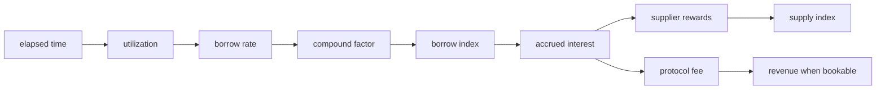
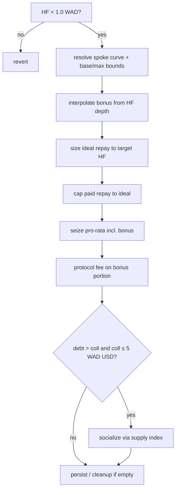
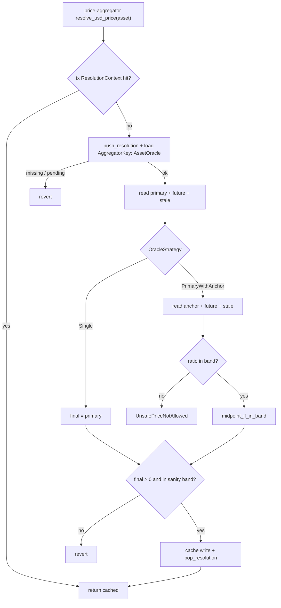

# Protocol Invariants

Runtime safety properties of XOXNO Lending. Use this when reviewing changes to
accounting, solvency, oracles, storage, or governance.

An **invariant** is a condition every successful operation must preserve. A
break means a bug, bad config, or missing validation.

The Rust contracts are the source of truth. Paths below point at the code and
checks that enforce each property.

## Scales

| Domain | Scale | Use |
|--------|------:|-----|
| Asset-native | token decimals | Transfers, tracked cash, user amounts |
| BPS | `10^4` | LTV, thresholds, fees, reserve factor, tolerances |
| WAD | `10^18` | USD values, health factor, prices |
| RAY | `10^27` | Rates, indexes, scaled shares, internal token amounts (`Ray::from_asset` / `to_asset*`) |

Defined in `common/src/constants/shared.rs` (`BPS`, `WAD`, `RAY`).

## Evidence

| Kind | Location |
|------|----------|
| Runtime | `common/src/*`, `contracts/pool/src/*`, `contracts/controller/src/*`, `contracts/price-aggregator/src/*` |
| Certora | `certora/{common,pool,controller}/spec/*_rules.rs` |
| Fuzz / harness | `tests/fuzz/fuzz_targets/*`, `tests/test-harness/tests/*` |

## How to review a change

1. Find the section this change touches.
2. Check the invariant statements against the modified path.
3. Use the [verification matrix](#7-verification-matrix) for tests, fuzz, and Certora.
4. Re-check storage and oracle assumptions when the change crosses contracts.

---

## 1. Numeric model

### 1.1 Scale boundaries

Convert into the target scale before compare, store, or transfer.

| Boundary | Scale |
|----------|-------|
| User transfer / cash | asset-native (token decimals) |
| Pool internal amounts, shares, indexes, rates | RAY |
| USD risk (values, HF, oracle prices) | WAD |
| Ratios (LTV, thresholds, fees, RF, tolerances) | BPS |

Token amounts enter as asset-native, then usually `Ray::from_asset` before
index/share math. Views and solvency recompute actuals in RAY, then convert to
asset-native at transfers or to WAD for USD valuation.

Common failure modes: asset-native compared to WAD, WAD mixed with RAY, or
floor/ceil applied on the wrong side of a convert.

### 1.2 Fixed-point rounding

Default multiply/divide on `Ray` / `Wad` is half-up via `mul_div_half_up`:

```text
mul_div_half_up(x, y, d) = (x * y + d / 2) / d   // I256 intermediate
mul(a, b) = mul_div_half_up(a, b, precision)      // precision = RAY or WAD
div(a, b) = mul_div_half_up(a, precision, b)
```

Half-up is off by at most half a unit in the result precision. Floor and ceil
are required at risk and payout boundaries:

- **Floor** — collateral valuation, LTV/threshold weighting, HF numerator/div,
  supply credit (never overstate safety).
- **Ceil** — debt valuation, borrow debit to asset (never understate debt).
- **Half-up** — accrual, indexes, utilization, default rescales.

Changing operation order can change the rounded result. Gate paths fix order
and direction at every step.

### 1.3 Scaled balances

Positions store scaled shares (RAY). Reconstruction is half-up Ray mul
(`scaled.mul(index)`):

```text
supply_actual_ray = scaled_supply * supply_index / RAY
borrow_actual_ray = scaled_debt   * borrow_index / RAY
```

Higher indexes raise actuals for a fixed scaled amount. Storage writes update
shares; views and solvency recompute actuals. User-facing asset units may
further rescale with half-up, floor, or ceil depending on the flow.

### 1.4 Borrow index

For non-negative borrow rate and any elapsed time:

```text
interest_factor = compound_interest(rate_per_ms, delta_ms) >= RAY
new_borrow_index = min(old_borrow_index * interest_factor, MAX_BORROW_INDEX_RAY)
new_borrow_index >= old_borrow_index
```

Accrual rate is `min(model(U), params.max_borrow_rate)`. Config requires
`params.max_borrow_rate <= MAX_BORROW_RATE_RAY` (`2 * RAY` annual). Rates in
the compound step are per millisecond.

Long idle intervals accrue in chunks of at most `MAX_COMPOUND_DELTA_MS`
(one year of milliseconds).

### 1.5 Supply index

Normal accrual never decreases the supply index, and the index always stays
inside the band `[SUPPLY_INDEX_FLOOR_RAW, MAX_SUPPLY_INDEX_RAY]`:

```text
new_supply_index >= old_supply_index                  // accrual
new_supply_index <= MAX_SUPPLY_INDEX_RAY              // update_supply_index clamp
```

Only `apply_bad_debt_to_supply_index` may reduce it, floored at
`SUPPLY_INDEX_FLOOR_RAW = RAY / 1000` (`10^24` raw RAY units).

Reward growth uses a virtual offset: `update_supply_index` adds
`SUPPLY_VIRTUAL_VALUE_RAY` (`= RAY`, one token of phantom value) to the reward
denominator, so a dust supplier cannot inflate the index by donating rewards —
per-step growth is bounded by `old_index * rewards / SUPPLY_VIRTUAL_VALUE_RAY`
regardless of how small the supplied base is. Utilization and bad-debt math use
the real supplied value (no offset).

### 1.6 Empty-market utilization

```text
U = div(borrowed_actual, supplied_actual)   // half-up Ray
```

If `supplied_actual == 0` (or scaled supplied is zero), `U = 0`. Empty markets
must not produce undefined rates.

---

## 2. Pool accounting

### 2.1 Interest split

Borrow-index growth on scaled debt creates interest. Reserve factor splits it
(half-up BPS on the fee; suppliers take the residual):

```text
accrued_interest = new_total_debt - old_total_debt
protocol_fee     = accrued_interest * reserve_factor / BPS   // half-up
supplier_rewards = accrued_interest - protocol_fee

accrued_interest = supplier_rewards + protocol_fee           // exact
```

Supplier rewards raise the supply index. Protocol fee is scaled by
`/ supply_index` (`protocol_fee_shares`, half-up) and always minted into both
`revenue` and `supplied` via `add_protocol_revenue`. At a floored index the raw
share count can exceed `i128`; the conversion saturates and is capped to the
headroom left in `supplied`, so accrual never traps and `revenue <= supplied`
is preserved.

Any new accrual branch must keep the identity above.



### 2.2 Revenue bound

Protocol revenue is a scaled supply claim:

```text
0 <= revenue_ray <= supplied_ray
```

`add_protocol_revenue` mints the same fee-scaled shares into `revenue` and
`supplied`. Claims burn the same scaled amount from both. Seize of deposit dust
reattributes existing `supplied` shares into `revenue` without changing
`supplied`. Revenue then follows the supply index until claimed.

### 2.3 Reserve availability

No path may pay out more **tracked** liquidity (`cash`) than the pool holds.
That covers borrow, withdraw, strategy borrow legs, flash-loan principal, and
revenue claims.

Gate with `require_reserves` (or `amount = cash.min(...)` on claim) before
external token transfer. `cash` ignores direct donations. Flash-loan principal
is balance-checked on the SAC and does not debit `cash`. Only the fee credits
`cash` after repay.

### 2.4 Revenue claims

A claim cannot exceed current tracked reserves. If `cash` is short of the
unscaled treasury claim, the pool pays `min(cash, treasury_actual)` and burns
the matching fraction of scaled revenue (and the same amount from `supplied`)
so `revenue_ray <= supplied_ray` holds.

### 2.5 Flash-loan repayment

Balances below are the pool SAC balance for the loaned asset
(`token.balance(pool)`), not tracked `cash`.

```text
sac_after_payout   == sac_before - amount
sac_after_callback == sac_after_payout
sac_after_repay    == sac_before + fee
cash_after         == cash_before + fee    // principal does not touch cash
```

`pool.flash_loan` (owner/controller only):

1. Require `amount > 0`, `fee >= 0`.
2. Liquidity gate: `cash >= amount` (`require_reserves`).
3. Snapshot SAC `pre`; transfer `amount` to receiver; require exact
   `sac == pre - amount`.
4. Callback `execute_flash_loan(...)`; require SAC still exactly
   `pre - amount`.
5. Require allowance ≥ `amount + fee`, then `transfer_from` that total; require
   exact `sac == pre + fee`.
6. Always `cash += fee`. When `fee > 0`, revenue shares mint via
   `add_protocol_revenue` (saturating share conversion, capped to `supplied`
   headroom); both `revenue` and `supplied` grow by the same share count.

Exact equality (not ≥). Under-repay or mid-callback SAC moves revert
`InvalidFlashloanRepay`. Assumes a well-behaved SAC (ADR 0006).

### 2.6 No orphan debt after withdraw / claim

After `withdraw` and `claim_revenue`, the pool rejects
`supplied == 0 && borrowed != 0` (`require_solvent_withdraw_state` →
`PoolInsolvent`). That gate does **not** run on `net_settle` (cash-neutral
share burns only); callers must not leave an empty-supply residual debt via
settle.

---

## 3. Account solvency

### 3.1 Health factor

USD WAD with directed rounding (floor collateral, ceil debt; HF floor-divides
and saturates):

```text
gate_collateral_i   = position_value_floor(supply_i, price_i)
weighted_collateral = sum floor(gate_collateral_i * liquidation_threshold_bps / BPS)
total_debt          = sum position_value_ceil(debt_j, price_j)
HF                  = weighted_collateral.div_floor_saturating(total_debt)
```

Risk weights are the **stamped** per-position `liquidation_threshold` and
`loan_to_value`, not necessarily the live spoke row until a refresh path runs.

| Condition | Result |
|-----------|--------|
| Debt and `HF >= 1.0 WAD` | Solvent (not liquidatable) |
| Debt and `HF < 1.0 WAD` | Liquidatable |
| No debt | `HF = i128::MAX` (views may short-circuit before oracle) |
| Tiny debt vs large collateral | Saturates to `i128::MAX` |

HF uses **liquidation thresholds**, not LTV. LTV is the tighter borrow-capacity
weight (`loan_to_value_bps < liquidation_threshold_bps` at config).

### 3.2 Borrow admission

After the pool records debt (user `borrow`; strategy paths at finalize), any
account with debt must satisfy (same floor/ceil valuation as §3.1):

```text
total_debt     <= ltv_collateral
                  where ltv_collateral = sum floor(gate_collateral_i * LTV_bps / BPS)
health_factor  >= 1.0 WAD
ltv_collateral >= MinBorrowCollateralUsd   // when instance floor ≠ 0
```

LTV (stamped `position.loan_to_value`) caps new debt capacity. Liquidation
threshold weights HF and liquidation (§3.1, §3.3). Config requires
`liquidation_threshold_bps > loan_to_value_bps` (strict).

Positive raw borrow that floors to zero scaled debt shares reverts in the pool
(`BorrowRoundsToZeroShares`). Otherwise cash would leave with no debt recorded.

### 3.3 Liquidation progress

Only when `HF < 1.0 WAD`. The account spoke supplies a liquidation curve
(defaults stamped at spoke create unless overridden):

- `liquidation_target_hf_wad` — default `1.10 WAD`
- `hf_for_max_bonus_wad` — default `0.80 WAD`
- `liquidation_bonus_factor_bps` — default `10_000` (1.0×)

**Bonus** (base/max from the account supply mix; factor scales only the
increment above base):

```text
bonus = base + factor × (max − base) × min(1, (target − hf) / (target − hf_for_max))
```

Scale is 0 at `target` and 1 at or below `hf_for_max_bonus`. Bonus may then be
reduced by the HF-preserving cap, or forced to base with full close when no
safe partial exists.

**Repay sizing:** ideal USD repay restores HF toward `target` for the chosen
bonus. Liquidator payments above ideal are capped. Dust residual debt below
`BAD_DEBT_USD_THRESHOLD` (5 USD WAD) expands ideal to full close.

**Seizure:** `repay_usd × (1 + bonus)` pro-rata across supply. Protocol fee is
listing `liquidation_fees` on the bonus portion. After apply, residual bad debt
may be socialized (§4.4).



---

## 4. Market and oracle configuration

### 4.1 Market parameters

Spoke listing risk (`validate_risk_bounds` / `validate_liquidation_fees`):

- `liquidation_threshold_bps > loan_to_value_bps`
- `liquidation_threshold_bps <= BPS`
- `liquidation_threshold_bps * (BPS + liquidation_bonus_bps) <= BPS * BPS`
- `liquidation_fees_bps <= BPS`
- `supply_cap, borrow_cap >= 0` (`0` and `i128::MAX` disable; controller also
  enforces asset-domain ceiling)

Pool market params (`MarketParamsRaw::verify` → `InterestRateModel::verify`):

- `flashloan_fee` (bps) `<= MAX_FLASHLOAN_FEE_BPS` (500)
- `reserve_factor < BPS`
- `0 < mid_utilization < optimal_utilization < RAY`
- `optimal_utilization <= max_utilization <= RAY`
- `base_borrow_rate >= 0`
- non-decreasing rates: `base <= slope1 <= slope2 <= slope3 <= max_borrow_rate`
- `max_borrow_rate > base_borrow_rate` and
  `max_borrow_rate <= MAX_BORROW_RATE_RAY`

Instance floor:

- `MinBorrowCollateralUsd` (`floor_wad`) `>= 0`

Per-spoke liquidation curve (`validate_liquidation_curve`):

- `WAD < target_hf_wad <= MAX_LIQUIDATION_TARGET_HF_WAD` (10 WAD)
- `0 < hf_for_max_bonus_wad < target_hf_wad`
- `bonus_factor_bps <= BPS` (0 allowed)

There is no flat `MAX_LIQUIDATION_BONUS`. The product bound above is the
per-asset listing seizure ceiling. When `MinBorrowCollateralUsd ≠ 0`,
debt-bearing accounts need LTV-weighted collateral USD WAD ≥ floor after
post-pool solvency checks.

### 4.2 Oracle setup

Token-rooted config is `AggregatorKey::AssetOracle(asset)` on
**price-aggregator** (persistent). Controller stores only the instance
`PriceAggregator` address and cross-calls; it does **not** hold `AssetOracle`
keys.

For each active market:

- Token decimals from the token contract; per-source decimals discovered
  on-chain (Reflector / Xoxno SEP-40 `decimals()`; RedStone fixed at 8)
- Reflector source decimals in `[1, 18]`
- `PrimaryWithAnchor` requires an anchor; primary and anchor must not
  `reads_same_feed_as` (same Reflector contract/asset/mode, or same
  RedStone/Xoxno `(contract, feed_id)`)
- Production (`not(feature = "testing")`): different provider kinds and
  different contracts; primary must not be spot (`SpotOnlyNotProductionSafe`.
  Reflector Spot and all RedStone/Xoxno legs count as spot)
- Live feed probe at configuration time
- Reflector TWAP: `0 < twap_records <= 12`
- Stale windows in `[60, 86_400]` seconds
- Sanity: `0 < min_sanity_price_wad < max_sanity_price_wad` and
  `max_sanity_price_wad <= MAX_REASONABLE_PRICE_WAD`
- Tolerance from one `tolerance_bps` in `[MIN_TOLERANCE, MAX_TOLERANCE]`
  (150..2_500 BPS)

Operators do not hand-enter token or oracle decimals; contracts read them
on-chain.

### 4.3 Price resolution

| Strategy | Behavior |
|----------|----------|
| `Single` | Primary only. Spot allowed. Sanity band capped at ±10% midpoint-relative. Stored tolerance is unused at compose time. |
| `PrimaryWithAnchor` | Both legs required. Production rejects a spot primary. Tolerance band applies to the primary/anchor ratio in BPS. |

Under `PrimaryWithAnchor` (both legs fresh):

1. Ratio inside `[lower_ratio_bps, upper_ratio_bps]` → integer midpoint
   `(primary + anchor) / 2`
2. Outside the band → revert `UnsafePriceNotAllowed`

Per-source future-skew and staleness run at each provider read. Composed final
price must be `> 0` and inside the sanity band. Missing or stale either leg
reverts. No primary-only fallback. A flow that skips pricing does so by not
calling the oracle at all (ADR 0004), never by relaxing validation of a price
once read.

**Call-site policy:** `repay` never prices. Debt-free `withdraw` skips
`require_post_pool_risk_gates` (empty borrow map). Fail-closed pricing:
`borrow`, debt-bearing `withdraw`, `liquidate`, `clean_bad_debt`, debt-leaving
strategies, and price-resolving views. Full table: ADR 0004.

Oracle timestamps beyond `MAX_FUTURE_SKEW_SECONDS` (60s) always revert.

Resolution below runs on **price-aggregator** after the controller cross-call
(`prices` / `price`). `load AssetOracle` means persistent
`AggregatorKey::AssetOracle(asset)` on that contract — not a controller key.



### 4.4 Bad debt and supply-index floor (ADR 0007)

Socializable only when total debt USD > total collateral USD **and** total
collateral USD ≤ 5 WAD (`BAD_DEBT_USD_THRESHOLD`). Runs automatically after
liquidation when residual still qualifies, or via permissionless
`clean_bad_debt` (caller auth + not flash-loaning), which re-checks the same
predicate.

`execute_bad_debt_cleanup` seizes both sides in one `pool.seize_positions`
batch:

| Seized side | Pool effect |
|-------------|-------------|
| **Borrow** | Unscale debt → `apply_bad_debt_to_supply_index` (capped at total supplied value, floored at `SUPPLY_INDEX_FLOOR_RAW`) |
| **Deposit** | Credit scaled amount to pool **revenue**; does not move the supply index |

Emits `CleanBadDebtEvent` and removes the account.

If the **debt** listing is spoke-`paused`, liquidation repay reverts
(tainted-debt). Collateral seizure and `clean_bad_debt` stay available.
Underwater positions with collateral above 5 WAD USD are not socializable
here; further liquidation must wind them down.

---

## 5. Storage and boundaries

### 5.1 Governance, controller, pool

Production ownership chain: governance → controller → pool.

Governance routes structural and risk-loosening admin through a closed
`AdminOperation` enum and the timelock. Incident paths bypass delay: GUARDIAN
(`pause`, tighten spoke flags), ORACLE (sanity-band move within rules), and
owner-only immediate revoke of GUARDIAN/ORACLE. Resume is timelocked
`AdminOperation::Unpause` only.

The controller calls the pool only through the pool ABI. Pool mutators are
`#[only_owner]`. The pool does not evaluate account HF/LTV or liquidation
eligibility (market cash, util, and fee accounting only).

### 5.2 Account storage (ADR 0002)

| Key | Content |
|-----|---------|
| `AccountMeta(account_id)` | Owner, spoke, mode |
| `SupplyPositions(account_id)` | `Map<HubAssetKey, AccountPositionRaw>` |
| `BorrowPositions(account_id)` | `Map<HubAssetKey, DebtPositionRaw>` |
| `Delegates(account_id)` | Optional `Vec<Address>` (max 16); absent when empty |

Position map keys are `HubAssetKey` (hub + asset). Collateral rows store scaled
supply shares and a risk snapshot (LTV, LT, bonus, fees). Debt rows store
scaled share only.

Empty side maps (and empty delegate lists) are pruned on write. Account removal
deletes meta, both position maps, and `Delegates`.

Risk params re-stamp from spoke listing config via `update_account_threshold`,
supply, and withdraw (and strategy supply legs). Debt-increasing paths
(`borrow` and strategy finalize) re-stamp supply LTV, liquidation bonus, and
fees from live listing config before LTV/HF gates; liquidation threshold stays
lazy (supply/withdraw/keeper with HF≥1.05 on cuts). Solvency uses last-stamped
LT until a threshold refresh path runs.

Removing an asset from a spoke requires zero spoke usage
(`SpokeAssetInUse` otherwise), so every open position’s asset remains listed;
there is no supported path where delisted collateral still backs an account.

### 5.3 TTL

Persistent account and protocol-shared keys need explicit TTL extension.
Instance storage is bumped on controller and pool hot paths.

- Account keys on touch: `AccountMeta`, `SupplyPositions`, `BorrowPositions`,
  and `Delegates` when present.
- Controller shared keys (spokes, listings, hubs, and related) renew on
  read/write and/or keeper. Pool `Params`/`State` renew on pool read/write
  and/or keeper. Oracle configs renew on price-aggregator read/write of
  `AggregatorKey::AssetOracle(asset)` (not controller-owned) and/or keeper
  when `contracts.price_aggregator` is set.
- Owner-authenticated `renew_account` re-bumps existing account keys.

Keeper (`services/keeper`) covers controller/pool/governance/price-aggregator
instances (and configured WASM), controller hubs/spokes/per-account keys
including `Delegates`, pool `Params`/`State` for configured markets, and
price-aggregator persistent `AggregatorKey::AssetOracle(asset)` rows — not
controller-owned oracle config keys. Some keys (for example `SpokeAsset` /
`SpokeUsage`) rely on activity and contract renew rather than keeper
enumeration. Any new persistent key must have a renew path.

Position writes only persist the touched side (`PositionSides`). Unrelated side
maps must not be rewritten.

### 5.4 Halt controls (ADR 0011)

Three layers:

| Layer | Blocks | Exits / liquidations |
|-------|--------|----------------------|
| **Global pause** | All `#[when_not_paused]` entrypoints (list below) | `withdraw`, `repay`, `liquidate`, `clean_bad_debt` stay live |
| **Spoke-asset `paused`** | supply/borrow/withdraw/repay for that listing (strategy legs share processors) | Exits blocked for that asset; liq debt-repay blocked (tainted-debt); coll seizure + `clean_bad_debt` live |
| **Spoke-asset `frozen`** | new supply/borrow only | withdraw/repay live |

**`#[when_not_paused]` complete set:** `supply`, `borrow`, `multiply`,
`swap_debt`, `swap_collateral`, `repay_debt_with_collateral`,
`migrate_from_blend`, `flash_loan`, `update_indexes`, `claim_revenue`,
`add_rewards`, `update_account_threshold`.

**Who sets global pause:** governance `pause(caller)` is GUARDIAN-gated and
immediate. Resume is risk-loosening: only timelocked `AdminOperation::Unpause`
(no governance immediate `unpause`). Controller `pause`/`unpause` are
owner-only (owner = governance). Constructor and upgrade start or re-pause.

**Spoke flags:** GUARDIAN `set_spoke_asset_flags` is immediate and tighten-only
(`false → true` or stay; clear reverts `SpokeAssetFlagRelaxation`). Clearing
rides timelocked `edit_asset_in_spoke`.

**Previews under halt:**

| Preview | Global pause | Spoke `paused` | Spoke `frozen` |
|---------|--------------|----------------|----------------|
| `max_supply` | 0 | 0 | 0 |
| `max_borrow` | 0 | 0 | 0 |
| `max_withdraw` | still computed (op live) | 0 | still computed (op live) |

There is no `max_repay`. Debt-bearing `withdraw` and `liquidate` still read
oracles while globally paused. Global pause is not an oracle killswitch; use
per-asset `paused` for that market.

---

## 6. Design commitments

Changing any of these needs protocol review:

- Half-up rounding is the default for fixed-point mul/div; floor/ceil at risk
  and payout boundaries
- Protocol revenue is scaled supply
- Token and oracle decimals are discovered on-chain at configuration
- Account storage is split by side
- Strategy routes are checked by controller balance delta, not trusted router
  reports

---

## 7. Verification matrix

| Area | Runtime | Verification |
|------|---------|--------------|
| Numeric model | `common::math`, rates, pool cache/views | Certora: `math_rules`, `rates_rules`, `index_rules`, `interest_rules`; fuzz: `fp_math`, `fp_ops`, `rates_and_index` |
| Pool accounting | interest, reserves, revenue, flash loan | Certora: `solvency_rules`, `boundary_rules`, `flash_loan_rules`, `rate_index_accounting_rules`, `position_accounting_rules`, `seize_settle_accounting_rules`, `fee_strategy_accounting_rules`, `flash_loan_accounting_rules`; fuzz: `flow_e2e`, `flow_strategy`, `pool_native` |
| Account solvency | HF, LTV, liquidation, seizure | Certora: `health_rules`, `position_rules`, `liquidation_rules`; fuzz/proptest: `flow_e2e`, harness liquidation tests |
| Market / oracle / strategy | validation, tolerance, routes | Certora: `oracle_rules`, `tolerance_math_rules`, `strategy_rules`, `spoke_rules`; harness oracle/governance tests |
| Storage / boundaries | governance, pool ABI, account TTL, keeper | contract/harness tests; `tests/test-harness/tests/meta/account_ttl_regression.rs`; Certora: `account_isolation_rules` |

---

## 8. Re-verification checklist

Re-run relevant tests after changes to:

- fixed-point math, rate curves, indexes
- pool reserves, `cash`, revenue
- liquidation, HF, LTV admission
- oracle config or price resolution
- account storage or TTL
- governance / controller / pool ABIs

Minimum checks:

- scaled → actual reconstruction
- `revenue_ray <= supplied_ray`
- interest split identity
- HF around `1.0 WAD`
- borrow admission (LTV + HF + min floor)
- supply-index floor on **debt** seize (bad debt)
- reserve caps for borrow, withdraw, flash loan, revenue claim
- flash-loan SAC equalities and `cash += fee`

## Related

- [README.md](../../README.md)
- [architecture.md](./architecture.md)
- [SECURITY.md](../../SECURITY.md)
- [decisions/](../explanation/decisions/README.md)
